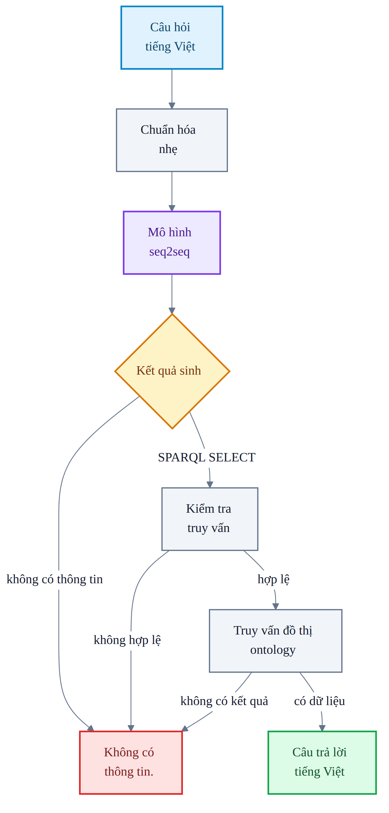
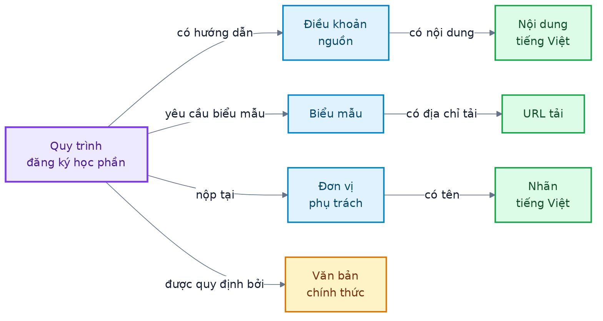
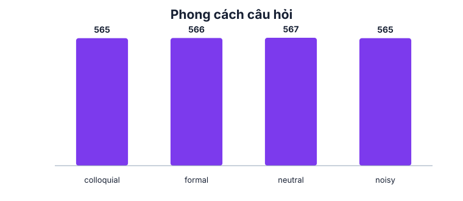
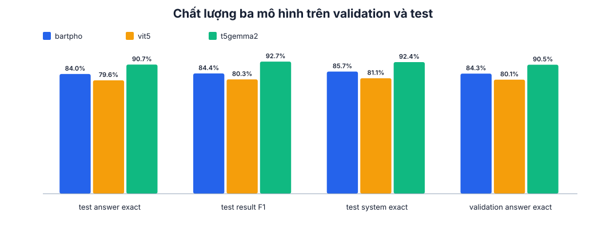
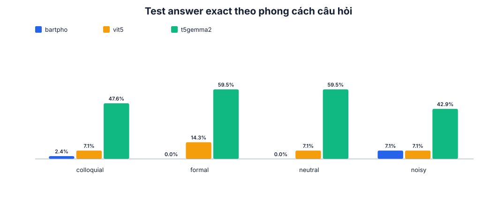
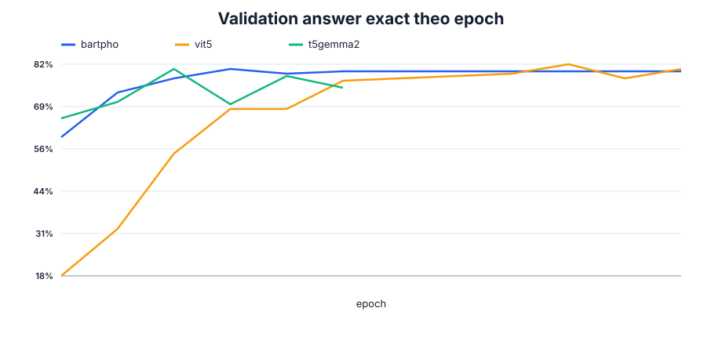

# Chatbot hỏi đáp học vụ dựa trên ontology

## Tóm tắt

Nghiên cứu này xây dựng một chatbot tiếng Việt trả lời câu hỏi về quy trình học
vụ bằng ontology. Thay vì ghi nhớ và sinh trực tiếp câu trả lời, một mô hình
ngôn ngữ chuyển câu hỏi của người dùng thành truy vấn SPARQL. Truy vấn được kiểm
tra, thực thi trên đồ thị tri thức và trả về dữ liệu lấy từ các văn bản chính
thức của Trường Đại học Nha Trang.

Hệ thống kết hợp ba thành phần: một ontology biểu diễn quy trình và quy định học
vụ, một dataset 4.454 câu hỏi tiếng Việt và một mô hình encoder–decoder sinh
truy vấn có cấu trúc. Ba mô hình BARTpho, ViT5 và T5Gemma2 được huấn luyện trong
cùng điều kiện. Trong baseline v0.4.1, T5Gemma2 đạt kết quả tốt nhất với 92,38%
câu trả lời cuối chính xác trên tập test; phiên bản triển khai bằng CTranslate2
đạt 92,87%.

Các đóng góp chính gồm:

1. đồ thị tri thức học vụ được xây dựng từ các văn bản chính thức;
2. kiến trúc một mô hình duy nhất vừa sinh SPARQL vừa từ chối câu hỏi không thể
   trả lời từ ontology;
3. dataset tiếng Việt bao phủ ngôn ngữ trang trọng, thông thường, khẩu ngữ và
   câu có lỗi viết;
4. thực nghiệm so sánh ba mô hình sinh chuỗi và kiểm thử toàn bộ chatbot từ câu
   hỏi đến nội dung hiển thị.

## 1. Bài toán nghiên cứu

Thông tin về một quy trình học vụ thường nằm rải rác trong quy chế đào tạo, phụ
lục, hướng dẫn thanh toán và danh mục biểu mẫu. Một câu hỏi như “bảo lưu cần
nộp đơn ở đâu?” không chỉ cần tìm đoạn văn có từ “bảo lưu”, mà còn phải nối được
quy trình bảo lưu với đơn vị nhận hồ sơ và tên chính thức của đơn vị đó.

Ontology phù hợp với bài toán này vì nó biểu diễn dữ liệu dưới dạng đồ thị có
quan hệ rõ ràng. Chatbot có thể đi theo các quan hệ giữa quy trình, điều khoản,
đơn vị, biểu mẫu và quy tắc thay vì tìm một đoạn văn gần nghĩa rồi trả về toàn
bộ đoạn đó.

Câu hỏi nghiên cứu trung tâm là:

> Một mô hình encoder–decoder nhỏ có thể chuyển câu hỏi tiếng Việt tự nhiên
> thành truy vấn chính xác trên ontology, đồng thời từ chối an toàn những câu
> ontology không thể trả lời hay không?

Phạm vi trọng tâm là các quy trình học vụ. Hệ thống cũng hỗ trợ một số câu hỏi
liên quan đến học phí, biểu mẫu, chứng chỉ và quy tắc đào tạo khi dữ liệu tương
ứng có trong ontology. Nó không phải chatbot kiến thức chung.

## 2. Các khái niệm nền tảng

| Khái niệm | Giải thích ngắn gọn |
|---|---|
| **Ontology** | Đồ thị mô tả các loại thực thể, thuộc tính và quan hệ trong một miền tri thức. |
| **RDF triple** | Một sự thật dạng *chủ thể – quan hệ – đối tượng*, ví dụ “bảo lưu – nộp tại – Phòng Công tác Chính trị và Sinh viên”. |
| **IRI** | Tên định danh duy nhất của một thực thể hoặc quan hệ trong đồ thị. |
| **Literal** | Giá trị được trả trực tiếp, chẳng hạn nội dung quy định, tên đơn vị, URL hoặc mức học phí. |
| **SPARQL** | Ngôn ngữ dùng để đặt câu hỏi cho đồ thị RDF, tương tự vai trò của SQL đối với cơ sở dữ liệu quan hệ. |
| **Mô hình seq2seq** | Mô hình nhận một chuỗi văn bản và sinh một chuỗi khác; ở đây là câu hỏi tiếng Việt → SPARQL. |
| **Trong miền** | Câu hỏi có thể được trả lời đầy đủ bằng dữ liệu hiện có trong ontology. |
| **Ngoài miền** | Câu hỏi không liên quan, mơ hồ hoặc yêu cầu dữ liệu ontology không có. |

Model được phép học tên định danh và quan hệ của ontology, nhưng không học thuộc
nội dung câu trả lời. Nội dung vẫn nằm trong đồ thị và chỉ được lấy ra khi truy
vấn được thực thi.

## 3. Phương pháp đề xuất

Hệ thống sử dụng một mô hình duy nhất. Với mỗi câu hỏi, model sinh một truy vấn
SPARQL `SELECT` hoặc chuỗi `không có thông tin`. Backend không dò thực thể bằng
fuzzy matching, không tự sửa truy vấn và không dùng thêm một model phân loại
trong/ngoài miền.



### 3.1. Hình dạng đầu vào và đầu ra của model

Đầu vào luôn là một câu tiếng Việt. Đầu ra là một chuỗi duy nhất, nhưng chuỗi
đó không phải câu trả lời cho người dùng: nó mô tả dữ liệu backend cần lấy từ
ontology.

**Ví dụ 1 – hỏi toàn bộ hướng dẫn của một quy trình**

```text
Đầu vào model:
đăng ký học phần như thế nào

Đầu ra model:
SELECT ?answer WHERE { :CourseRegistrationProcedure :hasStep ?s . ?s :stepOrder ?o ; :stepText ?answer . } ORDER BY ?o

Đầu ra giao diện:
- Tìm hiểu chương trình đào tạo, kế hoạch giảng dạy trong học kỳ...
- Đăng ký lớp của các học phần dự định học trong học kỳ...
- Xin ý kiến tư vấn của Cố vấn học tập...
- Xác nhận đăng ký học phần trên Hệ thống quản lý đào tạo.
```

Trong truy vấn này, `CourseRegistrationProcedure` là quy trình đăng ký học phần,
`hasStep` dẫn tới từng bước thực hiện và `stepText` lấy nội dung tiếng Việt của
bước đó. `ORDER BY` là bắt buộc vì kết quả SPARQL vốn không có thứ tự.

**Ví dụ 2 – hỏi một quan hệ cụ thể**

```text
Đầu vào model:
phòng nào nhận hồ sơ bảo lưu

Đầu ra model:
SELECT ?answer WHERE { :TemporaryAcademicLeaveProcedure :submittedTo ?office . ?office rdfs:label ?answer . }

Đầu ra giao diện:
Phòng Công tác Chính trị và Sinh viên
```

Model không sinh sẵn tên phòng. Nó yêu cầu backend đi từ quy trình bảo lưu qua
quan hệ `submittedTo`, sau đó lấy nhãn tiếng Việt của đơn vị tìm được.

**Ví dụ 3 – câu hỏi ontology không thể trả lời**

```text
Đầu vào model:
ngày mai Nha Trang có mưa không

Đầu ra model:
không có thông tin

Đầu ra giao diện:
Không có thông tin.
```

Như vậy, hình dạng dữ liệu xuyên suốt hệ thống là:

| Giai đoạn | Dữ liệu |
|---|---|
| Đầu vào | Câu hỏi tiếng Việt tự nhiên |
| Đầu ra model | Một dòng SPARQL `SELECT` hoặc `không có thông tin` |
| Kết quả ontology | Một hay nhiều nhãn, đoạn nội dung, URL hoặc con số |
| Đầu ra giao diện | Văn bản tiếng Việt được định dạng cho người dùng |

Nếu model sinh truy vấn sai cú pháp, sử dụng thao tác không an toàn hoặc truy
vấn không trả về dữ liệu, backend cũng từ chối thay vì đoán câu trả lời.

## 4. Đồ thị tri thức học vụ

Ontology được xây dựng từ Quyết định 1052 về đào tạo đại học, các phụ lục về
chứng chỉ, Quyết định 729 về học phí, hướng dẫn thanh toán học phí và danh mục
biểu mẫu của nhà trường. Văn bản nguồn quyết định dữ kiện nào được đưa vào đồ
thị và giới hạn những gì chatbot có thể trả lời.

Một phần đồ thị có hình dạng trừu tượng như sau:



Các mũi tên biểu diễn đường đi trong đồ thị. Dữ liệu cuối cùng trả cho người
dùng là nhãn hoặc giá trị như nội dung, địa điểm, URL và con số; bản thân quan
hệ chỉ được dùng để tìm tới dữ liệu đó.

Đồ thị hiện có:

| Thành phần | Số lượng |
|---|---:|
| Bộ ba RDF | 7.519 |
| Lớp | 46 |
| Quan hệ giữa các thực thể | 34 |
| Thuộc tính dữ liệu | 50 |
| Thực thể có định danh | 822 |
| Quy trình học vụ | 22 |
| Chính sách học vụ | 2 |
| Bước thực hiện của các quy trình | 44 |
| Điều kiện được tách riêng | 33 |

Mỗi thực thể công khai có tên tiếng Việt; các dữ kiện trả lời được liên kết về
văn bản nguồn. Chi tiết thiết kế và quy ước đặt tên nằm trong
[tài liệu ontology](docs/ONTOLOGY.md).

## 5. Dataset

Mỗi bản ghi nối một câu hỏi tiếng Việt với kết quả model cần sinh:

| Trường | Ví dụ | Vai trò |
|---|---|---|
| Câu hỏi | “phòng nào nhận hồ sơ bảo lưu?” | Đầu vào ngôn ngữ tự nhiên |
| Nhóm truy vấn | Đơn vị tiếp nhận quy trình | Nhóm các câu có cùng logic |
| Phong cách | Khẩu ngữ | Dạng diễn đạt của câu hỏi |
| Đích | Một truy vấn SPARQL | Chuỗi model phải sinh |

Câu ngoài miền dùng cùng hình dạng bản ghi nhưng có đích là `không có thông
tin`. Vì vậy model học cả truy vấn ontology và giới hạn trả lời trong một nhiệm
vụ thống nhất.

### 5.1. Quy mô

| Tập | Số câu | Mục đích |
|---|---:|---|
| Train | 3.645 | Dạy model các quan hệ, thực thể và cách diễn đạt |
| Validation | 402 | Chọn checkpoint mà không nhìn vào test |
| Test | 407 | Đánh giá cuối cùng bằng cách diễn đạt chưa xuất hiện trong train |
| **Tổng** | **4.454** | **51 nhóm truy vấn** |

| Miền câu hỏi | Số câu |
|---|---:|
| Quy trình học vụ | 2.552 |
| Học phí | 363 |
| Quy tắc học vụ | 295 |
| Chứng chỉ | 271 |
| Biểu mẫu | 146 |
| Ngoài miền | 827 |


### 5.2. Phong cách ngôn ngữ

Dataset không chỉ chứa câu hỏi chuẩn. Bốn phong cách được sử dụng để mô phỏng
cách sinh viên thực sự đặt câu hỏi:

| Phong cách | Mô tả | Số câu |
|---|---|---:|
| Trang trọng | Câu đầy đủ, gần văn bản hành chính | 1.016 |
| Thông thường | Cách hỏi trung tính hằng ngày | 1.153 |
| Khẩu ngữ | “tui”, “sao giờ”, cách nói hội thoại | 1.075 |
| Noisy | Viết tắt, thiếu dấu hoặc lỗi gõ nhưng vẫn còn nghĩa | 1.210 |



Các câu trùng sau chuẩn hóa và các câu gần trùng trong cùng nhóm truy vấn không
được đi xuyên qua train, validation và test. Mọi truy vấn đích đều được kiểm tra
cú pháp, độ an toàn và khả năng trả về dữ liệu trên ontology trước khi đưa vào
dataset. Chi tiết nằm trong [tài liệu dataset](docs/DATASET.md).

### 5.3. Tài nguyên dữ liệu và đánh giá

Các tài nguyên tĩnh dùng trong nghiên cứu được lưu trực tiếp trong repository:
`ontology.ttl`, `catalogue.jsonl`, `coverage.json` và ba split là dữ liệu
canonical. Chuỗi kiểm tra là ontology → danh mục khả năng trả lời → danh mục
truy vấn → dataset; inventory, manifest và các file trong `reports/` là artifact
được sinh lại từ chuỗi này.

| Tài nguyên | Địa chỉ | Vai trò |
|---|---|---|
| Ontology | [`ontology.ttl`](resources/ontology/ontology.ttl) | Đồ thị RDF chứa dữ liệu học vụ được truy vấn khi chatbot trả lời |
| Danh mục khả năng trả lời | [`answer_inventory.json`](resources/ontology/answer_inventory.json) | Liệt kê các đường đi từ thực thể tới nhãn hoặc literal có thể trả lời |
| Danh mục truy vấn | [`catalogue.jsonl`](resources/dataset/catalogue.jsonl) | Định nghĩa 51 nhóm truy vấn SPARQL của dataset |
| Tập huấn luyện | [`train.jsonl`](resources/dataset/train.jsonl) | 3.645 câu dùng để cập nhật trọng số model |
| Tập validation | [`val.jsonl`](resources/dataset/val.jsonl) | 402 câu dùng để chọn checkpoint |
| Tập test | [`test.jsonl`](resources/dataset/test.jsonl) | 407 câu dùng cho benchmark cuối cùng |
| Quy tắc độ phủ | [`coverage.json`](resources/dataset/coverage.json) | Các yêu cầu về miền, phong cách diễn đạt và nhóm từ chối |
| Manifest dataset | [`manifest.json`](resources/dataset/manifest.json) | Cấu trúc, thống kê và checksum của dữ liệu |

Ngoài tập test chính, repository còn có các bộ kiểm tra hành vi:

| Bộ kiểm tra | Địa chỉ | Nội dung |
|---|---|---|
| Ngôn ngữ quy trình | [`procedure_language.jsonl`](resources/cases/procedure_language.jsonl) | 308 câu hồi quy về cách hỏi quy trình và các câu gần miền cần từ chối |
| Câu hỏi người dùng | [`user_queries.txt`](resources/cases/user_queries.txt) | Bảy câu hỏi thực tế dùng để kiểm tra nhanh end-to-end |
| Chỉ mục câu từ chối | [`rejection_checklist.json`](resources/cases/rejection_checklist.json) | Nhóm ID câu ngoài miền theo loại mơ hồ, hỗn hợp và hard negative |

Số liệu đứng sau các bảng và biểu đồ cũng được công bố ở dạng máy đọc được:

| Số liệu | Địa chỉ | Biểu đồ hoặc thống kê tương ứng |
|---|---|---|
| Dataset và ontology | [`reports/dataset.json`](reports/dataset.json) | Kích thước tập, miền, phong cách, đặc trưng truy vấn và thống kê ontology |
| Độ phủ quy trình | [`reports/procedure-dataset.json`](reports/procedure-dataset.json) | Số target và số câu quy trình trong từng tập |
| Huấn luyện và benchmark | [`reports/models.json`](reports/models.json) | Loss, validation, kết quả ba model và phân rã lỗi trên test |
| Nguồn gốc số liệu | [`reports/provenance.json`](reports/provenance.json) | Hash input của baseline v0.4.1, hash hiện hành và trạng thái metric |
| Toàn bộ hình trực quan | [`reports/figures/`](reports/figures/) | Các biểu đồ SVG được sinh từ những file JSON trên |

Ý nghĩa từng file và lệnh tái tạo biểu đồ được mô tả tại
[`reports/README.md`](reports/README.md). Các bộ hồi quy bổ sung không thay thế
tập test 407 câu khi báo cáo kết quả so sánh model.

## 6. Thiết kế thực nghiệm

Ba mô hình encoder–decoder được so sánh:

- **BARTpho-syllable:** mô hình BART được tiền huấn luyện cho tiếng Việt;
- **ViT5-base:** mô hình T5 chuyên cho tiếng Việt;
- **T5Gemma2:** mô hình T5 thế hệ mới, được tiền huấn luyện đa ngôn ngữ.

Cả ba nhận cùng dữ liệu, batch size 8, tối đa 20 epoch, greedy decoding và đúng
một seed. PEFT LoRA được dùng để chỉ cập nhật một phần nhỏ tham số; checkpoint
tốt nhất được chọn bằng validation rồi mới chạy test. Việc đánh giá không dùng
BLEU hoặc ROUGE vì một câu SPARQL chỉ khác vài ký tự vẫn có thể truy vấn sai dữ
liệu hoàn toàn.

### 6.1. Tiêu chí đánh giá

| Tiêu chí | Câu hỏi mà tiêu chí trả lời |
|---|---|
| Parse rate | Chuỗi model sinh có phải SPARQL hợp lệ không? |
| Answer Exact | Kết quả truy vấn có trùng hoàn toàn đáp án tham chiếu không? |
| Result F1 | Nếu chưa đúng hoàn toàn, model lấy đúng được bao nhiêu dữ liệu? |
| Safe Rejection | Câu ngoài miền có kết thúc bằng “Không có thông tin.” không? |
| System Exact | Nội dung cuối cùng trên giao diện có đúng hoàn toàn không? |

`System Exact` phản ánh trực tiếp trải nghiệm người dùng. `Answer Exact` giúp
phân biệt lỗi truy vấn với lỗi định dạng giao diện. Định nghĩa toán học và cách
so sánh tập kết quả nằm trong [giao thức đánh giá](docs/EVALUATION.md).

## 7. Kết quả — baseline v0.4.1

| Model | Validation Answer Exact | Test Answer Exact | Test Result F1 | Test System Exact |
|---|---:|---:|---:|---:|
| BARTpho-syllable | 84,33% | 84,03% | 84,44% | 85,75% |
| ViT5-base | 80,10% | 79,61% | 80,28% | 81,08% |
| **T5Gemma2** | **90,55%** | **90,66%** | **92,74%** | **92,38%** |



T5Gemma2 đạt kết quả cao nhất trên cả validation và test nên được chọn để triển
khai. Trên riêng 185 câu hỏi quy trình học vụ, model đạt 96,22% Answer Exact.
Đây là nhóm quan trọng nhất của đề tài và cũng là nhóm có mật độ dữ liệu huấn
luyện cao nhất.



Đường validation cho thấy T5Gemma2 học nhanh hơn hai model tiếng Việt trong cấu
hình thực nghiệm này. Kết quả không có nghĩa model đa ngôn ngữ luôn tốt hơn;
nó chỉ cho thấy T5Gemma2 phù hợp hơn với dataset và nhiệm vụ sinh SPARQL đang
xét.

`reports/provenance.json` đối chiếu sáu input canonical với baseline v0.4.1.
Khi `model_metrics.status` là `stale`, các con số trên chỉ là kết quả lịch sử
và không được hiểu là đánh giá ontology/dataset mới.



## 8. Triển khai — baseline v0.4.1

Checkpoint T5Gemma2 được chuyển sang CTranslate2 và lượng tử hóa int8 để chạy
gọn hơn trên CPU. CTranslate2 là bộ máy suy luận tối ưu cho model sinh chuỗi;
nó không thay đổi ontology hoặc logic trả lời.

| Chỉ số end-to-end | Kết quả |
|---|---:|
| Câu test trả HTTP 200 | 407/407 |
| Câu trả lời cuối chính xác | 378/407 (92,87%) |
| Trung vị độ trễ CPU | 300 ms |
| 95% request nhanh hơn | 864 ms |
| Probe đồng thời | 8/8 request thành công |

Artifact Transformers và CTranslate2 được công bố tại
[vpthinh19/ntu-ontology-t5gemma-2](https://huggingface.co/vpthinh19/ntu-ontology-t5gemma-2).
Trạng thái `deployment_metrics` trong `reports/provenance.json` áp dụng cùng quy
tắc: `stale` nghĩa là số liệu triển khai chỉ còn là baseline lịch sử.

## 9. Giới hạn

- Câu noisy là nhóm khó nhất; phiên bản CTranslate2 đạt 85,71% trên toàn bộ
  nhóm này.
- Safe Rejection ngoài miền của T5Gemma2 đạt 92,22%, vẫn có trường hợp câu gần
  miền bị model trả lời sai thay vì từ chối.
- Tập test gồm 407 câu, phù hợp để so sánh trong phạm vi đề tài nhưng chưa đại
  diện cho mọi cách sinh viên có thể diễn đạt.
- Model học schema của ontology. Khi thực thể hoặc quan hệ thay đổi đáng kể,
  dataset phải được cập nhật và model cần được huấn luyện lại.
- Hệ thống không suy đoán thông tin không có nguồn và không trả lời kiến thức
  ngoài phạm vi học vụ đã mô hình hóa.

## 10. Tái lập và sử dụng

Project yêu cầu Linux và Python 3.12. Thực nghiệm huấn luyện được thực hiện trên
NVIDIA RTX 4050 Laptop 6 GB với PyTorch 2.13 và Transformers 5.14. Runtime CPU
dùng CTranslate2 4.8, RDFLib 7.6 và không cần Transformers.

### Chạy trực tiếp bằng Docker

Image đã chứa model CTranslate2, ontology, backend và giao diện web:

```bash
docker pull vpt19/ontchatbot:0.4.1
docker run --rm --publish 8000:8000 vpt19/ontchatbot:0.4.1
```

Mở `http://127.0.0.1:8000` để sử dụng chatbot. Nhấn `Ctrl+C` để dừng container;
tuỳ chọn `--rm` tự xoá container sau khi dừng nhưng không xoá image đã tải.

### Chạy chatbot bằng artifact đã công bố

```bash
git clone https://github.com/vpthinh19/ontology-chatbot.git
cd ontology-chatbot
uv sync --extra inference

uv run hf download vpthinh19/ntu-ontology-t5gemma-2 \
  --include 'ctranslate2/*' --local-dir model

uv run serve_sparql \
  --model-dir model/ctranslate2 \
  --device cpu --compute-type int8 \
  --host 127.0.0.1 --port 8000
```

Mở `http://127.0.0.1:8000` để sử dụng giao diện web.

### Kiểm tra dữ liệu và phần mềm

```bash
uv run validate_sparql_dataset
uv run pytest
```

### Các lệnh CLI chính

`validate_sparql_dataset` chỉ đọc và kiểm tra toàn chuỗi canonical cùng các
artifact đã commit. `generate_reports` chỉ ghi lại inventory, manifest, báo cáo,
provenance và biểu đồ dẫn xuất; lệnh này không sửa ontology, catalogue,
coverage hay các split:

```bash
uv run validate_sparql_dataset
uv run generate_reports
```

Huấn luyện và đánh giá một model Transformers cần nhóm dependency `train`:

```bash
uv sync --extra train --dev

uv run train_sparql \
  --model t5gemma2 \
  --output-dir <output-dir> \
  --epochs 20 \
  --save-model \
  --benchmark-after-training

uv run evaluate_sparql_model \
  --model t5gemma2 \
  --model-dir <checkpoint-dir> \
  --suite both \
  --output-dir <evaluation-dir>
```

Chuyển checkpoint đã huấn luyện sang CTranslate2 int8:

```bash
uv run convert_sparql_model \
  --model-dir <checkpoint-dir> \
  --output-dir <ctranslate2-dir> \
  --quantization int8
```

Đánh giá hoặc phục vụ model CTranslate2 cần nhóm dependency `inference`:

```bash
uv sync --extra inference --dev

uv run evaluate_ct2_model \
  --model-dir <ctranslate2-dir> \
  --device cpu \
  --compute-type int8 \
  --output <metrics.json>

uv run serve_sparql \
  --model-dir <ctranslate2-dir> \
  --device cpu \
  --compute-type int8 \
  --host 127.0.0.1 \
  --port 8000
```

Các giá trị đặt trong dấu `<...>` là đường dẫn do người chạy lựa chọn. Có thể
dùng `uv run <tên-lệnh> --help` để xem toàn bộ tham số của từng lệnh.

Các tài liệu chuyên sâu:

- [Concept và ranh giới hệ thống](docs/CONCEPT.md)
- [Thiết kế ontology](docs/ONTOLOGY.md)
- [Dataset và cách chia tập](docs/DATASET.md)
- [Kiến trúc phần mềm](docs/ARCHITECTURE.md)
- [Giao thức huấn luyện](docs/TRAINING.md)
- [Tiêu chí đánh giá](docs/EVALUATION.md)
- [Triển khai](docs/DEPLOYMENT.md)
