# Chatbot hỏi đáp học vụ dựa trên ontology

Ontology (mô hình khái niệm gồm thực thể, thuộc tính và quan hệ) học vụ là nguồn
dữ kiện duy nhất của hệ thống. Mô hình phân loại chọn một truy vấn SPARQL (ngôn
ngữ truy vấn đồ thị tri thức) trong danh mục dựng sẵn. Mô hình ngôn ngữ lớn (LLM)
dùng kết quả tra cứu để trả lời người học, kèm trích dẫn văn bản gốc. Khi ontology
không có câu trả lời, hệ thống được thiết kế để từ chối.

---

## Tóm tắt

Hệ thống dự đoán một trong 344 nhãn từ câu hỏi tiếng Việt. Mỗi nhãn ánh xạ tất
định tới một truy vấn SPARQL đã kiểm định hoặc hành động từ chối; LLM chỉ thực
hiện giao tiếp, gọi công cụ và diễn đạt dữ kiện trả về.

Năm mô hình được đánh giá trên 6.313 câu hỏi: bốn bộ mã hoá văn bản đã tiền huấn
luyện, và một mốc so sánh chỉ đếm tần suất cụm ký tự. Trên 390 câu của tập đánh giá
độc lập, mô hình đa ngữ XLM-R base chọn đúng nhãn ở **85,1%** số câu, cao hơn mốc so
sánh 4,8 điểm phần trăm.

Bốn bộ mã hoá cách nhau dưới ba điểm phần trăm, nhỏ hơn mức dao động giữa hai lượt
huấn luyện; phép đo vì thế xếp được chúng trên baseline nhưng không xếp được thứ tự
giữa chúng với nhau. Định nghĩa đầy đủ các chỉ số nằm ở mục 6.

Phép đo chỉ phản ánh cách hỏi mới về các nội dung đã xuất hiện trong dữ liệu huấn
luyện; khả năng xử lý nội dung chưa từng thấy và độ biến thiên giữa nhiều lần
huấn luyện chưa được đánh giá.

---

## 1. Bài toán

Quy chế đặt ra quy tắc đào tạo; thủ tục học vụ quy định điều kiện, hồ sơ và các
bước thực hiện. Phạm vi còn gồm biểu mẫu, học phí, chứng chỉ ngoại ngữ và bảng
tra cứu.

Người học có thể hỏi *"nghỉ ngang một kỳ có sao không ạ"* thay vì *"thủ tục nghỉ
học tạm thời"*. Câu hỏi cũng có thể thiếu dấu, viết tắt, ngắn hoặc chứa nhiều ý.
Hệ thống cần nhận diện đúng ý định, chọn đúng mục trong đồ thị và chỉ lấy dữ kiện
có nguồn.

Hệ thống tuân theo hai ràng buộc:

1. **Câu trả lời trong phạm vi phải bám vào văn bản của trường.** Dữ kiện từ nguồn
   khác không được sử dụng thay cho dữ kiện trong ontology.
2. **Câu ngoài phạm vi phải bị từ chối rõ ràng.** Chính sách này hạn chế câu trả
   lời không có căn cứ về các thông tin học vụ quan trọng.

Bài toán được quy về chọn truy vấn SPARQL đã định nghĩa và quyết định từ chối câu
ngoài phạm vi, thay vì sinh văn bản trả lời trực tiếp từ tham số mô hình.

---

## 2. Tổng quan hệ thống

Ontology học vụ và mô hình phân loại truy vấn là phần lõi. LLM rút cụm từ khoá
từ câu hỏi, gọi công cụ và diễn đạt dữ kiện trả về. Mô hình phân loại chỉ nhận
cụm từ khoá ngắn, không đối thoại trực tiếp với người dùng.

Khuôn nhắc yêu cầu LLM gọi công cụ tra cứu trước khi trả lời câu hỏi học vụ. Công
cụ chỉ trả về dữ kiện từ ontology.

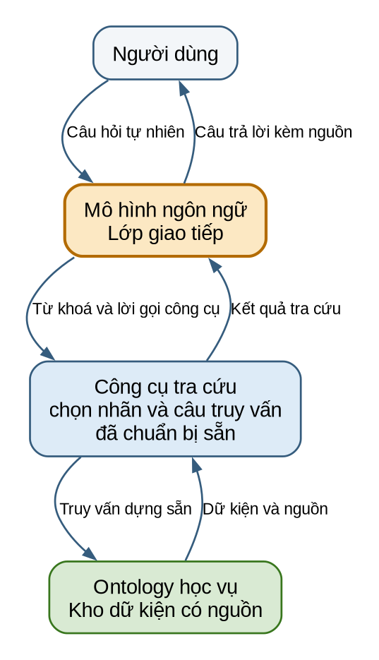

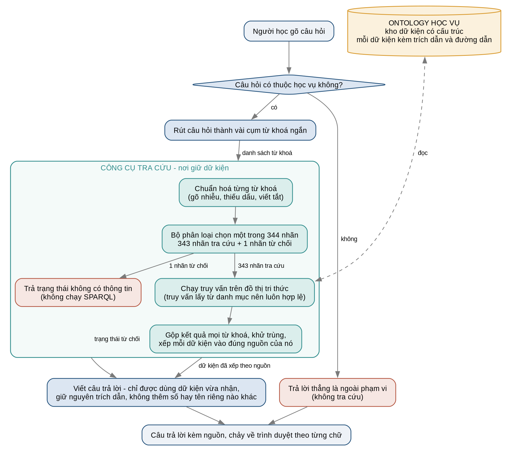

Hệ thống gồm ba tầng:

| Tầng | Thành phần | Trách nhiệm |
|---|---|---|
| Hội thoại | Mô hình ngôn ngữ lớn | Rút từ khoá và diễn đạt câu trả lời cuối |
| Tra cứu | Encoder kết hợp bộ phân loại | Chọn một trong 344 nhãn |
| Dữ kiện | Đồ thị tri thức | Lưu nội dung và nguồn, thực thi truy vấn dựng sẵn |

Bộ phân loại dự đoán một trong 344 nhãn. Trong đó, 343 nhãn ánh xạ tới truy vấn
SPARQL và một nhãn ánh xạ tới hành động từ chối. Các truy vấn được tạo từ bốn
khuôn cố định và chỉ tham chiếu thực thể có trong ontology.

Công cụ nhận từ khoá thay vì toàn bộ câu hỏi. LLM có thể gửi nhiều cụm từ khoá
của cùng một chủ đề để bao quát khác biệt giữa cách hỏi và tên trong ontology.

---

## 3. Ontology

Ontology mô tả các thực thể, thuộc tính và quan hệ học vụ, đồng thời là cơ sở dữ
liệu nội dung duy nhất cho mọi truy vấn.

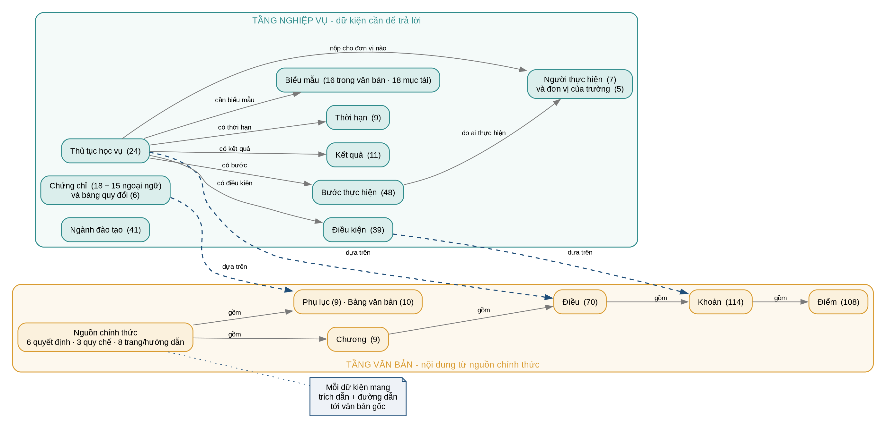

Đồ thị có hai tầng trả lời trực tiếp:

- **Tầng văn bản** giữ nguyên văn công văn, chia theo Chương → Điều → Khoản →
  Điểm, cùng Phụ lục và Bảng.
- **Tầng tri thức** giữ dữ kiện đã bóc tách về thủ tục, bước thực hiện, điều kiện,
  thời hạn, biểu mẫu, ngành đào tạo và chứng chỉ.

Mỗi dữ kiện liên kết tới phần văn bản chứng minh, cho phép câu trả lời kèm trích
dẫn và đường dẫn đối chiếu.

| Thành phần | Quy mô |
|---|---:|
| Phát biểu khai báo trực tiếp | 6.350 |
| Toàn bộ phát biểu trong đồ thị khi vận hành | 7.704 |
| Lớp khái niệm | 56 |
| Mục cụ thể (cá thể) | 685 |
| Quan hệ giữa hai thực thể | 29 |
| Thuộc tính mang giá trị chữ hoặc số | 55 |
| Văn bản gốc đã số hoá | 16 |

Phần chênh lệch 1.354 bộ ba phát sinh do đồ thị khi vận hành bổ sung cặp trích
dẫn-đường dẫn cho các mục trả lời được.

Nội dung được bóc tách từ 16 văn bản chính thức: sáu quyết định của Hiệu trưởng,
gồm **Quyết định 1052**, **Quyết định 317**, 626, 729, 753 và 1965; ba quy chế
kèm theo; cùng bảy trang thông tin chính thức.

---

## 4. Hình dạng dữ liệu

Hình dưới mô tả sáu biểu diễn của một yêu cầu, từ đầu vào đến câu trả lời.

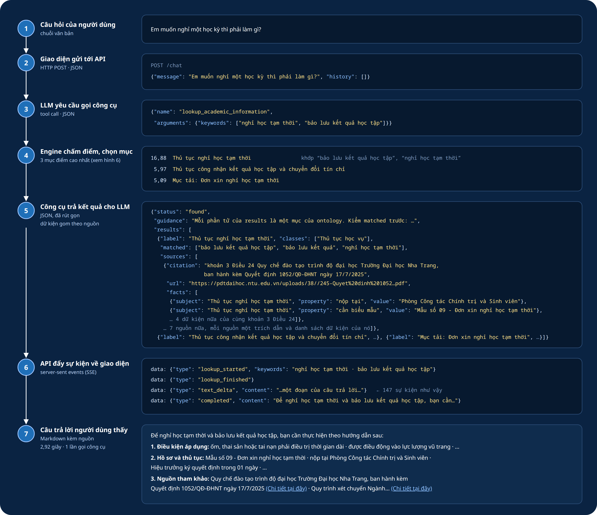

### 4.1 Một dòng dữ liệu huấn luyện

Mỗi mẫu gồm câu hỏi, mã nhóm, nhãn phong cách và IRI (Internationalized Resource
Identifier, định danh của thực thể) đích. IRI được dùng thay cho chuỗi SPARQL để
tách dữ liệu khỏi khuôn truy vấn; mẫu ngoài phạm vi có đích rỗng.

Ví dụ trả lời được, dùng câu hỏi gõ không dấu:

```json
{
  "id": "question-000013",
  "query_id": "academic-actor-facts",
  "register": "noisy",
  "input": "co van hoc tap la ai",
  "target": [":AcademicAdvisor"]
}
```

Ví dụ thuộc nhóm phải từ chối:

```json
{
  "id": "question-005274",
  "query_id": "no-information",
  "register": "formal",
  "input": "Xin cho biết chào bạn.",
  "target": []
}
```

Nhãn chuẩn của một mẫu là cặp `(query_id, target)`. `query_id` xác định khía cạnh
được hỏi, còn `target` xác định thực thể. Cặp này định danh duy nhất một trong 344
nhãn.

### 4.2 Kết quả công cụ trả về

Công cụ trả về trạng thái dữ liệu, hướng dẫn, danh sách nguồn và từ khoá không
tìm thấy. Mỗi dữ kiện nằm trong nguồn đã khẳng định nó, do đó dữ kiện và trích dẫn
được duy trì cùng nhau.

```json
{
  "trang_thai": "co_du_lieu",
  "huong_dan": "Đây là toàn bộ dữ liệu tìm thấy. Đọc hết du_lieu. Nếu chi tiết được hỏi không xuất hiện, dữ liệu hiện có không chứa chi tiết đó; không tra lại cùng chủ đề. Mỗi mục trong nguon gồm trích dẫn, đường dẫn, và các dữ kiện mà nguồn đó khẳng định.",
  "nguon": [
    {
      "trich_dan": "Điều 12 Quy chế đào tạo trình độ đại học, ban hành kèm Quyết định 1052/QĐ-ĐHNT ngày 17/7/2025",
      "duong_dan": "https://pdtdaihoc.ntu.edu.vn/uploads/38//245-Quyet dinh 1052.pdf",
      "du_lieu": [
        { "thuoc_tinh": "tên gọi", "gia_tri": "Thủ tục công nhận kết quả học tập và chuyển đổi tín chỉ" },
        { "thuoc_tinh": "nội dung bước", "gia_tri": "Sau khi trúng tuyển, thực hiện chương trình đào tạo và đăng ký học tập theo kế hoạch chung." },
        { "thuoc_tinh": "thứ tự bước", "gia_tri": 2 }
      ]
    }
  ],
  "tu_khoa_khong_thay": ["hồ sơ liên thông"]
}
```

Khi không từ khoá nào khớp, trạng thái cho biết không có thông tin và danh sách
nguồn rỗng.

---

## 5. Tập dữ liệu

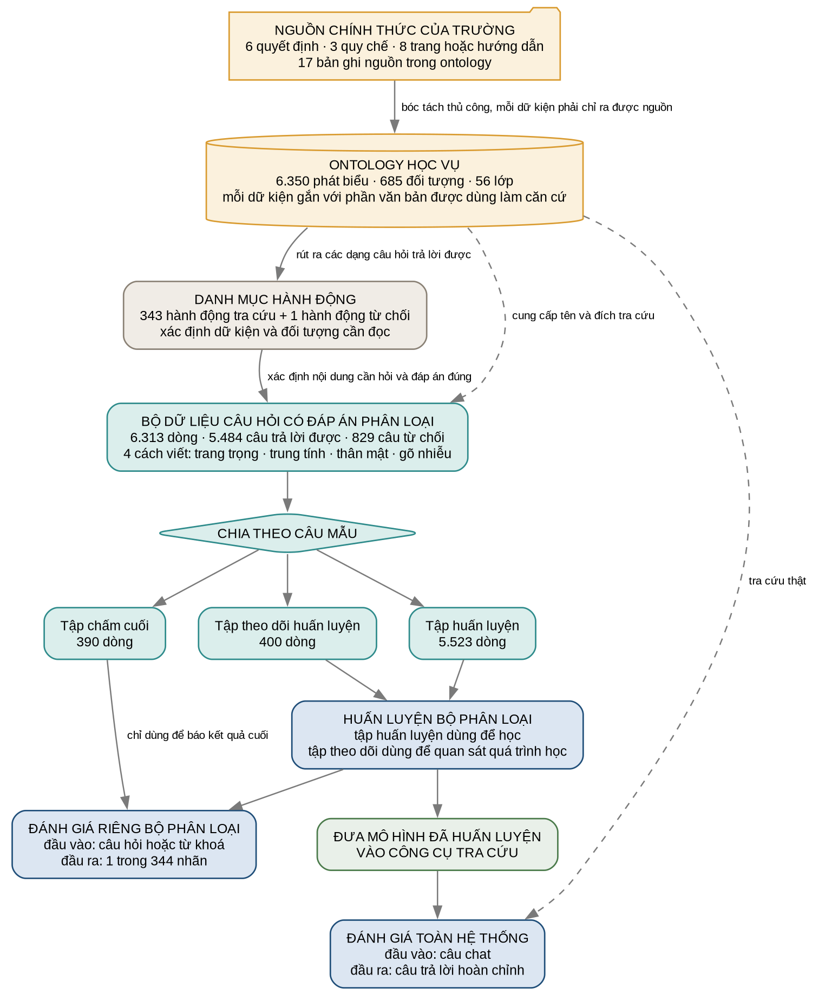

Dữ liệu được xây dựng từ ontology theo 49 nhóm câu hỏi trả lời được và một nhóm
từ chối. Trong 566 đích, 258 đích xuất hiện ở cả bốn cách hỏi. Tập dữ liệu gồm
`train` (tập học tham số), `validation` (tập theo dõi huấn luyện) và `test` (tập
đánh giá độc lập).

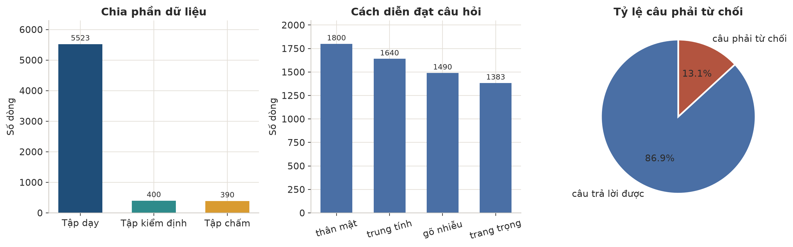

| Phần dữ liệu | Số dòng | Vai trò |
|---|---:|---|
| `train` | 5.523 | Học ánh xạ từ câu hỏi sang nhãn hoặc từ chối |
| `validation` (`val`) | 400 | Theo dõi quá trình huấn luyện |
| `test` | 390 | Đánh giá độc lập |
| **Toàn bộ** | **6.313** | - |

Không câu nào ở `validation` hoặc `test` trùng nguyên văn với `train`. Tuy nhiên,
ba phần dùng chung bộ đích; vì vậy phép đo phản ánh khả năng nhận diện cách hỏi
mới về nội dung đã biết, không phản ánh khả năng xử lý mục chưa gặp.

Dữ liệu phủ 50 nhóm câu hỏi và 566 đích, gồm 565 đích truy vấn cùng một đích từ
chối. Sau khi gộp Khoản và Điểm lên Điều, mô hình phân biệt 344 nhãn. Độ dài câu
hỏi có trung vị 11 từ, trung bình 11,54 từ, nhỏ nhất 1 từ và lớn nhất 36 từ.

Toàn bộ dữ liệu có 829 câu mang nhãn từ chối, chiếm 13,1%: 730 câu `train`, 50
câu `validation` và 49 câu `test`.

Bốn phong cách câu hỏi biểu diễn biến thiên bề mặt của cùng ý định:

| Phong cách | Số dòng | Mô tả |
|---|---:|---|
| thân mật | 1.800 | cách diễn đạt hội thoại |
| trung tính | 1.640 | câu hỏi đủ dấu, cấu trúc thông dụng |
| gõ nhiễu | 1.490 | thiếu dấu, sai chính tả hoặc viết dính |
| trang trọng | 1.383 | văn phong hành chính |

---

## 6. Thiết lập thực nghiệm

### 6.1 Năm mô hình đem so

Bốn encoder được fine-tune, tức tiếp tục huấn luyện trên bài toán phân loại hiện
tại. Baseline TF-IDF + LinearSVC kết hợp TF-IDF (*term frequency-inverse document
frequency*, trọng số phản ánh mức đặc trưng của n-gram) với bộ phân loại tuyến
tính biên lớn LinearSVC. Baseline không dùng biểu diễn tiền huấn luyện và khai
thác n-gram ký tự cùng n-gram từ; đặc trưng ký tự phù hợp với câu thiếu dấu và
sai chính tả trong tập dữ liệu.

| Mô hình | Tổ chức | Loại |
|---|---|---|
| XLM-R base (`FacebookAI/xlm-roberta-base`) | Meta AI | encoder đa ngữ |
| PhoBERT-v2 (`vinai/phobert-base-v2`) | VinAI | encoder tiếng Việt |
| BamiBERT (`Qualcomm-AI-Research/BamiBERT`) | Qualcomm AI Research | encoder đa ngữ |
| ViSoBERT (`uitnlp/visobert`) | UIT-NLP | encoder tiếng Việt cho mạng xã hội |
| TF-IDF + LinearSVC | - | baseline tuyến tính |

### 6.2 Điều kiện chạy

Cả năm mô hình dùng cùng ba phần dữ liệu. Một epoch là một lượt xử lý toàn bộ tập
`train`; bốn encoder được fine-tune trong 32 epoch. Checkpoint là trạng thái mô
hình được lưu tại một epoch; checkpoint ở epoch cuối được đánh giá trên `test`.
Baseline được huấn luyện một lần. `Test` không tham gia lựa chọn mô hình hoặc
điều chỉnh tham số.

### 6.3 Các chỉ số và cách tính

Mỗi câu được chấm bằng cách so nhãn dự đoán với nhãn chuẩn. Accuracy dùng toàn bộ
390 câu. Precision macro, recall macro và F1 macro cho mỗi nhãn trọng số bằng
nhau; F1 weighted lấy trung bình F1 theo số mẫu của từng nhãn. Các chỉ số theo
phạm vi còn báo riêng 341 câu trả lời được và 49 câu ngoài phạm vi; trên
`validation`, hai nhóm tương ứng có 350 và 50 câu.

Nhãn dự đoán được ánh xạ tất định tới truy vấn dựng sẵn khi hệ thống phục vụ.
Thực nghiệm bộ phân loại không chấm phép sinh chuỗi truy vấn hoặc thực thi SPARQL.

### 6.4 Cách tiến hành phép đo

**Chia dữ liệu.** 6.313 câu được chia thành 5.523 câu `train`, 400 câu
`validation` và 390 câu `test`. Không có câu trùng nguyên văn giữa ba phần.

**Huấn luyện và chấm nhãn.** Bốn encoder chạy 32 epoch; checkpoint cuối được dùng
để dự đoán nhãn trên `test`. Baseline được huấn luyện trên `train` rồi áp dụng
cùng phép chấm nhãn.

**Chấm end-to-end.** End-to-end là toàn bộ luồng từ câu hỏi đến câu trả lời. Phép
đo đưa 85 câu qua trợ lý hoàn chỉnh, gồm 60 câu trong phạm vi, 15 câu ngoài phạm
vi và 10 câu hỏi về dữ liệu ontology chưa có. Mỗi lượt ghi câu hỏi, dữ liệu công
cụ và câu trả lời cuối.

**Thời gian phản hồi.** Thời gian được đo từ lúc nhận câu hỏi đến khi có câu trả
lời cuối. Trung vị và p95 được lấy theo thứ hạng; p95 là phần tử thứ
⌈0,95 × n⌉ của dãy đã sắp xếp.

---

## 7. Kết quả thực nghiệm

### 7.1 Bảng so sánh năm mô hình

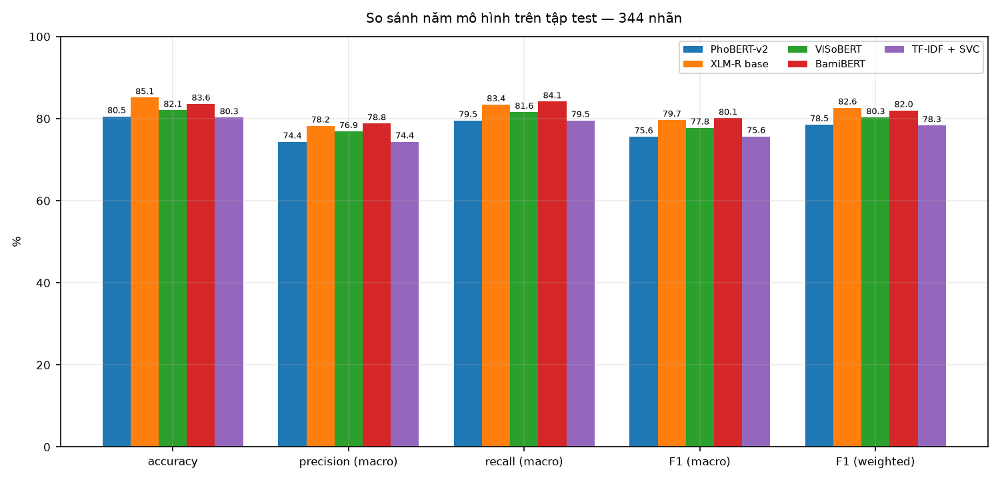

Kết quả trên 390 câu `test` với 344 nhãn:

| Mô hình | Accuracy | Precision macro | Recall macro | F1 macro | F1 weighted |
|---|---:|---:|---:|---:|---:|
| XLM-R base | **85,1%** | 78,2% | 83,4% | 79,7% | **82,6%** |
| BamiBERT | 83,6% | **78,8%** | **84,1%** | **80,1%** | 82,0% |
| ViSoBERT | 82,1% | 76,9% | 81,6% | 77,8% | 80,3% |
| PhoBERT-v2 | 80,5% | 74,4% | 79,5% | 75,6% | 78,5% |
| TF-IDF + LinearSVC | 80,3% | 74,4% | 79,5% | 75,6% | 78,3% |

Bốn mô hình học sâu đều vượt mốc so sánh, và XLM-R hơn mốc đó 4,8 điểm. Phần lớn
khoảng cách nằm ở những nhãn ít câu dạy, xem ngay mục dưới.

**Nhưng không mô hình nào dẫn đầu cả năm cột.** XLM-R hơn ở hai cột đầu và cuối,
BamiBERT hơn ở ba cột giữa. Chuyện này không mâu thuẫn: accuracy đếm theo từng câu
hỏi nên nhãn nào nhiều câu thì có tiếng nói lớn hơn, còn ba cột giữa lấy trung bình
theo nhãn nên nhãn nào cũng một phiếu như nhau. Hai mô hình mạnh ở hai phía khác
nhau của cùng một bộ dữ liệu.

Khoảng cách lớn nhất giữa chúng là 1,5 điểm, mà **huấn luyện lại cùng một mô hình
trên gần như cùng dữ liệu đã làm điểm xê dịch tới 1,8 điểm** (mục 10). Nói cách
khác, bảng này chưa đủ để nói mô hình nào hơn mô hình nào. XLM-R là mô hình được
đem triển khai, nhưng đó là một lựa chọn, không phải một kết luận từ số liệu.

Tách theo phạm vi câu hỏi:

| Mô hình | Trong phạm vi<br>(341 câu) | Ngoài phạm vi<br>(49 câu) | Thời gian huấn luyện |
|---|---:|---:|---:|
| XLM-R base | 86,2% <br><sub>294/341</sub> | 77,6% <br><sub>38/49</sub> | 186 s |
| BamiBERT | 86,2% <br><sub>294/341</sub> | 65,3% <br><sub>32/49</sub> | 182 s |
| ViSoBERT | 84,2% <br><sub>287/341</sub> | 67,3% <br><sub>33/49</sub> | 240 s |
| PhoBERT-v2 | 81,8% <br><sub>279/341</sub> | 71,4% <br><sub>35/49</sub> | 181 s |
| TF-IDF + LinearSVC | 82,7% <br><sub>282/341</sub> | 63,3% <br><sub>31/49</sub> | 4 s |

Hai cột này đo hai việc trái ngược nhau nên phải đọc riêng: cột trái là "trả lời
đúng khi có thể trả lời", cột phải là "biết im lặng khi không nên trả lời". Cột phải
chỉ dựa trên 49 câu, mà 49 câu đó lại sinh ra từ bảy khuôn câu, nên các biến thể của
cùng một khuôn không phải bảy phép thử độc lập. Đừng xếp hạng mô hình bằng cột này.

#### Nhãn được dạy càng ít câu thì càng khó

Không phải nhãn nào cũng được dạy như nhau. Có nhãn xuất hiện trong hai chục câu hỏi
của tập dạy, có nhãn chỉ một hai câu. Bảng dưới chia 344 nhãn thành năm nhóm theo số
câu đã dạy cho chúng, rồi xem mỗi mô hình trả lời đúng bao nhiêu phần trăm ở từng nhóm.

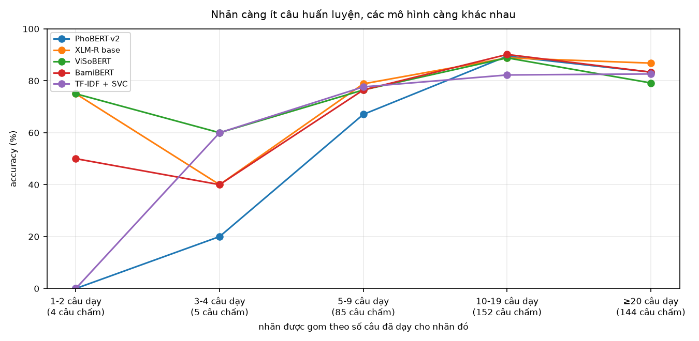

| Mô hình | Nhãn được dạy 1-2 câu | 3-4 câu | 5-9 câu | 10-19 câu | Từ 20 câu trở lên |
|---|---:|---:|---:|---:|---:|
| *Số câu trong tập chấm rơi vào nhóm* | *4* | *5* | *85* | *152* | *144* |
| XLM-R base | 75% | 40% | 79% | 89% | 87% |
| BamiBERT | 50% | 40% | 76% | 90% | 83% |
| ViSoBERT | 75% | 60% | 76% | 89% | 79% |
| PhoBERT-v2 | 0% | 20% | 67% | 89% | 83% |
| TF-IDF + LinearSVC | 0% | 60% | 78% | 82% | 83% |

Nhìn từ phải sang trái: nhãn nào được dạy nhiều thì cả năm mô hình đều làm tốt và
gần bằng nhau. Càng sang trái, nhãn càng ít câu dạy, các mô hình càng tách xa nhau.

Nhưng **hai cột trái không dùng để so mô hình được**. Hàng thứ hai của bảng cho biết
vì sao: cả hai nhóm đó cộng lại chỉ có 9 câu trong tập chấm, nên một câu trả lời khác
đi là tỷ lệ nhảy 20 điểm phần trăm. Chúng cho thấy một xu hướng, không cho thấy thứ
hạng. Toàn bộ dữ liệu có 57 trong 344 nhãn được dạy dưới năm câu.

### 7.2 Diễn biến huấn luyện

Hình dưới theo dõi "hao hụt" của mô hình qua từng vòng học. Hao hụt là một con số
đo mức mô hình đoán lệch khỏi đáp án đúng: càng thấp thì đoán càng sát. Đường màu
nhạt là hao hụt trên chính tập đã dạy, đường đậm là trên tập kiểm định mà mô hình
chưa từng học. Khi đường thứ nhất tiếp tục xuống mà đường thứ hai dừng lại hoặc đi
lên, mô hình đang học thuộc lòng thay vì học quy luật.

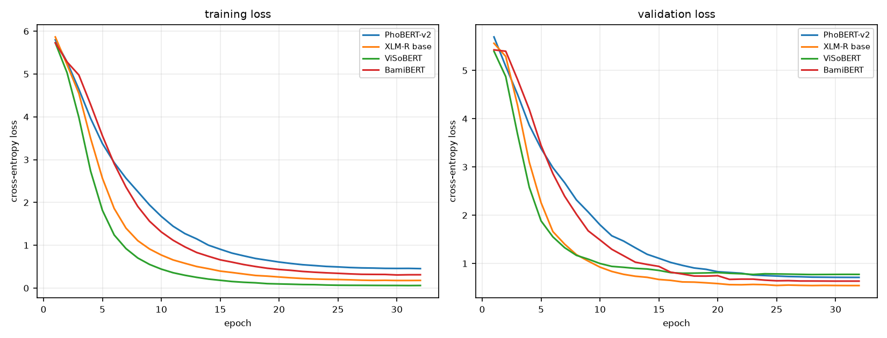

Đó đúng là chuyện xảy ra với ViSoBERT: sau 32 vòng nó có hao hụt trên tập dạy
thấp nhất trong bốn mô hình, nhưng hao hụt trên tập kiểm định lại cao nhất. XLM-R
thì ngược lại, giữ hao hụt kiểm định thấp nhất. Mốc so sánh không học theo vòng
nên không có đường nào trong hình.

### 7.3 Kết quả theo lĩnh vực

Kết quả của XLM-R trên `test`:

| Lĩnh vực | Accuracy | Số câu |
|---|---:|---:|
| Chứng chỉ ngoại ngữ | 93,5% | 31 |
| Thủ tục học vụ | 89,8% | 49 |
| Văn bản và điều khoản | 87,7% | 57 |
| Biểu mẫu | 87,5% | 48 |
| Quy tắc học vụ | 84,7% | 131 |
| Ngoài phạm vi | 77,6% | 49 |
| Học phí | 72,0% | 25 |

Đừng đọc bảng này như một bảng xếp hạng lĩnh vực. Học phí đứng cuối nhưng chỉ có
25 câu, nên sai thêm một câu là tụt 4 điểm. Chỉ Quy tắc học vụ đủ lớn để tin: 131
câu, đạt 84,7%, tức gần đúng bằng mức chung của cả tập.

### 7.4 Kết quả theo cách hỏi

| Mô hình | Trang trọng | Trung tính | Thân mật | Gõ nhiễu |
|---|---:|---:|---:|---:|
| XLM-R base | **94,9%** | **91,9%** | **83,5%** | 69,8% |
| BamiBERT | 92,9% | **91,9%** | 78,4% | 70,8% |
| ViSoBERT | 90,8% | 88,9% | 78,4% | 69,8% |
| PhoBERT-v2 | 87,8% | 86,9% | 75,3% | **71,9%** |
| TF-IDF + LinearSVC | 85,7% | 85,9% | 77,3% | **71,9%** |

Cả năm mô hình đều tệ nhất ở nhóm gõ nhiễu, và với XLM-R khoảng cách giữa câu
trang trọng và câu gõ vội lên tới 25 điểm. Đáng chú ý hơn: ở riêng nhóm này, mốc so
sánh đơn giản lại nhỉnh hơn cả bốn mô hình học sâu. Việc học trước trên khối văn bản
lớn không giúp được gì khi chữ bị viết sai và mất dấu.

### 7.5 Độ chính xác câu trả lời `end-to-end`

Mục 7.1 là **phép đo từng phần**: nó chỉ chấm tầng chọn nhãn. Phép đo dưới đây chạy
hết cả đường - rút từ khoá, tra cứu đồ thị, rồi LLM đọc dữ liệu và viết câu trả lời.
Hai con số vì thế không so trực tiếp với nhau được, và chọn đúng nhãn không bảo đảm
câu trả lời cuối cùng đúng.

#### Bộ đo có hai loại câu hỏi, và phải đọc riêng

85 câu hỏi chia làm hai loại. Với **61 câu trong phạm vi**, làm tốt nghĩa là đưa ra
được thứ người ta hỏi. Với **24 câu còn lại** - 14 câu ngoài phạm vi và 10 câu hỏi
đúng vào chỗ ontology không lưu - làm tốt nghĩa là **từ chối**; trả lời được chúng
tức là hệ thống đã bịa ra thứ dữ liệu không hề nói.

Đây là lý do hai nhóm không được cộng chung. Gộp cả 85 câu vào một mẫu số thì mỗi
lần hệ thống từ chối đúng một câu, tỷ lệ "đúng" lại tụt xuống - hệ thống càng cư xử
đúng, bảng điểm càng xấu.

#### 61 câu trong phạm vi

Ba phép đếm chạy tự động, không cần ai đọc câu trả lời:

| Đếm gì | Tỷ lệ | Số câu |
|---|---:|---:|
| Trợ lý có tra cứu trước khi trả lời không | 93,4% | 57/61 |
| Trong các mục lấy về từ đồ thị, có mục mà câu hỏi nhắm tới không | 78,7% | 48/61 |
| Mọi con số và tên viết tắt trong câu trả lời đều có trong dữ liệu vừa tra chứ | 96,7% | 59/61 |
| **Vừa lấy đúng mục, vừa không nêu gì ngoài dữ liệu** | **77,0%** | **47/61** |

Ba phép đếm trên không đọc được câu trả lời có thật sự trả lời câu hỏi hay không.
Phần đó do một mô hình ngôn ngữ lớn chấm, sau khi đọc cả câu hỏi, dữ liệu công cụ
trả về và câu trả lời:

| Mô hình chấm | Tỷ lệ | Số câu |
|---|---:|---:|
| **đúng** - đưa ra được thứ được hỏi, và mọi dữ kiện nêu ra đều có trong dữ liệu | **78,7%** | **48/61** |
| *từ chối* - không đưa ra được, nhưng có nói rõ là dữ liệu không có | 18,0% | 11/61 |
| *thiếu* - đưa ra được một phần, phần đã đưa thì đúng | 3,3% | 2/61 |
| *sai* - nêu dữ kiện sai, hoặc nối hai dữ kiện rời thành một quan hệ dữ liệu không nói | 0% | 0/61 |
| *lạc đề* - không đưa ra được, mà cũng không nói là thiếu | 0% | 0/61 |

#### 24 câu lẽ ra phải từ chối

| Mô hình chấm | Tỷ lệ | Số câu |
|---|---:|---:|
| **từ chối** - đúng như mong đợi | **87,5%** | **21/24** |
| *đúng* - tức là đã trả lời, trong khi lẽ ra phải từ chối | 12,5% | 3/24 |

Ba câu bị trả lời đều giống nhau một kiểu: người hỏi nhắc tới một thứ có thật trong
đồ thị, nhưng hỏi một thuộc tính mà ontology không lưu, và trợ lý ghép hai dữ kiện
rời lại thành câu trả lời.

#### Con số này đáng tin tới đâu

Người chấm là máy chứ không phải người, nên nó được soi lại bằng chính ba phép đếm
tự động ở trên: câu nào lấy đúng mục, có dữ liệu, không bịa số mà vẫn bị chấm là từ
chối thì chắc chắn một trong hai bên sai. **6 trên 85 phán quyết vướng mâu thuẫn
kiểu đó.** Chín trường hợp trải đều các mức đã được đọc bằng tay, và cả chín lần
máy chấm đều đúng. Dù vậy, chưa có ai chấm song song để đối chứng, nên con số này
nên đọc như một ước lượng.

Có thêm một phép dò đơn giản chạy song song, chỉ tìm xem câu trả lời có chứa cụm
kiểu "không tìm thấy", "dữ liệu không có" hay không. Nó bắt được 7 trên 14 câu ngoài
phạm vi và 9 trên 10 câu chạm khoảng trống. Nó thấp hơn phép chấm đọc cả câu, vốn
cho 12 trên 14 ở cùng nhóm, đơn giản vì nó chỉ nhận ra những cách nói đã liệt kê sẵn.

### 7.6 Thời gian phản hồi

Phép đo trên 85 câu bao gồm thời gian gọi LLM qua mạng:

| Thống kê | Giây |
|---|---:|
| Trung vị | **2,5** |
| p95 | 4,8 |
| Dài nhất | 6,9 |
| Ngắn nhất | 0,7 |

Trung vị với tra cứu là 2,6 giây, so với 1,2 giây khi không tra cứu.

Đo riêng bên trong công cụ, trên 76 lượt tra cứu thật:

| Giai đoạn | Trung vị | p95 |
|---|---:|---:|
| Chọn truy vấn | **3,9 ms** | 5,1 ms |
| Chạy truy vấn trên đồ thị | 17,6 ms | 1.530,6 ms |
| Toàn bộ công cụ | 22,6 ms | 1.535,5 ms |

Tầng chọn truy vấn tốn **3,9 ms**, tức khoảng 0,16% thời gian phản hồi. Toàn bộ công
cụ, gồm cả việc chạy SPARQL trên đồ thị, chiếm chưa tới 1%. Phần còn lại là LLM đọc
dữ liệu và viết câu trả lời.

Hệ quả cho việc triển khai: thời gian phản hồi của hệ thống bị chi phối bởi lớp giao
tiếp chứ không phải phần lõi. Muốn nhanh hơn thì tối ưu ở LLM hoặc rút ngắn khuôn
nhắc; tối ưu bộ phân loại không còn dư địa đáng kể.

Giá trị p95 của bước chạy truy vấn cao hơn trung vị hai bậc độ lớn vì một số truy
vấn trả về toàn văn bảng biểu dài; đó là đặc điểm của dữ liệu, không phải của mô hình.

## 8. Phân tích trường hợp trả lời sai

Hai tầng có thể sai độc lập: tầng tra cứu chọn nhầm nhãn, hoặc tầng giao tiếp diễn
đạt sai dù nhận đúng dữ liệu.

### 8.1 Lỗi của tầng chọn truy vấn

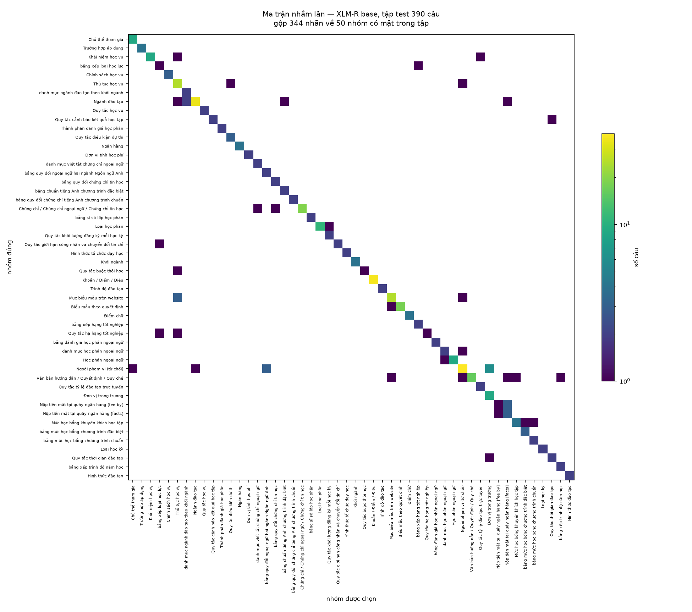

XLM-R sai 58/390 câu `test`; trong số đó, 48 lỗi đổi nhóm câu hỏi và 10 lỗi chọn
sai thực thể trong cùng nhóm.

Sáu trường hợp tiêu biểu:

| Câu hỏi | Đích đúng | Mô hình chọn |
|---|---|---|
| nganh co khi goi sao | Ngành Kỹ thuật cơ khí | Bảng danh mục ngành |
| nganh thuy san ten j | Ngành Công nghệ chế biến thuỷ sản | Ngành Nuôi trồng thuỷ sản |
| nganh ky thuat co dien tu | Ngành Kỹ thuật cơ điện tử | Ngành Kỹ thuật điện |
| hp ny la gi | Học phần tự chọn | Học phần điều kiện |
| tg dt chuan toan khoa | Thời gian đào tạo chuẩn | Khoa hoặc viện đào tạo |
| meo hoc tieng nhat nhanh? | *từ chối* | Bảng quy đổi chứng chỉ tiếng Anh |

Phần lớn ví dụ ở trên là câu gõ tắt không dấu, đúng nhóm có accuracy thấp nhất ở
§7.4. Ba dạng lặp lại: nhầm một ngành với ngành khác cùng lĩnh vực, nhầm thực thể
với bảng danh mục chứa nó, và nhận câu lẽ ra phải từ chối vào một bảng quy đổi.

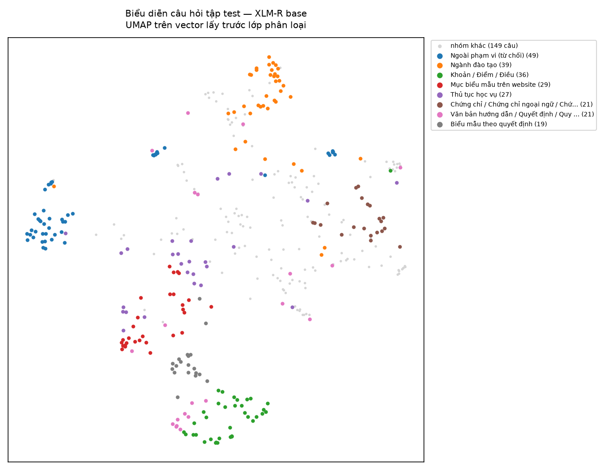

Hình trên chiếu vector biểu diễn của 390 câu hỏi tập test xuống hai chiều bằng UMAP,
một phép giảm chiều phi tuyến giữ lại quan hệ lân cận. Mỗi điểm là một câu hỏi, màu
theo nhóm câu hỏi. Các nhóm tách thành cụm rời nhau, nghĩa là mô hình học được biểu
diễn phân tách theo nhóm chứ không chỉ ghi nhớ từng câu.

Nhóm ngoài phạm vi tách thành nhiều cụm rời chứ không gộp làm một. Điều này phù hợp
với việc dữ liệu chứa nhiều loại câu ngoài phạm vi khác nhau - lời chào, câu hỏi
thuộc lĩnh vực khác, câu hỏi đúng chủ đề nhưng đòi dữ kiện ontology không lưu - và
mô hình phân biệt được chúng.

### 8.2 Lỗi của cả trợ lý

Trong 85 câu end-to-end, không câu nào bị máy chấm là nêu dữ kiện sai. Dạng hỏng
còn lại nằm ở chỗ khác: **câu hỏi chỉ nêu chủ thể mà không nêu cần biết gì về chủ
thể đó**. Cả bốn câu trong phạm vi mà trợ lý không tra cứu đều thuộc dạng này:

> **Hỏi:** "Trường Đại học Nha Trang?" - "Sinh viên thế nào ạ?" -
> "Mình cần tra cứu các thông tin liên quan đến Trình độ đại học?"
>
> **Trả lời:** trợ lý liệt kê các nhóm chủ đề tra được rồi mời hỏi cụ thể hơn.

Hành vi này hợp lý với người dùng nhưng không tạo ra câu trả lời, nên phép đo xếp
vào mức từ chối. Câu thứ tư cùng nhóm hỏi "trường hợp nằm viện, tai nạn được mô tả
trong quy định này" - đại từ "này" không có tiền ngữ trong lượt hỏi đơn lẻ.

Đây là lỗi tầng giao tiếp chứ không phải lỗi chọn truy vấn: với cả bốn câu, nhãn
đúng vẫn tồn tại trong danh mục, chỉ là trợ lý không gửi từ khoá nào đi tra.

## 9. Giao diện

Giao diện trình bày kết quả tra cứu và không tham gia chọn truy vấn.

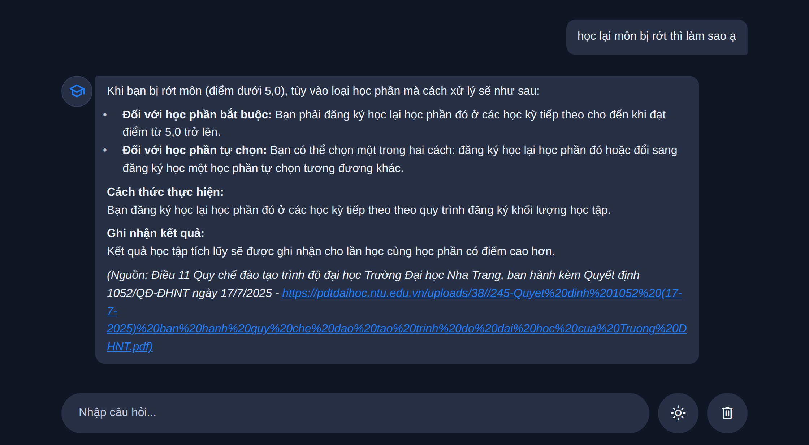

Tiêu chí có đường dẫn được xác định bằng sự xuất hiện của URL trong câu trả lời.
Có 67/85 câu đáp ứng tiêu chí này, tương ứng 78,8%. Trong các câu có dữ liệu trả
về, 67/76 câu có URL, tương ứng 88,2%.

Trong lúc tra cứu, giao diện hiển thị các cụm từ khoá được gửi tới công cụ:

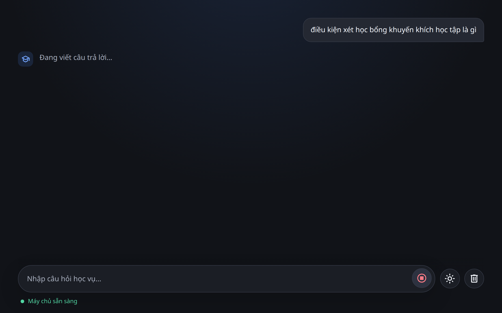

Thông tin này cho phép đối chiếu cụm từ khoá với câu hỏi đầu vào khi kết quả tra
cứu không phù hợp.

Khi câu hỏi nằm ngoài phạm vi, giao diện trình bày thông báo không có thông tin:

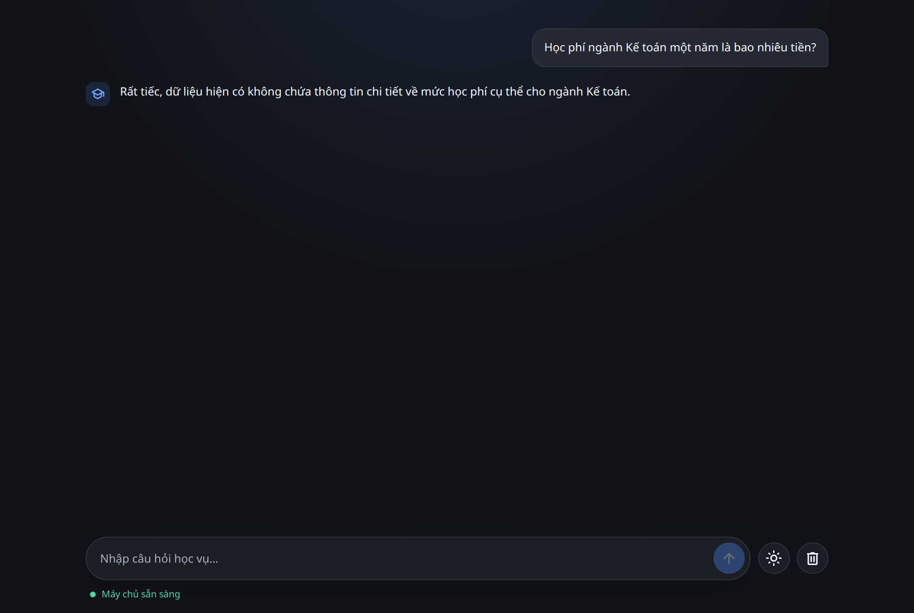

---

## 10. Hạn chế

**Phạm vi câu hỏi đóng.** Câu hỏi được xây dựng từ đồ thị và mọi nhãn của `test`
đều có trong `train`. Phép đo chưa đánh giá mục chưa từng thấy hoặc câu hỏi do
người học cung cấp.

**Gộp nhãn làm giảm độ chi tiết truy xuất.** Gộp Khoản và Điểm lên Điều làm số
nhãn giảm từ 566 xuống 344 và tỷ lệ nhãn có dưới năm mẫu huấn luyện giảm từ 55%
xuống 17%. Hệ quả là truy vấn ở cấp Điểm có thể trả về toàn bộ Điều, với trung vị
10 dòng; trích dẫn vẫn định vị dữ kiện ở cấp Điểm.

**Chênh lệch nhỏ giữa các bộ mã hoá không đọc được thành khác biệt thật.** Bốn bộ
mã hoá được huấn luyện hai lượt trên hai bản `train` chênh nhau 5 dòng, tức 0,09%.
Mỗi mô hình đổi dự đoán ở 28-42 trong 390 câu `test` (7-11%), trong khi accuracy chỉ
xê dịch 0,8-1,8 điểm phần trăm vì các lỗi mới và lỗi được sửa gần bù nhau. Baseline
đếm tần suất cụm ký tự đổi 0 câu ở cùng phép thử, nên mức xê dịch này đến từ quá
trình huấn luyện chứ không từ năm dòng dữ liệu.

Hệ quả: XLM-R đứng đầu và BamiBERT đứng thứ hai ở cả hai lượt, nhưng thứ tự các vị
trí sau đó đổi chỗ giữa hai lượt. Chênh lệch cỡ hai điểm phần trăm giữa các bộ mã
hoá nằm trong mức xê dịch này. Hai lượt chạy chưa đủ để dựng khoảng tin cậy.

**Nhãn chuẩn chỉ công nhận một đáp án.** Một câu hỏi có thể được trả lời bằng
nhiều truy vấn thu được dữ kiện tương đương, nhưng phép chấm nhãn chỉ công nhận
một nhãn chuẩn. Ảnh hưởng của hiện tượng này chưa được lượng hoá bằng tệp kết quả
có thể tái lập.

**Dữ liệu tổng hợp còn hạn chế về ngôn ngữ và nhãn phong cách.** Một số câu mang
dấu vết của khuôn soạn hoặc có phong cách không tách bạch. Mức ảnh hưởng chưa có
kết quả kiểm tra theo từng mẫu.

**Đánh giá từ chối có cỡ mẫu nhỏ.** Có 49 câu ngoài phạm vi trong `test`, được tạo
từ bảy khuôn; các biến thể cùng khuôn không phải phép thử độc lập.

**Nhãn từ chối cần kiểm tra thực thi có bằng chứng nguồn.** Kiểm tra cần lưu quy
tắc, danh sách mã mẫu và mã băm dữ liệu trước khi dùng để công bố số lượng trường
hợp sai nhãn.

**Phép đo end-to-end có quy mô nhỏ.** Mẫu 85 câu chưa đủ để báo cáo sai số hẹp;
phần chấm chất lượng do mô hình ngôn ngữ lớn thực hiện và chưa được đối chứng với
người chấm.

Trên `test`, XLM-R không từ chối đúng 11/49 câu ngoài phạm vi, tương ứng 22,4%;
Học phí có accuracy thấp nhất trong bảy lĩnh vực, đạt 72,0%.

---

## 11. Hướng cải tiến

1. Xây dựng quy tắc chấm cho trường hợp nhiều truy vấn trả về dữ kiện tương đương,
   đồng thời lưu kết quả thực thi theo từng câu.
2. Hiệu chỉnh lỗi câu chữ và nhãn phong cách bằng quy trình kiểm tra có quy tắc,
   danh sách mã mẫu và mã băm dữ liệu.
3. Bổ sung tên gọi thay thế và viết tắt tiếng Việt cho các thực thể dễ nhầm lẫn,
   tập trung vào nhóm gõ nhiễu.
4. Mở rộng bộ đánh giá từ chối theo chủ đề độc lập thay vì chỉ tăng biến thể câu
   trong cùng khuôn.
5. Lặp huấn luyện với nhiều hạt giống để ước lượng biến thiên và khoảng tin cậy.
6. Xây dựng tập đánh giá từ câu hỏi thực tế của người học, tách biệt với quá trình
   xây dựng ontology và dữ liệu huấn luyện.
