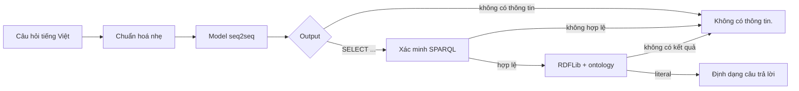

# NTU Ontology Chatbot

Chatbot tiếng Việt trả lời câu hỏi học vụ bằng cách chuyển câu hỏi thành SPARQL
và truy vấn ontology RDF. Tài liệu này mô tả kiến trúc đích cùng trạng thái thật
của lần xây lại từ nguồn công văn chính thức. Các kiểm tra kỹ thuật đã qua không
tự động biến ontology, dataset hoặc model thành artifact production.

## Trạng thái hiện tại

- **Đã kiểm chứng:** ontology canonical, semantic index, answer inventory,
  query catalogue và contract runtime marker/SPARQL.
- **Đang thực hiện:** biên soạn dataset chính thức từ catalogue.
- **Candidate:** 455 câu hiện tại dùng cho smoke và curation.
- **Chưa thực hiện:** full fine-tuning, benchmark chính thức và chọn model
  production trên dataset mới.

Chiều kiểm soát độ phủ bắt buộc là:

```text
ontology → inventory → catalogue → dataset
```

Catalogue gồm 51 họ truy vấn và phủ bằng máy toàn bộ 2.953 khả năng trả lời
`supported` trong inventory. Candidate mới dùng 24 họ nên chưa được phép full
fine-tune hoặc xem là dataset production.

## Bài toán và phương pháp

Hệ thống dùng một model encoder-decoder cho hai nhiệm vụ gắn liền nhau:

1. từ chối câu hỏi mà ontology không thể trả lời trọn vẹn;
2. sinh một truy vấn SPARQL `SELECT` cho câu hỏi được hỗ trợ.

Model không chứa câu trả lời học vụ. Nội dung hướng dẫn, nhãn thực thể, email,
địa điểm, mức học phí và các literal khác nằm trong ontology và chỉ được lấy ra
khi backend thực thi SPARQL.



Không có model phân loại thứ hai, fuzzy matching, tự sửa query hoặc logic dò IRI
trong backend.

## Ranh giới trong và ngoài miền

Output model chỉ có hai dạng:

```text
SELECT ?answer WHERE { ... }
```

```text
không có thông tin
```

Câu ngoài học vụ, câu gần học vụ nhưng ontology thiếu dữ liệu, câu mơ hồ và câu
trộn nhiều yêu cầu mà có ít nhất một phần không được hỗ trợ đều dùng marker từ
chối. Hệ thống không trả lời một phần câu hỗn hợp.

## Ontology

Nguồn công văn chính thức quyết định dữ liệu và phạm vi trả lời. Ontology dùng
IRI tiếng Anh ổn định, `rdfs:label@vi` cho tên tiếng Việt chính và
`skos:altLabel@vi` cho tên gọi thay thế hữu ích. Object property tạo đường đi
trên graph; label và datatype property là dữ liệu được trả về.

Lớp văn bản nguồn, học phí, biểu mẫu và các bảng quy tắc đã được đối chiếu với
`NTUdocs`. Ontology canonical hiện có 22 quy trình, 2 chính sách và inventory
máy đọc được tại `resources/ontology/answer_inventory.json`. Các chủ đề nghỉ
ốm, học liên thông, cảnh báo và buộc thôi học đã có đường truy vấn về đúng
provision nguồn.

Chi tiết nằm tại [docs/ONTOLOGY.md](docs/ONTOLOGY.md).

## Dataset

Catalogue canonical cùng candidate pool nằm tại `resources/dataset/main/`.
Snapshot câu hỏi hiện tại có 455 câu thuộc 24/51 họ truy vấn: 339 train, 58
validation và 58 test. Trong đó 96 câu dạy marker từ chối. Các con số này chỉ
mô tả dữ liệu đang có để smoke pipeline; từng câu sẽ được giữ, sửa hoặc loại sau
khi catalogue đã được khóa.

Dataset chính thức phải phủ inventory khả năng trả lời của ontology, đặc biệt
toàn bộ khía cạnh quan trọng của các quy trình học vụ, học phí, biểu mẫu và quy
đổi chứng chỉ. Nó cũng phải có lượng lớn câu ngoài miền được tuyển chọn, câu nói
tự nhiên, viết tắt/noisy và các ca test tay. Việc một IRI hữu hạn đã xuất hiện
trong candidate không phải bằng chứng dataset đã phủ catalogue.

Phân bố cùng checksum được sinh trong `resources/dataset/main/manifest.json`
và `reports/dataset.json`. Các câu người dùng thực tế được giữ tại
`resources/cases/user_queries.txt`; quyết định hồi quy hiện tại cũng chỉ là ứng
viên và phải được rà lại theo catalogue đã khóa.

Chi tiết nằm tại [docs/DATASET.md](docs/DATASET.md).

## Mô hình và đánh giá

Sau khi dataset chính thức được khóa, ba model sẽ được fine-tune và benchmark
công bằng trên cùng dữ liệu:

- `vinai/bartpho-syllable`;
- `VietAI/vit5-base`;
- `google/t5gemma-2-270m-270m`.

Metric chính trong miền là Answer Exact sau khi thực thi SPARQL. Phần ngoài
miền đo tỷ lệ sinh đúng marker, false acceptance và khả năng từ chối câu hỗn
hợp. System Answer Exact được báo cáo riêng cho trong miền, ngoài miền và toàn
bộ test. Hiện chưa có benchmark chính thức áp dụng cho dataset đích; smoke/pilot
trên candidate không được dùng để xếp hạng model.

Giao thức nằm tại [docs/TRAINING.md](docs/TRAINING.md) và định nghĩa metric nằm
tại [docs/EVALUATION.md](docs/EVALUATION.md).

## Kiến trúc phần mềm

```text
resources/
├── ontology/ontology.ttl
├── cases/user_queries.txt
└── dataset/main/
src/ontchatbot/
├── runtime/      # inference, SPARQL, RDFLib, renderer và API
├── research/     # dataset, fine-tuning, benchmark và báo cáo
├── tools/        # tokenizer và chuyển đổi artifact
├── cli/          # entry point dòng lệnh
└── settings.py
docs/             # concept và đặc tả kỹ thuật
reports/          # JSON nguồn và biểu đồ được sinh lại
tests/            # kiểm tra theo package
```

Runtime production chỉ cần một artifact seq2seq đã chuyển đổi, tokenizer,
RDFLib và ontology. Thiết kế module chi tiết nằm tại
[docs/ARCHITECTURE.md](docs/ARCHITECTURE.md); contract triển khai nằm tại
[docs/DEPLOYMENT.md](docs/DEPLOYMENT.md).

## Tái lập nghiên cứu

Trình tự duy nhất là: xây ontology từ tài liệu chính thức, audit semantic index,
lập inventory khả năng trả lời, lập catalogue SPARQL có kết quả, xây dataset
hợp nhất, kiểm tra tokenizer, fine-tune ba model cùng giao thức, benchmark
checkpoint được chọn và sinh báo cáo từ JSON máy đọc.

Không giữ số liệu giả, không tái sử dụng benchmark hết hiệu lực và không dùng
test để chọn checkpoint.
