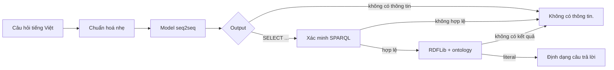
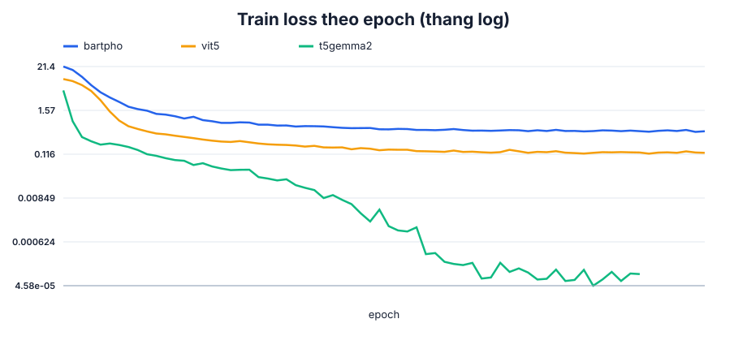

# NTU Ontology Chatbot

Chatbot tiếng Việt trả lời câu hỏi học vụ bằng cách chuyển câu hỏi thành SPARQL
và truy vấn ontology RDF. Ontology và dataset được xây dựng từ các quyết định,
phụ lục và hướng dẫn chính thức của Trường Đại học Nha Trang.

## Trạng thái hiện tại

- **Đã kiểm chứng:** ontology canonical, semantic index, answer inventory,
  query catalogue, dataset hợp nhất 4.454 câu và pipeline web end-to-end.
- **Dataset:** 3.645 câu train, 402 câu validation và 407 câu test; đủ 51 họ
  truy vấn, sáu miền nội dung và bốn phong cách diễn đạt.
- **Quy trình học vụ:** 142 target canonical đều có mặt trong ba split; train có
  2.128 câu `procedure-*`, mỗi target có ít nhất mười câu và đủ bốn phong cách.
- **Model triển khai:** T5Gemma2, được chọn sau khi fine-tune và benchmark cùng
  BARTpho và ViT5 trên đúng dataset khóa; artifact được công bố tại
  [vpthinh19/ntu-ontology-chatbot](https://huggingface.co/vpthinh19/ntu-ontology-chatbot).
- **Kết quả web:** câu trả lời hiển thị khớp 378/407 câu test (92,87%) với
  artifact CTranslate2 int8; toàn bộ 407 request trả HTTP 200.

Chiều kiểm soát độ phủ bắt buộc là:

```text
ontology → inventory → catalogue → dataset
```

Catalogue gồm 51 họ truy vấn và phủ bằng máy toàn bộ 2.953 khả năng trả lời
`supported` trong inventory. Dataset sử dụng đủ 51 họ; mọi target trong miền
đều parse, qua contract an toàn, thực thi trên graph và trả về dữ liệu.

## Bài toán và phương pháp

Hệ thống dùng một model encoder-decoder cho hai nhiệm vụ gắn liền nhau:

1. từ chối câu hỏi mà ontology không thể trả lời trọn vẹn;
2. sinh một truy vấn SPARQL `SELECT` cho câu hỏi được hỗ trợ.

Model không chứa câu trả lời học vụ. Nội dung hướng dẫn, nhãn thực thể, email,
địa điểm, mức học phí và các literal khác nằm trong ontology và chỉ được lấy ra
khi backend thực thi SPARQL.



Không có model phân loại thứ hai, fuzzy matching, tự sửa query hoặc logic dò IRI
trong backend.

## Ranh giới trong và ngoài miền

Output model chỉ có hai dạng:

```text
SELECT ?answer WHERE { ... }
```

```text
không có thông tin
```

Câu ngoài học vụ, câu gần học vụ nhưng ontology thiếu dữ liệu, câu mơ hồ và câu
trộn nhiều yêu cầu mà có ít nhất một phần không được hỗ trợ đều dùng marker từ
chối. Hệ thống không trả lời một phần câu hỗn hợp.

## Ontology

Nguồn công văn chính thức quyết định dữ liệu và phạm vi trả lời. Ontology dùng
IRI tiếng Anh ổn định, `rdfs:label@vi` cho tên tiếng Việt chính và
`skos:altLabel@vi` cho tên gọi thay thế hữu ích. Object property tạo đường đi
trên graph; label và datatype property là dữ liệu được trả về.

Lớp văn bản nguồn, học phí, biểu mẫu và các bảng quy tắc đã được đối chiếu với
`NTUdocs`. Ontology canonical hiện có 22 quy trình, 2 chính sách và inventory
máy đọc được tại `resources/ontology/answer_inventory.json`. Các chủ đề nghỉ
ốm, học liên thông, cảnh báo và buộc thôi học đã có đường truy vấn về đúng
provision nguồn.

Chi tiết nằm tại [docs/ONTOLOGY.md](docs/ONTOLOGY.md).

## Dataset

Dataset hợp nhất nằm tại `resources/dataset/` và có 4.454 câu: 3.645 train,
402 validation, 407 test. Trong đó 3.627 câu thuộc năm miền trả lời được
(quy trình, học phí, quy tắc học vụ, chứng chỉ, biểu mẫu) và 827 câu ngoài miền
dùng marker `không có thông tin`. Bốn phong cách `formal`, `neutral`,
`colloquial`, `noisy` lần lượt có 1.016, 1.153, 1.075 và 1.210 câu.

Train dạy toàn bộ schema và giá trị slot hữu hạn. Validation dùng cách diễn đạt
chưa thấy để chọn checkpoint; test được đóng băng và chỉ dùng cho đánh giá cuối.
Mọi họ truy vấn đều có mặt trong cả ba split, nhưng câu hỏi đã chuẩn hóa và câu
gần trùng cùng họ không được đi xuyên split.


Phân bố cùng checksum được sinh trong `resources/dataset/manifest.json`
và `reports/dataset.json`; contract riêng cho 142 target quy trình nằm trong
`reports/procedure-dataset.json`. Các câu người dùng thực tế được giữ tại
`resources/cases/user_queries.txt`; cả bảy câu đều xuất hiện đúng một lần trong
test để giữ vai trò hồi quy người dùng.

Ngoài test đã khóa, `resources/cases/procedure_language.jsonl` có 308 câu chấp
nhận production (220 câu quy trình và 88 câu phải từ chối). Bộ này dùng để bắt
lỗi hồi quy ngôn ngữ cơ bản sau huấn luyện, không được xem là benchmark khoa
học độc lập hay dùng để chọn checkpoint.

Chi tiết nằm tại [docs/DATASET.md](docs/DATASET.md).

## Mô hình và đánh giá

Ba model encoder-decoder được benchmark trên cùng dataset và giao thức là
`vinai/bartpho-syllable`, `VietAI/vit5-base` và
`google/t5gemma-2-270m-270m`. Kết quả test quyết định checkpoint duy nhất được
đưa vào runtime.

Mỗi model được huấn luyện bằng PEFT LoRA trên attention và FFN tương ứng của
encoder/decoder. Base pretrained được đóng băng trong lúc train; adapter tốt
nhất được merge thành một checkpoint Transformers độc lập trước khi benchmark
và chuyển sang CTranslate2. Runtime vì vậy vẫn chỉ nạp một model, không phụ
thuộc PEFT.

Metric chính trong miền là Answer Exact sau khi thực thi SPARQL. Phần ngoài
miền đo tỷ lệ sinh đúng marker, false acceptance và khả năng từ chối câu hỗn
hợp. System Answer Exact được báo cáo riêng cho trong miền, ngoài miền và toàn
bộ test. Chỉ công bố số liệu sau khi checkpoint được chọn bằng validation và
chạy đúng một lần trên test đã khóa.

Giao thức nằm tại [docs/TRAINING.md](docs/TRAINING.md) và định nghĩa metric nằm
tại [docs/EVALUATION.md](docs/EVALUATION.md).

### Kết quả benchmark

Mỗi model chạy đúng một seed và cùng giao thức. Answer Exact so kết quả SPARQL
đã thực thi; System Exact so phản hồi cuối người dùng nhận được. T5Gemma2 đạt
cao nhất trên validation và test nên được chọn cho runtime.

| Model | Validation Answer Exact | Test Answer Exact | Test Result F1 | Test System Exact |
|---|---:|---:|---:|---:|
| BARTpho-syllable | 84,33% | 84,03% | 84,44% | 85,75% |
| ViT5-base | 80,10% | 79,61% | 80,28% | 81,08% |
| **T5Gemma2** | **90,55%** | **90,66%** | **92,74%** | **92,38%** |




Theo phong cách câu hỏi, artifact Transformers T5Gemma2 đạt 98,0% `formal`,
93,33% `neutral`, 97,83% `colloquial` và 95,45% `noisy` trên riêng nhóm quy
trình. Trên toàn bộ web test sau chuyển đổi CT2, tỷ lệ phản hồi khớp tương ứng
là 95,56%, 95,61%, 96,43% và 85,71%. Nhóm noisy vẫn là điểm yếu chính.

### Kết quả triển khai

Checkpoint T5Gemma2 đã merge LoRA được chuyển sang CTranslate2 int8. Khi chạy
CPU trên 407 câu test, artifact đạt System Exact 92,87%, p50 300 ms và p95
864 ms mỗi request. Lượng tử hóa làm đổi 9 output so với Transformers: 4 ca
tốt lên, 2 ca xấu đi và 3 ca vẫn sai. Probe tám request đồng thời trả thành
công 8/8, thông lượng 3,26 request/giây.

Các JSON nguồn của bảng và biểu đồ nằm trong `reports/` và
`artifacts/model-benchmark/`; báo cáo web chi tiết nằm tại
`artifacts/e2e_web_benchmark.json` khi tái tạo trong môi trường nghiên cứu.

## Kiến trúc phần mềm

```text
resources/
├── ontology/ontology.ttl
├── cases/user_queries.txt
└── dataset/
src/ontchatbot/
├── runtime/      # inference, SPARQL, RDFLib, renderer và API
├── research/     # dataset, fine-tuning, benchmark và báo cáo
├── tools/        # tokenizer và chuyển đổi artifact
├── cli/          # entry point dòng lệnh
└── settings.py
docs/             # concept và đặc tả kỹ thuật
reports/          # JSON nguồn và biểu đồ được sinh lại
tests/            # kiểm tra theo package
```

Runtime production chỉ cần một artifact seq2seq đã chuyển đổi, tokenizer,
RDFLib và ontology. Thiết kế module chi tiết nằm tại
[docs/ARCHITECTURE.md](docs/ARCHITECTURE.md); contract triển khai nằm tại
[docs/DEPLOYMENT.md](docs/DEPLOYMENT.md).

## Tái lập nghiên cứu

Trình tự tái lập là: xây ontology từ tài liệu chính thức, audit semantic index,
lập inventory khả năng trả lời, lập catalogue SPARQL có kết quả, xác minh
dataset hợp nhất, kiểm tra tokenizer, fine-tune model theo giao thức đã khóa,
benchmark checkpoint được chọn và sinh báo cáo từ JSON máy đọc.

Không giữ số liệu giả, không tái sử dụng benchmark hết hiệu lực và không dùng
test để chọn checkpoint.

### Môi trường thực nghiệm

- Fedora Linux, Python 3.12;
- NVIDIA GeForce RTX 4050 Laptop GPU 6 GB;
- PyTorch 2.13.0 + CUDA 13.0, Transformers 5.14.1;
- CTranslate2 4.8.1, RDFLib 7.6 và OWL-RL 7.6.

Tạo môi trường huấn luyện và chạy kiểm tra:

```bash
uv sync --extra train
uv run validate_sparql_dataset
uv run pytest
```

Fine-tune một model hoặc sinh lại toàn bộ báo cáo:

```bash
uv run train_sparql \
  --model t5gemma2 \
  --output-dir artifacts/model-benchmark \
  --epochs 20 --seed 42 --save-model --benchmark-after-training \
  --local-files-only

uv run generate_reports
```

Chuyển checkpoint đã chọn và chạy webapp:

```bash
uv run convert_sparql_model \
  --model-dir artifacts/model-benchmark/t5gemma2/model \
  --output-dir artifacts/deployment/t5gemma2-production \
  --quantization int8

uv run --extra inference serve_sparql \
  --model-dir artifacts/deployment/t5gemma2-production \
  --device cpu --compute-type int8 --host 127.0.0.1 --port 8000
```

Mở `http://127.0.0.1:8000`. Lệnh, cấu trúc artifact và các giới hạn triển khai
được mô tả chi tiết tại [docs/DEPLOYMENT.md](docs/DEPLOYMENT.md).
