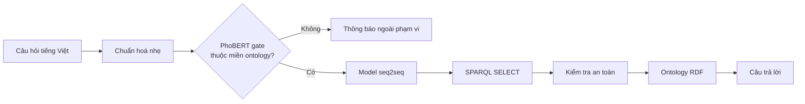

# NTU Ontology Chatbot

Chatbot tiếng Việt trả lời câu hỏi học vụ bằng cách sinh trực tiếp truy vấn
SPARQL và thực thi truy vấn trên ontology RDF.



Model chịu trách nhiệm hiểu câu hỏi và tạo query. Backend kiểm tra query, thực
thi bằng RDFLib và định dạng dữ liệu trả về; query không hợp lệ được báo là lỗi
thay vì được tự động sửa đoán.

Gate đứng trước model sinh SPARQL và chỉ cho qua câu hỏi mà ontology hiện tại
có khả năng trả lời trọn vẹn. Gate được triển khai bằng encoder PhoBERT INT8
trên CTranslate2 và classifier NumPy, nên runtime không cần PyTorch.

## Dữ liệu nghiên cứu

Dataset có 2.263 câu hỏi ánh xạ tới danh mục 215 truy vấn SPARQL canonical.
Mỗi truy vấn có nhiều cách hỏi thuộc bốn phong cách: trang trọng, trung tính,
khẩu ngữ và câu nhiễu/viết tắt.

| Tập | Câu hỏi | Truy vấn được hỗ trợ | Vai trò |
|---|---:|---:|---:|
| Train | 1.403 | 215 | Học toàn bộ danh mục truy vấn |
| Validation | 430 | 215 | Chọn checkpoint trên cách diễn đạt chưa thấy |
| Test | 430 | 215 | Đánh giá cuối trên cách diễn đạt chưa thấy |

Mỗi truy vấn có đúng hai câu validation, hai câu test và ít nhất bốn câu train.
Hai câu của mỗi tập held-out dùng hai phong cách khác nhau. Validation và test
giữ lại cách diễn đạt, không giữ lại logic truy vấn. Mọi
target đều được parse, kiểm tra an toàn, chạy trực tiếp trên ontology và trả về
ít nhất một dòng trước khi được dùng.

Model học ánh xạ câu hỏi sang SPARQL, không chứa sẵn câu trả lời học vụ. Label,
nội dung hướng dẫn, email, học phí và các literal khác vẫn được lấy từ ontology
khi backend thực thi query.


Chi tiết dữ liệu nằm tại [docs/DATASET.md](docs/DATASET.md), số liệu máy đọc tại
[reports/dataset.json](reports/dataset.json).

Dataset gate tách riêng gồm 4.526 câu cân bằng tuyệt đối giữa `in_scope` và
`out_of_scope`: 2.806 train, 860 validation và 860 test. Mỗi dòng chỉ chứa câu
hỏi cùng nhãn phạm vi; các câu `in_scope` bao phủ toàn bộ 2.263 câu của dataset
SPARQL.

## Mô hình

Ba encoder-decoder được fine-tune và so sánh trên cùng dữ liệu, cách giải mã
greedy và tiêu chí đánh giá:

- `vinai/bartpho-syllable`
- `VietAI/vit5-base`
- `google/t5gemma-2-270m-270m`

Checkpoint được chọn bằng độ chính xác câu trả lời trên validation. Test chỉ
được dùng một lần cho báo cáo cuối. Các metric phân biệt rõ query có parse
được, chạy được, trả đúng dữ liệu hay trùng hoàn toàn chuỗi target.

## Đánh giá thực nghiệm

Answer exact là tiêu chí chính: toàn bộ dữ liệu trả về phải trùng reference,
không phụ thuộc tên biến hay thứ tự dòng. Parse rate, execution rate, Result
precision/recall/F1 và query exact được dùng để chẩn đoán lỗi.

| Model | Validation Answer Exact | Test Answer Exact | Test Result F1 | Test parse / execution |
|---|---:|---:|---:|---:|
| BARTpho | 4,65% | 4,19% | 5,19% | 57,91% |
| ViT5 | 29,30% | 29,53% | 31,96% | 99,77% |
| T5Gemma2 | **93,95%** | **91,86%** | **92,38%** | **100%** |

T5Gemma2 là model duy nhất vượt ngưỡng nghiệm thu 90% Answer Exact trên test.
Chênh lệch nhỏ giữa validation và test cho thấy kết quả ổn định trên hai tập
cách diễn đạt held-out. BARTpho và ViT5 học được một phần cú pháp SPARQL nhưng
không đạt chất lượng trả lời cần thiết cho hệ thống.


Gate PhoBERT đạt recall trong miền **95,58%** và false acceptance rate
**1,16%** trên 860 câu test. Sau khi chuyển sang CTranslate2 INT8, ma trận
nhầm lẫn vẫn giữ nguyên: 411 câu đúng miền được nhận, 19 câu đúng miền bị từ
chối, 5 câu ngoài miền bị nhận nhầm và 425 câu ngoài miền được chặn.

Đường học, kết quả theo đặc trưng SPARQL và số liệu máy đọc đầy đủ nằm trong
[reports](reports/README.md). Định nghĩa metric và giao thức nghiệm thu nằm tại
[docs/EVALUATION.md](docs/EVALUATION.md).

## Môi trường thực nghiệm

Benchmark được chạy trên Fedora Linux 44, Python 3.12.13, PyTorch 2.13.0
(CUDA 13.0), Transformers 5.14.1 và RDFLib 7.6.0. Phần cứng là NVIDIA GeForce
RTX 4050 Laptop GPU 6 GB; fine-tuning dùng BF16, TF32 và dynamic padding, không
dùng `torch.compile`. Cấu hình tái lập đầy đủ và câu lệnh chạy nằm tại
[docs/TRAINING.md](docs/TRAINING.md).

## Cấu trúc project

```text
resources/
├── ontology/ontology.ttl       # nguồn dữ liệu RDF duy nhất
└── dataset/
    ├── main/                   # câu hỏi → SPARQL
    └── gate/                   # câu hỏi → in_scope / out_of_scope
src/ontchatbot/
├── runtime/                    # model → validator → RDFLib → renderer/API
├── research/                   # dataset, train, evaluation và báo cáo
├── tools/                      # tokenizer và chuyển đổi model
├── cli/                        # entry point dòng lệnh
└── settings.py
docs/                           # đặc tả dành cho người đọc project
reports/                        # số liệu và biểu đồ có thể sinh lại
tests/                          # kiểm tra theo đúng các package ở trên
```

Muốn hiểu hệ thống, đọc [docs/CONCEPT.md](docs/CONCEPT.md) rồi
[docs/ARCHITECTURE.md](docs/ARCHITECTURE.md). Muốn đánh giá nghiên cứu, đọc
[docs/DATASET.md](docs/DATASET.md), [docs/TRAINING.md](docs/TRAINING.md) và
[docs/EVALUATION.md](docs/EVALUATION.md).

## Chạy kiểm tra

```bash
uv sync --dev
uv run validate_gate_dataset
uv run validate_sparql_dataset
uv run generate_reports
uv run pytest
```

Huấn luyện cần extra `train` và GPU hỗ trợ BF16:

```bash
uv sync --extra train --dev
uv run --extra train train_sparql \
  --model bartpho \
  --save-model \
  --benchmark-after-training
```

Thay `bartpho` bằng `vit5` hoặc `t5gemma2` để chạy model còn lại. Hướng dẫn
đầy đủ nằm tại [docs/TRAINING.md](docs/TRAINING.md).

Lệnh chuyển đổi và khởi động webapp với cả hai artifact production nằm tại
[docs/DEPLOYMENT.md](docs/DEPLOYMENT.md).
