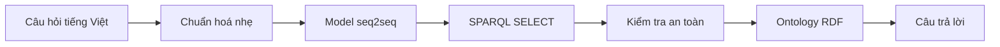

# NTU Ontology Chatbot

Chatbot tiếng Việt trả lời câu hỏi học vụ bằng cách sinh trực tiếp truy vấn
SPARQL và thực thi truy vấn trên ontology RDF.



Model chịu trách nhiệm hiểu câu hỏi và tạo query. RDFLib chịu trách nhiệm truy
vấn dữ liệu. Backend không có cây traversal, QueryPlan, fuzzy matching hay DTO
gắn với schema để sửa đoán kết quả của model.

## Dữ liệu nghiên cứu

Dataset có 1.416 câu hỏi ánh xạ tới danh mục 215 truy vấn SPARQL canonical.
Mỗi truy vấn có nhiều cách hỏi thuộc bốn phong cách: trang trọng, trung tính,
khẩu ngữ và câu nhiễu/viết tắt.

| Tập | Câu hỏi | Truy vấn được hỗ trợ | Vai trò |
|---|---:|---:|---:|
| Train | 986 | 215 | Học toàn bộ danh mục truy vấn |
| Validation | 215 | 215 | Chọn checkpoint trên cách diễn đạt chưa thấy |
| Test | 215 | 215 | Đánh giá cuối trên cách diễn đạt chưa thấy |

Mỗi truy vấn có đúng một câu validation, một câu test và ít nhất hai câu train.
Validation và test giữ lại cách diễn đạt, không giữ lại logic truy vấn. Mọi
target đều được parse, kiểm tra an toàn, chạy trực tiếp trên ontology và trả về
ít nhất một dòng trước khi được dùng.

Model học ánh xạ câu hỏi sang SPARQL, không chứa sẵn câu trả lời học vụ. Label,
nội dung hướng dẫn, email, học phí và các literal khác vẫn được lấy từ ontology
khi backend thực thi query.


Chi tiết dữ liệu nằm tại [docs/DATASET.md](docs/DATASET.md), số liệu máy đọc tại
[reports/dataset.json](reports/dataset.json).

## Mô hình

Ba encoder-decoder được fine-tune và so sánh trên cùng dữ liệu, cách giải mã
greedy và tiêu chí đánh giá:

- `vinai/bartpho-syllable`
- `VietAI/vit5-base`
- `google/t5gemma-2-270m-270m`

Checkpoint được chọn bằng độ chính xác câu trả lời trên validation. Test chỉ
được dùng một lần cho báo cáo cuối. Các metric phân biệt rõ query có parse
được, chạy được, trả đúng dữ liệu hay trùng hoàn toàn chuỗi target.

## Đánh giá thực nghiệm

Answer exact là tiêu chí chính: toàn bộ dữ liệu trả về phải trùng reference,
không phụ thuộc tên biến hay thứ tự dòng. Parse rate, execution rate, Result
precision/recall/F1 và query exact được dùng để chẩn đoán lỗi.

Bảng so sánh chỉ được công bố khi cả ba model được fine-tune và đánh giá trên
cùng ba split nêu trên. Hiện tại báo cáo chỉ chứa số liệu dataset và ontology.
Định nghĩa metric và giao thức nghiệm thu nằm tại
[docs/EVALUATION.md](docs/EVALUATION.md).

## Môi trường thực nghiệm

Benchmark được chạy trên Fedora Linux 44, Python 3.12.13, PyTorch 2.13.0
(CUDA 13.0), Transformers 5.14.1 và RDFLib 7.6.0. Phần cứng là NVIDIA GeForce
RTX 4050 Laptop GPU 6 GB; fine-tuning dùng BF16, TF32 và dynamic padding, không
dùng `torch.compile`. Cấu hình tái lập đầy đủ và câu lệnh chạy nằm tại
[docs/TRAINING.md](docs/TRAINING.md).

## Cấu trúc project

```text
resources/
├── ontology/ontology.ttl       # nguồn dữ liệu RDF duy nhất
└── dataset/                    # train.jsonl, val.jsonl, test.jsonl, manifest
src/ontchatbot/
├── runtime/                    # model → validator → RDFLib → renderer/API
├── research/                   # dataset, train, evaluation và báo cáo
├── tools/                      # tokenizer và chuyển đổi model
├── cli/                        # entry point dòng lệnh
└── settings.py
docs/                           # đặc tả dành cho người đọc project
reports/                        # số liệu và biểu đồ có thể sinh lại
tests/                          # kiểm tra theo đúng các package ở trên
```

Muốn hiểu hệ thống, đọc [docs/CONCEPT.md](docs/CONCEPT.md) rồi
[docs/ARCHITECTURE.md](docs/ARCHITECTURE.md). Muốn đánh giá nghiên cứu, đọc
[docs/DATASET.md](docs/DATASET.md), [docs/TRAINING.md](docs/TRAINING.md) và
[docs/EVALUATION.md](docs/EVALUATION.md).

## Chạy kiểm tra

```bash
uv sync --dev
uv run validate_sparql_dataset
uv run generate_reports
uv run pytest
```

Huấn luyện cần extra `train` và GPU hỗ trợ BF16:

```bash
uv sync --extra train --dev
uv run --extra train train_sparql \
  --model bartpho \
  --save-model \
  --benchmark-after-training
```

Thay `bartpho` bằng `vit5` hoặc `t5gemma2` để chạy model còn lại. Hướng dẫn
đầy đủ nằm tại [docs/TRAINING.md](docs/TRAINING.md).
