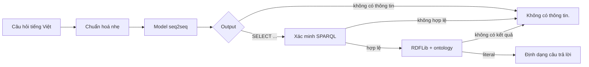

# NTU Ontology Chatbot

Chatbot tiếng Việt trả lời câu hỏi học vụ bằng cách chuyển câu hỏi thành SPARQL
và truy vấn ontology RDF. Tài liệu này mô tả kiến trúc đã chốt cho lần xây lại
từ nguồn công văn chính thức. Ontology, dataset, artifact và kết quả thực nghiệm
cũ không được xem là kết quả của kiến trúc này.

## Bài toán và phương pháp

Hệ thống dùng một model encoder-decoder cho hai nhiệm vụ gắn liền nhau:

1. từ chối câu hỏi mà ontology không thể trả lời trọn vẹn;
2. sinh một truy vấn SPARQL `SELECT` cho câu hỏi được hỗ trợ.

Model không chứa câu trả lời học vụ. Nội dung hướng dẫn, nhãn thực thể, email,
địa điểm, mức học phí và các literal khác nằm trong ontology và chỉ được lấy ra
khi backend thực thi SPARQL.



Không có model phân loại thứ hai, fuzzy matching, tự sửa query hoặc logic dò IRI
trong backend.

## Ranh giới trong và ngoài miền

Output model chỉ có hai dạng:

```text
SELECT ?answer WHERE { ... }
```

```text
không có thông tin
```

Câu ngoài học vụ, câu gần học vụ nhưng ontology thiếu dữ liệu, câu mơ hồ và câu
trộn nhiều yêu cầu mà có ít nhất một phần không được hỗ trợ đều dùng marker từ
chối. Hệ thống không trả lời một phần câu hỗn hợp.

## Ontology

Nguồn công văn chính thức quyết định dữ liệu và phạm vi trả lời. Ontology dùng
IRI tiếng Anh ổn định, `rdfs:label@vi` cho tên tiếng Việt chính và
`skos:altLabel@vi` cho tên gọi thay thế hữu ích. Object property tạo đường đi
trên graph; label và datatype property là dữ liệu được trả về.

Chi tiết nằm tại [docs/ONTOLOGY.md](docs/ONTOLOGY.md).

## Dataset

Dataset duy nhất nằm tại `resources/dataset/main/` và gồm ba split
`train.jsonl`, `val.jsonl`, `test.jsonl`. Câu trong miền ánh xạ tới SPARQL;
câu ngoài miền ánh xạ tới `không có thông tin`. Các câu đã được người dùng thử
trên giao diện được giữ tại `resources/cases/user_queries.txt` và phải được gán
lại target theo ontology mới.

Không công bố số lượng hoặc biểu đồ từ dữ liệu cũ. Thống kê chỉ có giá trị sau
khi dataset mới vượt kiểm tra schema, leakage, khả năng thực thi SPARQL và
tokenizer.

Chi tiết nằm tại [docs/DATASET.md](docs/DATASET.md).

## Mô hình và đánh giá

Ba model được fine-tune và benchmark công bằng trên cùng dataset:

- `vinai/bartpho-syllable`;
- `VietAI/vit5-base`;
- `google/t5gemma-2-270m-270m`.

Metric chính trong miền là Answer Exact sau khi thực thi SPARQL. Phần ngoài
miền đo tỷ lệ sinh đúng marker, false acceptance và khả năng từ chối câu hỗn
hợp. System Answer Exact được báo cáo riêng cho trong miền, ngoài miền và toàn
bộ test. Điểm model cũ không đại diện cho dataset/ontology mới nên không xuất
hiện trong tài liệu này.

Giao thức nằm tại [docs/TRAINING.md](docs/TRAINING.md) và định nghĩa metric nằm
tại [docs/EVALUATION.md](docs/EVALUATION.md).

## Kiến trúc phần mềm

```text
resources/
├── ontology/ontology.ttl
├── cases/user_queries.txt
└── dataset/main/
src/ontchatbot/
├── runtime/      # inference, SPARQL, RDFLib, renderer và API
├── research/     # dataset, fine-tuning, benchmark và báo cáo
├── tools/        # tokenizer và chuyển đổi artifact
├── cli/          # entry point dòng lệnh
└── settings.py
docs/             # concept và đặc tả kỹ thuật
reports/          # JSON nguồn và biểu đồ được sinh lại
tests/            # kiểm tra theo package
```

Runtime production chỉ cần một artifact seq2seq đã chuyển đổi, tokenizer,
RDFLib và ontology. Thiết kế module chi tiết nằm tại
[docs/ARCHITECTURE.md](docs/ARCHITECTURE.md); contract triển khai nằm tại
[docs/DEPLOYMENT.md](docs/DEPLOYMENT.md).

## Tái lập nghiên cứu

Trình tự duy nhất là: xây ontology từ tài liệu chính thức, lập danh mục SPARQL
có kết quả, xây dataset hợp nhất, kiểm tra tokenizer, fine-tune ba model cùng
giao thức, benchmark checkpoint được chọn và sinh báo cáo từ JSON máy đọc.

Không giữ số liệu giả, không tái sử dụng benchmark hết hiệu lực và không dùng
test để chọn checkpoint.
