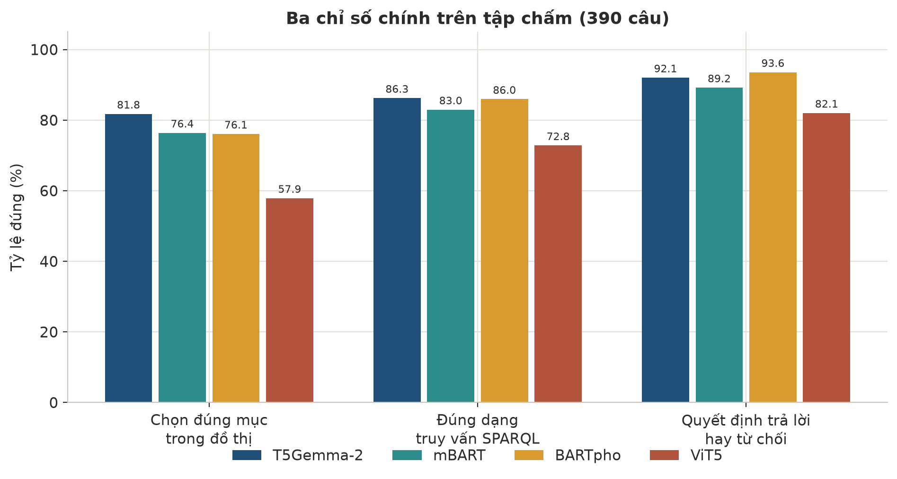
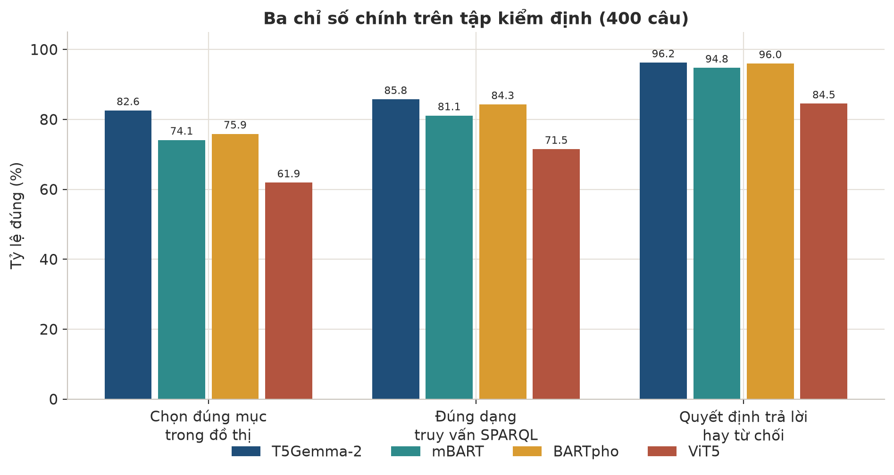
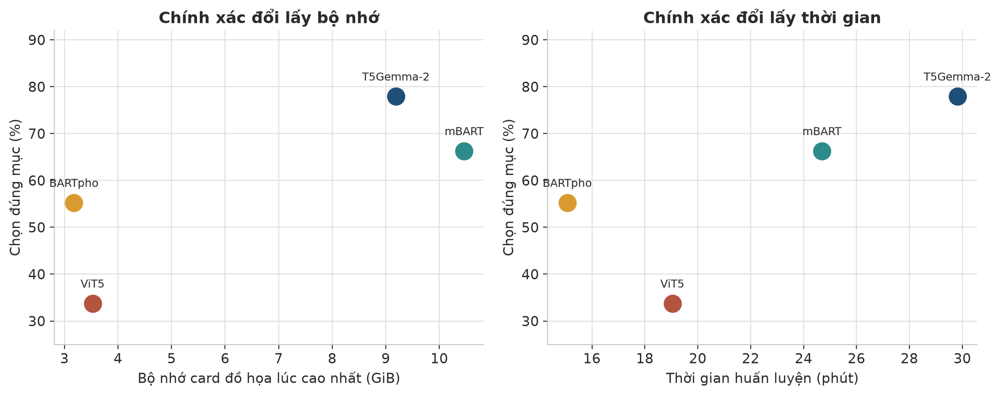
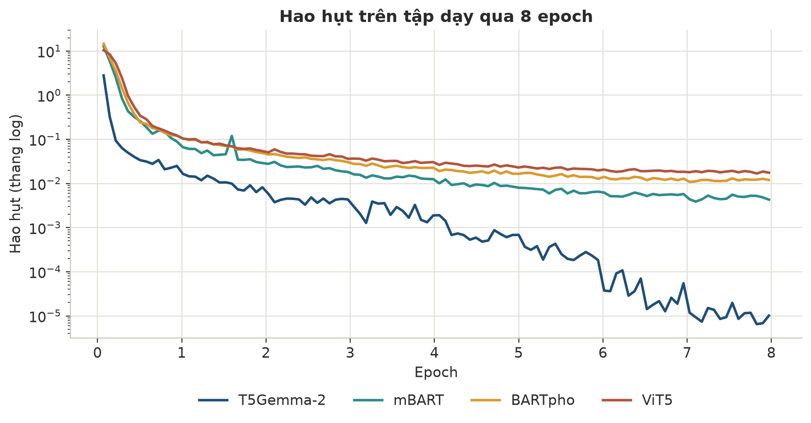
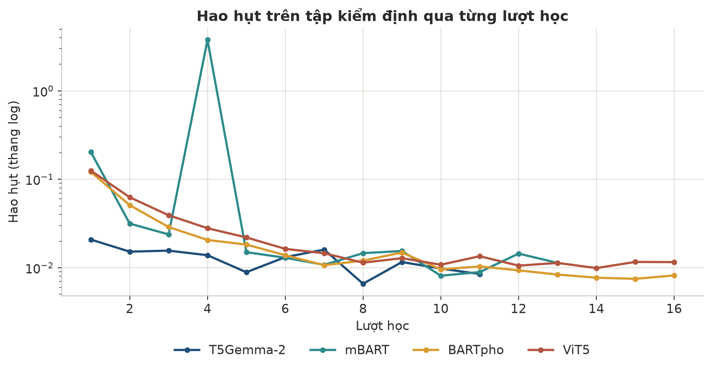
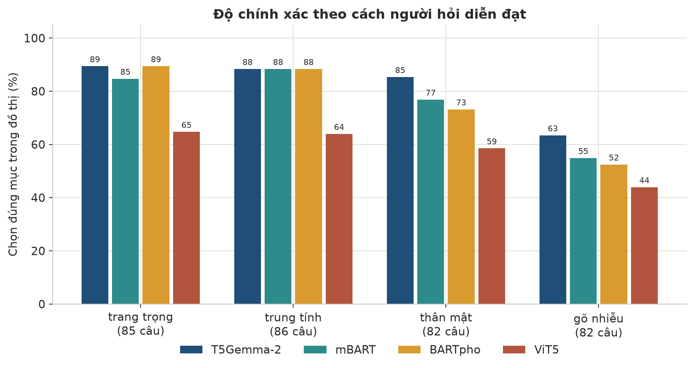
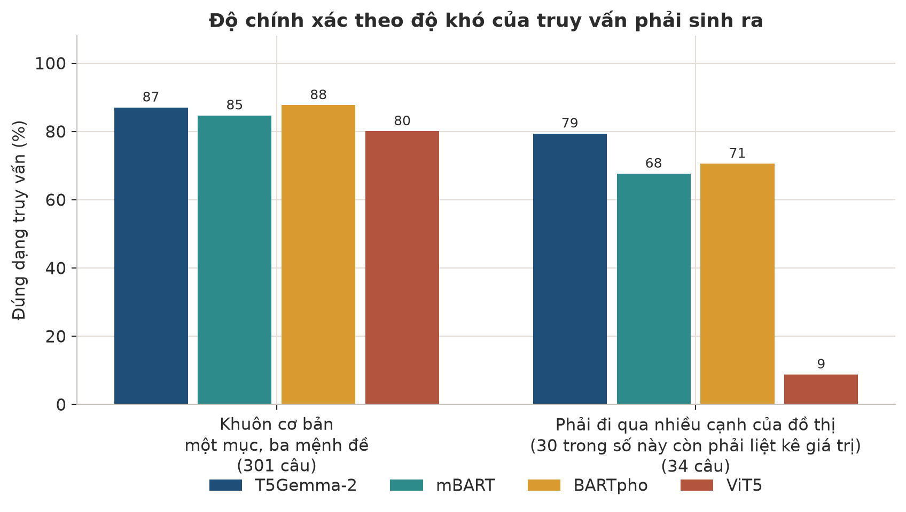
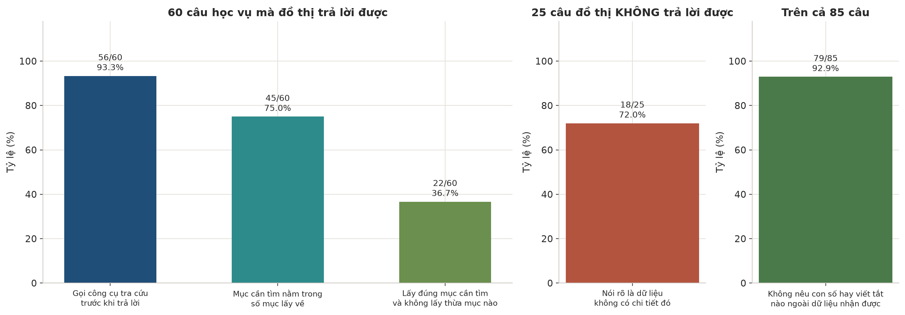
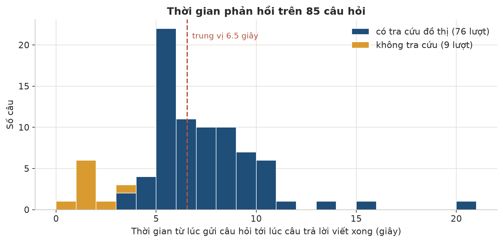
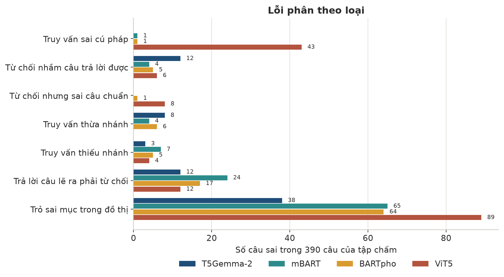

# Chatbot hỏi đáp học vụ dựa trên ontology

Ontology học vụ là nguồn dữ kiện duy nhất của hệ thống. Mô hình seq2seq sinh
truy vấn SPARQL để đọc ontology. LLM dùng kết quả đó để trả lời người học, kèm
trích dẫn văn bản gốc. Khi ontology không có câu trả lời, hệ thống được thiết kế để
từ chối; mức tuân thủ thực tế được báo trong phần kết quả.

---

## Tóm tắt

Hệ thống gồm ontology học vụ chứa dữ kiện và nguồn, cùng các mô hình seq2seq
sinh truy vấn SPARQL từ cụm từ khoá tiếng Việt. Seq2seq nhận một chuỗi chữ và
viết ra chuỗi khác. Bốn mô hình được tinh chỉnh (*fine-tune*) để viết truy vấn.

LLM chỉ là lớp giao tiếp: gọi công cụ tra ontology và diễn đạt dữ kiện trả về.
Cách tách này nhằm giảm khả năng LLM tự suy đoán từ văn bản quy chế; nó không loại
bỏ hoàn toàn — xem phần hạn chế.

Bốn mô hình seq2seq cùng học trên 6.308 câu hỏi, trong đó 5.518 câu thuộc
`train`, và được đánh giá bằng cùng một bộ thước đo. **T5Gemma-2 dẫn đầu năm
trong sáu phép đo trên `test` và `val`**. Trên `test`, mô hình chọn đúng mục cần
tra trong đồ thị ở 81,8% và dựng đúng khuôn truy vấn ở 86,3% trong số 335 câu
thuộc phạm vi; với 55 câu ngoài phạm vi, mô hình từ chối đúng 78,2%.

Lớp giao tiếp dùng mô hình seq2seq tốt nhất được đánh giá `end-to-end` trên 85
câu hỏi. Phép dò tự động ghi nhận 79/85 câu không nêu số hay chữ viết tắt ngoài
dữ liệu vừa tra; phép dò này không đọc hiểu nội dung. Trong 25 câu ontology
không trả lời được, 18 câu được nói thẳng là không có. Một nửa số câu được trả
lời trong vòng 6,25 giây.

Các giới hạn chính:

- Đồ thị hiện có 16 văn bản và 50 dạng câu hỏi (49 khuôn truy vấn cộng một họ từ chối). Ngoài phạm vi đó, câu trả lời
  đúng duy nhất là "tôi không có thông tin này".
- Dữ liệu được chia theo câu hỏi. Điểm số đo **khả năng hiểu một cách hỏi mới
  về việc đã biết**, chưa đo khả năng xử lý mục chưa từng thấy.
- Mỗi mô hình chỉ được huấn luyện độc lập một lần, nên chưa có khoảng tin cậy
  cho các điểm số. Chỉ nên tin những khoảng cách lớn.

---

## 1. Bài toán

Quy chế đặt ra quy tắc đào tạo; thủ tục học vụ quy định điều kiện, hồ sơ và các
bước thực hiện. Phạm vi còn gồm biểu mẫu, học phí, chứng chỉ ngoại ngữ và bảng
tra cứu.

Người học không hỏi theo cách văn bản viết. Họ hỏi *"nghỉ ngang một kỳ có sao
không ạ"* thay vì *"thủ tục nghỉ học tạm thời"*. Câu hỏi có thể thiếu dấu, viết
tắt, cụt lủn hoặc chứa hai ý. Hệ thống phải nhận đúng ý định, tìm đúng mục trong
đồ thị và chỉ lấy dữ kiện có nguồn.

Hệ thống tuân theo hai ràng buộc:

1. **Câu trả lời trong phạm vi phải bám vào văn bản của trường.** Không được lấy
   quy định của trường khác, dù mô hình ngôn ngữ lớn có "nhớ" quy định đó.
2. **Câu ngoài phạm vi phải bị từ chối rõ ràng.** Một câu trả lời sai về hạn nộp
   đơn gây hại hơn hẳn một câu "tôi không có thông tin này".

Bài toán khoa học chính là sinh truy vấn SPARQL có ràng buộc từ cụm từ khoá và
quyết định khi nào **không** trả lời, không phải sinh văn bản tự do.

---

## 2. Tổng quan hệ thống

Ontology học vụ và mô hình seq2seq sinh SPARQL là phần lõi. Mô hình ngôn ngữ lớn
(LLM) làm lớp giao tiếp: rút cụm từ khoá từ câu hỏi, gọi công cụ và diễn đạt dữ
kiện trả về. Seq2seq chỉ nhận cụm từ khoá ngắn, không đối thoại trực tiếp với
người dùng.

Với mọi câu hỏi học vụ, LLM phải gọi công cụ tra cứu rồi mới trả lời; công cụ
chỉ trả về dữ kiện từ ontology.


Hệ thống gồm ba tầng:

| Tầng | Ai làm | Trách nhiệm |
|---|---|---|
| Hội thoại | Mô hình ngôn ngữ lớn | Hiểu câu hỏi, rút thành từ khoá, viết câu trả lời cuối |
| Tra cứu | Mô hình chuỗi-chuỗi đã tinh chỉnh | Biến từ khoá thành truy vấn SPARQL |
| Dữ kiện | Đồ thị tri thức | Giữ nội dung và nguồn, trả về đúng những gì được hỏi |

**Công cụ nhận từ khoá thay vì cả câu hỏi.** LLM có thể gửi hai tới ba cách gọi
của cùng một chủ đề để bao quát khác biệt giữa cách hỏi và tên trong ontology.

**Truy vấn phải thuộc một trong 49 khuôn đã khai báo.** Truy vấn không khớp dạng
nào bị loại để tránh trả về dữ liệu không đúng câu hỏi.

---

## 3. Ontology

Ontology là mô hình khái niệm mô tả thực thể, thuộc tính và quan hệ học vụ; đây
là cơ sở dữ liệu duy nhất cho mọi truy vấn.


Đồ thị có **hai tầng trả lời được trực tiếp**:

- **Tầng văn bản** giữ nguyên văn công văn, chia theo Chương → Điều → Khoản →
  Điểm, cộng Phụ lục và Bảng. Người hỏi *"điểm a khoản 2 Điều 15 nói gì"* được
  trả lời từ tầng này.
- **Tầng tri thức** giữ dữ kiện đã bóc tách: thủ tục, bước thực hiện, điều kiện,
  thời hạn, biểu mẫu, ngành đào tạo, chứng chỉ. Người hỏi *"nghỉ tạm thời cần
  làm gì"* được trả lời từ tầng này.

Mỗi dữ kiện trỏ về phần văn bản chứng minh nó, nên câu trả lời có thể kèm trích
dẫn và đường dẫn để đối chiếu.

| Thành phần | Quy mô |
|---|---:|
| Phát biểu khai báo trực tiếp | 6.355 |
| Toàn bộ phát biểu trong đồ thị | 7.711 |
| Lớp khái niệm | 56 |
| Mục cụ thể (cá thể) | 686 |
| Quan hệ giữa hai thực thể | 29 |
| Thuộc tính mang giá trị chữ hoặc số | 55 |
| Văn bản gốc đã số hoá | 16 |

Phần chênh lệch gồm thông tin nguồn liên kết với từng mục trả lời được.

Nội dung được bóc tách từ 16 văn bản chính thức: sáu quyết định của Hiệu trưởng,
gồm **Quyết định 1052**, **Quyết định 317**, 626, 729, 753 và 1965; ba quy chế
kèm theo; cùng bảy trang thông tin chính thức. Mỗi dữ kiện trỏ về một trong 16
văn bản để lớp giao tiếp cung cấp trích dẫn và đường dẫn đối chiếu.

---

## 4. Hình dạng dữ liệu

Một câu hỏi đổi hình sáu lần từ đầu vào đến câu trả lời.


### 4.1 Một dòng dữ liệu huấn luyện

Mỗi dòng ghép câu hỏi tiếng Việt với truy vấn đúng, mã số, dạng câu hỏi và nhãn
phong cách. Với câu ngoài phạm vi, đích là "không có thông tin". Ví dụ trả lời
được dưới đây dùng câu hỏi gõ không dấu và truy vấn về cố vấn học tập:

```json
{
  "id": "question-000013",
  "query_id": "academic-actor-facts",
  "register": "noisy",
  "input": "co van hoc tap la ai",
  "target": "SELECT ?thuoctinh ?giatri ?nguon ?duongdan WHERE { { :AcademicAdvisor ?p ?giatri . FILTER(isLiteral(?giatri)) ?p rdfs:label ?thuoctinh OPTIONAL{:AcademicAdvisor :sourceCitation ?nguon;:sourceLink ?duongdan} } UNION { :AcademicAdvisor ?l ?con . ?con ?p ?giatri . FILTER(isLiteral(?giatri)) ?p rdfs:label ?thuoctinh OPTIONAL{?con :sourceCitation ?nguon;:sourceLink ?duongdan} } FILTER(?p!=skos:altLabel&&?p!=:sourceCitation&&?p!=:sourceLink) }"
}
```

Ví dụ thuộc nhóm phải từ chối:

```json
{
  "id": "question-005274",
  "query_id": "no-information",
  "register": "formal",
  "input": "Xin cho biết chào bạn.",
  "target": "không có thông tin"
}
```

### 4.2 Kết quả công cụ trả về

Công cụ luôn trả về cùng một khuôn: trạng thái dữ liệu, hướng dẫn, danh sách
nguồn và từ khoá không tìm thấy. Mỗi dữ kiện nằm trong nguồn đã khẳng định nó,
nhờ vậy dữ kiện và trích dẫn không bị tách rời.

```json
{
  "trang_thai": "co_du_lieu",
  "huong_dan": "Đây là toàn bộ dữ liệu tìm thấy. Đọc hết du_lieu. Nếu chi tiết được hỏi không xuất hiện, dữ liệu hiện có không chứa chi tiết đó; không tra lại cùng chủ đề. Mỗi mục trong nguon gồm trích dẫn, đường dẫn, và các dữ kiện mà nguồn đó khẳng định.",
  "nguon": [
    {
      "trich_dan": "Điều 12 Quy chế đào tạo trình độ đại học, ban hành kèm Quyết định 1052/QĐ-ĐHNT ngày 17/7/2025",
      "duong_dan": "https://pdtdaihoc.ntu.edu.vn/uploads/38//245-Quyet dinh 1052.pdf",
      "du_lieu": [
        { "thuoc_tinh": "tên gọi", "gia_tri": "Thủ tục công nhận kết quả học tập và chuyển đổi tín chỉ" },
        { "thuoc_tinh": "nội dung bước", "gia_tri": "Sau khi trúng tuyển, thực hiện chương trình đào tạo và đăng ký học tập theo kế hoạch chung." },
        { "thuoc_tinh": "thứ tự bước", "gia_tri": 2 }
      ]
    }
  ],
  "tu_khoa_khong_thay": ["hồ sơ liên thông"]
}
```

Khi không từ khoá nào khớp, trạng thái là không có thông tin và danh sách nguồn
rỗng.

---

## 5. Tập dữ liệu


Dữ liệu được sinh từ ontology theo 49 khuôn truy vấn cùng một họ từ chối; mỗi mục sinh
bốn cách hỏi. Đáp án đúng là truy vấn chạy được. Nội dung chưa có trong ontology
không thuộc phạm vi phép đo ở mục 10.

Ba tập dữ liệu có thể được xem trực tiếp trong `resources/dataset/` của kho mã.


| Phần dữ liệu | Số dòng | Vai trò |
|---|---:|---|
| `train` | 5.518 | Học ánh xạ từ câu hỏi sang truy vấn hoặc từ chối |
| `val` | 400 | Đánh giá trong huấn luyện, xác định điểm dừng |
| `test` | 390 | Đánh giá độc lập với các lựa chọn mô hình |
| **Toàn bộ** | **6.308** | Không áp dụng |

`test` độc lập với mọi lựa chọn dựa trên `train` và `val`, tránh chọn cấu hình
theo chính bộ đề đánh giá.

Ba tập được chia **theo câu hỏi**: không câu nào ở `val` hoặc `test` xuất hiện ở
`train`. Tuy nhiên, ba tập dùng chung 567 câu trả lời đúng. Vì vậy, 390 câu
`test` có đáp án đã được 5.518 câu `train` phủ. Điểm số đo **khả năng hiểu cách
hỏi mới về việc đã biết**, không đo khả năng xử lý mục chưa gặp.

Dữ liệu phủ **50 họ đầu ra — 49 khuôn truy vấn và một họ từ chối** — với **567 đích khác nhau**: 566 câu
truy vấn và một câu từ chối dùng chung cho mọi câu ngoài phạm vi. Một nửa số câu
hỏi dài không quá 11 từ. Độ dài trung bình là 11,59 từ, ngắn nhất 1 từ và dài
nhất 36 từ.

Toàn bộ dữ liệu có **884 câu mang nhãn từ chối**, chiếm 14,0%: 773 câu `train`, 56
câu `val` và 55 câu `test`. Chưa có số đo về ảnh hưởng của các tỷ lệ khác.

Bốn phong cách câu hỏi kiểm tra khả năng giữ đúng ý định khi bề mặt câu thay đổi:

| Phong cách | Số dòng | Nghĩa |
|---|---:|---|
| thân mật | 1.799 | cách người học nhắn tin hàng ngày |
| trung tính | 1.640 | câu hỏi bình thường, đủ dấu |
| gõ nhiễu | 1.486 | thiếu dấu, sai chính tả, dính chữ |
| trang trọng | 1.383 | văn phong đơn từ |

---

## 6. Thiết lập thực nghiệm

### 6.1 Bốn mô hình đem so

Bốn mô hình chuỗi-chuỗi của bốn tổ chức được đánh giá trên cùng bài toán.
**Tham số** là các giá trị quyết định hoạt động của mô hình; mô hình nhiều tham
số thường cần nhiều tài nguyên hơn. Khi tinh chỉnh, chỉ một **lớp mỏng** gắn
thêm được học.

| Mô hình | Tổ chức | Tham số mô hình nền | Tham số thực sự được học |
|---|---|---:|---:|
| T5Gemma-2 (`google/t5gemma-2-270m-270m`) | Google | 786 M | 15,2 M |
| mBART (`facebook/mbart-large-cc25`) | Meta AI | 611 M | 17,3 M |
| BARTpho (`vinai/bartpho-syllable`) | VinAI | 396 M | 17,3 M |
| ViT5 (`VietAI/vit5-base`) | VietAI | 226 M | 13,0 M |

Phần tinh chỉnh chiếm từ 1,9% (T5Gemma-2) đến 5,7% (ViT5); trọng số nền giữ
nguyên.

### 6.2 Điều kiện chạy

Bốn mô hình dùng **cùng điều kiện**:

- **Cùng một bộ dữ liệu**, không mô hình nào được thấy thêm hay bớt câu nào.
- **Cùng một điểm khởi đầu ngẫu nhiên.** Độ ổn định giữa các lần khởi tạo chưa
  có số đo.
- **Cùng cách viết câu trả lời.** Mỗi chữ chọn phương án khả dĩ nhất, không bốc
  thăm, nên cùng câu hỏi cho cùng truy vấn.
- **Cùng một máy**: card đồ hoạ 24 GB.

Mỗi lượt học là một lần đọc hết `train`. Bảng chi phí huấn luyện gồm số lượt học
của từng mô hình và lượt có kết quả `val` tốt nhất. `test` là phép đánh giá độc
lập với các lựa chọn mô hình.

### 6.3 Bốn chỉ số chính và cách tính

Mỗi chỉ số dưới đây nêu rõ **đếm cái gì** và **chia cho bao nhiêu**. Mẫu số khác nhau
giữa các chỉ số, nên không được cộng hay trung bình chúng lại.

| Chỉ số | Tính là đúng khi | Mẫu số trên `test` | Mẫu số trên `val` |
|---|---|---:|---:|
| Chọn đúng mục trong đồ thị | Truy vấn trỏ đúng tập mục câu hỏi nhắm tới. Lấy đúng mục nhưng kèm mục thừa vẫn tính sai. | 335 câu trong phạm vi | 344 |
| Dựng đúng khuôn truy vấn | Truy vấn khớp đúng một trong 49 khuôn **và** điền đúng mọi chỗ trống không phải tên mục. Truy vấn khác khuôn nhưng cho cùng kết quả vẫn tính sai. | 335 câu trong phạm vi | 344 |
| Bắt đúng câu ngoài phạm vi | Mô hình trả đúng câu từ chối chuẩn. Câu từ chối diễn đạt khác vẫn tính sai. | 55 câu ngoài phạm vi | 56 |
| Không từ chối oan | Với câu trong phạm vi, mô hình sinh ra một truy vấn hợp lệ thay vì từ chối. | 335 câu trong phạm vi | 344 |

**Vì sao tách hai chỉ số cuối.** Chúng là hai mặt của cùng một quyết định. Gộp lại
thành một tỷ lệ chung thì 335 câu trong phạm vi sẽ lấn át 55 câu ngoài phạm vi, và
thứ hạng giữa các mô hình đổi theo. Chỉ số gộp vì vậy không được dùng để kết luận về
khả năng từ chối.

**Chọn đúng mục và dựng đúng khuôn là hai việc khác nhau.** Tên mục được chấm riêng,
nên một truy vấn có thể đúng khuôn mà vẫn trỏ sai mục — đó chính là dạng lỗi phổ biến
nhất, xem mục 8.1.

Phép đánh giá còn tính mức trùng khớp giữa bảng kết quả và bảng đúng, nhưng chỉ dùng
để dò lỗi vì nó cho điểm từng phần.

### 6.4 Cách tiến hành phép đo

**Chia dữ liệu.** 6.308 câu chia thành 5.518 `train`, 400 `val`, 390 `test`. Việc chia
theo khung soạn câu chứ không ngẫu nhiên theo dòng: mỗi họ truy vấn giữ lại một khung
diễn đạt riêng cho `val` và `test`, nên câu dùng để chấm luôn được viết theo cách chưa
từng xuất hiện lúc học. Không có câu nào trùng nguyên văn giữa ba tập.

**Chọn lượt giữ lại.** Mỗi mô hình chạy tối đa 16 lượt; lượt được giữ là lượt đạt điểm
cao nhất trên `val`. `test` không tham gia vào việc chọn lượt hay chỉnh tham số.

**Chấm truy vấn.** So chuỗi truy vấn mô hình sinh ra với truy vấn đúng, sau khi chuẩn
hoá khoảng trắng. Truy vấn còn được chạy thật trên ontology để đối chiếu bảng kết quả.

**Chấm `end-to-end`.** 85 câu hỏi đưa vào trợ lý hoàn chỉnh qua giao diện thật, gồm 60
câu trong phạm vi và 25 câu được soạn để kiểm tình huống thiếu dữ liệu. Mỗi lượt ghi
lại câu hỏi, dữ liệu công cụ trả về và câu trả lời cuối.

**Thời gian phản hồi.** Đo từ lúc nhận câu hỏi tới lúc chữ cuối cùng hiện ra, trên cùng
một máy, chạy tuần tự từng câu, có một lượt chạy làm nóng trước khi tính giờ. Trung vị
và p95 lấy theo thứ hạng: p95 là phần tử thứ ⌈0,95 × n⌉ của dãy đã sắp xếp, không nội
suy giữa hai phần tử.

**Máy chạy.** Huấn luyện và chấm trên một card đồ hoạ NVIDIA L4 24 GB. Đo tốc độ phục
vụ trên máy triển khai, cấu hình ghi trong mục 7.6.

---

## 7. Kết quả thực nghiệm

### 7.1 Bảng so sánh bốn mô hình



Kết quả trên **`test`** (390 câu, chỉ dùng một lần):

| Mô hình | Chọn đúng mục<br>(335 câu trong phạm vi) | Đúng dạng truy vấn<br>(335 câu trong phạm vi) | Bắt đúng câu ngoài phạm vi<br>(55 câu) | Không từ chối oan<br>(335 câu trong phạm vi) |
|---|---:|---:|---:|---:|
| **T5Gemma-2** | **81,8%** <br><sub>274/335</sub> | **86,3%** <br><sub>289/335</sub> | **78,2%** <br><sub>43/55</sub> | 94,3% <br><sub>316/335</sub> |
| mBART | 76,4% <br><sub>256/335</sub> | 83,0% <br><sub>278/335</sub> | 56,4% <br><sub>31/55</sub> | 94,6% <br><sub>317/335</sub> |
| BARTpho | 76,1% <br><sub>255/335</sub> | 86,0% <br><sub>288/335</sub> | 67,3% <br><sub>37/55</sub> | **97,9%** <br><sub>328/335</sub> |
| ViT5 | 57,9% <br><sub>194/335</sub> | 72,8% <br><sub>244/335</sub> | 63,6% <br><sub>35/55</sub> | 85,1% <br><sub>285/335</sub> |

**Một điều kiện không đồng đều giữa bốn mô hình:** bộ tách từ của ViT5 không tái tạo
được nguyên vẹn 14 trong 567 đích (2,5%); ba mô hình còn lại là 0/567. Với 14 đích đó,
ViT5 không thể sinh đúng dù học tốt tới đâu. Điểm của ViT5 vì vậy mang một trần thấp hơn
ba mô hình kia, và phép so không hoàn toàn cùng điều kiện.

Hai cột cuối là hai mặt của cùng một quyết định và **phải đọc tách nhau**. Một mô
hình từ chối nhiều sẽ đẹp ở cột "bắt đúng câu ngoài phạm vi" nhưng xấu ở cột "không
từ chối oan", và ngược lại. Gộp chúng thành một tỷ lệ chung sẽ bị 335 câu trong phạm
vi lấn át 55 câu ngoài phạm vi, làm sai thứ hạng.

Chi phí huấn luyện và chấm `test`:

| Mô hình | Bộ nhớ card lúc đỉnh | Thời gian `train` | Tốc độ `test` | Số lượt chạy | Lượt `val` tốt nhất |
|---|---:|---:|---:|---:|---:|
| T5Gemma-2 | 9,19 GiB | 36,9 phút | 0,46 s/câu | 11 | 8 |
| mBART | 10,46 GiB | 38,6 phút | 0,23 s/câu | 13 | 10 |
| BARTpho | 3,18 GiB | 26,9 phút | 0,17 s/câu | 16 | 15 |
| ViT5 | 3,53 GiB | 31,4 phút | 0,40 s/câu | 16 | 14 |

Kết quả trên **`val`** (400 câu, dùng để chọn lượt giữ lại):

| Mô hình | Chọn đúng mục<br>(344 câu trong phạm vi) | Đúng dạng truy vấn<br>(344 câu trong phạm vi) | Bắt đúng câu ngoài phạm vi<br>(56 câu) | Không từ chối oan<br>(344 câu trong phạm vi) |
|---|---:|---:|---:|---:|
| **T5Gemma-2** | **82,6%** <br><sub>284/344</sub> | **85,8%** <br><sub>295/344</sub> | **94,6%** <br><sub>53/56</sub> | 96,5% <br><sub>332/344</sub> |
| mBART | 74,1% <br><sub>255/344</sub> | 81,1% <br><sub>279/344</sub> | 87,5% <br><sub>49/56</sub> | 95,9% <br><sub>330/344</sub> |
| BARTpho | 75,9% <br><sub>261/344</sub> | 84,3% <br><sub>290/344</sub> | 83,9% <br><sub>47/56</sub> | **98,0%** <br><sub>337/344</sub> |
| ViT5 | 61,9% <br><sub>213/344</sub> | 71,5% <br><sub>246/344</sub> | 80,4% <br><sub>45/56</sub> | 85,2% <br><sub>293/344</sub> |



T5Gemma-2 dẫn đầu ở chọn đúng mục, dựng khuôn và bắt câu ngoài phạm vi trên cả
`test` lẫn `val`. Ở chọn đúng mục trên `test`, khoảng cách với mô hình thứ hai là
5,4 điểm.

Ở khả năng bắt câu ngoài phạm vi trên `test`, T5Gemma-2 đạt 78,2% còn BARTpho đạt
67,3% — cách nhau 10,9 điểm. Đổi lại, BARTpho từ chối oan ít hơn: 97,9% so với
94,3%. Đây là đánh đổi thường gặp: mô hình dè dặt hơn sẽ bắt được nhiều câu ngoài
phạm vi hơn nhưng cũng chặn nhầm nhiều câu hợp lệ hơn.

Khoảng cách dựng khuôn giữa hai mô hình chỉ 0,3 điểm, trong khi chọn đúng mục cách
nhau 5,7 điểm. Bốn chỉ số không thể gộp thành một điểm duy nhất.

Thứ hạng chọn đúng mục trùng với quy mô, nhưng BARTpho đứng trên mBART ở dựng
khuôn và từ chối. Chưa thể tách ảnh hưởng của kiến trúc, dữ liệu nền và quy mô
đối với kết quả của từng mô hình.



BARTpho đạt 76,1% ở chọn đúng mục với 3,18 GiB và 26,9 phút huấn luyện, dùng xấp
xỉ một phần ba bộ nhớ của T5Gemma-2 và ít hơn 10,0 phút huấn luyện.

### 7.2 Diễn biến huấn luyện





`loss` thấp biểu thị mô hình khớp dữ liệu tốt hơn. Mức `val` thấp nhất nằm ở lượt
8 với T5Gemma-2, lượt 10 với mBART, lượt 15 với BARTpho và lượt 14 với ViT5.
Các lượt tương ứng được dùng để đánh giá.

### 7.3 Kết quả theo lĩnh vực

| Lĩnh vực | Số câu | Chọn đúng mục | Đúng dạng | Từ chối đúng |
|---|---:|---:|---:|---:|
| Tra cứu văn bản | 57 | 86,0% | 89,5% | 96,5% |
| Thủ tục học vụ | 49 | 85,7% | 91,8% | 93,9% |
| Biểu mẫu | 42 | 83,3% | 85,7% | 90,5% |
| Quy chế đào tạo | 131 | 80,9% | 86,3% | 94,7% |
| Học phí | 25 | 76,0% | 84,0% | 96,0% |
| Chứng chỉ ngoại ngữ | 31 | 74,2% | 74,2% | 93,5% |
| Ngoài phạm vi | 55 | Không áp dụng | Không áp dụng | 78,2% |

**Chứng chỉ ngoại ngữ có mức chọn đúng mục và dựng đúng khuôn thấp nhất**,
cùng ở 74,2%. Tra cứu văn bản đứng đầu về chọn đúng mục với 86,0%, còn thủ tục
học vụ đứng đầu về dựng đúng khuôn với 91,8%.

**Câu ngoài phạm vi có mức từ chối 78,2%.** Mức 92,1% ở bảng tổng được tính trên
390 câu, chủ yếu thuộc phạm vi, nên không đại diện riêng cho câu ngoài phạm vi.
Trong 55 câu ngoài phạm vi, 43 câu bị từ chối đúng và **12/55 = 21,8%** được
chấp nhận nhầm.

### 7.4 Kết quả theo cách hỏi và độ khó truy vấn



| Mô hình | Trang trọng | Trung tính | Thân mật | Gõ nhiễu |
|---|---:|---:|---:|---:|
| T5Gemma-2 | 89,4% | 88,4% | 85,4% | **63,4%** |
| mBART | 84,7% | 88,4% | 76,8% | **54,9%** |
| BARTpho | 89,4% | 88,4% | 73,2% | **52,4%** |
| ViT5 | 64,7% | 64,0% | 58,5% | **43,9%** |

**Câu gõ nhiễu có mức thấp nhất ở cả bốn mô hình.** Khoảng cách với phong cách
tốt nhất của từng mô hình nằm trong khoảng **20,8 tới 37,0 điểm**. Câu thân mật
đủ dấu cách phong cách tốt nhất 4,0 điểm với T5Gemma-2, 11,6 điểm với mBART,
16,2 điểm với BARTpho và 6,2 điểm với ViT5. Nhóm nhiễu gộp thiếu dấu, sai chính
tả, dính chữ và đổi cách diễn đạt nên chưa xác định được ảnh hưởng riêng của
từng yếu tố. Khả năng khôi phục dấu tiếng Việt cần được đánh giá riêng.



`test` có khuôn cơ bản trỏ một mục (301 câu) và khuôn nhiều cạnh (34 câu,
trong đó 30 câu phải liệt kê giá trị):

| Mô hình | Khuôn cơ bản | Khuôn nhiều cạnh | Chênh |
|---|---:|---:|---:|
| T5Gemma-2 | 87,0% | 79,4% | +7,6 |
| mBART | 84,7% | 67,6% | +17,1 |
| BARTpho | 87,7% | 70,6% | +17,1 |
| ViT5 | 80,1% | **8,8%** | +71,2 |

T5Gemma-2 có khoảng cách nhỏ nhất giữa hai nhóm khuôn, 7,6 điểm. mBART và
BARTpho cùng cách 17,1 điểm. ViT5 đạt 8,8% ở khuôn nhiều cạnh, với chênh lệch
71,2 điểm. Mô hình chuỗi-chuỗi không bảo đảm cấu trúc SPARQL; ràng buộc đầu ra
theo 49 khuôn có thể loại lỗi cấu trúc.

### 7.5 Độ chính xác câu trả lời `end-to-end`

Phép đo `end-to-end` đánh giá toàn bộ lớp giao tiếp dùng mô hình seq2seq tốt
nhất, thay vì chỉ đánh giá mô hình sinh truy vấn.

**Cách chấm.** Từng câu trả lời được đọc và đối chiếu với đúng dữ liệu mà công cụ
trả về trong chính lượt đó, rồi xếp vào một trong năm mức. Việc chấm do một mô
hình ngôn ngữ lớn thực hiện, **không phải người chấm**; mỗi mức đều kèm trích đoạn
làm bằng chứng để kiểm lại được. Cách chấm này nhanh và nhất quán, nhưng chưa có
đối chứng với người chấm nên chưa đo được mức đồng thuận.

| Mức | Nghĩa | Số câu |
|---|---|---:|
| Đúng | Trả lời đúng trọng tâm, mọi dữ kiện nêu ra đều có trong dữ liệu tra được | **47** (55,3%) |
| Từ chối | Nói thẳng là không có thông tin | 29 (34,1%) |
| Lạc đề | Không trả lời thứ được hỏi, chuyển sang hỏi lại hoặc giới thiệu năng lực | 4 (4,7%) |
| Thiếu | Đúng nhưng bỏ sót một phần câu hỏi nhắm tới | 3 (3,5%) |
| Sai | Có dữ kiện sai hoặc suy diễn không có trong dữ liệu | **2** (2,4%) |

Trong 56 câu trợ lý chọn trả lời thay vì từ chối, **47 câu đúng trọn vẹn (83,9%)**.

**Hai câu sai, nêu đủ để đối chiếu:**

- Một câu về chứng chỉ tiếng Nga bậc 1 lấy nhầm tên hệ chứng chỉ làm giá trị: trả
  lời ghi `TPKN`, trong khi dữ liệu tra được ghi giá trị bậc 1 là `TEU`.
- Một câu trả lời rằng "gặp sự cố kỹ thuật trong quá trình tra cứu", trong khi bản
  ghi cho thấy công cụ **không hề báo lỗi** — nó chỉ trả về 0 dòng. Đây là trợ lý tự
  bịa nguyên nhân.

Bốn câu lạc đề đều có cùng hình dạng: trợ lý **không gọi công cụ** mà hỏi ngược lại
người dùng hoặc liệt kê năng lực của mình.

Ngoài phép chấm nội dung trên, các phép dò tự động dưới đây đếm những thứ hẹp hơn
nhưng kiểm lại được bằng máy. Phép dò số chỉ đối chiếu con số từ hai chữ số trở lên
và chữ viết tắt in hoa với dữ liệu công cụ trả về; nó **không** đọc hiểu nội dung.

Phép đo gồm 85 lượt trò chuyện riêng: 60 câu học vụ lấy ngẫu nhiên từ `test` và
chia đều cho bốn cách hỏi; 15 câu được `test` đánh dấu là ontology không trả lời
được; cùng 10 câu về nội dung còn trống.

Bộ câu hỏi, kịch bản đánh giá và kết quả thô được lưu tại
`resources/end-to-end/` để đối chiếu trực tiếp.



| Điều được đếm | Kết quả |
|---|---|
| Câu học vụ có tra cứu rồi mới trả lời | 56/60 (93,3%) |
| Mục cần tìm nằm trong số node lấy về | 45/60 (75,0%) |
| Lấy đúng và không lấy thừa node nào | 22/60 (36,7%) |
| Không nêu số hay chữ viết tắt ngoài dữ liệu vừa tra | 79/85 (92,9%) |
| Câu ontology không trả lời được, được nói thẳng là không có | 18/25 (72,0%) |
| Có đủ nhận diện nguồn và đường dẫn, trên toàn bộ mẫu | 62/85 (72,9%) |
| Có đủ nhận diện nguồn và đường dẫn, trong số câu lấy được dữ liệu | 62/70 (88,6%) |

Các tỷ lệ về tra cứu, node lấy về và từ chối được đánh giá trên từng câu trả
lời. Hàng "không nêu số hay chữ viết tắt ngoài dữ liệu vừa tra" dùng phép dò tự
động trên cả 85 câu. Vì phép dò chỉ bắt hai loại dấu hiệu, **79/85 không phải mức
sàn của độ đúng** — nó bỏ lọt mọi lỗi không mang hình dạng số hay chữ viết tắt,
kể cả hai câu sai đã nêu ở trên. Con số dùng để nói về độ đúng là bảng năm mức.

Mức 75,0% yêu cầu node đích **có mặt**; mức 36,7% còn không chấp nhận node thừa.
Trong 60 câu học vụ, 33 câu lấy ít nhất một node thừa và 15 câu không lấy trúng
node đích; hai nhóm có thể giao nhau. Trong 25 câu ontology không trả lời được,
10/15 câu ở nhóm `test` và 8/10 câu ở nhóm nội dung trống nói thẳng là không có,
gộp lại thành 18/25. Kết quả `end-to-end` đo toàn bộ lớp giao tiếp, khác với
phép đo từng phần ở mục 7.1.

Tỷ lệ trích dẫn chính là 62/85 vì cả 85 câu đều thuộc phép đo. Tỷ lệ 62/70 chỉ
xét các câu thực sự lấy được dữ liệu nên cao hơn: 15 câu không lấy được dòng dữ
liệu bị loại khỏi mẫu số. Hai tỷ lệ lần lượt phản ánh kết quả trên toàn bộ mẫu
và chất lượng trình bày khi có dữ liệu; 8/70 câu có dữ liệu vẫn thiếu đường dẫn.

### 7.6 Thời gian phản hồi



Thời gian được đo riêng cho cùng 85 lượt, từ lúc gửi câu hỏi đến khi hoàn tất câu
trả lời. `p95` là mức mà 95 trong 100 câu không lâu hơn.

| Phạm vi | Mẫu | Trung vị | `p95` | Lâu nhất |
|---|---:|---:|---:|---:|
| Toàn bộ | 85 | 6,25 s | 10,96 s | 12,18 s |
| Có tra cứu | 75 | 6,66 s | 11,06 s | 12,18 s |
| Không tra cứu | 10 | 1,23 s | 4,67 s | 4,67 s |

Thời gian xử lý bên trong công cụ được đo trên 75 lô từ khoá do trợ lý gửi, với
CPU 8 nhân và không dùng GPU. Mỗi lô có trung bình 2,5 từ khoá.

| Chặng bên trong công cụ | Trung vị | `p95` |
|---|---:|---:|
| Sinh truy vấn | 3.725 ms | 6.597 ms |
| Chạy SPARQL trên ontology | 16 ms | 1.614 ms |
| **Cả công cụ** | **3.756 ms** | **7.292 ms** |
| Quy về một từ khoá | 1.774 ms | 2.302 ms |

**SPARQL không phải chặng chiếm phần lớn thời gian ở trung vị:** chạy trên
ontology mất 16 ms, còn sinh truy vấn mất 3.725 ms. Các số này chỉ bao gồm xử lý
bên trong công cụ, không bao gồm toàn bộ thời gian đầu-cuối của câu trả lời.

#### Chọn cách chạy mô hình sinh truy vấn

Vì sinh truy vấn chiếm gần trọn thời gian của công cụ, cách chạy mô hình quyết định
tốc độ toàn hệ thống. Sáu cách chạy được đo trên **cùng một bản mô hình, cùng 120 câu
hỏi, cùng cách tiền xử lý, xử lý từng câu một**:

| Cách chạy | Đúng | Trung vị | `p95` |
|---|---:|---:|---:|
| CPU, độ chính xác đầy đủ | 82,5% <br><sub>99/120</sub> | 4.192 ms | 4.766 ms |
| CPU, nén số nguyên 8 bit | 82,5% <br><sub>99/120</sub> | 1.893 ms | 3.342 ms |
| **Card đồ hoạ, độ chính xác đầy đủ** | **82,5%** <br><sub>99/120</sub> | **1.222 ms** | **1.387 ms** |
| Card đồ hoạ, nén số nguyên 8 bit | 78,3% <br><sub>94/120</sub> | 592 ms | 673 ms |
| Card đồ hoạ, độ chính xác một nửa | 80,0% <br><sub>96/120</sub> | 692 ms | 749 ms |
| Card đồ hoạ, nén 8 bit + nửa độ chính xác | 79,2% <br><sub>95/120</sub> | 577 ms | 649 ms |

Hai điều đọc được từ bảng này:

**Nén số bằng nhau nhưng kết quả khác nhau tuỳ nơi chạy.** Cùng một kiểu nén 8 bit,
chạy trên bộ xử lý trung tâm không mất điểm nào, còn chạy trên card đồ hoạ mất 4,2
điểm. Khác biệt nằm ở cách hai nơi thực hiện phép nhân số nguyên, không nằm ở dữ liệu
hay ở mô hình. Khi cùng chạy ở độ chính xác đầy đủ, hai nơi cho **kết quả giống nhau
trên cả 120 câu**.

**Cách chạy được chọn là card đồ hoạ ở độ chính xác đầy đủ**: giữ nguyên điểm số cao
nhất và nhanh hơn cách nén 8 bit trên bộ xử lý trung tâm 1,55 lần. Các cách nén tuy
nhanh gấp hai đến ba lần nhưng đổi lại 2,5 đến 4,2 điểm, nên không được chọn.

---

## 8. Phân tích trường hợp trả lời sai

### 8.1 Lỗi của tầng sinh truy vấn



Trên 390 câu của `test`:

| Loại lỗi | T5Gemma-2 | mBART | BARTpho | ViT5 |
|---|---:|---:|---:|---:|
| Trỏ sai mục trong đồ thị | 38 | 65 | 64 | 89 |
| Trả lời câu lẽ ra phải từ chối | 12 | 24 | 17 | 12 |
| Từ chối nhầm câu trả lời được | 12 | 4 | 5 | 6 |
| Truy vấn thừa nhánh | 8 | 4 | 6 | 0 |
| Truy vấn thiếu nhánh | 3 | 7 | 5 | 4 |
| Từ chối đúng ý nhưng sai câu chuẩn | 0 | 0 | 1 | 8 |
| Truy vấn sai cú pháp | 0 | 1 | 1 | 43 |

**Trỏ sai mục là loại lỗi lớn nhất** ở cả bốn mô hình. Sai cú pháp hầu như chỉ
xảy ra với ViT5. Các mô hình dựng được hình dạng SPARQL tốt hơn chọn tên mục.

Các ví dụ của T5Gemma-2:

| Câu hỏi | Mô hình làm gì | Đáng lẽ |
|---|---|---|
| "có những điều gì cần hiểu khi nhắc tới lớp hành chímh" | trỏ tới khái niệm lớp học phần | khái niệm lớp hành chính |
| "co nhung dieu gi can hieu khi nhac toi tin chi z?" | không trỏ tới mục nào | khái niệm tín chỉ |
| "đối tượng áp dụng" | trỏ tới trường hợp ốm đau | khái niệm đối tượng áp dụng |
| "Xin cho biết điều kiện về khối lượng học tập còn lại khi rút học phần ạ." | trỏ tới điều kiện loại học phần | thủ tục rút học phần |
| "muon dang ky datn thi lien he phong nao?" | không trỏ tới mục nào | thủ tục đăng ký đồ án tốt nghiệp |
| "xét học bổng khuyến khích sao vậy ta" | không trỏ tới mục nào | thủ tục xét học bổng |

Các ca này gồm cả việc chọn một mục lân cận về nghĩa và không chọn được mục nào.
Ràng buộc tên mục đầu ra không tự giải quyết việc chọn nhầm một tên hợp lệ, nhưng
có thể chặn đầu ra không trỏ tới mục trong ontology.

### 8.2 Lỗi của cả trợ lý

**Mâu thuẫn biểu mẫu ngay trong một câu trả lời.** Với câu *"xin quay lại học
dùng đơn nào ta"*, trợ lý nói "Mẫu số 11 - Đơn xin học trở lại", nhưng đường
dẫn đi kèm lại ghi "Mẫu số 09 - Đơn xin học trở lại". Mâu thuẫn này có thể khiến
người dùng tải nhầm biểu mẫu. Lượt tra còn lấy thừa hai node không liên quan.

**Không lấy đúng phần văn bản được hỏi.** Với câu *"cho hoi mình cần tra cứu
văn bản tại chươngi quy chế 626?"*, đích là Chương I nhưng lượt tra chỉ lấy toàn
văn Quyết định 626. Câu trả lời nêu tên, ngày ban hành và đường dẫn, không đưa
nội dung Chương I.

**Báo nhầm sự cố kỹ thuật.** Với câu *"Điểm chuẩn ngành Ngôn ngữ Anh năm nay là
bao nhiêu?"*, trợ lý nói không thể truy xuất do sự cố kỹ thuật. Công cụ không gặp
lỗi và không trả về dữ liệu, nên câu trả lời đúng phải nói ontology không có
thông tin thay vì quy nguyên nhân cho sự cố.

---

## 9. Giao diện

Giao diện là lớp trình bày kết quả tra cứu, không tham gia sinh SPARQL. Người
dùng thấy một khung chat bình thường; câu trả lời hiện dần theo từng chữ.


Câu trả lời có đủ nhận diện nguồn và đường dẫn ở 62/85 câu, tương ứng 72,9% trên
toàn bộ mẫu. Nếu chỉ xét 70 câu thực sự lấy được dữ liệu, kết quả là 62/70, tương
ứng 88,6%; tỷ lệ này cao hơn vì không tính 15 câu không lấy được dòng dữ liệu.
Trong 70 câu có dữ liệu, 8 câu vẫn thiếu đường dẫn.

Trong lúc tra cứu, giao diện hiện đúng những cụm từ khoá mà trợ lý đang gửi cho
công cụ:


Từ khoá hiển thị cho phép người dùng nhận ra khi trợ lý gửi cả câu hỏi dài thay
vì cụm từ ngắn, làm công cụ tra không trúng.

Khi câu hỏi nằm ngoài phạm vi, trợ lý nói thẳng thay vì điền một câu trả lời suy
đoán:


---

## 10. Hạn chế

**Bộ câu hỏi đóng kín trong chính đồ thị.** Câu hỏi được sinh ra từ đồ thị rồi
chia theo câu hỏi, nên cả 272 câu trả lời đúng khác nhau của `test` đều đã có
mặt ở `train`. Điểm số ở mục 7 đo khả năng nhận ra cách hỏi mới về nội dung đã
học. Khả năng xử lý mục hoặc dạng truy vấn chưa từng thấy chưa được đo. Chưa có
tập câu hỏi do người học thật gõ ra. Đây là hạn chế lớn nhất.

**Không có mốc dưới, và mỗi mô hình chỉ chạy một lượt.** Bảng so sánh không có
mô hình chưa huấn luyện hoặc cách dò từ khoá đơn giản làm mốc. Vì vậy, đóng góp
của việc tinh chỉnh chưa được tách riêng. Một lượt chạy không tạo được khoảng
tin cậy; khoảng cách 5,4 điểm vẫn chỉ là một quan sát.

**Thước đo vừa chặt hơn, vừa lỏng hơn thực tế.** Thước "dựng đúng khuôn" tính sai
truy vấn khác khuôn chuẩn dù trả về đúng dữ liệu. Ngược lại, phép dò số và chữ viết
tắt không đọc hiểu nội dung, nên nó bỏ lọt các lỗi không mang hình dạng đó.

**55 trong 884 câu từ chối bị gán nhãn sai (6,2%).** Soát lại toàn bộ bằng cách chạy
truy vấn thật trên ontology cho thấy 55 câu mang nhãn "không có thông tin" mà đồ thị
**trả lời được**: 43 câu ở `train`, 6 ở `val`, 6 ở `test`. Cả 55 câu cùng một chủ đề —
hỏi về "Đơn xin chuyển Chương trình đào tạo", thứ ontology có đủ tên, số mẫu và đường
dẫn tải.

Hệ quả: tỷ lệ **bắt đúng câu ngoài phạm vi** ở mục 7.1 tính trên 55 câu `test`, trong
đó 6 câu lẽ ra phải trả lời được. Con số đó vì vậy là **mức khớp với nhãn hiện có**,
chưa phải mức đúng đã kiểm chứng. Nhóm nhãn `hard-negative` và `near-domain-missing`
đã được soát riêng và **không** có lỗi: chúng cố ý hỏi về thực thể có thật nhưng hỏi
thuộc tính ontology không lưu.

Sửa 55 nhãn này đòi huấn luyện lại cả bốn mô hình, vì 43 câu nằm trong `train`.

**Phép đo `end-to-end` có quy mô nhỏ.** Mẫu 85 câu chưa đủ để báo cáo sai số hẹp.
Mô hình ngôn ngữ lớn không cho kết quả cố định, nên cùng một câu hỏi có thể nhận
câu trả lời khác. **Việc chấm đúng-sai do một mô hình ngôn ngữ lớn thực hiện, không
phải người chấm**, và chưa có đối chứng với người để đo mức đồng thuận. Trong nhóm câu
dùng để kiểm tra khả năng từ chối, một số câu hoá ra ontology vẫn trả lời được — xem
mục về nhãn sai ở trên.

Ngoài các giới hạn của phép đo, ontology hiện chỉ phản ánh 16 văn bản và 49 khuôn truy vấn
câu hỏi; câu hỏi về nội dung chưa có trong ontology phải bị từ chối. Ở lớp giao
tiếp, **21,8% câu ngoài phạm vi vẫn lọt**, **chứng chỉ ngoại ngữ có mức chọn
đúng mục thấp nhất**, và **trợ lý vẫn có thể ghép hai dữ kiện thành một quan hệ
mới**.

---

## 11. Hướng cải tiến

**1. Ràng buộc tên mục đầu ra theo ontology.** Phép phân loại lỗi quy 38 ca về nhóm trỏ sai mục của
T5Gemma-2. Ràng buộc đầu ra theo danh sách tên trong ontology có thể chặn trường
hợp mô hình không trỏ tới mục nào, nhưng vẫn cần cơ chế chọn đúng giữa các tên
hợp lệ.

**2. Bổ sung cho ontology các tên mà người học thực sự dùng.** Lỗi trỏ sai mục là
loại lỗi lớn nhất; chứng chỉ ngoại ngữ có mức chọn đúng mục thấp nhất, 74,2%.
Bổ sung tên gọi thay thế cho từng mục ít tốn kém hơn đổi mô hình.

**3. Dựng bộ câu hỏi `test` thật sự mới.** Bộ mới cần có câu hỏi với đáp án chưa
từng xuất hiện trong `train`, cùng một tập câu hỏi do người học gõ ra. Việc này
xử lý hạn chế lớn nhất ở mục 10 và đo khả năng làm việc với nội dung chưa gặp.

**4. Lặp lại phép huấn luyện với ngân sách đủ lớn.** Nhiều lượt huấn luyện độc
lập cho mỗi mô hình sẽ cho phép công bố khoảng thay vì một con số đơn lẻ. Ngân
sách của mỗi lượt cần đủ để `loss` trên `val` đạt mức ổn định. Hướng này tốn máy
nên được xếp cuối.

Hai hướng nhỏ hơn cũng có số liệu hỗ trợ: khôi phục dấu tiếng Việt ở đầu vào, vì
nhóm gõ nhiễu chỉ đạt 43,9% tới 63,4% ở chọn đúng mục; và ràng buộc đầu ra theo
49 khuôn đã khai báo để xử lý 11 lỗi thiếu nhánh hoặc thừa nhánh của T5Gemma-2.
