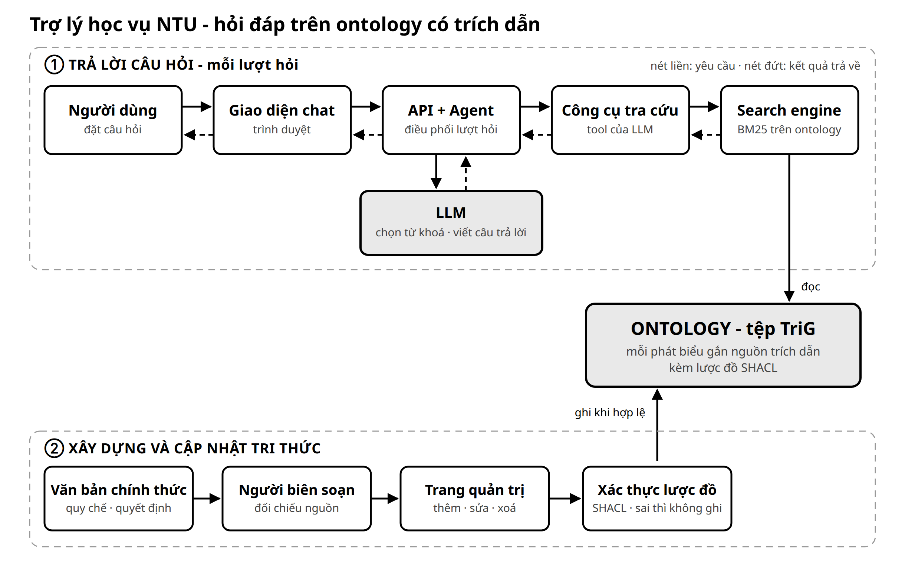
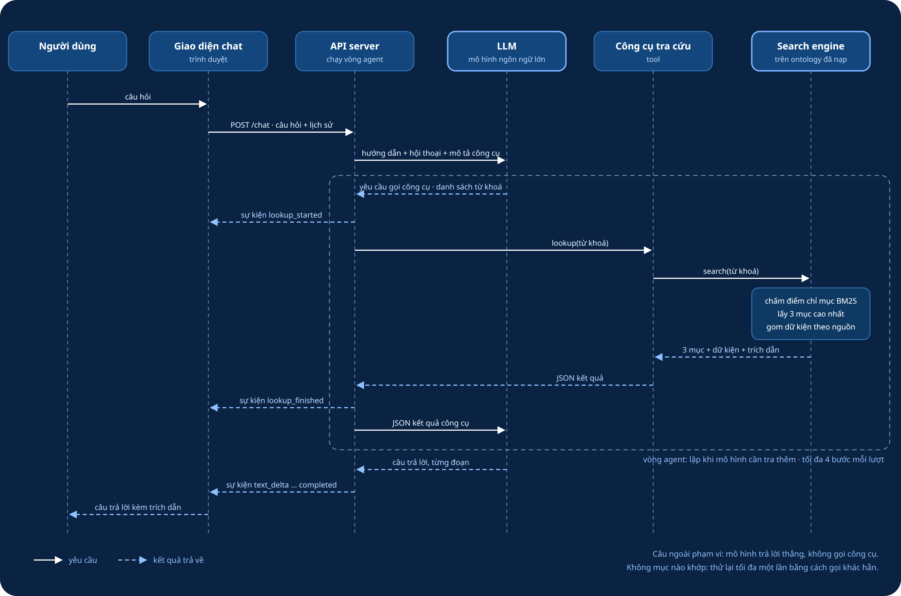
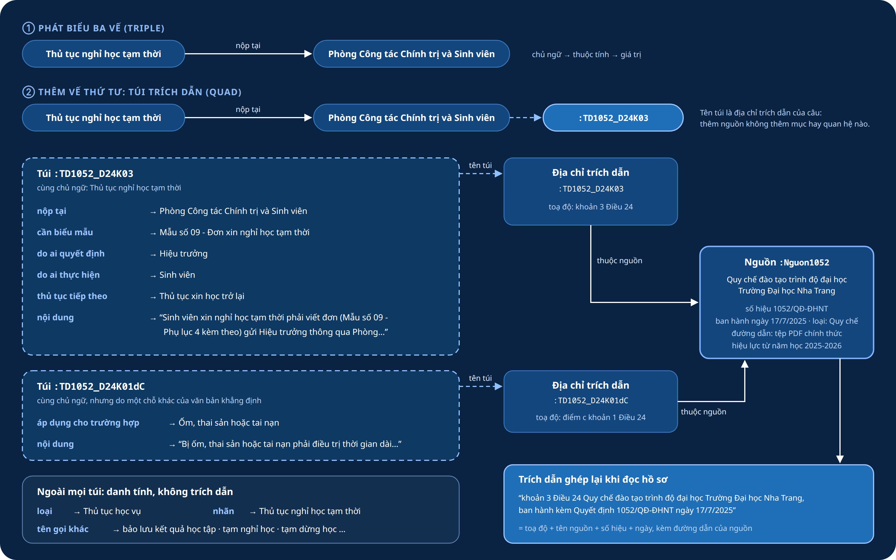
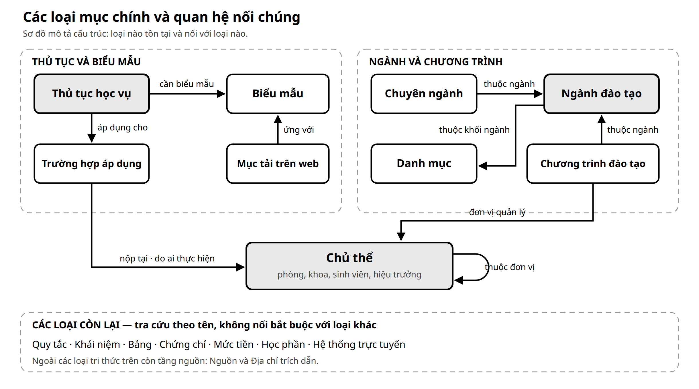
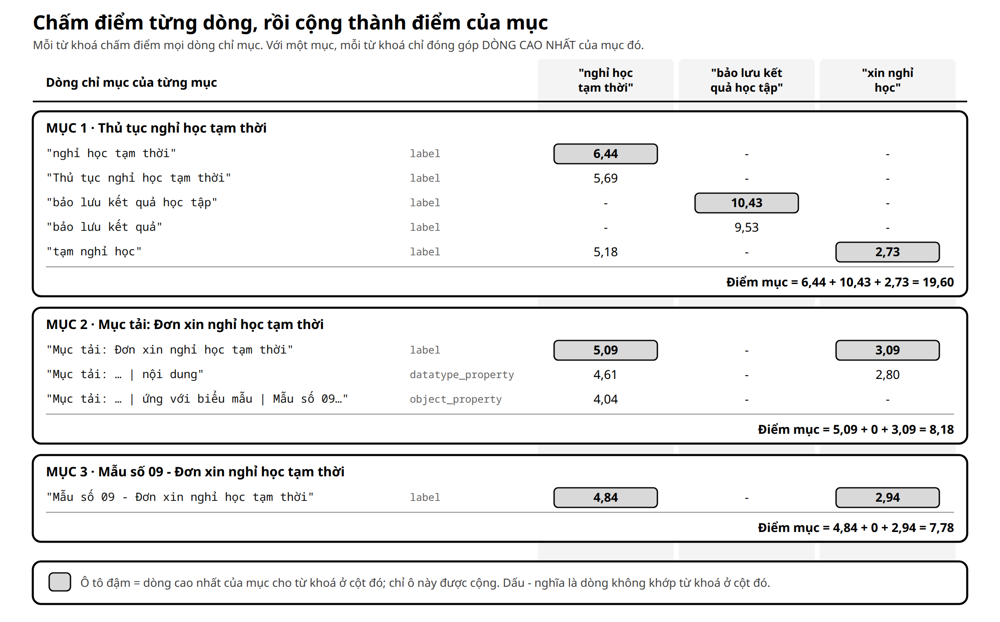
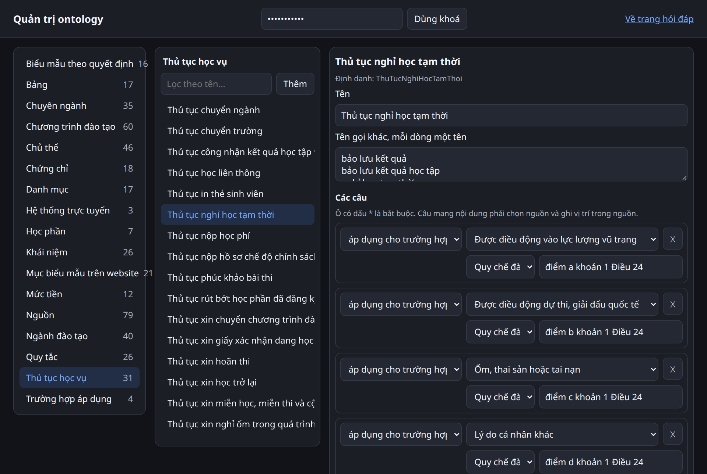
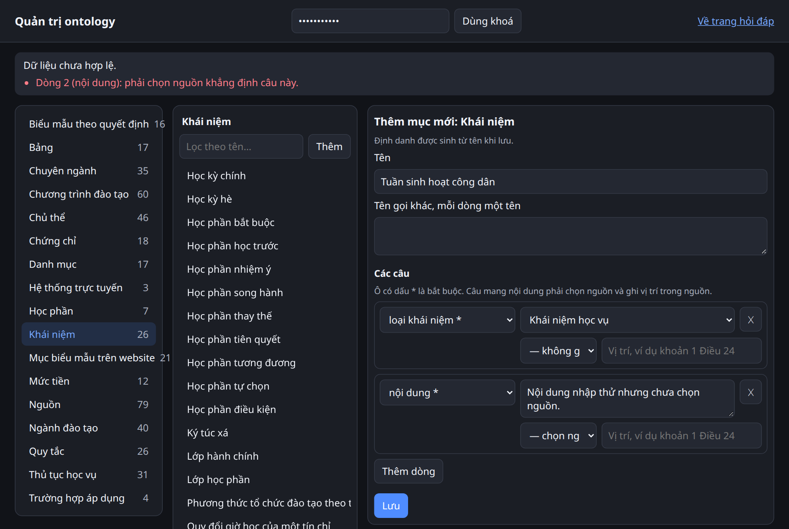
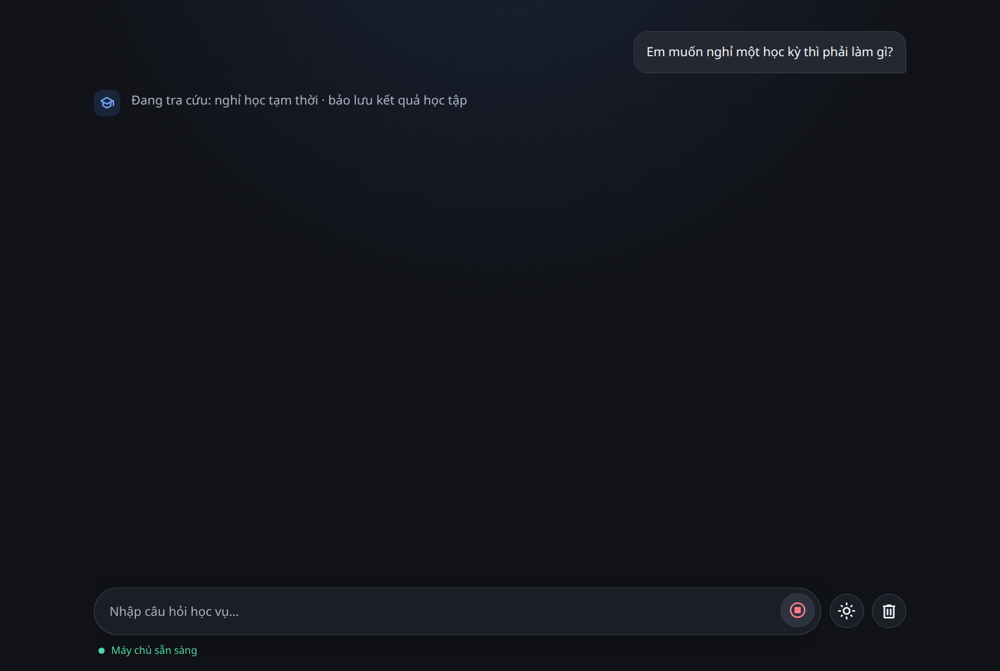
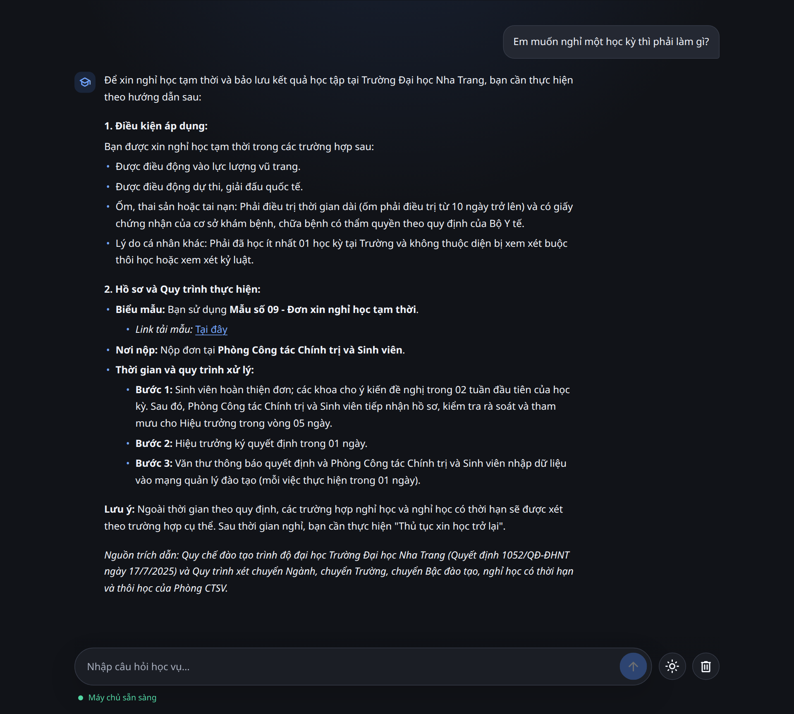

# Trợ lý hỏi đáp học vụ dựa trên ontology

Đây là nguyên mẫu nghiên cứu về hỏi đáp học vụ tiếng Việt tại Trường Đại học Nha
Trang. Người dùng đặt câu hỏi tự nhiên; mô hình ngôn ngữ lớn (LLM) rút từ khoá,
gọi một công cụ tìm kiếm trên ontology, rồi viết câu trả lời chỉ từ những dữ kiện
công cụ trả về, kèm trích dẫn và đường dẫn tới văn bản gốc.

Nguyên tắc cốt lõi là **LLM không phải nơi lưu quy định**. Nội dung học vụ phải
đến từ ontology. Nếu không tìm thấy dữ kiện phù hợp, hệ thống phải trả lời **"không
có thông tin"**, không tự điền phần còn thiếu.

- [Dùng thử hệ thống](https://ontchatbot.vercel.app/)
- [Ảnh dịch vụ trên Docker Hub](https://hub.docker.com/r/vpt19/ontchatbot)

Sơ đồ sau trả lời câu hỏi **"hệ thống gồm những khối nào và chúng tương tác ra
sao?"**. Vùng trên là việc diễn ra ở mỗi lượt hỏi; vùng dưới là việc xây dựng và
cập nhật tri thức mà các lượt hỏi đọc tới. Các mục sau giải thích từng khối.



README đi theo thứ tự mà một người chưa biết dự án cần để hiểu: bài toán, thành
phần, luồng một lượt hỏi, hình dạng dữ liệu, ontology, thuật toán tìm kiếm, cách
cập nhật dữ liệu, thực nghiệm, kết quả và giới hạn.

## 1. Bài toán nghiên cứu là gì?

Thông tin học vụ nằm rải rác trong nhiều loại nguồn: quy chế, quyết định, phụ lục,
bảng, biểu mẫu, chương trình đào tạo và trang web của các phòng ban. Sinh viên lại
hỏi bằng từ ngữ đời thường, viết tắt hoặc thiếu dấu. Ví dụ, "nghỉ một học kỳ" và
"bảo lưu kết quả" cùng chỉ đến thủ tục nghỉ học tạm thời.

Một LLM trả lời từ trí nhớ của nó sẽ nói trôi chảy nhưng dễ sai: nó không biết quy
chế riêng của trường, và không cho biết câu nào lấy từ đâu. Hệ thống ở đây đặt ra
ba yêu cầu:

1. mỗi dữ kiện trong câu trả lời phải truy được về đúng chỗ của văn bản đã nói ra nó;
2. khi dữ liệu không có điều được hỏi, hệ thống phải nói là không có;
3. khi văn bản thay đổi, dữ liệu phải sửa được ngay mà không cần huấn luyện lại gì.

Phạm vi hiện có gồm quy tắc đào tạo, thủ tục học vụ, biểu mẫu, học bổng, rèn luyện
và kỷ luật, chứng chỉ, ngành, chuyên ngành, chương trình đào tạo và các đơn vị phục
vụ sinh viên. Những dữ liệu phụ thuộc từng người hoặc từng đợt, như điểm của một
sinh viên, học phí của một tài khoản hay điểm chuẩn, không được lưu thành một con số
chung; hệ thống chỉ người dùng đến nơi tra cứu chính thức.

Nghiên cứu trả lời ba câu hỏi:

1. Tìm kiếm theo từ khoá trên ontology có đưa đúng mục cần tra lên đầu không?
2. Khi ghép LLM với công cụ tìm kiếm, toàn hệ thống trả lời đúng và từ chối đúng đến đâu?
3. Có giữ được nguồn của từng dữ kiện, và sửa dữ liệu mà vẫn đúng cấu trúc không?

Sản phẩm nghiên cứu không phải một LLM mới hay một thuật toán tìm kiếm mới. Đóng góp
nằm ở cách tổ chức tài nguyên có thể kiểm tra: văn bản chính thức → ontology mà mỗi
câu gắn nguồn → công cụ tìm kiếm trả dữ kiện theo nguồn → câu trả lời có trích dẫn.

## 2. Hệ thống gồm những thành phần nào?

Vài tên gọi cần biết trước:

| Tên gọi | Nghĩa trong dự án |
|---|---|
| **LLM** (*large language model*) | mô hình ngôn ngữ lớn: đọc câu hỏi và viết câu trả lời |
| **Công cụ** (*tool*) | một hàm mà LLM được phép yêu cầu gọi; LLM gửi tham số, hệ thống chạy hàm rồi đưa kết quả lại cho LLM |
| **Agent** | vòng lặp điều phối: gửi hội thoại cho LLM, chạy công cụ khi LLM yêu cầu, lặp lại tới khi LLM viết xong câu trả lời |
| **Ontology** | kho dữ kiện dạng đồ thị: các mục nối với nhau bằng quan hệ có tên, mỗi câu kèm nguồn (mục 5) |
| **API** | điểm nhận yêu cầu qua HTTP của máy chủ |
| **SSE** (*server-sent events*) | cách máy chủ đẩy từng sự kiện nhỏ về trình duyệt trong lúc đang xử lý, để người dùng thấy câu trả lời hiện dần |

Bảy thành phần giữ bảy trách nhiệm:

| Thành phần | Làm gì | Không làm gì |
|---|---|---|
| Giao diện chat | nhận câu hỏi, hiện trạng thái tra cứu và câu trả lời từng đoạn | không gọi LLM, không đọc ontology |
| API server | nhận câu hỏi, xếp hàng các lượt, chạy agent, đẩy sự kiện SSE | không tự viết câu trả lời |
| LLM agent | hiểu câu hỏi, quyết định có tra không và tra bằng từ khoá nào, viết câu trả lời từ kết quả | không phải nơi lưu quy định |
| Công cụ tra cứu | giới hạn danh sách từ khoá, gọi search engine, viết kết quả thành JSON | không chọn câu trả lời |
| Search engine | chấm điểm các dòng chỉ mục, chọn 3 mục, đọc dữ kiện của mục theo nguồn | không hiểu nghĩa câu hỏi |
| Ontology và lược đồ | lưu dữ kiện cùng nguồn của từng câu; lược đồ khai báo mỗi loại mục có những ô nào | không tự trả lời |
| Trang quản trị | thêm, sửa, xoá mục; kiểm theo lược đồ trước khi ghi | không ghi dữ liệu sai lược đồ |

Giao diện là một trang web tĩnh. API server, agent, công cụ, search engine và trang
quản trị chạy trong cùng một dịch vụ Python. LLM chạy ở một máy chủ bên ngoài, gọi
qua giao thức *chat completions* tương thích OpenAI.

## 3. Một câu hỏi đi qua hệ thống như thế nào?

Sơ đồ sau trả lời câu hỏi **"một lượt hỏi đi qua các thành phần theo thứ tự thời
gian nào?"**. Mũi tên liền là yêu cầu đi, mũi tên đứt là kết quả trả về. Đây là
luồng của một lượt hỏi, không phải quy trình xây dựng dữ liệu.



Với câu "Em muốn nghỉ một học kỳ thì phải làm gì?", trình tự thật là:

1. Giao diện gửi câu hỏi cùng tối đa 20 tin nhắn gần nhất tới API.
2. API mở một lượt: gửi cho LLM lời hướng dẫn, hội thoại và mô tả của công cụ
   `lookup_academic_information`.
3. LLM không trả lời ngay mà yêu cầu gọi công cụ với hai từ khoá:
   `nghỉ học tạm thời` và `bảo lưu kết quả học tập`.
4. API báo cho giao diện sự kiện `lookup_started`, rồi chạy công cụ.
5. Search engine tìm các dòng chỉ mục khớp từ khoá, chọn 3 mục điểm cao nhất và
   đọc toàn bộ dữ kiện của từng mục, gom theo nguồn đã khẳng định chúng.
6. Công cụ trả JSON cho LLM; API báo `lookup_finished`.
7. LLM viết câu trả lời chỉ từ JSON đó. Mỗi đoạn chữ vừa sinh ra được đẩy về giao
   diện qua sự kiện `text_delta`; cuối cùng là `completed`.

Lượt hỏi thật này mất 2,92 giây, gọi công cụ một lần và sinh 147 sự kiện `text_delta`.

Hệ thống từ chối theo ba cách:

- **Câu ngoài phạm vi học vụ** (thời tiết, chuyện phiếm): LLM trả lời thẳng là ngoài
  phạm vi, không gọi công cụ.
- **Không mục nào khớp từ khoá** (`status=not_found`): LLM được thử lại tối đa một lần
  bằng cách gọi khác hẳn, sau đó phải nói không tìm thấy.
- **Có mục khớp nhưng không chứa điều được hỏi**: lời hướng dẫn buộc LLM kiểm trường
  `matched` và đọc hết dữ kiện; chi tiết không có trong dữ kiện thì nói dữ liệu hiện
  có không chứa chi tiết đó.

Mỗi lượt có giới hạn cứng: tối đa 4 bước gọi LLM, tối đa 45 giây, và cổng vào chỉ
cho một số lượt chạy cùng lúc (mặc định 16, hàng đợi 64), để một đợt dồn không làm
treo dịch vụ. Câu trả lời "không có thông tin" nghĩa là dữ liệu hiện có không chứa
nó, không phải khẳng định thông tin đó không tồn tại ngoài thực tế.

## 4. Dữ liệu trông như thế nào ở từng bước?

Sơ đồ sau trả lời câu hỏi **"dữ liệu thật có hình dạng gì ở mỗi bước của lượt hỏi
trên?"**. Mọi khối lấy từ lượt hỏi thật ở mục 3, chỉ rút gọn phần dài.


| Bước | Hình dạng | Nội dung chính |
|---|---|---|
| 1. Câu hỏi | chuỗi văn bản | `Em muốn nghỉ một học kỳ thì phải làm gì?` |
| 2. Yêu cầu tới API | JSON qua `POST /chat` | `message` và `history` |
| 3. Lời gọi công cụ | JSON do LLM sinh | tên công cụ và danh sách `keywords` |
| 4. Kết quả tìm kiếm | 3 mục kèm điểm | mục, điểm, các dòng đã khớp |
| 5. Kết quả công cụ | JSON | mục, dòng khớp, dữ kiện gom theo nguồn |
| 6. Sự kiện về giao diện | SSE | `lookup_started`, `lookup_finished`, `text_delta`, `completed` |
| 7. Câu trả lời | Markdown | hướng dẫn kèm nguồn và đường dẫn |

**JSON** là định dạng văn bản ghi dữ liệu thành các cặp tên - giá trị. Kết quả
công cụ là phần quan trọng nhất, vì đó là tất cả những gì LLM được biết về quy định:

```json
{
  "status": "found",
  "guidance": "Mỗi phần tử của results là một mục của ontology. Kiểm matched trước: …",
  "results": [
    {
      "label": "Thủ tục nghỉ học tạm thời",
      "classes": ["Thủ tục học vụ"],
      "matched": ["bảo lưu kết quả học tập", "bảo lưu kết quả", "nghỉ học tạm thời"],
      "sources": [
        {
          "citation": "khoản 3 Điều 24 Quy chế đào tạo trình độ đại học Trường Đại học Nha Trang, ban hành kèm Quyết định 1052/QĐ-ĐHNT ngày 17/7/2025",
          "url": "https://pdtdaihoc.ntu.edu.vn/…pdf",
          "facts": [
            {"subject": "Thủ tục nghỉ học tạm thời", "property": "nộp tại", "value": "Phòng Công tác Chính trị và Sinh viên"},
            {"subject": "Thủ tục nghỉ học tạm thời", "property": "cần biểu mẫu", "value": "Mẫu số 09 - Đơn xin nghỉ học tạm thời"}
          ]
        }
      ]
    }
  ]
}
```

| Trường | Ý nghĩa |
|---|---|
| `status` | `found` khi có ít nhất một mục khớp, `not_found` khi không có |
| `guidance` | lời nhắc cách đọc kết quả, lặp lại ngay trong dữ liệu |
| `label`, `classes` | tên mục và loại của nó |
| `matched` | các dòng chỉ mục đã khớp từ khoá; LLM dùng để loại mục không đúng ý hỏi |
| `sources` | mỗi phần tử là một nguồn: `citation` và `url` để trích dẫn, `facts` là các dữ kiện nguồn đó khẳng định |
| `facts[].subject` | mục nói ra dữ kiện; khác `label` nghĩa là câu của một mục khác nói tới mục này |
| `unmatched`, `truncation` | từ khoá không khớp gì; số từ khoá bị cắt vì vượt giới hạn |

Một nguồn có `citation` bằng `null` là dữ kiện dùng được nhưng không được trích
dẫn. Công cụ nhận tối đa 20 từ khoá, mỗi từ khoá tối đa 120 ký tự.

Sự kiện SSE là các dòng `data:` nối nhau trong một kết nối HTTP:

```text
data: {"type": "lookup_started", "keywords": "nghỉ học tạm thời · bảo lưu kết quả học tập"}
data: {"type": "lookup_finished"}
data: {"type": "text_delta", "content": "…một đoạn của câu trả lời…"}
data: {"type": "completed", "content": "Để nghỉ học tạm thời và bảo lưu kết quả học tập, bạn cần…"}
```

Ngoài bốn loại trên còn `queued` (đang xếp hàng, kèm vị trí), `warning` (lịch sử quá
dài đã bị cắt) và `error`.

## 5. Ontology được tổ chức ra sao?

Tệp [`resources/ontology/ontology.trig`](resources/ontology/ontology.trig) là cơ sở
dữ liệu nội dung duy nhất mà dịch vụ đọc. Văn bản chính thức vẫn là căn cứ có thẩm
quyền; ontology chỉ là bản biểu diễn có cấu trúc của phần nội dung đã chọn vào phạm vi.

### 5.1 Đọc các khái niệm cơ bản trước khi xem ví dụ

Mọi định danh trong ontology dùng chung một tiền tố địa chỉ, gọi là *namespace*:

```text
http://www.ntu.edu.vn/ontology/academic#
```

**IRI** là định danh duy nhất của một mục. IRI đầy đủ của thủ tục nghỉ học tạm thời
là `http://www.ntu.edu.vn/ontology/academic#ThuTucNghiHocTamThoi`; trong tệp, tiền tố
`:` thay cho namespace nên viết gọn thành `:ThuTucNghiHocTamThoi`. Định danh sinh từ
tên tiếng Việt bỏ dấu; tên hiển thị cho người đọc nằm trong `rdfs:label`.

| Khái niệm | Bản chất | Ví dụ |
|---|---|---|
| Lớp (loại) | nhóm các mục cùng kiểu | `:ThuTucHocVu` là lớp thủ tục học vụ |
| Cá thể (mục) | một đối tượng cụ thể thuộc một lớp | `:ThuTucNghiHocTamThoi` |
| Quan hệ | nối mục với mục khác | `:nopTai` nối thủ tục với đơn vị tiếp nhận |
| Thuộc tính | nối mục với chữ, số, ngày hoặc đường dẫn | `:noiDung` nối thủ tục với một câu nội dung |

Mỗi dữ kiện được ghi thành một **phát biểu ba vế** (*triple*):

```text
chủ ngữ → quan hệ hoặc thuộc tính → mục đích hoặc giá trị
```

Ví dụ `Thủ tục nghỉ học tạm thời → nộp tại → Phòng Công tác Chính trị và Sinh viên`.

### 5.2 Mỗi phát biểu mang nguồn của chính nó

Một thủ tục thường được nhiều chỗ của văn bản nói tới: nơi nộp ở khoản 3 Điều 24,
trường hợp được nghỉ ở điểm a đến d khoản 1 Điều 24. Nếu nguồn chỉ gắn cho cả mục,
người đọc không biết câu nào lấy từ đâu. Vì vậy ontology thêm **vế thứ tư** cho mỗi
phát biểu, gọi là *quad*. Vế thứ tư là tên của một **túi trích dẫn** (*named graph*):
mọi phát biểu do cùng một chỗ của cùng một văn bản khẳng định thì nằm chung một túi,
và tên túi chính là **địa chỉ trích dẫn** trỏ về nguồn. **TriG** là định dạng văn bản
ghi được cả bốn vế.

Sơ đồ sau trả lời câu hỏi **"một thủ tục thật được ghi với nguồn như thế nào?"**.
Nó là cách tổ chức dữ liệu, không phải luồng chạy.



Nhờ vậy, thêm nguồn không thêm mục hay quan hệ nào: nguồn là thông tin đi kèm phát
biểu, không phải một loại nội dung khác. Khi một văn bản mới thay đổi một chi tiết,
chỉ phát biểu đó đổi túi hoặc được thay, các phát biểu khác của mục giữ nguyên nguồn.

### 5.3 Một thủ tục được biểu diễn ra sao?

Đoạn sau rút gọn từ tệp thật, xếp lại cho dễ đọc:

```trig
:ThuTucNghiHocTamThoi a :ThuTucHocVu ;
    rdfs:label "Thủ tục nghỉ học tạm thời"@vi ;
    skos:altLabel "bảo lưu kết quả học tập"@vi , "tạm nghỉ học"@vi .

:TD1052_D24K03 {
    :ThuTucNghiHocTamThoi :nopTai :PhongCongTacChinhTriVaSinhVien ;
        :canBieuMau :MauSo09DonXinNghiHocTamThoi ;
        :doAiQuyetDinh :HieuTruong ;
        :doAiThucHien :SinhVien ;
        :thuTucTiepTheo :ThuTucXinHocTroLai ;
        :noiDung "Sinh viên xin nghỉ học tạm thời phải viết đơn (Mẫu số 09 - Phụ lục 4 kèm theo) gửi Hiệu trưởng thông qua Phòng Công tác Chính trị và Sinh viên."@vi .
}

:TD1052_D24K03 a :DiaChiTrichDan ;
    :thuocNguon :Nguon1052 ;
    :toaDo "khoản 3 Điều 24"@vi .

:Nguon1052 a :Nguon ;
    rdfs:label "Quy chế đào tạo trình độ đại học Trường Đại học Nha Trang"@vi ;
    :soHieu "1052/QĐ-ĐHNT"@vi ;
    :banHanhNgay "2025-07-17"^^xsd:date ;
    :loaiNguon :QuyChe ;
    :duongDan "https://pdtdaihoc.ntu.edu.vn/…pdf"^^xsd:anyURI .
```

Cách đọc đoạn này:

- khối đầu nằm ngoài mọi túi: loại, tên và các **tên gọi khác** (`skos:altLabel`) mà
  người dùng hay gọi; đây là danh tính của mục, không cần trích dẫn;
- khối `:TD1052_D24K03 { … }` là một túi: sáu phát biểu cùng do khoản 3 Điều 24 khẳng định;
- `:TD1052_D24K03` là địa chỉ trích dẫn: toạ độ "khoản 3 Điều 24" trong nguồn `:Nguon1052`;
- `:Nguon1052` mang số hiệu, ngày ban hành, loại và đường dẫn của văn bản.

Khi đọc hồ sơ, hệ thống ghép toạ độ, tên nguồn, số hiệu và ngày thành chuỗi trích dẫn
"khoản 3 Điều 24 Quy chế đào tạo trình độ đại học Trường Đại học Nha Trang, ban hành
kèm Quyết định 1052/QĐ-ĐHNT ngày 17/7/2025".

### 5.4 Tầng tri thức và tầng nguồn

| Tầng | Lưu gì | Dùng để làm gì |
|---|---|---|
| Tri thức | 16 loại mục: thủ tục, quy tắc, đơn vị, ngành, biểu mẫu… | là thứ người dùng hỏi tới và được tìm kiếm |
| Nguồn | nguồn (văn bản, trang web) và địa chỉ trích dẫn | chỉ để dựng trích dẫn; không được tìm kiếm |

Có hai loại phát biểu nằm ngoài mọi túi: danh tính của mục (loại, tên, tên gọi khác)
và vài điều dự án tự khẳng định mà không văn bản nào ghi, như việc ghép một mục tải
trên website với biểu mẫu tương ứng trong phụ lục. Những phát biểu này hiện ra với
`citation: null`: dùng được nhưng không được trích dẫn.

### 5.5 Lược đồ khai báo mỗi loại mục có những ô nào

**SHACL** là ngôn ngữ khai báo ràng buộc cho dữ liệu dạng đồ thị. Tệp
[`resources/ontology/shapes.ttl`](resources/ontology/shapes.ttl) có một **shape** cho
mỗi loại mục: loại đó có những ô nào, ô nào bắt buộc, nhận một hay nhiều giá trị, là
chữ hay trỏ tới loại nào, có phải gắn nguồn không. Tệp viết bằng Turtle, định dạng ba
vế cùng họ với TriG. Đoạn rút gọn cho thủ tục học vụ:

```turtle
:ThuTucHocVuShape a sh:NodeShape ;
    sh:targetClass :ThuTucHocVu ;
    sh:closed true ;
    sh:property
        [ sh:path :noiDung ; sh:name "nội dung"@vi ;
          sh:datatype rdf:langString ; sh:minCount 1 ;
          :batBuocNguon true ] ,
        [ sh:path :nopTai ; sh:name "nộp tại"@vi ;
          sh:class :ChuThe ;
          :batBuocNguon true ] .
```

`sh:closed true` cấm ô chưa khai báo; `sh:minCount 1` là ô bắt buộc; `sh:class` buộc
giá trị trỏ tới đúng loại; `:batBuocNguon true` là quy ước riêng của dự án: câu của ô
đó phải nằm trong một túi trích dẫn.

Sơ đồ sau trả lời câu hỏi **"các loại mục nối với nhau bằng những quan hệ nào?"**. Số
trong mỗi hộp là số mục đếm ngày 13/9/2026, mô tả quy mô chứ không đo chất lượng.



| Loại | Lớp | Số mục | Chứa gì |
|---|---|---:|---|
| Thủ tục học vụ | `ThuTucHocVu` | 31 | nội dung, người thực hiện, nơi nộp, biểu mẫu, trường hợp áp dụng |
| Quy tắc | `QuyTac` | 26 | quy định học vụ: cảnh báo, buộc thôi học, khối lượng đăng ký, thời gian đào tạo |
| Khái niệm | `KhaiNiem` | 26 | khái niệm học vụ: học kỳ, loại học phần, điểm rèn luyện |
| Chủ thể | `ChuThe` | 46 | đơn vị trong trường và vai trò: phòng, khoa, sinh viên, hiệu trưởng |
| Ngành đào tạo | `NganhDaoTao` | 40 | tên ngành, mã ngành, khối ngành |
| Chuyên ngành | `ChuyenNganh` | 35 | chuyên ngành và ngành chứa nó |
| Chương trình đào tạo | `ChuongTrinhDaoTao` | 60 | thời gian, ngôn ngữ, văn bằng, tổng tín chỉ, đơn vị quản lý |
| Biểu mẫu theo quyết định | `BieuMauTheoQuyetDinh` | 16 | mẫu đơn trong phụ lục quy chế |
| Mục biểu mẫu trên website | `MucBieuMauTrenWebsite` | 21 | đường tải biểu mẫu |
| Bảng | `Bang` | 17 | bảng chép nguyên văn từng ô |
| Chứng chỉ | `ChungChi` | 18 | chứng chỉ ngoại ngữ và tin học |
| Danh mục | `DanhMuc` | 17 | danh mục dùng chung: khối ngành, ngân hàng, đơn vị tính |
| Mức tiền | `MucTien` | 12 | mức học bổng, lệ phí |
| Học phần | `HocPhan` | 7 | học phần có quy định riêng |
| Trường hợp áp dụng | `TruongHopApDung` | 4 | trường hợp mà thủ tục áp dụng |
| Hệ thống trực tuyến | `HeThongTrucTuyen` | 3 | cổng thông tin sinh viên và các hệ thống tương tự |
| *Nguồn* | `Nguon` | 79 | văn bản và trang web làm căn cứ |
| *Địa chỉ trích dẫn* | `DiaChiTrichDan` | 374 | toạ độ trong nguồn, cũng là tên túi |

### 5.6 Dữ liệu được biên soạn và đối chiếu nguồn thế nào?

Quy trình biên soạn có năm bước:

1. **Chọn nguồn chính thức:** văn bản của trường hoặc trang của phòng ban; ghi số
   hiệu, ngày ban hành, đường dẫn và ngày thu thập.
2. **Tách thành mục và phát biểu:** mỗi câu gắn với chỗ nhỏ nhất của văn bản khẳng
   định nó (khoản, điểm, mục của trang).
3. **Đối chiếu từng giá trị:** so với bản chép trong [`references/`](references/) hoặc
   trang chính thức; bảng nhiều tầng được chép nguyên văn từng ô.
4. **Ghi vào ontology:** qua script hoặc trang quản trị; mọi lần ghi đều qua kiểm lược đồ.
5. **Chạy lại bộ test và bộ kiểm tìm kiếm** (mục 8).

Các quy tắc biên soạn:

- văn bản cũ vẫn là căn cứ cho những điểm mà văn bản mới không nói tới;
- khi hai nguồn mâu thuẫn, dùng nguồn mới hơn;
- không lưu thông tin cá nhân của cán bộ, như số điện thoại riêng của trưởng đơn vị;
- không lưu dữ liệu riêng của từng sinh viên và dữ liệu theo đợt (học phí từng tài
  khoản, điểm chuẩn); chỉ lưu đường dẫn tới nơi tra cứu chính thức.

79 nguồn hiện có gồm 48 văn bản chương trình đào tạo, 18 hướng dẫn và trang web
chính thức, 7 quyết định, 4 quy chế và 2 danh mục biểu mẫu.

### 5.7 Các con số giải phẫu có ý nghĩa gì?

Các số đếm từ phiên bản ontology ngày 13/9/2026. Chúng mô tả quy mô, không đo độ
đúng hay độ đầy đủ.

| Thành phần | Số lượng | Nó là gì |
|---|---:|---|
| Loại mục | 18 | 16 loại tri thức và 2 loại của tầng nguồn |
| Shape trong lược đồ | 18 | một shape cho mỗi loại |
| Phát biểu (quad) | 4.082 | toàn bộ phát biểu trong tệp |
| Phát biểu trong túi | 1.211 | các câu mang nội dung có nguồn |
| Phát biểu ngoài túi | 2.871 | danh tính, tầng nguồn và tên của các loại và thuộc tính |
| Nguồn | 79 | văn bản và trang web |
| Địa chỉ trích dẫn | 374 | số túi |

### 5.8 Kiểm định ontology chứng minh được gì?

Các phép kiểm tự động trên tệp thật xác nhận:

- toàn bộ dữ liệu khớp lược đồ SHACL;
- mọi ô bắt buộc gắn nguồn đều nằm trong túi;
- quy tắc trích dẫn: không có địa chỉ rỗng, mỗi chỗ trong nguồn chỉ có một địa chỉ,
  một văn bản không khẳng định cùng một dữ kiện ở hai chỗ;
- 17 bảng khớp bản chép trong `references/` đến từng ký tự;
- các kiểu câu hỏi tiêu biểu tìm ra đúng mục.

Các phép kiểm đó **không** chứng minh tập nguồn đầy đủ, mọi diễn giải đúng về pháp lý,
trang web còn nguyên như lúc thu thập, hay LLM luôn trình bày trung thực. Khi ontology
mâu thuẫn với văn bản chính thức, văn bản chính thức được ưu tiên và ontology phải được sửa.

## 6. Công cụ tìm kiếm trên ontology hoạt động ra sao?

Mục này trả lời một câu hỏi cụ thể: **LLM gửi vài từ khoá, làm sao hệ thống biết mục
nào của ontology cần đưa lại?**

Sơ đồ sau dùng đúng hai từ khoá của lượt hỏi ở mục 3 và điểm số thật. Nó mô tả thuật
toán, không phải luồng giữa các thành phần.



### 6.1 Từ ontology đến chỉ mục

**Chỉ mục** là danh sách các dòng chữ được chuẩn bị sẵn để tìm nhanh. Khi dịch vụ
khởi động, mỗi mục của tầng tri thức sinh ba loại dòng:

| Loại dòng | Khuôn | Ví dụ |
|---|---|---|
| Tên | tên chính và mỗi tên gọi khác | `bảo lưu kết quả học tập` |
| Thuộc tính | `tên mục \| tên thuộc tính` | `Thủ tục nghỉ học tạm thời \| nội dung` |
| Quan hệ | `tên mục \| tên quan hệ \| tên mục đích` | `Thủ tục nghỉ học tạm thời \| nộp tại \| Phòng Công tác Chính trị và Sinh viên` |

Giá trị không vào chỉ mục: người ta hỏi "học phí ngành nào", không hỏi bằng con số.
Giá trị đến tay LLM ở bước đọc hồ sơ. Tầng nguồn cũng không vào chỉ mục, và ba thuộc
tính chỉ chứa đường dẫn hoặc hộp thư không sinh dòng. Ontology hiện tại sinh 1.766
dòng cho 379 mục: 733 dòng tên, 518 dòng thuộc tính, 515 dòng quan hệ.

### 6.2 Tách từ

**Token** là đơn vị chữ nhỏ nhất đem đi so khớp. Cả dòng chỉ mục lẫn từ khoá đi qua
cùng một bước tách: chuẩn hoá Unicode, chuyển chữ thường, tách theo âm tiết, bỏ 26 từ
hỏi và hư từ như "là", "gì", "của", "được". Mỗi token chỉ tính một lần trong một dòng,
vì dòng quan hệ hay lặp chữ ở hai đầu.

Không có bước sửa lỗi gõ hay bung viết tắt: từ khoá do LLM viết lại đã đúng chính tả,
còn tên viết tắt như "CNTT" được khai làm tên gọi khác của mục trong dữ liệu.

### 6.3 Chấm điểm một dòng bằng BM25

**BM25** là công thức xếp hạng văn bản theo mức khớp với truy vấn. Nói bằng lời, một
dòng được điểm cao khi:

- chứa các token của từ khoá (**TF**, *term frequency*; ở đây mỗi token có hoặc không);
- các token đó hiếm trong toàn chỉ mục (**IDF**, *inverse document frequency*): chữ
  "thủ tục" xuất hiện ở rất nhiều dòng nên ít giá trị hơn chữ "bảo lưu";
- dòng ngắn: cùng khớp một chữ, dòng ngắn tập trung hơn dòng dài.

Công thức, với `q` là từ khoá, `d` là dòng, `N` là số dòng, `n(t)` là số dòng chứa
token `t`, `|d|` là độ dài dòng và `avgdl` là độ dài trung bình:

```text
điểm(q, d) = Σ_{t ∈ q} IDF(t) · f(t, d) · (k1 + 1) / (f(t, d) + k1 · (1 − b + b · |d| / avgdl))
IDF(t)     = ln(1 + (N − n(t) + 0,5) / (n(t) + 0,5))
```

`f(t, d)` bằng 1 nếu dòng chứa token, bằng 0 nếu không; `k1 = 1,5` và `b = 0,75` là
tham số mặc định của thư viện `bm25s`. Mỗi từ khoá lấy tối đa 20 dòng điểm cao nhất.

### 6.4 Gộp điểm dòng thành điểm mục

Một mục có nhiều dòng, và LLM thường gửi 2-3 từ khoá cho cùng một câu hỏi. Quy tắc
gộp chỉ có một:

1. với từng từ khoá, mỗi mục chỉ giữ **dòng điểm cao nhất** của nó;
2. điểm của mục là **tổng** các điểm đó qua các từ khoá.

Ở ví dụ, "Thủ tục nghỉ học tạm thời" có dòng 10,43 cho từ khoá "bảo lưu kết quả học
tập" và dòng 6,44 cho "nghỉ học tạm thời", nên được 16,88. Dòng 9,53 của cùng mục cho
cùng từ khoá không được cộng thêm. Cộng theo từ khoá mà không cộng theo dòng làm mục
trả lời được nhiều ý của câu hỏi đứng trên mục khớp thật tốt một ý, trong khi một mục
nhiều dòng không tự tăng điểm.

### 6.5 Chọn 3 mục, không đặt ngưỡng

Engine trả 3 mục điểm cao nhất, không đặt ngưỡng điểm tối thiểu. Trả 3 thay vì 1 để
LLM thấy cả các ứng viên yếu hơn: nếu cả ba đều lạc đề, LLM có đủ căn cứ để từ chối
thay vì bị buộc dùng mục đầu. Không đặt ngưỡng vì điểm BM25 không so được giữa các
truy vấn khác nhau; việc loại mục không đúng ý hỏi giao cho LLM, qua trường `matched`.

### 6.6 Đọc hồ sơ của từng mục

Với mỗi mục được chọn, engine đọc mọi phát biểu mà mục là chủ ngữ, và cả các phát
biểu của mục khác trỏ tới nó (ví dụ các thủ tục "nộp tại" một phòng). Các phát biểu
được gom theo túi; mỗi túi thành một nguồn với chuỗi trích dẫn và đường dẫn. Nhóm
nhiều dữ kiện nhất đứng trước; nhóm không có nguồn xếp cuối. Mục "Thủ tục nghỉ học
tạm thời" ở ví dụ có 8 nhóm nguồn.

### 6.7 Chi phí

Trên máy phát triển, nạp tệp TriG và dựng chỉ mục mất khoảng 50 ms. Một lần tìm, kể
cả đọc hồ sơ 3 mục, có trung vị 0,57 ms và p95 1,0 ms qua 285 lần chạy với từ khoá của
bộ kiểm ở mục 8.1. Chỉ mục dựng lại trong bộ nhớ mỗi khi ontology thay đổi, nên không
có tệp chỉ mục nào phải giữ đồng bộ.

## 7. Dữ liệu được cập nhật thế nào?

**CRUD** (*create, read, update, delete*) là bốn thao tác thêm, đọc, sửa, xoá. Trang
quản trị làm cả bốn trên ontology theo ba nguyên tắc:

- **sửa là sửa thật:** mục được thay bằng đúng những gì người sửa gửi lên, kể cả nguồn
  của từng câu, vì một văn bản mới có thể thay một phần hay toàn bộ căn cứ cũ;
- **câu mang nội dung phải gắn nguồn:** người sửa chọn nguồn và ghi vị trí trong nguồn;
  địa chỉ trích dẫn được tạo nếu chưa có và được dọn khi không còn câu nào dùng;
- **dữ liệu sai lược đồ không được ghi.**

Form của mỗi loại mục được sinh từ chính `shapes.ttl`: ô bắt buộc có dấu `*`, ô trỏ
tới loại khác là danh sách chọn, ô không được gắn nguồn không hiện ô nguồn. Vì form và
bước kiểm cùng đọc một lược đồ, chúng không thể nói hai điều khác nhau.



Một lần lưu đi bốn bước:

1. dựng bản ontology mới trong bộ nhớ từ bản hiện tại và nội dung gửi lên;
2. kiểm toàn bộ bản mới bằng SHACL, cộng luật gắn nguồn;
3. ghi tệp TriG qua tệp tạm rồi đổi tên, các phát biểu sắp theo thứ tự cố định để lịch
   sử `git` chỉ hiện đúng dòng đã đổi;
4. dựng lại engine tìm kiếm, nên lượt hỏi kế tiếp dùng dữ liệu mới.

Bước 2 hỏng thì tệp trên đĩa giữ nguyên và lý do hiện ngay trên trang:



Trang gọi các đường API sau. Mọi đường đòi khoá dịch vụ như đường hỏi đáp, cộng khoá
quản trị trong header `X-Admin-Token`; không đặt khoá quản trị thì dịch vụ không mở
các đường này.

| Đường | Làm gì |
|---|---|
| `GET /admin/schema` | mô tả form của mọi loại mục, đọc từ lược đồ |
| `GET /admin/entities?class=…` | danh sách mục của một loại |
| `POST /admin/entities` | tạo mục mới; định danh sinh từ tên |
| `GET /admin/entities/{id}` | đọc một mục cùng các câu và nguồn của từng câu |
| `PUT /admin/entities/{id}` | thay toàn bộ mục bằng nội dung gửi lên |
| `DELETE /admin/entities/{id}` | xoá mục, từ chối nếu còn mục khác trỏ tới |

Nội dung gửi lên và lý do từ chối có dạng:

```json
{
  "class": "ThuTucHocVu",
  "label": "Thủ tục nghỉ học tạm thời",
  "altLabels": ["bảo lưu kết quả học tập"],
  "statements": [
    {"property": "nopTai", "value": "PhongCongTacChinhTriVaSinhVien",
     "source": "Nguon1052", "coordinate": "khoản 3 Điều 24"}
  ]
}
```

```json
{"detail": "Dữ liệu chưa hợp lệ.", "errors": ["Dòng 2 (nội dung): phải chọn nguồn khẳng định câu này."]}
```

Đo trên máy phát triển: lưu lại một thủ tục không đổi gì mất 0,47 giây và giữ nguyên
tệp đến từng byte; tạo một mục mới mất 0,32 giây.

## 8. Thực nghiệm được thiết lập thế nào?

### 8.1 Bộ kiểm tìm kiếm

Bộ kiểm [`retrieval.json`](resources/end-to-end/retrieval.json) đo riêng câu hỏi
nghiên cứu thứ nhất, không cần gọi LLM. Mỗi câu có từ khoá do trợ lý đã viết trong một
lượt chạy thật, được ghi lại và đóng băng, cùng mục đích và tên của mục đích.

- Bộ có 57 câu; 49 câu được chấm. 8 câu không tính: 6 câu hỏi nguyên văn một điều
  khoản, trong khi ontology không lưu nguyên văn văn bản mà dẫn tới văn bản gốc; 2 câu
  có đáp án là chính một văn bản nguồn, trong khi nguồn dùng để trích dẫn chứ không
  phải để tra.
- Một câu đạt khi mục đích nằm trong 3 mục trả về, khớp theo IRI hoặc theo tên. Thứ
  hạng của mục đích được ghi lại.
- [`check_retrieval.py`](resources/end-to-end/check_retrieval.py) so kết quả với một mốc
  đã ghi, nên mỗi lần sửa dữ liệu làm tụt câu nào là biết ngay.

### 8.2 Bộ đánh giá toàn hệ thống

Bộ [`questions.json`](resources/end-to-end/questions.json) có 85 câu cố định, viết theo
nhiều cách: trang trọng, trung tính, đời thường và gõ thiếu dấu. Các câu chia ba nhóm:

| Nhóm | Số câu | Hành vi đúng |
|---|---:|---|
| Có dữ kiện | 66 | trả lời đúng điều được hỏi |
| Ngoài phạm vi | 11 | từ chối hoặc hỏi lại cho rõ |
| Hỏi vào khoảng trống của dữ liệu | 8 | nói dữ liệu không có |

Trong 66 câu có dữ kiện, 58 câu có mục đích để chấm việc lấy đúng mục; 8 câu còn lại
là các câu hỏi nguyên văn điều khoản và câu có đáp án là văn bản nguồn nói ở mục 8.1.
Có 5 câu được chuyển sang nhóm có dữ kiện vì ontology hiện tại đã có câu trả lời: ba
câu về bảo hiểm y tế, một câu về chuẩn tiếng Anh của ngành Công nghệ thông tin, một câu
về số tín chỉ ngành Quản trị kinh doanh. Lý do chuyển ghi trong trường `chuyen_nhom`.

Điều kiện chạy:

| Thiết lập | Giá trị |
|---|---|
| Mô hình ngôn ngữ | `lightning-ai/gemma-4-31B-it` qua Lightning AI |
| Ngày chạy | 13/9/2026 |
| Số mục mỗi lần tìm | 3 |
| Số bước LLM tối đa mỗi lượt | 4 |
| Cách chạy | tuần tự, mỗi câu một lượt độc lập, không có lịch sử |

Trợ lý được dựng đúng như khi phục vụ; chỉ công cụ tra cứu được bọc để ghi từ khoá,
mục trả về, thời gian và nguyên văn dữ liệu của từng lần gọi. Khoá API bị giới hạn tốc
độ (lỗi HTTP 429) thì phần chạy chờ rồi hỏi lại cả câu; thời gian ghi nhận chỉ tính lần
hỏi cuối.

Mỗi câu được chấm theo hai cách. **Kiểm tra cố định** đếm những thứ có hình dạng rõ:

| Kiểm tra | Cách tính |
|---|---|
| Gọi công cụ | lượt có ít nhất một lần gọi công cụ trước khi trả lời |
| Lấy đúng mục | mục đích nằm trong các mục công cụ trả về |
| Bám dữ liệu | mọi số có từ hai chữ số và chữ viết tắt trong câu trả lời có mặt trong dữ liệu công cụ, câu hỏi hoặc lời hướng dẫn, sau khi bỏ dấu phân cách hàng nghìn |
| Nói là không có | câu trả lời chứa một cụm từ chối như "không tìm thấy", "không có thông tin" |

**Mô hình chấm** đọc cùng lúc câu hỏi, dữ liệu công cụ trả về trong chính lượt đó và
câu trả lời, rồi xếp vào một mức kèm một trích đoạn làm bằng chứng:

| Mức | Tiêu chí |
|---|---|
| Đúng | đưa ra được điều được hỏi, và mọi dữ kiện nêu ra có trong dữ liệu |
| Đúng một phần | đưa ra được một phần, phần đã đưa là đúng |
| Từ chối | không đưa ra được điều được hỏi, và nói dữ liệu không có |
| Lạc đề | không đưa ra điều được hỏi mà cũng không nói là thiếu |
| Sai | có dữ kiện sai, hoặc ghép thành quan hệ mà dữ liệu không nói |

Phán quyết nào mâu thuẫn với kiểm tra cố định, ví dụ chấm "từ chối" dù đã lấy đúng mục
và có dữ liệu, được đánh dấu đáng ngờ để đọc lại trong
[`quality-log.md`](resources/end-to-end/quality-log.md).

### 8.3 Bộ test tự động

| Nhóm | Số test | Kiểm điều gì |
|---|---:|---|
| `tests/runtime` | 88 | vòng agent, công cụ tra cứu, API, lệnh dòng lệnh |
| `tests/search` | 47 | tách từ, chỉ mục, xếp hạng, hồ sơ, trích dẫn, lược đồ và các câu hỏi tiêu biểu trên ontology thật |
| `tests/admin` | 11 | lược đồ form, thêm, sửa, xoá, từ chối và các đường API quản trị |
| `tests/ci` | 6 | cấu hình ảnh Docker và quy trình phát hành |
| `tests/ontology` | 1 | 17 bảng khớp bản chép nguyên văn |
| `webui` | 8 + 19 | proxy tới máy chủ; hành vi giao diện trong trình duyệt |

## 9. Kết quả cho thấy gì?

### 9.1 Tìm kiếm

| Chỉ số | Kết quả |
|---|---:|
| Tìm ra mục đúng trong 3 mục | 48/49, 98,0% |
| Mục đúng đứng đầu | 43/49, 87,8% |
| Mục đúng ở hạng 2 | 3/49 |
| Mục đúng ở hạng 3 | 2/49 |

Câu trượt duy nhất hỏi đường tải đơn xin bảo lưu học phần: từ khoá đã ghi đưa lên các
mục về nghỉ học tạm thời thay vì mục tải của đơn đó. Kết quả này chỉ đo engine với từ
khoá cố định; nó không cho biết LLM có viết được từ khoá tốt như vậy ở câu hỏi mới hay không.

### 9.2 Toàn hệ thống

Kiểm tra cố định:

| Chỉ số | Kết quả | Ý nghĩa giới hạn |
|---|---:|---|
| Gọi công cụ trước khi trả lời | 64/66, 97,0% | chỉ biết đã tra, chưa biết tra đúng |
| Lấy đúng mục | 55/58, 94,8% | đo đúng đối tượng, chưa chấm cách diễn đạt |
| Vừa đúng mục vừa bám dữ liệu | 54/58, 93,1% | phải đạt đồng thời hai điều kiện |
| Câu trả lời có số hoặc viết tắt ngoài dữ liệu | 2/85 | kiểm theo chuỗi, không hiểu quan hệ |
| Lượt lỗi | 0/85 | |

Mô hình chấm:

| Nhóm | Hành vi đúng | Kết quả | Còn lại |
|---|---|---:|---|
| Có dữ kiện, 66 câu | đúng | 53/66, 80,3% | từ chối 11, đúng một phần 2, sai 0, lạc đề 0 |
| — trong đó 58 câu có mục đích | đúng | 52/58, 89,7% | từ chối 4, đúng một phần 2 |
| — trong đó 8 câu hỏi nguyên văn hoặc hỏi văn bản nguồn | | đúng 1 | từ chối 7 |
| Ngoài phạm vi, 11 câu | từ chối | 11/11 | |
| Khoảng trống, 8 câu | từ chối | 8/8 | |

Có 4/85 phán quyết mâu thuẫn với kiểm tra cố định và được đánh dấu để đọc lại. Kết quả
nên được đọc như ước lượng trên 85 tình huống cố định, không phải độ chính xác trên mọi
câu hỏi thật.

### 9.3 Thời gian phản hồi

| Phạm vi đo | Trung vị | p95 | Ghi chú |
|---|---:|---:|---|
| Toàn lượt, 85 lượt | 2,0 s | 2,9 s | gồm gọi LLM qua mạng; ngắn nhất 0,8 s, dài nhất 21,9 s |
| Lượt có tra cứu, 78 lượt | 2,1 s | 2,9 s | |
| Lượt không tra cứu, 7 lượt | 1,1 s | — | |
| Một lần gọi công cụ, 78 lần | 3,2 ms | 6,9 ms | tìm, đọc hồ sơ và viết JSON |

`p95` là ngưỡng mà 95% lượt không vượt quá. Thời gian toàn lượt gần như hoàn toàn nằm ở
LLM và mạng; phần tra cứu chỉ vài mili giây. Trong các lượt có gọi công cụ, LLM gửi 2 từ
khoá ở 41 lần, 3 từ khoá ở 25 lần, 1 từ khoá ở 11 lần và 4 từ khoá ở 1 lần.

### 9.4 Phân tích lỗi

Trong 58 câu có mục đích, 6 câu chưa đạt mức đúng:

- **Hai câu quá chung** ("Trường Đại học Nha Trang?", "Sinh viên thế nào ạ?"): LLM hỏi
  lại người dùng muốn biết điều gì thay vì tra. Đây là hành vi hợp lý khi câu hỏi không
  nói rõ nhu cầu, nhưng không trả lời được như bộ đánh giá mong đợi.
- **Một câu bị hiểu lệch** ("quản lý thủy sản ra sao"): LLM lấy đúng ngành nhưng hiểu
  "ra sao" là hỏi cơ hội việc làm, rồi nói dữ liệu không có.
- **Một câu chạm khoảng trống thật** ("đăng ký đồ án tốt nghiệp liên hệ phòng nào"): dữ
  liệu có thủ tục và mẫu đơn nhưng không có nơi nộp, và LLM nói đúng như vậy.
- **Hai câu đúng một phần:** dữ liệu trả lời được một vế, vế còn lại không có.

Không câu nào bị chấm sai hay lạc đề. Ở nhóm phải từ chối, kiểm tra cố định chỉ nhận ra
7/11 câu ngoài phạm vi vì LLM từ chối bằng những cách nói không có trong danh sách cụm từ
(ví dụ hỏi lại khi câu hỏi thiếu ý); mô hình chấm xếp cả 11 câu là từ chối.

## 10. Giao diện

Giao diện tại [ontchatbot.vercel.app](https://ontchatbot.vercel.app/) chỉ trình bày hội
thoại và trạng thái; nó không quyết định tra gì và không đọc ontology. Trong lúc tra
cứu, giao diện hiện các từ khoá LLM đã gửi tới công cụ, giúp phân biệt lỗi chọn từ khoá
với lỗi dữ liệu.



Câu trả lời hiện dần và kèm nguồn trích dẫn:



Khi dữ liệu không có điều được hỏi, giao diện hiện lời từ chối:


## 11. Kết luận, ưu điểm và hạn chế

### 11.1 Có thể kết luận gì?

Trên bộ kiểm cố định, tìm kiếm theo từ khoá trên ontology đưa mục đúng vào 3 mục đầu ở
48/49 câu, đứng đầu ở 43 câu. Trên 85 tình huống toàn hệ thống, mô hình chấm xếp đúng
52/58 câu có mục đích, không có câu sai, và từ chối đúng 19/19 câu phải từ chối. Mỗi
lượt mất trung vị 2,0 giây, trong đó tra cứu chỉ vài mili giây.

Các kết quả cho thấy chuỗi LLM → công cụ tìm kiếm → ontology có nguồn là khả thi cho
phạm vi học vụ đã cấu trúc. Chúng không chứng minh hệ thống bao quát toàn bộ quy định,
hoạt động tương tự trên câu hỏi thật chưa quan sát, hoặc tốt hơn các cách tiếp cận
chưa được đem so sánh.

### 11.2 Ưu điểm ở cấp độ thiết kế

- **Nguồn nội dung tách khỏi LLM:** quy định nằm trong ontology, không nằm trong tham
  số của mô hình.
- **Nguồn theo từng câu:** mỗi dữ kiện mang đúng chỗ của văn bản đã nói ra nó, và trích
  dẫn được dựng tự động khi đọc.
- **Sửa dữ liệu có kiểm soát:** một lược đồ duy nhất vừa sinh form vừa chặn dữ liệu
  sai; dữ liệu mới có hiệu lực ngay ở lượt hỏi kế tiếp, không cần huấn luyện lại.
- **Tra cứu minh bạch và rẻ:** thuật toán có một quy tắc xếp hạng, không có tham số
  phải tinh chỉnh ngoài mặc định của BM25, chạy dưới một mili giây và giải thích được
  bằng các dòng đã khớp.
- **Tách được loại lỗi:** nhật ký từng lượt cho biết lỗi nằm ở từ khoá, ở dữ liệu thiếu
  hay ở cách LLM diễn đạt.

### 11.3 Hạn chế

1. **Tìm theo từ vựng:** engine chỉ khớp chữ. Cách gọi không có trong tên hay tên gọi
   khác của mục sẽ trượt, và chất lượng phụ thuộc vào từ khoá LLM viết.
2. **Không có ngưỡng:** 3 mục luôn được trả về khi có chữ trùng; LLM phải tự loại mục
   không đúng ý hỏi và có thể dùng nhầm mục gần đúng.
3. **Có nguồn không bảo đảm mọi kết luận đúng:** LLM vẫn có thể ghép hai dữ kiện đúng
   thành một quan hệ mà dữ liệu không nói.
4. **Dữ liệu:** biên soạn và đối chiếu thủ công, chưa có hai người rà độc lập; trang web
   có thể đổi sau ngày thu thập; một số thông báo có hạn theo học kỳ.
5. **Đánh giá:** 85 câu và một lượt chạy; mô hình chấm là cùng mô hình với trợ lý; 5 câu
   được chuyển nhóm theo dữ liệu hiện tại; kiểm tra từ chối bằng cụm từ bỏ sót nhiều
   cách nói.
6. **Trang quản trị:** bản triển khai hiện ghi vào tệp trong container nên thay đổi mất
   khi dịch vụ khởi động lại; chỉ có một khoá quản trị chung, không phân quyền, không
   lưu lịch sử sửa; mỗi lần ghi kiểm lại toàn bộ đồ thị nên chậm dần khi dữ liệu lớn lên.
7. **Chưa đối chứng:** chưa so với cách tìm đoạn văn bản rồi đưa cho LLM (RAG) hay các
   cách tiếp cận khác trên cùng bộ câu hỏi.

## 12. Hướng cải tiến

1. Lưu ontology trên kho bền vững có kiểm tra phiên bản khi ghi, để thay đổi từ trang
   quản trị không mất và hai người sửa cùng lúc không ghi đè nhau.
2. Thêm lịch sử sửa, xem khác biệt trước khi lưu và phân quyền cho trang quản trị.
3. Biểu diễn thời gian hiệu lực của văn bản để trả lời đúng theo khoá học.
4. Xây bộ câu hỏi thật từ người dùng, đóng băng trước khi sửa hệ thống; chạy nhiều lượt;
   dùng mô hình chấm khác mô hình trợ lý và thêm người chấm độc lập.
5. So sánh với RAG trên văn bản gốc trên cùng bộ câu hỏi.
6. Gợi ý tên gọi khác cho mục từ các từ khoá thật đã trượt.

## 13. Tài nguyên và cách chạy thử

### 13.1 Tài nguyên để kiểm tra

- [`resources/ontology/ontology.trig`](resources/ontology/ontology.trig): ontology mà dịch vụ đọc.
- [`resources/ontology/shapes.ttl`](resources/ontology/shapes.ttl): lược đồ SHACL.
- [`references/`](references/): bản chép các văn bản gốc dùng để đối chiếu.
- [`src/ontchatbot/search/`](src/ontchatbot/search/): engine tìm kiếm.
- [`src/ontchatbot/runtime/`](src/ontchatbot/runtime/): agent, công cụ tra cứu, API.
- [`src/ontchatbot/admin/`](src/ontchatbot/admin/): lược đồ form và thao tác ghi.
- [`webui/`](webui/): giao diện chat, trang quản trị và proxy.
- [`resources/end-to-end/`](resources/end-to-end/): bộ câu hỏi, phần chạy, phần chấm,
  kết quả từng lượt (`results.json`), phán quyết (`quality.json`) và nhật ký đọc được
  (`quality-log.md`).
- [`docs/diagrams/`](docs/diagrams/): mã nguồn SVG của các sơ đồ.

### 13.2 Chạy thử trên máy

Cần Python 3.12 với [uv](https://docs.astral.sh/uv/) và Node.js cho giao diện.

```bash
uv sync --extra inference --dev

export ONTCHATBOT_LLM_MODEL=…          # tên mô hình trên máy chủ LLM
export ONTCHATBOT_LLM_API_KEY=…        # khoá của máy chủ LLM
export ONTCHATBOT_BACKEND_TOKEN=…      # khoá mà giao diện dùng để gọi API
export ONTCHATBOT_ADMIN_TOKEN=…        # đặt thì mới mở trang quản trị

uv run serve_chatbot                   # API tại http://127.0.0.1:8000

cd webui && npm ci
BACKEND_API_TOKEN=$ONTCHATBOT_BACKEND_TOKEN npm run dev
# hỏi đáp: http://127.0.0.1:4173 · quản trị: http://127.0.0.1:4173/admin.html
```

Các lệnh khác:

```bash
uv run chat_agent --hoi "Em muốn nghỉ một học kỳ thì phải làm gì?"   # hỏi từ dòng lệnh
uv run ontology_search search "nghỉ học tạm thời" "bảo lưu kết quả học tập"
uv run pytest -q                                                    # bộ test Python
uv run python resources/end-to-end/check_retrieval.py              # bộ kiểm tìm kiếm
uv run python resources/end-to-end/run.py                          # chạy lại 85 câu (gọi LLM)
uv run python resources/end-to-end/score.py                        # tổng hợp kiểm tra cố định
uv run python resources/end-to-end/score_quality.py                # chấm bằng mô hình
```

Các biến tuỳ chọn: `ONTCHATBOT_LLM_BASE_URL` (mặc định `https://lightning.ai/api/v1/`),
`ONTCHATBOT_ONTOLOGY_PATH`, `ONTCHATBOT_SEARCH_TOP_K`, `ONTCHATBOT_SEARCH_WORKERS`,
`ONTCHATBOT_TURN_SLOTS`, `ONTCHATBOT_TURN_QUEUE`, `ONTCHATBOT_CORS_ORIGINS`. Khi triển
khai giao diện trên Vercel, proxy đọc `CLOUD_RUN_SERVICE_URL` và `BACKEND_API_TOKEN`
để khoá dịch vụ không bao giờ nằm trong trình duyệt.

Khi tài liệu mâu thuẫn với dữ liệu máy đọc được, số liệu phải được tính lại từ phiên
bản dữ liệu tương ứng. Khi ontology mâu thuẫn với văn bản chính thức, văn bản chính
thức là căn cứ.
