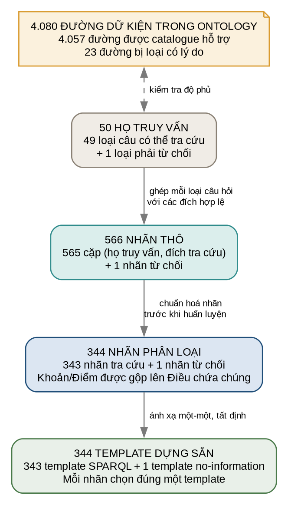
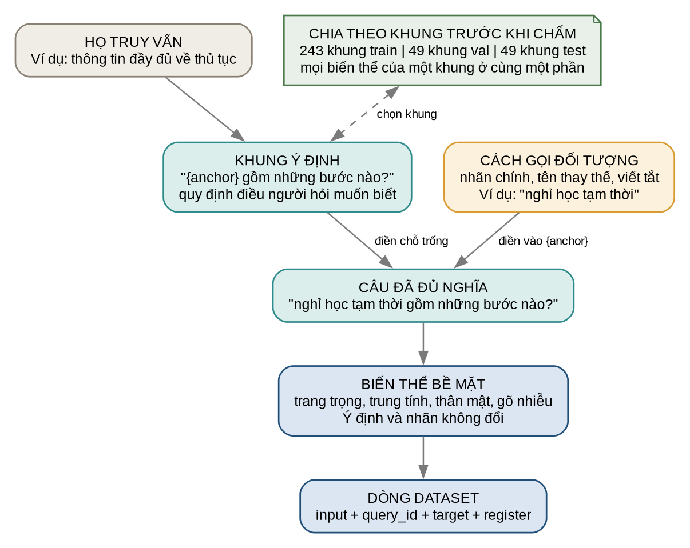

# Chatbot hỏi đáp học vụ dựa trên ontology

Đây là nguyên mẫu nghiên cứu về hỏi đáp học vụ tiếng Việt tại Trường Đại học
Nha Trang. Người dùng đặt câu hỏi tự nhiên; hệ thống xác định nội dung cần tra,
đọc dữ kiện từ ontology bằng truy vấn SPARQL dựng sẵn và dùng mô hình ngôn ngữ
lớn (LLM) để trình bày câu trả lời kèm nguồn.

Nguyên tắc cốt lõi là **LLM không phải nơi lưu quy định**. Nội dung học vụ phải
đến từ ontology. Nếu không tìm thấy dữ kiện phù hợp, hệ thống phải trả trạng thái
**"không có thông tin"**, không tự điền phần còn thiếu.

- [Dùng thử hệ thống](https://ontchatbot.vercel.app/)
- [Mô hình XLM-R dạng ONNX trên Hugging Face Hub](https://huggingface.co/vpthinh19/ntu-ontology-xlmr)
- [Ảnh dịch vụ trên Docker Hub](https://hub.docker.com/r/vpt19/ontchatbot)

README đi theo thứ tự mà một người chưa biết dự án cần để hiểu: bài toán, luồng
hoạt động, hình dạng dữ liệu, ontology, danh mục truy vấn, dataset, thực nghiệm,
kết quả và giới hạn.

## 1. Bài toán nghiên cứu

Thông tin học vụ nằm trong nhiều loại nguồn: quy chế, quyết định, phụ lục, bảng,
biểu mẫu và hướng dẫn trên website. Sinh viên lại thường hỏi bằng từ ngữ đời
thường, viết tắt hoặc thiếu dấu. Ví dụ, "nghỉ một học kỳ" và "bảo lưu kết quả"
có thể cùng chỉ đến thủ tục nghỉ học tạm thời.

Một hệ thống trả lời được câu hỏi đó phải làm ba việc khác nhau:

1. xác định đúng loại thông tin và đối tượng người dùng muốn hỏi;
2. lấy đúng dữ kiện cùng căn cứ từ kho nội dung;
3. diễn đạt lại dễ hiểu mà không thêm thông tin ngoài dữ kiện đã lấy.

Dự án giải bài toán theo **miền đóng**. Bộ phân loại chỉ được chọn trong những
hành động tra cứu đã khai báo trước; nó không tự phát minh truy vấn. Phạm vi hiện
có gồm quy tắc đào tạo, thủ tục học vụ, điều khoản văn bản, biểu mẫu, học phí và
thanh toán, học bổng, chứng chỉ và ngành đào tạo.

Các dữ liệu phụ thuộc từng cá nhân hoặc từng đợt như điểm của một sinh viên, số
tiền phải đóng của một tài khoản, chỉ tiêu và điểm chuẩn không được lưu như một
con số chung. Hệ thống có thể chỉ người dùng đến nơi tra cứu chính thức nếu
ontology có đường dẫn phù hợp.

Nghiên cứu tập trung vào hai câu hỏi:

1. Bộ phân loại nhận diện hành động tra cứu từ các cách hỏi tiếng Việt khác nhau
   chính xác đến đâu?
2. Khi ghép bộ phân loại, ontology và LLM, toàn hệ thống lấy đúng dữ kiện và từ
   chối đúng khi thiếu dữ liệu đến đâu?

Sản phẩm nghiên cứu không phải một thuật toán ontology mới hay một LLM mới. Đóng
góp nằm ở cách tổ chức tài nguyên miền và chuỗi xử lý có thể kiểm tra: nguồn chính
thức -> ontology -> danh mục truy vấn -> nhãn phân loại -> câu trả lời có nguồn.

## 2. Hệ thống hoạt động như thế nào?

### 2.1 Thành phần và trách nhiệm

Ontology là kho dữ kiện dạng đồ thị. SPARQL là ngôn ngữ đọc kho đó, có vai trò
tương tự SQL với cơ sở dữ liệu bảng. Bốn thành phần giữ bốn trách nhiệm:

| Thành phần | Làm gì | Không làm gì |
|---|---|---|
| LLM | đọc câu chat, rút cụm cần tra và diễn đạt kết quả | không phải nguồn quy định |
| Bộ phân loại | nhận chuỗi tiếng Việt, chọn 1 trong 344 nhãn | không viết câu trả lời, không tự sinh SPARQL |
| Danh mục truy vấn | ánh xạ 344 nhãn tới 343 template SPARQL và 1 template `no-information` | không chứa nội dung quy định |
| Ontology | cung cấp dữ kiện và nguồn | không tự hiểu câu chat |

Sơ đồ sau trả lời câu hỏi **"thành phần nào chịu trách nhiệm cho việc gì?"**.
Các mũi tên biểu diễn giao tiếp giữa thành phần, không phải mô tả chi tiết thứ tự
thời gian.


### 2.2 Từ 344 nhãn đến template tương ứng

Đây là cầu nối trực tiếp giữa học máy và ontology:

```text
câu/cụm tiếng Việt
    -> classifier chọn 1 trong 344 nhãn
    -> 343 nhãn tra cứu chọn 343 template SPARQL
    -> 1 nhãn OOD chọn template no-information
    -> thực thi SPARQL trên ontology hoặc trả về từ chối
```

Ánh xạ này là **một-một và tất định**: 344 nhãn nối với 343 template SPARQL và
1 template `no-information`. Cùng một nhãn luôn dẫn đến cùng một template đã
định nghĩa. Model không viết SPARQL; nó chỉ quyết định template nào được chọn.

Ví dụ, nhãn biểu diễn nhu cầu hỏi thông tin về thủ tục nghỉ học tạm thời tương
ứng với template đã chứa đích `:TemporaryAcademicLeaveProcedure`. Khi nhãn này
được chọn, hệ thống thực thi template đó để lấy thuộc tính trực tiếp, bước, điều
kiện, biểu mẫu và nguồn của thủ tục.

Template SPARQL được thực thi trên ontology để lấy dữ kiện và nguồn. Template
`no-information` không chạy SPARQL; nó trả về quyết định từ chối.

### 2.3 Luồng thật của một lượt hỏi

Sơ đồ sau trả lời câu hỏi khác: **"một câu chat thực sự đi qua hệ thống theo thứ
tự nào?"** Đây là luồng chạy trực tuyến, không phải quy trình tạo dataset.


Với câu "Em muốn nghỉ một học kỳ thì phải làm gì?", trình tự là:

1. LLM xác định đây là câu hỏi học vụ và rút cụm như "thủ tục nghỉ học tạm thời".
2. Công cụ chuẩn hoá cụm từ rồi đưa vào bộ phân loại.
3. Bộ phân loại chọn một trong 344 nhãn.
4. Nhãn chọn template SPARQL tương ứng; hệ thống thực thi template trên ontology.
5. Công cụ gom dữ kiện theo đúng nguồn đã khẳng định chúng.
6. LLM dùng dữ kiện đó để viết câu trả lời kèm trích dẫn và URL.

Nếu không có nhãn hoặc dữ kiện phù hợp, kết quả phải nói kho hiện có không có
thông tin. Đây không phải khẳng định thông tin đó không tồn tại ngoài thực tế.

## 3. Hình dạng dữ liệu trong một lượt hỏi

Sơ đồ dưới đây trả lời **"dữ liệu trông như thế nào ở từng bước?"** Nó minh hoạ
sự chuyển đổi biểu diễn trong lúc hệ thống trả lời một câu, không phải kiến trúc
thành phần và cũng không phải cách chia dataset.


| Bước | Hình dạng | Ví dụ rút gọn |
|---|---|---|
| 1. Câu chat | chuỗi tự do | `Em muốn nghỉ một học kỳ thì làm gì?` |
| 2. Cụm tra cứu | một hoặc vài chuỗi ngắn | `thủ tục nghỉ học tạm thời` |
| 3. Nhãn | một trong 344 đầu ra classifier | thông tin về thủ tục nghỉ học tạm thời |
| 4. Template SPARQL | template tương ứng một-một với nhãn | đọc thuộc tính và nút con của thủ tục |
| 5. Kết quả công cụ | các cặp thuộc tính - giá trị, nhóm theo trích dẫn và URL | bước, điều kiện, biểu mẫu, nơi nộp |
| 6. Câu trả lời | văn bản tự nhiên | hướng dẫn cho người dùng kèm nguồn |

Bộ phân loại **nhận một chuỗi tiếng Việt và trả một nhãn**. Trong benchmark,
chuỗi là trường `input` của dataset; khi chạy toàn hệ thống, nó thường là cụm do
LLM rút từ câu chat. Bộ phân loại không viết câu trả lời.

Kết quả công cụ có hai trạng thái nội dung:

```json
{
  "trang_thai": "co_du_lieu",
  "nguon": [
    {
      "trich_dan": "Điều 24 Quy chế đào tạo, ban hành kèm Quyết định 1052/QĐ-ĐHNT",
      "duong_dan": "https://...",
      "du_lieu": [
        {"thuoc_tinh": "biểu mẫu yêu cầu", "gia_tri": "Mẫu số 09"}
      ]
    }
  ]
}
```

hoặc `trang_thai` cho biết **"không có thông tin"** và danh sách nguồn rỗng.

## 4. Ontology

Tệp [`resources/ontology/ontology.ttl`](resources/ontology/ontology.ttl) là cơ sở
dữ liệu nội dung duy nhất mà công cụ đọc khi chạy. Văn bản chính thức vẫn là căn
cứ có thẩm quyền; ontology chỉ là bản biểu diễn có cấu trúc của phần nội dung đã
được chọn vào phạm vi nghiên cứu.

### 4.1 Đọc các khái niệm cơ bản trước khi xem ví dụ

Ontology dùng namespace:

```text
http://www.ntu.edu.vn/ontology/academic#
```

**IRI** là định danh duy nhất của một mục trong đồ thị. Ví dụ, IRI đầy đủ của thủ
tục nghỉ học tạm thời là:

```text
http://www.ntu.edu.vn/ontology/academic#TemporaryAcademicLeaveProcedure
```

Trong tệp Turtle, tiền tố `:` thay cho phần namespace dài, nên IRI trên được viết
gọn thành `:TemporaryAcademicLeaveProcedure`. Đây là mã dành cho máy; nhãn tiếng
Việt trong `rdfs:label` mới là tên hiển thị cho người dùng.

Bốn khái niệm tạo nên giải phẫu của ontology:

| Khái niệm | Bản chất | Ví dụ |
|---|---|---|
| Lớp | loại hoặc khuôn khái niệm dùng để phân nhóm | `:AcademicProcedure` là lớp thủ tục học vụ |
| Cá thể | một đối tượng cụ thể thuộc một hoặc nhiều lớp | `:TemporaryAcademicLeaveProcedure` là một thủ tục cụ thể |
| Object property | quan hệ nối một đối tượng với đối tượng khác | `:requiresForm` nối thủ tục với biểu mẫu |
| Datatype property | thuộc tính nối đối tượng với giá trị chữ, số, ngày hoặc URL | `:stepText` nối một bước với nội dung chữ |

RDF lưu tri thức thành các phát biểu ba vế, thường gọi là **triple**:

```text
chủ thể -> quan hệ/thuộc tính -> đối tượng hoặc giá trị
```

Ví dụ `thủ tục nghỉ học tạm thời -> yêu cầu biểu mẫu -> Mẫu số 09` là một triple.
Nhiều triple cùng nói về một IRI tạo thành mô tả có cấu trúc của đối tượng đó.

### 4.2 Một thủ tục được biểu diễn ra sao?

Đoạn rút gọn sau lấy từ ontology thật:

```turtle
:TemporaryAcademicLeaveProcedure a :AcademicProcedure ;
    :basedOn :Regulation1052Article24 ;
    :hasRequirement :TemporaryLeavePersonalRequirement ;
    :hasStep :TemporaryLeaveStep01, :TemporaryLeaveStep02 ;
    :requiresForm :Form09TemporaryLeave ;
    :submittedTo :StudentAffairsOffice ;
    :summaryText "Thủ tục cho phép sinh viên tạm dừng việc học và bảo lưu kết quả đã tích lũy."@vi ;
    rdfs:label "Thủ tục nghỉ học tạm thời"@vi .
```

Cách đọc đoạn này:

- `a :AcademicProcedure`: đối tượng này thuộc lớp thủ tục học vụ;
- `basedOn`: căn cứ gần nhất là Điều 24 của Quy chế 1052;
- `hasRequirement`: thủ tục có một nút điều kiện riêng;
- `hasStep`: thủ tục có hai nút bước riêng, mỗi bước còn có thứ tự và nội dung;
- `requiresForm`: biểu mẫu được yêu cầu là Mẫu số 09;
- `submittedTo`: đơn vị tiếp nhận là Phòng Công tác Chính trị và Sinh viên;
- `summaryText` và `rdfs:label`: giá trị chữ dùng để mô tả và hiển thị.

Việc tách bước, điều kiện, biểu mẫu và đơn vị thành các nút riêng giúp truy vấn
đúng loại dữ kiện thay vì buộc LLM tự tách ý từ một đoạn văn dài. Cấu trúc này
không có nghĩa mọi thủ tục đều phải có đủ cùng một bộ thuộc tính; ontology chỉ
khai những gì nguồn được chọn có căn cứ để khẳng định.

### 4.3 Hai tầng của ontology

Sơ đồ sau trả lời **"ontology được tổ chức thành những loại đối tượng nào?"**.
Các con số trong ngoặc là số đối tượng thuộc từng loại, không phải điểm chất
lượng và không phải số câu hỏi dataset.


| Tầng | Lưu gì | Dùng để làm gì |
|---|---|---|
| Văn bản | quyết định, quy chế, chương, điều, khoản, điểm, phụ lục, mục và bảng | giữ nguyên văn cùng vị trí trích dẫn |
| Nghiệp vụ | thủ tục, bước, điều kiện, thời hạn, kết quả, biểu mẫu, quy tắc, chứng chỉ và ngành | biểu diễn trực tiếp điều người dùng thường muốn tra |

Quan hệ `basedOn` nối một nút nghiệp vụ với phần văn bản được dùng làm căn cứ.
Ví dụ, cả thủ tục có thể dựa trên Điều 24, còn điều kiện vì lý do cá nhân dẫn
chính xác hơn đến điểm d khoản 1 Điều 24. Khi chạy, hệ thống đi theo quan hệ này
để gắn `sourceCitation` và `sourceLink` vào kết quả.

`basedOn` thể hiện lựa chọn biên soạn có thể kiểm tra, không tự chứng minh lựa
chọn đó đúng về pháp lý. Nếu ontology mâu thuẫn với văn bản chính thức, văn bản
chính thức được ưu tiên và ontology là tài nguyên phải được sửa.

### 4.4 Ontology được tạo từ nguồn như thế nào?

Quy trình biên soạn có năm bước về bản chất:

1. **Chọn nguồn và phạm vi:** chọn văn bản hoặc trang chính thức liên quan đến
   loại câu hỏi cần hỗ trợ; ghi số hiệu, ngày và URL.
2. **Biểu diễn tầng văn bản:** tách nội dung theo Chương, Điều, Khoản, Điểm, phụ
   lục và bảng. Bảng nhiều tầng hoặc có ô rỗng được giữ nguyên khối Markdown để
   tránh làm lệch ý nghĩa hàng và cột.
3. **Trừu tượng hoá nghiệp vụ:** đọc nguồn và biểu diễn các khái niệm như thủ tục,
   bước, điều kiện, thời hạn và biểu mẫu bằng lớp, cá thể và thuộc tính chung.
4. **Nối căn cứ:** mỗi nút nghiệp vụ mang nội dung trả lời được nối đến phần văn
   bản nhỏ nhất có thể chứng minh nó.
5. **Kiểm định:** kiểm lược đồ, nhãn, quan hệ nguồn, thứ tự bước, ngưỡng số, bảng,
   đích truy vấn và độ phủ của danh mục.

Bước 3 là quá trình biên soạn thủ công, không phải kết quả trích xuất hoàn toàn
tự động. Đây vừa là lý do ontology biểu diễn được quan hệ nghiệp vụ cụ thể, vừa
là nguồn rủi ro diễn giải chủ quan cần được rà soát độc lập.

### 4.5 Mười bảy bản ghi nguồn là những gì?

Con số 17 là số **tài nguyên nguồn được khai trong ontology**, không phải 17 văn
bản pháp quy cùng loại. Chúng gồm 6 quyết định, 3 quy chế ban hành kèm và 8 trang
hoặc hướng dẫn chính thức.

| Nhóm | Nguồn | Nội dung được sử dụng |
|---|---|---|
| Quyết định | Quyết định 1052/QĐ-ĐHNT, 17/07/2025 | ban hành quy chế đào tạo đại học |
| Quyết định | Quyết định 1965/QĐ-ĐHNT, 19/12/2025 | sửa đổi, bổ sung phụ lục quy chế đào tạo |
| Quyết định | Quyết định 317/QĐ-ĐHNT, 07/03/2025 | mức học bổng khuyến khích học tập |
| Quyết định | Quyết định 626/QĐ-ĐHNT, 29/04/2026 | ban hành quy chế tuyển sinh đại học |
| Quyết định | Quyết định 729/QĐ-ĐHNT, 28/05/2025 | học phí năm học 2025-2026 và danh mục ngành |
| Quyết định | Quyết định 753/QĐ-ĐHNT, 13/08/2021 | phần quy định được dùng khi nội dung mới không thay thế tương ứng |
| Quy chế | Quy chế ban hành kèm Quyết định 1052 | quy tắc đào tạo, thủ tục và phụ lục |
| Quy chế | Quy chế ban hành kèm Quyết định 626 | tuyển sinh và phụ lục tuyển sinh |
| Quy chế | Quy chế ban hành kèm Quyết định 753 | phần quy định cũ còn được dự án sử dụng |
| Web/hướng dẫn | Trang thông tin tuyển sinh, lấy ngày 15/08/2026 | địa chỉ tra cứu tuyển sinh |
| Web/hướng dẫn | Trang Cơ cấu tổ chức, lấy ngày 14/08/2026 | danh sách đơn vị của trường |
| Web/hướng dẫn | Trang tiêu chuẩn học bổng, lấy ngày 10/08/2026 | tiêu chuẩn xét học bổng |
| Web/hướng dẫn | Thông báo danh sách dự kiến học bổng, lấy ngày 10/08/2026 | công bố, phản hồi và nhận học bổng |
| Web/hướng dẫn | Cổng thông tin sinh viên, lấy ngày 15/08/2026 | địa chỉ tra cứu học phí cá nhân |
| Web/hướng dẫn | Thông báo cách nộp học phí, lấy ngày 10/08/2026 | phương thức và phí thanh toán |
| Web/hướng dẫn | Hướng dẫn VNPAY - Vietcombank, lấy ngày 10/08/2026 | thao tác và lưu ý phí giao dịch |
| Web/hướng dẫn | Danh mục biểu mẫu Phòng Đào tạo Đại học, lấy ngày 30/07/2026 | tên và đường tải biểu mẫu |

Ngày lấy trang web xác định phiên bản nội dung đã được dùng. Nó không chứng minh
trang đó vẫn không đổi tại thời điểm người dùng đặt câu hỏi. Bản sao phục vụ đối
chiếu nằm trong [`references/`](references/), nhưng mức bao phủ bản sao cục bộ
không đồng nhất cho cả 17 nguồn.

### 4.6 Các con số giải phẫu có ý nghĩa gì?

Các số dưới đây được đếm từ snapshot hiện hành. Chúng mô tả **quy mô và cấu
trúc**, không đo độ đúng, độ đầy đủ hay hiệu quả của hệ thống.

| Thành phần | Số lượng | Nó là gì và tồn tại để làm gì? |
|---|---:|---|
| Lớp | 56 | bộ từ vựng về loại đối tượng, như thủ tục, điều kiện, điều khoản |
| Cá thể có tên | 685 | các đối tượng cụ thể được truy vấn hoặc dùng làm cấu trúc nguồn |
| Object property | 29 | các loại quan hệ nối hai đối tượng, như `hasStep`, `basedOn` |
| Datatype property | 55 | các loại thuộc tính mang chữ, số, ngày hoặc URL |
| `officialText` | 320 | các đoạn nguyên văn gắn với phần văn bản |
| `verbatimTableText` | 16 | các bảng giữ nguyên cấu trúc thay vì tách thành ô độc lập |
| `basedOn` | 368 | các liên kết từ nội dung nghiệp vụ đến căn cứ văn bản |
| Triple viết trong `ontology.ttl` | 6.350 | toàn bộ phát biểu được khai trực tiếp trong tệp Turtle |
| Triple khi chạy | 7.704 | đồ thị sau khi bổ sung thông tin nguồn dẫn xuất |

Chênh lệch 1.354 triple không phải 1.354 quy định mới. Có 677 nút được bổ sung
hai thuộc tính tiện tra cứu là `sourceCitation` và `sourceLink`, nên phát sinh
`677 x 2 = 1.354` triple khi nạp ontology.

### 4.7 Kiểm định ontology chứng minh được gì?

Các phép kiểm tự động xác nhận những tính chất có thể kiểm bằng mã:

- lớp và thuộc tính được khai báo theo lược đồ;
- cá thể có nhãn và các tên dùng để tra không xung đột theo quy tắc hiện có;
- các nhóm nút nghiệp vụ chính có căn cứ;
- bước, điều kiện và thứ tự không bị tách khỏi thủ tục;
- các bảng được kiểm giữ đúng ký tự so với nguồn Markdown tương ứng;
- mọi đích trả lời được trong dataset tạo được truy vấn có kết quả;
- danh mục bao phủ mọi đường dữ kiện đã đánh dấu là được hỗ trợ.

Các phép kiểm đó **không** chứng minh tập nguồn đầy đủ, mọi diễn giải đều đúng về
pháp lý, nguồn web còn hiệu lực hay LLM luôn trình bày trung thực. Mô hình dữ liệu
chi tiết hơn nằm tại [`docs/ONTOLOGY.md`](docs/ONTOLOGY.md).

## 5. Danh mục truy vấn: cầu nối giữa ontology và bộ phân loại

Ontology có hàng nghìn đường đi đến dữ kiện. Không thể coi mỗi triple là một loại
câu hỏi, và cũng không nên để mô hình tự viết đường đi bất kỳ. Vì vậy dự án dùng
[`catalogue.jsonl`](resources/ontology/catalogue.jsonl) làm hợp đồng trung gian
giữa nhãn và template, tức khuôn truy vấn đã định nghĩa sẵn.

### 5.1 Bốn đơn vị thường bị nhầm với nhau

| Đơn vị | Định nghĩa | Ví dụ |
|---|---|---|
| Họ truy vấn | một nhóm nhu cầu có cùng loại dữ kiện cần đọc | hỏi toàn bộ thông tin của một thủ tục |
| Nhãn thô | một họ truy vấn ghép với đích cụ thể | thông tin thủ tục + nghỉ học tạm thời |
| Nhãn phân loại | một đầu ra của model, ánh xạ tới đúng một template | một trong 344 nhãn |
| Đường dữ kiện | đường từ một đối tượng qua quan hệ đến giá trị trả lời được | thủ tục -> `hasStep` -> `stepText` |

Sơ đồ cho thấy quan hệ giữa các con số. Ba số đầu mô tả không gian quyết định
của bộ phân loại; 4.080 là kiểm kê nội dung ontology nên không cộng vào số nhãn.



Cụ thể:

1. **344 nhãn** là giao diện chính của classifier: 343 nhãn nối với 343 template
   SPARQL, nhãn OOD còn lại nối với template `no-information`.
2. **50 họ truy vấn** chỉ dùng để nhóm các nhãn theo loại nhu cầu: 49 họ lấy dữ
   liệu và một họ từ chối. Chúng không phải 50 model hay 50 đầu ra runtime.
3. Trước bước chuẩn hoá không gian nhãn, dataset có **566 nhãn thô**: 565 cặp
   `(query_id, target)` trả lời được và 1 nhãn `no-information`.
4. Các đích là Khoản hoặc Điểm được gộp lên Điều chứa chúng, tạo ra 344 nhãn dùng
   cho classifier: 343 template SPARQL và 1 template `no-information` tương ứng.
5. Riêng việc kiểm kê ontology tìm thấy **4.080 đường dữ kiện**. Danh mục hỗ trợ
   4.057 đường; 23 đường bị loại có lý do. Đây là số khả năng đọc dữ kiện, không
   phải số câu hỏi hay số nhãn.

Ví dụ, họ `academic-procedure-facts` bao gồm 24 thủ tục hợp lệ. Mỗi thủ tục tạo
một nhãn riêng và nhãn đó tương ứng với một template SPARQL riêng. Nhãn dành cho
`:TemporaryAcademicLeaveProcedure` vì thế không thể dẫn sang template của thủ
tục chuyển ngành hoặc một đối tượng ngoài catalogue.

Việc gộp Khoản và Điểm làm giảm số nhãn ít mẫu, nhưng đổi lại giảm độ chính xác
của điểm đến: câu hỏi về một Điểm có thể lấy cả Điều chứa nó. LLM sau đó phải
chọn chi tiết liên quan trong dữ liệu trả về.

Trong 23 đường không đưa vào khả năng tra cứu có 16 bản `officialText` phẳng của
bảng, 6 nhãn kỹ thuật của bản ghi ngưỡng và 1 quan hệ biểu mẫu không có căn cứ
tương ứng. Việc một đường được hỗ trợ chỉ chứng minh công cụ **có thể đọc** nó;
nó không chứng minh bộ phân loại sẽ luôn chọn đúng nhãn.

## 6. Tập dữ liệu

Dataset là snapshot bất biến dùng cho các kết quả báo cáo trong README. Sơ đồ
dưới đây mô tả chuỗi xây dựng tài nguyên và đánh giá ngoại tuyến. Nó không phải
luồng chạy của một câu chat; luồng trực tuyến nằm ở mục 2.2.


### 6.1 Dataset dạy điều gì?

Dataset không dạy nội dung quy chế và không chứa câu trả lời hoàn chỉnh. Nó dạy
bộ phân loại ánh xạ **câu/cụm tiếng Việt -> nhãn tra cứu**.

Mỗi dòng JSONL là một đối tượng JSON độc lập:

```json
{
  "id": "question-000013",
  "query_id": "academic-actor-facts",
  "register": "noisy",
  "input": "co van hoc tap la ai",
  "target": [":AcademicAdvisor"]
}
```

| Trường | Ý nghĩa |
|---|---|
| `id` | mã duy nhất của dòng |
| `input` | chuỗi tiếng Việt đưa vào bộ phân loại |
| `query_id` | họ truy vấn mô tả loại thông tin cần lấy |
| `target` | danh sách IRI được điền vào khuôn; rỗng nếu phải từ chối |
| `register` | phong cách bề mặt: `formal`, `neutral`, `colloquial` hoặc `noisy` |

Cặp `(query_id, target)` là nhãn thô. Dataset không lưu chuỗi SPARQL vì logic
truy vấn thuộc về catalogue, không thuộc câu hỏi huấn luyện.

### 6.2 "Khung" là gì và vì sao có khung riêng theo họ?

Một **khung ý định** là mẫu câu quy định người hỏi muốn biết **khía cạnh nào**.
Nó không phải một người dùng, một đối tượng ontology hay một dòng dữ liệu hoàn
chỉnh.

Ví dụ với họ dùng lại cho nhiều thủ tục:

```text
{anchor} gồm những bước nào?
```

`{anchor}` là chỗ trống. Nó có thể được điền bằng "nghỉ học tạm thời", "chuyển
ngành" hoặc tên một thủ tục khác. Khung giữ ý "hỏi các bước"; tên được điền giữ
đối tượng cụ thể.

Không phải họ nào cũng có chỗ trống. Ví dụ
`certificate-conversion-table-english-language-major-student` luôn hỏi đúng bảng
quy đổi ngoại ngữ thứ hai dành cho sinh viên ngành Ngôn ngữ Anh. Quy định nguồn
chia bảng theo nhóm đối tượng, nên phạm vi "sinh viên ngành Ngôn ngữ Anh" là một
phần của loại truy vấn và đích đã cố định là
`:SecondLanguageConversionTableEnglishMajor`. Vì thế khung của họ này không có
`{anchor}`. Đây **không phải khung riêng cho một sinh viên**; nó là khung cho một
bảng chính thức có phạm vi áp dụng riêng.

Tệp [`resources/provenance/frames.jsonl`](resources/provenance/frames.jsonl) có
49 dòng, mỗi dòng ứng với một họ trả lời được. Tổng cộng có 341 khung:

- 294 khung câu đầy đủ trong trường `frames`;
- 47 khung ngắn trong trường `short_frames` để biểu diễn truy vấn rất ngắn;
- mỗi họ có từ 6 đến 11 khung sau khi tính cả hai loại.

Sơ đồ sau chỉ mô tả **quá trình hình thành câu hỏi có nhãn**, không phải luồng xử
lý một câu chat khi hệ thống đang chạy.



Câu trả lời được hình thành từ ba trục:

1. **Ý định:** họ truy vấn và khung xác định điều cần hỏi.
2. **Cách gọi đối tượng:** `rdfs:label`, `skos:altLabel`, tên viết tắt hoặc tọa độ
   Điều/Khoản/Điểm từ ontology xác định đối tượng được nhắc đến.
3. **Biến thể bề mặt:** từ dẫn, đuôi câu, cách nói tương đương, viết hoa và nhiễu
   có kiểm soát thay đổi cách viết nhưng không đổi nhãn.

Ba dạng nhiễu chính là bỏ dấu, viết dính từ và thay một ký tự bằng phím lân cận.
Nhãn `register` mô tả cách dataset được thiết kế; nó không phải kết quả khảo sát
tần suất ngôn ngữ thật của sinh viên.

### 6.3 Câu phải từ chối được tạo để kiểm tra điều gì?

Dataset có 829 câu mang nhãn `no-information`. Chúng không phải một khối "câu
ngoài chủ đề" duy nhất mà gồm bảy tình huống:

| Lớp | Số câu | Rủi ro được kiểm tra |
|---|---:|---|
| `hard-negative` | 163 | có tên đối tượng thật nhưng hỏi thuộc tính không được lưu |
| `near-domain-missing` | 151 | gần phạm vi học vụ nhưng thiếu dữ kiện cần trả |
| `unrelated` | 115 | chủ đề không thuộc học vụ |
| `noisy-out-of-domain` | 109 | câu ngoài miền kèm thiếu dấu hoặc lỗi gõ |
| `incomplete-request` | 108 | không nêu đủ đối tượng hoặc nội dung cần hỏi |
| `greeting-social` | 94 | giao tiếp xã hội, không phải yêu cầu dữ kiện |
| `adjacent-domain` | 89 | nghiệp vụ lân cận nhưng ontology chưa hỗ trợ |

Các khuôn gốc nằm tại
[`resources/provenance/rejections.jsonl`](resources/provenance/rejections.jsonl).
[`rejection_checklist.json`](resources/provenance/rejection_checklist.json) định
nghĩa bảy lớp bắt buộc; [`rejection_provenance.json`](resources/provenance/rejection_provenance.json)
nối từng dòng từ chối với lớp và khuôn của nó.

Một nhóm khác tên `distraction` chỉ thêm vế ngoài lề vào câu vẫn có nhu cầu học
vụ rõ ràng. Các câu đó vẫn phải được trả lời, không được gán nhãn từ chối chỉ vì
có từ gây nhiễu.

### 6.4 Dataset được chia theo tiêu chí nào?

Tiêu chí chính là **chia theo khung, không chia ngẫu nhiên theo dòng**:

- với mỗi họ trả lời được, một khung được giữ cho `val`, một khung cho `test`,
  các khung còn lại cho `train`;
- tổng số khung là 243 cho `train`, 49 cho `val` và 49 cho `test`;
- mọi biến thể sinh từ cùng một khung phải ở cùng một phần;
- đối tượng và đích tra cứu vẫn xuất hiện trong `train`; thứ được giữ lại là cách
  diễn đạt, không phải kiến thức mới.

Cách chia này nhằm trả lời câu hỏi: **khi đích cần tra đã được học, model có nhận
ra cách hỏi khác hay không?** Nó không phải phép thử zero-shot cho thực thể hoặc
quy định chưa từng xuất hiện.

Đối với câu từ chối, mỗi tổ hợp của 7 lớp và 4 register đều có mặt trong
`train`, `val` và `test`. Các kiểm tra còn xác nhận không có câu trùng giữa các
phần sau khi so nguyên văn, chuẩn hoá khoảng trắng/viết tắt và bỏ dấu; cùng một
câu đã chuẩn hoá cũng không được gán hai đích khác nhau.

### 6.5 Quy mô snapshot


| Phần | Trả lời được | Từ chối | Tổng | Vai trò |
|---|---:|---:|---:|---|
| `train` | 4.793 | 730 | 5.523 | học tham số |
| `val` | 350 | 50 | 400 | theo dõi quá trình huấn luyện |
| `test` | 341 | 49 | 390 | báo kết quả sau khi cố định thiết lập |
| **Toàn bộ** | **5.484** | **829** | **6.313** | snapshot bất biến |

Các tệp chính là [`train.jsonl`](resources/dataset/train.jsonl),
[`val.jsonl`](resources/dataset/val.jsonl) và
[`test.jsonl`](resources/dataset/test.jsonl). Bản kê
[`manifest.json`](resources/dataset/manifest.json) ghi số dòng, phạm vi và mã băm
SHA-256 để nhận diện chính xác snapshot.

Phân bố theo miền và register là quyết định thiết kế, không phải ước lượng phân
bố sử dụng ngoài thực tế. Câu có độ dài từ 1 đến 36 từ, trung vị 11 từ và p95 là
21 từ. Chi tiết phương pháp nằm tại [`docs/DATASET.md`](docs/DATASET.md).

## 7. Thiết lập thực nghiệm

### 7.1 Hai phép chấm đo hai đối tượng khác nhau

| Phép chấm | Đầu vào | Đầu ra được chấm | Câu hỏi mà phép chấm trả lời |
|---|---|---|---|
| Chấm bộ phận, hay **phép đo từng phần** | một câu/cụm tiếng Việt | 1 trong 344 nhãn | bộ phân loại chọn đúng hành động tra cứu không? |
| Chấm `end-to-end` | một câu chat | câu trả lời tự do do LLM viết | toàn hệ thống có tra đúng, trả đúng và từ chối đúng không? |

Hai tỷ lệ không thể thay thế cho nhau. Nhãn đúng chưa bảo đảm LLM sẽ gọi công
cụ hoặc diễn đạt đúng; câu trả lời đúng đôi khi vẫn có thể xuất hiện dù đường đi
không đúng như nhãn chuẩn.

### 7.2 Các mô hình phân loại

Bốn encoder tiền huấn luyện được fine-tune cho cùng bài toán. Mốc so sánh duy
nhất là **TF-IDF + LinearSVC**. Từ "baseline" trong dự án chỉ mô hình này, không
chỉ một phiên bản phần mềm hay một trạng thái cũ của project.

| Tên báo cáo | Model ID hoặc phương pháp | Vai trò |
|---|---|---|
| XLM-R base | `FacebookAI/xlm-roberta-base` | encoder đa ngữ |
| BamiBERT | `Qualcomm-AI-Research/BamiBERT` | encoder đa ngữ |
| ViSoBERT | `uitnlp/visobert` | encoder hướng tới tiếng Việt mạng xã hội |
| PhoBERT-v2 | `vinai/phobert-base-v2` | encoder tiếng Việt |
| TF-IDF + LinearSVC | n-gram ký tự 2-5, n-gram từ 1-2, LinearSVC | baseline tuyến tính không dùng encoder tiền huấn luyện |

N-gram ký tự giúp baseline giữ một phần tín hiệu khi câu thiếu dấu hoặc sai
chính tả.

### 7.3 Điều kiện huấn luyện và chấm bộ phận

Cả năm mô hình dùng cùng `train`, `val` và `test`. Bốn encoder dùng:

- LoRA hạng 16 và một lớp phân loại học mới;
- độ dài tối đa 48 token, batch 32, learning rate `2e-4`;
- 32 epoch, seed 1; checkpoint sau epoch cuối được chấm trên `test`.

TF-IDF + LinearSVC được huấn luyện một lần trên `train`. `val` dùng để theo dõi
quá trình học; `test` chỉ dùng để báo kết quả cuối. Do mỗi cấu hình mới có một
seed, bảng kết quả chưa cho biết độ dao động giữa nhiều lần huấn luyện.


Loss đo mức dự đoán lệch khỏi nhãn đúng, càng thấp càng tốt. Đường train cho biết
model khớp dữ liệu đã học đến đâu; đường validation cho biết mức khớp trên cách
hỏi không dùng để cập nhật tham số. Loss là tín hiệu chẩn đoán quá trình học,
không phải tỷ lệ câu trả lời đúng.

Mỗi câu `test` được tính đúng khi nhãn dự đoán khớp hoàn toàn nhãn chuẩn sau gộp.
Các chỉ số được hiểu như sau:

| Chỉ số | Cách đọc |
|---|---|
| Accuracy | tỷ lệ câu trong toàn bộ `test` có nhãn đúng |
| Precision của một nhãn | trong các câu model gán nhãn đó, bao nhiêu câu thật sự thuộc nhãn |
| Recall của một nhãn | trong các câu thật sự thuộc nhãn đó, model tìm đúng bao nhiêu |
| F1 của một nhãn | trung bình điều hoà giữa precision và recall |
| Macro precision/recall/F1 | tính từng nhãn rồi cho mọi nhãn trọng số bằng nhau; nhạy với nhãn ít mẫu |
| Weighted F1 | trung bình F1 theo số câu của từng nhãn; nhãn nhiều mẫu có ảnh hưởng lớn hơn |

Các phân tích theo miền, register và số mẫu chỉ dùng để tìm điểm yếu; nhóm ít câu
không đủ ổn định để xếp hạng model.

### 7.4 Cách chấm toàn hệ thống

Bộ `end-to-end` có 85 câu độc lập với phép chấm nhãn:

- 61 câu có dữ kiện cần trả trong ontology;
- 14 câu ngoài phạm vi;
- 10 câu hỏi đúng chủ đề nhưng nhắm vào khoảng trống của ontology.

Hai nhóm cuối tạo thành 24 câu **phải từ chối**. Chúng được báo riêng với 61 câu
phải trả lời vì tiêu chí thành công trái ngược nhau.

Câu trả lời cuối là văn bản tự do: nhiều cách diễn đạt khác nhau đều có thể đúng,
nên không tồn tại một chuỗi tham chiếu duy nhất để so khớp chính xác. Vì vậy một
LLM khác đóng vai trò bộ chấm. Với mỗi lượt, bộ chấm đọc đồng thời:

1. câu hỏi;
2. JSON dữ kiện và nguồn mà công cụ đã trả;
3. câu trả lời cuối của hệ thống.

Đối với 61 câu có dữ kiện, nhãn chấm gồm:

| Nhãn | Tiêu chí |
|---|---|
| `correct` | trả đúng điều được hỏi và mọi dữ kiện nêu ra được dữ liệu công cụ hỗ trợ |
| `partial` | trả được một phần; phần đã trả có căn cứ nhưng còn thiếu ý cần thiết |
| `refusal` | không trả lời và nói rằng không có dữ liệu hoặc không thể xác định |
| `wrong` | nêu dữ kiện sai hoặc tạo quan hệ mà dữ liệu không khẳng định |
| `lost` | lạc đề, không trả lời và cũng không từ chối rõ ràng |

Đối với 24 câu phải từ chối, từ chối rõ ràng là kết quả đúng; đưa ra một câu trả
lời nội dung là lỗi an toàn.

LLM judge được bổ sung bằng ba kiểm tra tất định: có gọi công cụ không, dữ liệu
có chứa đúng IRI đích không, và số/tên trong câu trả lời có xuất hiện trong dữ
liệu vừa lấy không. Kiểm tra tất định giúp phát hiện mâu thuẫn nhưng không tự đọc
được toàn bộ ý nghĩa ngôn ngữ, nên không thay thế bộ chấm nội dung.

Thời gian `end-to-end` được đo từ lúc nhận câu chat đến lúc có câu trả lời cuối,
bao gồm gọi LLM qua mạng. Trung vị mô tả lượt điển hình; p95 là ngưỡng mà 95%
lượt không vượt quá.

## 8. Kết quả thực nghiệm

Các số trong mục này là kết quả mới nhất được báo cáo cho các mô hình đã công
bố. Trọng số XLM-R phục vụ nằm trên Hugging Face Hub và được đóng vào ảnh Docker;
repository mã nguồn không lưu các tệp model nặng.

### 8.1 Kết quả bộ phân loại trên 390 câu `test`


| Mô hình | Accuracy | Precision macro | Recall macro | F1 macro | F1 weighted |
|---|---:|---:|---:|---:|---:|
| XLM-R base | **85,1%** | 78,2% | 83,4% | 79,7% | **82,6%** |
| BamiBERT | 83,6% | **78,8%** | **84,1%** | **80,1%** | 82,0% |
| ViSoBERT | 82,1% | 76,9% | 81,6% | 77,8% | 80,3% |
| PhoBERT-v2 | 80,5% | 74,4% | 79,5% | 75,6% | 78,5% |
| TF-IDF + LinearSVC | 80,3% | 74,4% | 79,5% | 75,6% | 78,3% |

XLM-R có accuracy cao nhất và hơn TF-IDF + LinearSVC 4,8 điểm phần trăm. BamiBERT
có macro precision, macro recall và macro F1 cao nhất. Hai kết luận không mâu
thuẫn: accuracy cho mỗi câu một phiếu, còn macro cho mỗi nhãn một phiếu.

Do chỉ có một lượt chạy cho mỗi cấu hình và chưa có khoảng tin cậy, bảng đủ để
mô tả kết quả quan sát được nhưng chưa đủ để khẳng định chênh lệch nhỏ giữa các
encoder sẽ ổn định khi huấn luyện lại.

Tách hai quyết định trả lời và từ chối:

| Mô hình | Câu trả lời được, 341 câu | Câu phải từ chối, 49 câu | Thời gian huấn luyện |
|---|---:|---:|---:|
| XLM-R base | 294/341, 86,2% | 38/49, 77,6% | 186 s |
| BamiBERT | 294/341, 86,2% | 32/49, 65,3% | 182 s |
| ViSoBERT | 287/341, 84,2% | 33/49, 67,3% | 240 s |
| PhoBERT-v2 | 279/341, 81,8% | 35/49, 71,4% | 181 s |
| TF-IDF + LinearSVC | 282/341, 82,7% | 31/49, 63,3% | 4 s |

Cột trái đo chọn đúng nội dung khi có thể trả lời. Cột phải đo nhận đúng nhãn
từ chối. Cột phải chỉ có 49 câu và các câu đến từ bảy lớp thiết kế, nên không
phải một ước lượng chắc chắn cho mọi câu ngoài phạm vi ngoài thực tế.

### 8.2 Kết quả thay đổi theo loại câu hỏi


Có 57/344 nhãn chỉ có dưới 5 câu trong `train`. Hai nhóm ít mẫu nhất trong hình
chỉ chứa tổng cộng 9 câu `test`, nên hình cho thấy rủi ro nhãn thưa chứ không đủ
để xếp hạng model ở các nhóm đó.

Với XLM-R, accuracy giảm từ 94,9% ở câu trang trọng xuống 69,8% ở câu gõ nhiễu.
Theo miền, giá trị cao nhất là chứng chỉ 93,5% trên 31 câu và thấp nhất là học
phí 72,0% trên 25 câu. Các mẫu số nhỏ và khác nhau, nên đây là tín hiệu tìm lỗi,
không phải bảng xếp hạng độ khó tuyệt đối.

### 8.3 Kết quả `end-to-end`

Mục 8.1 chấm bộ phân loại. Mục này chấm toàn bộ chuỗi từ câu chat đến câu trả
lời do LLM viết.

Với 61 câu phải trả lời, các kiểm tra tất định cho kết quả:

| Tiêu chí | Kết quả | Ý nghĩa giới hạn |
|---|---:|---|
| Có gọi công cụ | 57/61, 93,4% | chỉ biết hệ thống đã tra, chưa biết tra đúng |
| Dữ liệu lấy về có đúng IRI đích | 48/61, 78,7% | đo đúng đối tượng, chưa chấm cách diễn đạt |
| Số và tên trong câu trả lời có mặt trong dữ liệu | 59/61, 96,7% | kiểm bám chuỗi, không hiểu mọi quan hệ ngữ nghĩa |
| Vừa đúng đích, vừa qua kiểm tra bám dữ liệu | 47/61, 77,0% | điều kiện kết hợp tất định |

LLM judge chấm cùng 61 câu:

| Nhãn chấm | Kết quả |
|---|---:|
| Đúng hoàn toàn | 48/61, 78,7% |
| Từ chối dù câu có dữ kiện | 11/61, 18,0% |
| Đúng một phần | 2/61, 3,3% |
| Sai | 0/61 |
| Lạc đề | 0/61 |

Với 24 câu phải từ chối:

| Kết quả | Số câu |
|---|---:|
| Từ chối đúng | 21/24, 87,5% |
| Vẫn trả lời | 3/24, 12,5% |

Ba lỗi ở nhóm phải từ chối cho thấy một giới hạn quan trọng: LLM có thể nhận hai
dữ kiện đều tồn tại rồi nối chúng thành quan hệ mà ontology không khẳng định.
Vì vậy "có nguồn" không đồng nghĩa mọi kết luận trong câu trả lời đều được nguồn
hỗ trợ.

Có 6/85 phán quyết của LLM judge mâu thuẫn với ít nhất một tín hiệu tất định và
đã được đánh dấu để rà lại. Chín trường hợp trải trên các mức chấm đã được đọc
thủ công và đều đồng ý với judge, nhưng đây chỉ là kiểm tra mẫu, không phải hai
người chấm độc lập. Kết quả `end-to-end` vì vậy nên được đọc như ước lượng trên
85 tình huống cố định.

Nhật ký cho phép đối chiếu câu hỏi, dữ liệu công cụ, câu trả lời và lý do chấm tại
[`resources/end-to-end/quality-log.md`](resources/end-to-end/quality-log.md).

### 8.4 Thời gian phản hồi

| Phạm vi đo | Trung vị | p95 | Ghi chú |
|---|---:|---:|---|
| Toàn bộ 85 lượt `end-to-end` | 2,5 s | 4,8 s | gồm LLM qua mạng; min 0,7 s, max 6,9 s |
| 76 lượt có tra cứu | 2,6 s | - | tính đến câu trả lời cuối |
| Lượt không tra cứu | 1,2 s | - | không chạy công cụ |
| Chọn nhãn/truy vấn trong công cụ | 3,9 ms | 5,1 ms | đo trên 76 lượt gọi công cụ |
| Chạy SPARQL trên đồ thị | 17,6 ms | 1.530,6 ms | đuôi dài do một số bảng trả nhiều văn bản |
| Toàn bộ công cụ | 22,6 ms | 1.535,5 ms | gồm chọn truy vấn và đọc đồ thị |

Trung vị cho thấy độ trễ điển hình bị chi phối bởi LLM và mạng, không phải bộ
phân loại. Tuy nhiên p95 của truy vấn đồ thị cao cho thấy các truy vấn trả bảng
dài vẫn cần được tối ưu; không nên suy từ trung vị 22,6 ms rằng mọi lượt tra cứu
đều nhanh như nhau.

## 9. Phân tích lỗi

### 9.1 Lỗi chọn nhãn

XLM-R sai 58/390 câu `test`: 48 trường hợp chọn sai họ truy vấn và 10 trường hợp
đúng họ nhưng sai đối tượng. Các dạng lặp lại gồm nhầm hai ngành gần tên, nhầm
một thực thể với bảng danh mục chứa nó, và nhận một câu cần từ chối thành câu hỏi
về bảng chứng chỉ.


Ma trận nhầm lẫn cho biết nhãn đúng ở trục này bị dự đoán thành nhãn nào ở trục
kia. Nó giúp tìm cặp hay bị nhầm, nhưng không giải thích nguyên nhân nếu chưa đọc
lại câu hỏi tương ứng.


UMAP chiếu vector nhiều chiều xuống hai chiều để quan sát quan hệ lân cận. Các
cụm trong hình cho thấy một số nhóm có biểu diễn gần nhau hoặc tách nhau trong
phép chiếu. Hình chỉ là công cụ thăm dò: phép giảm chiều làm mất thông tin, nên
không thể dùng riêng nó để chứng minh model hiểu ngữ nghĩa hay tổng quát tốt.

### 9.2 Lỗi của toàn hệ thống

Bốn trong 61 câu có đích không gọi công cụ. Chúng chủ yếu là câu chỉ nêu một chủ
thể nhưng không nói muốn biết khía cạnh nào; lớp hội thoại chọn hỏi lại hoặc liệt
kê khả năng thay vì tra cứu. Đây là lỗi hoặc hành vi ở lớp điều phối, không phải
một dự đoán sai đã được quan sát từ bộ phân loại.

Ở nhóm phải từ chối, ba câu được trả lời do LLM nối các dữ kiện riêng lẻ thành
một kết luận mới. Hướng khắc phục vì thế không chỉ là tăng accuracy của
classifier mà còn phải kiểm soát quan hệ được phép phát biểu sau truy xuất.

## 10. Giao diện

Giao diện triển khai tại [ontchatbot.vercel.app](https://ontchatbot.vercel.app/)
chỉ trình bày hội thoại và trạng thái tra cứu; nó không quyết định nhãn hay nội
dung ontology.


Trong lúc tra cứu, giao diện hiển thị các cụm từ được gửi tới công cụ. Thông tin
này giúp phân biệt lỗi rút chủ đề với lỗi chọn nhãn.


Khi câu hỏi không có dữ kiện phù hợp, giao diện trình bày thông báo từ chối.


## 11. Kết luận, ưu điểm và Hạn chế

### 11.1 Có thể kết luận gì?

Trong phạm vi dataset đóng, XLM-R đạt accuracy cao nhất là 85,1%; baseline
TF-IDF + LinearSVC đạt 80,3%. Trên 85 tình huống toàn hệ thống, LLM judge chấm
đúng 48/61 câu cần trả lời và ghi nhận từ chối đúng 21/24 câu cần từ chối.

Các kết quả cho thấy chuỗi phân loại -> truy vấn dựng sẵn -> ontology -> LLM có
tín hiệu khả thi cho phạm vi học vụ đã cấu trúc. Chúng không chứng minh hệ thống
đã bao quát toàn bộ quy định, hoạt động tương tự trên câu hỏi thực tế chưa quan
sát, hoặc tốt hơn các kiến trúc chưa được đem so sánh.

### 11.2 Ưu điểm ở cấp độ thiết kế

- **Nguồn nội dung tách khỏi LLM:** quy định nằm trong ontology, không nằm trong
  tham số model hội thoại.
- **Không gian hành động hữu hạn:** classifier chọn nhãn; SPARQL lấy từ catalogue
  thay vì được sinh tự do.
- **Có đường truy nguồn:** nội dung nghiệp vụ nối về phần văn bản và URL được
  dùng làm căn cứ.
- **Tách được loại lỗi:** có thể phân biệt lỗi rút cụm, chọn nhãn, thiếu ontology,
  chạy truy vấn và diễn đạt cuối.
- **Tài nguyên mở để kiểm tra:** ontology, catalogue, dataset, inventory và nhật
  ký `end-to-end` đều có định dạng máy đọc được.

Đây là đặc tính của thiết kế, không tự động chứng minh độ chính xác cao hơn RAG,
tìm kiếm văn bản, SQL hay một hệ thống khác.

### 11.3 Hạn chế

1. **Nguồn:** 17 bản ghi chỉ là phạm vi đã chọn; trang web có thể đổi; ontology
   chưa giải quyết tổng quát hiệu lực, sửa đổi và thay thế văn bản.
2. **Trừu tượng hoá:** tầng nghiệp vụ được biên soạn thủ công, chưa có hai chuyên
   gia độc lập và chưa đo mức đồng thuận.
3. **Dataset:** dữ liệu chủ yếu được biên soạn/tổng hợp, register là nhãn thiết
   kế, mọi đích `test` đã có trong `train`, và 57/344 nhãn có dưới 5 câu train.
4. **Benchmark:** mỗi model mới có một seed; `test` có 390 câu, trong đó chỉ 49
   câu từ chối; chưa có khoảng tin cậy.
5. **Toàn hệ thống:** phép chấm chỉ có 85 câu, phụ thuộc một LLM judge và chưa có
   hai người chấm độc lập. Có nguồn vẫn không chặn tuyệt đối việc LLM ghép sai
   quan hệ.
6. **Giá trị thực tiễn:** chưa đối chứng với RAG, tìm kiếm văn bản hoặc SQL; chưa
   đánh giá đủ câu hỏi thật, tải đồng thời, chi phí và độ ổn định dài hạn.

## 12. Hướng cải tiến

1. Rà ontology bởi ít nhất hai người có chuyên môn; ghi bất đồng và cách phân xử.
2. Bổ sung thời gian hiệu lực, quan hệ sửa đổi/thay thế và lịch rà nguồn web.
3. Xây tập đánh giá độc lập từ câu hỏi thực tế, đóng băng trước khi điều chỉnh
   model và không dùng lại cho huấn luyện.
4. Huấn luyện nhiều seed, báo trung bình, độ lệch và khoảng tin cậy thay vì một
   điểm duy nhất.
5. Đánh giá riêng rút cụm, chọn nhãn, lấy dữ kiện và viết câu trả lời; bổ sung
   kiểm tra quan hệ mà LLM được phép kết luận.
6. So sánh với RAG, tìm kiếm văn bản và SQL; mở rộng `end-to-end` bằng nhiều
   người chấm, nhiều khoảng trống ontology và câu hỏi nhiều lượt.

## 13. Tài nguyên để kiểm tra

- [`docs/ONTOLOGY.md`](docs/ONTOLOGY.md): mô hình dữ liệu, nguồn và giới hạn của
  kiểm định ontology.
- [`docs/DATASET.md`](docs/DATASET.md): nguồn gốc, khung, lớp từ chối và hợp đồng
  chia dataset.
- [`docs/DEFENSE.md`](docs/DEFENSE.md): các câu hỏi phản biện khó và bằng chứng
  cần mở khi trả lời.
- [`resources/ontology/ontology.ttl`](resources/ontology/ontology.ttl): ontology
  được runtime đọc.
- [`resources/ontology/catalogue.jsonl`](resources/ontology/catalogue.jsonl): 50
  họ truy vấn và khuôn SPARQL.
- [`resources/ontology/answer_inventory.json`](resources/ontology/answer_inventory.json):
  4.080 đường dữ kiện cùng trạng thái hỗ trợ hoặc loại trừ.
- [`resources/dataset/manifest.json`](resources/dataset/manifest.json): quy mô,
  hợp đồng split và mã băm dataset.
- [`resources/reports/dataset.json`](resources/reports/dataset.json): báo cáo
  thống kê được tính từ snapshot.
- [`resources/end-to-end/questions.json`](resources/end-to-end/questions.json):
  bộ 85 câu dùng để đánh giá toàn hệ thống.
- [`resources/end-to-end/quality-log.md`](resources/end-to-end/quality-log.md):
  câu hỏi, dữ kiện công cụ, câu trả lời và nhãn chấm từng lượt.

Khi tài liệu mâu thuẫn với dữ liệu máy đọc được, số liệu phải được tính lại từ
snapshot tương ứng. Khi ontology mâu thuẫn với văn bản chính thức, văn bản chính
thức là căn cứ.
