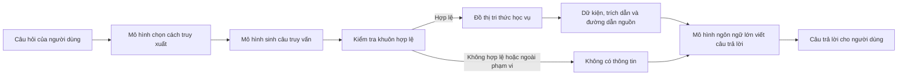
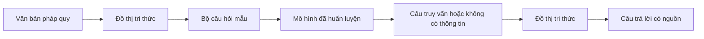
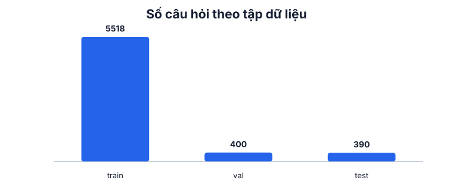
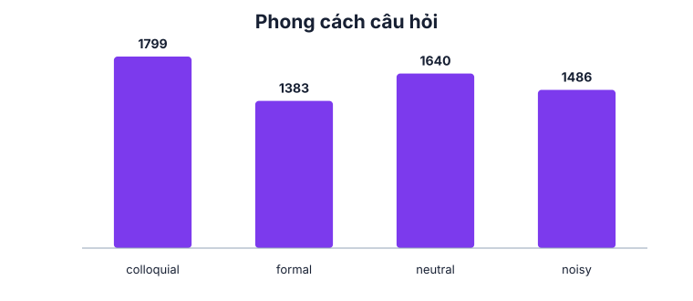
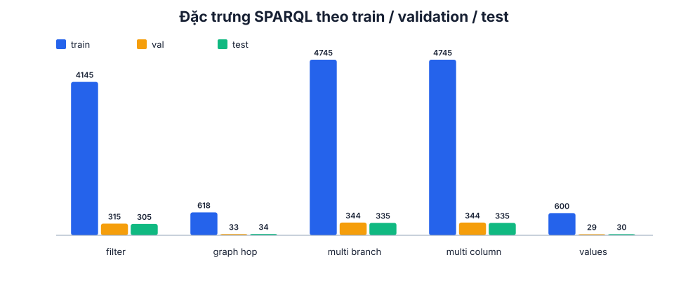

# Chatbot hỏi đáp học vụ dựa trên ontology

## Dự án này là gì

Đây là công cụ truy xuất thông tin học vụ để một mô hình ngôn ngữ lớn gọi khi
cần trả lời câu hỏi. Mô hình ngôn ngữ lớn, hay LLM, là phần mềm đọc và viết ngôn
ngữ tự nhiên; trong hệ thống này nó không tự đoán quy định mà gọi công cụ để lấy
dữ kiện có nguồn. Công cụ nhận câu hỏi tiếng Việt, chọn đúng mục dữ liệu học vụ
và trả các dữ kiện kèm trích dẫn. Nó không phải chatbot tự trả lời người dùng.

## Bài toán

Thông tin học vụ của Trường Đại học Nha Trang nằm rải trong quy chế, quyết định,
phụ lục, hướng dẫn thanh toán và danh mục biểu mẫu. Một câu hỏi có thể liên quan
đến điều kiện, hồ sơ, thời hạn, nơi nộp hoặc một bảng trong các văn bản này.

Không nên để mô hình ngôn ngữ tự trả lời bằng trí nhớ hoặc suy đoán. Một quy
định bị trả lời sai có thể làm người học nộp nhầm hồ sơ, lỡ thời hạn hoặc hiểu
sai nghĩa vụ học phí. Vì vậy, công cụ chỉ đưa lại dữ kiện đã được liên kết với
nguồn chính thức; phần viết câu trả lời cuối cùng thuộc về mô hình ngôn ngữ lớn.

## Cách hệ thống hoạt động



Đầu tiên, người dùng đặt câu hỏi bằng tiếng Việt. Mô hình sinh câu truy vấn:
đó là một câu lệnh có cấu trúc để chỉ rõ phải lấy thông tin nào, thay vì một câu
trả lời bằng văn xuôi.

Câu truy vấn phải đi qua bộ kiểm tra. Bộ này chỉ chấp nhận câu khớp một khuôn
hợp lệ đã định sẵn và chỉ cho phép đọc dữ liệu. Nếu câu hỏi ngoài phạm vi hoặc
câu truy vấn không hợp lệ, công cụ trả về “không có thông tin”.

Nếu hợp lệ, câu truy vấn chạy trên đồ thị tri thức. Đồ thị tri thức là tập các
mục dữ liệu và liên kết giữa chúng, giúp giữ quy định, thủ tục, bảng biểu và
nguồn của chúng theo một cấu trúc có thể tra cứu. Công cụ trả dữ kiện, trích
dẫn và đường dẫn đến văn bản gốc; LLM dùng đúng phần này để viết câu trả lời.

## Dữ liệu vào và ra của mô hình

Đây là phần quyết định phạm vi công cụ có thể làm được. Đầu vào là một câu hỏi
tiếng Việt viết thường, chẳng hạn: “học phí một tín chỉ là bao nhiêu”.

Đầu ra chỉ có đúng một trong hai dạng. Dạng thứ nhất là một câu truy vấn có cấu
trúc trỏ đến một mục trong đồ thị tri thức. Dạng thứ hai là câu “không có thông
tin”. Công cụ không sinh thêm dạng trả lời thứ ba.

SPARQL là ngôn ngữ dùng để hỏi dữ liệu trong đồ thị tri thức. Người dùng không
cần viết SPARQL: mô hình tạo nó ở bên trong hệ thống. Câu SPARQL tạo ra được
kiểm tra để phải khớp một trong 50 khuôn truy vấn hợp lệ, tức 50 mẫu câu lệnh
đã giới hạn trước về dữ liệu có thể đọc. Sau đó nó mới được chạy trên đồ thị.

Kết quả trả về gồm các dữ kiện của mục đã chọn, trích dẫn và đường dẫn đến văn
bản gốc. Trích dẫn cho biết dữ kiện lấy từ phần nào của tài liệu; đường dẫn cho
phép mở trực tiếp tài liệu đó để đối chiếu.

Ví dụ đầu-cuối:

| Bước | Nội dung |
|---|---|
| Câu hỏi vào | `bảo lưu cần làm gì` |
| Mục được chọn | Thủ tục bảo lưu kết quả học tập |
| Câu truy vấn rút gọn | Lấy toàn bộ dữ kiện và nguồn của mục “thủ tục bảo lưu”. |
| Dữ kiện trả về | Điều kiện thực hiện, hồ sơ cần nộp, nơi nộp, các bước xử lý và kết quả thủ tục. |
| Nguồn kèm theo | Trích dẫn của thủ tục và đường dẫn đến văn bản chính thức. |

Với câu hỏi về mức học phí một tín chỉ, hệ thống chỉ trả dữ kiện khi đồ thị có
một mục nguồn phù hợp. Nếu không có mức phí ổn định trong tài liệu, kết quả là
“không có thông tin”, thay vì suy ra một con số.



Văn bản pháp quy là các tài liệu chính thức quy định việc đào tạo và thủ tục.
Từ các tài liệu này, dự án tạo đồ thị tri thức. Bộ câu hỏi mẫu là tập câu hỏi
kèm đầu ra đúng để dạy mô hình; mô hình đã huấn luyện là mô hình đã học từ tập
mẫu đó. Khi phục vụ, nó tạo câu truy vấn hoặc từ chối, rồi công cụ trả câu trả
lời có nguồn từ đồ thị.

## Dữ liệu của dự án

Đồ thị tri thức được xây từ các văn bản chính thức của Trường Đại học Nha Trang:
Quyết định 1052 về quy chế đào tạo đại học cùng các phụ lục, Quyết định 626 về
quy chế tuyển sinh, Quyết định 1965 sửa đổi phụ lục, phần còn hiệu lực của Quyết
định 753, Quyết định 317 về học bổng, Phụ lục II của Quyết định 729 về ngành đào
tạo, cùng các hướng dẫn thanh toán và danh mục biểu mẫu. Mỗi mục được lưu kèm
thông tin nguồn để đối chiếu lại văn bản gốc.

Bộ câu hỏi có 6.308 dòng. Trong đó, 5.518 dòng dùng để dạy mô hình, 400 dòng
dùng để chỉnh lựa chọn trước khi chấm, và 390 dòng dùng để chấm cuối cùng.

| Tập dữ liệu | Số dòng | Mục đích |
|---|---:|---|
| Tập dạy | 5.518 | Cho mô hình học cách đổi câu hỏi thành đầu ra có cấu trúc. |
| Tập chỉnh | 400 | Chọn các thiết lập trước khi đo kết quả cuối. |
| Tập chấm | 390 | Đo kết quả sau khi mọi lựa chọn đã cố định. |
| Tổng | 6.308 | Toàn bộ bộ câu hỏi. |

Có 50 khuôn truy vấn. Chúng giới hạn các kiểu dữ liệu mà công cụ được phép lấy
từ đồ thị, để một câu hỏi không thể biến thành yêu cầu đọc dữ liệu tùy ý.

Phân bố câu hỏi theo miền như sau: quy tắc học vụ 1.742 · thủ tục 1.121 · văn
bản 1.115 · ngoài phạm vi 884 · biểu mẫu 634 · chứng chỉ 476 · học phí 336.

Bốn giọng hỏi được dùng là trang trọng, trung tính, thân mật và gõ vội không
dấu. “Giọng hỏi” ở đây là cách diễn đạt cùng một nhu cầu; ví dụ, dạng gõ vội có
thể bỏ dấu tiếng Việt và rút ngắn từ.



Hình này cho thấy số câu dành cho tập dạy, tập chỉnh và tập chấm.



Hình này cho thấy sự có mặt của bốn cách diễn đạt câu hỏi trong dữ liệu.



Hình này cho thấy các đặc điểm của những câu truy vấn mà mô hình cần tạo.

## Kết quả đo được

Ba chỉ số được báo riêng, vì mỗi chỉ số trả lời một câu hỏi khác nhau. “Tập
chỉnh” là tập dùng để lựa chọn thiết lập; “tập chấm” chỉ được mở sau khi mọi lựa
chọn đã cố định, nên dùng để đánh giá cuối cùng.

Chọn đúng mục trong đồ thị đo xem mô hình có tìm đúng nơi chứa thông tin cần
thiết hay không. Kết quả là 80,2% trên tập chỉnh và 76,4% trên tập chấm.

Dựng đúng dạng truy vấn đo xem câu truy vấn có theo đúng khuôn hợp lệ, gồm đúng
các phần cần thiết để lấy dữ liệu, hay không. Kết quả là 85,5% trên tập chỉnh
và 81,8% trên tập chấm.

Từ chối đúng câu ngoài phạm vi đo xem mô hình có nói “không có thông tin” khi
câu hỏi không thuộc dữ liệu dự án hay không. Kết quả là 96,5% trên tập chỉnh và
90,8% trên tập chấm.

| Chỉ số | Tập chỉnh | Tập chấm |
|---|---:|---:|
| Chọn đúng mục trong đồ thị | 80,2% | 76,4% |
| Dựng đúng dạng truy vấn | 85,5% | 81,8% |
| Từ chối đúng câu ngoài phạm vi | 96,5% | 90,8% |

## Chạy lại thế nào

```bash
uv sync --extra train
```

Lệnh này cài các thư viện cần để huấn luyện và đánh giá.

```bash
uv run validate_sparql_dataset
```

Lệnh này kiểm tra bộ câu hỏi và 50 khuôn truy vấn có khớp dữ liệu hay không.

```bash
bash train-server.sh
```

Lệnh này huấn luyện và đánh giá cả ba mô hình.

```bash
.venv/bin/python -m pytest tests -q
```

Lệnh này chạy các phép kiểm tự động của dự án.

## Yêu cầu phần cứng

Huấn luyện một mô hình trong 3 vòng học cần một card đồ hoạ NVIDIA L4 24 GB,
mất khoảng 16 phút và dùng bộ nhớ card ở mức đỉnh 6,5 GB. “Vòng học” là một
lượt mô hình đi qua toàn bộ dữ liệu dùng để dạy.

Hệ thống cũng có thể chạy trên card đồ hoạ 6 GB nếu hạ cỡ lô. Cỡ lô là số câu
hỏi được xử lý cùng lúc; hạ số này giảm bộ nhớ cần dùng nhưng có thể làm chạy lâu
hơn.

Khi phục vụ, mô hình đã được chuyển sang định dạng chạy nhanh. Do đó không cần
một card đồ hoạ lớn để đưa công cụ vào sử dụng.

## Giới hạn

- Lớp điều phối gọi công cụ chưa được tích hợp. Đây là lớp nhận biết khi nào mô
  hình ngôn ngữ lớn cần gọi công cụ và chuyển kết quả về câu trả lời cuối.
- Hai mô hình dùng để so sánh có bộ từ vựng không viết nổi mọi câu truy vấn.
  Bộ từ vựng là tập các mảnh chữ mà mô hình có thể tạo, nên trần kết quả của hai
  mô hình này thấp hơn 100%.
- Giọng gõ vội không dấu là điểm yếu rõ nhất.

## Tài liệu chi tiết

- [Khái niệm và phạm vi](docs/CONCEPT.md)
- [Cách các thành phần phối hợp](docs/ARCHITECTURE.md)
- [Đồ thị tri thức và nguồn](docs/ONTOLOGY.md)
- [Bộ câu hỏi](docs/DATASET.md)
- [Cách đo kết quả](docs/EVALUATION.md)
- [Huấn luyện](docs/TRAINING.md)
- [Đưa vào môi trường sử dụng](docs/DEPLOYMENT.md)
- [Thông tin về mô hình](docs/MODEL_CARD.md)
