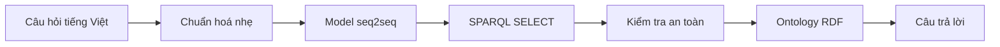

# NTU Ontology Chatbot

Chatbot tiếng Việt trả lời câu hỏi học vụ bằng cách sinh trực tiếp truy vấn
SPARQL và thực thi truy vấn trên ontology RDF.



Model chịu trách nhiệm hiểu câu hỏi và tạo query. RDFLib chịu trách nhiệm truy
vấn dữ liệu. Backend không có cây traversal, QueryPlan, fuzzy matching hay DTO
gắn với schema để sửa đoán kết quả của model.

## Dữ liệu nghiên cứu

Dataset hiện có 1.416 câu hỏi thuộc 354 họ ngữ nghĩa. Mỗi họ gồm bốn cách diễn đạt:
trang trọng, trung tính, khẩu ngữ và câu nhiễu/viết tắt.

| Tập | Câu hỏi | Họ ngữ nghĩa | Target SPARQL |
|---|---:|---:|---:|
| Train | 1.084 | 271 | 173 |
| Validation | 164 | 41 | 41 |
| Test | 168 | 42 | 42 |

Test chỉ dùng các thành phần ontology đã có trong train nhưng ghép chúng thành
42 target chưa từng xuất hiện trong train. Mọi target đều được parse và chạy
trực tiếp trên ontology trước khi dùng để huấn luyện hoặc đánh giá.


Chi tiết dữ liệu nằm tại [docs/DATASET.md](docs/DATASET.md), số liệu máy đọc tại
[reports/dataset.json](reports/dataset.json).

## Mô hình

Ba encoder-decoder được fine-tune và so sánh trên cùng dữ liệu, cách giải mã
greedy và tiêu chí đánh giá:

- `vinai/bartpho-syllable`
- `VietAI/vit5-base`
- `google/t5gemma-2-270m-270m`

Checkpoint được chọn bằng độ chính xác câu trả lời trên validation. Test chỉ
được dùng một lần cho báo cáo cuối. Các metric phân biệt rõ query có parse
được, chạy được, trả đúng dữ liệu hay trùng hoàn toàn chuỗi target.

## Kết quả thực nghiệm

Mỗi model được chạy đúng một lần với seed 42. Bảng dưới là kết quả của artifact
đã lưu, được nạp lại độc lập rồi đánh giá trên 168 câu test có target ngữ nghĩa
chưa xuất hiện trong train/validation.

| Model | Parse | Thực thi | Result F1 | Answer exact | Query exact |
|---|---:|---:|---:|---:|---:|
| BARTpho | 61,31% | 61,31% | 2,38% | 2,38% | 1,19% |
| ViT5 | 99,40% | 99,40% | 11,71% | 8,93% | 5,95% |
| T5Gemma2 | **100,00%** | **100,00%** | **58,15%** | **52,38%** | **47,02%** |

Answer exact là tiêu chí chính: toàn bộ dữ liệu trả về phải trùng reference,
không phụ thuộc tên biến hay thứ tự dòng. Result F1 ghi nhận câu trả lời đúng
một phần. Kết quả cho thấy T5Gemma2 tổng quát hóa tốt nhất trong ba model,
nhưng 52,38% answer exact cũng cho thấy bài toán compositional test vẫn còn
nhiều dư địa cải thiện.


Số liệu đầy đủ theo phong cách câu hỏi, đặc trưng SPARQL và nhóm lỗi nằm tại
[reports/models.json](reports/models.json). Định nghĩa metric nằm tại
[docs/EVALUATION.md](docs/EVALUATION.md).

## Môi trường thực nghiệm

Benchmark được chạy trên Fedora Linux 44, Python 3.12.13, PyTorch 2.13.0
(CUDA 13.0), Transformers 5.14.1 và RDFLib 7.6.0. Phần cứng là NVIDIA GeForce
RTX 4050 Laptop GPU 6 GB; fine-tuning dùng BF16, TF32 và dynamic padding, không
dùng `torch.compile`. Cấu hình tái lập đầy đủ và câu lệnh chạy nằm tại
[docs/TRAINING.md](docs/TRAINING.md).

## Cấu trúc project

```text
resources/
├── ontology/ontology.ttl       # nguồn dữ liệu RDF duy nhất
└── dataset/                    # train.jsonl, val.jsonl, test.jsonl, manifest
src/ontchatbot/
├── runtime/                    # model → validator → RDFLib → renderer/API
├── research/                   # dataset, train, evaluation và báo cáo
├── tools/                      # tokenizer và chuyển đổi model
├── cli/                        # entry point dòng lệnh
└── settings.py
docs/                           # đặc tả dành cho người đọc project
reports/                        # số liệu và biểu đồ có thể sinh lại
tests/                          # kiểm tra theo đúng các package ở trên
```

Muốn hiểu hệ thống, đọc [docs/CONCEPT.md](docs/CONCEPT.md) rồi
[docs/ARCHITECTURE.md](docs/ARCHITECTURE.md). Muốn đánh giá nghiên cứu, đọc
[docs/DATASET.md](docs/DATASET.md), [docs/TRAINING.md](docs/TRAINING.md) và
[docs/EVALUATION.md](docs/EVALUATION.md).

## Chạy kiểm tra

```bash
uv sync --dev
uv run validate_sparql_dataset
uv run generate_reports
uv run pytest
```

Huấn luyện cần extra `train` và GPU hỗ trợ BF16:

```bash
uv sync --extra train --dev
uv run --extra train train_sparql \
  --model bartpho \
  --save-model \
  --benchmark-after-training
```

Thay `bartpho` bằng `vit5` hoặc `t5gemma2` để chạy model còn lại. Hướng dẫn
đầy đủ nằm tại [docs/TRAINING.md](docs/TRAINING.md).
