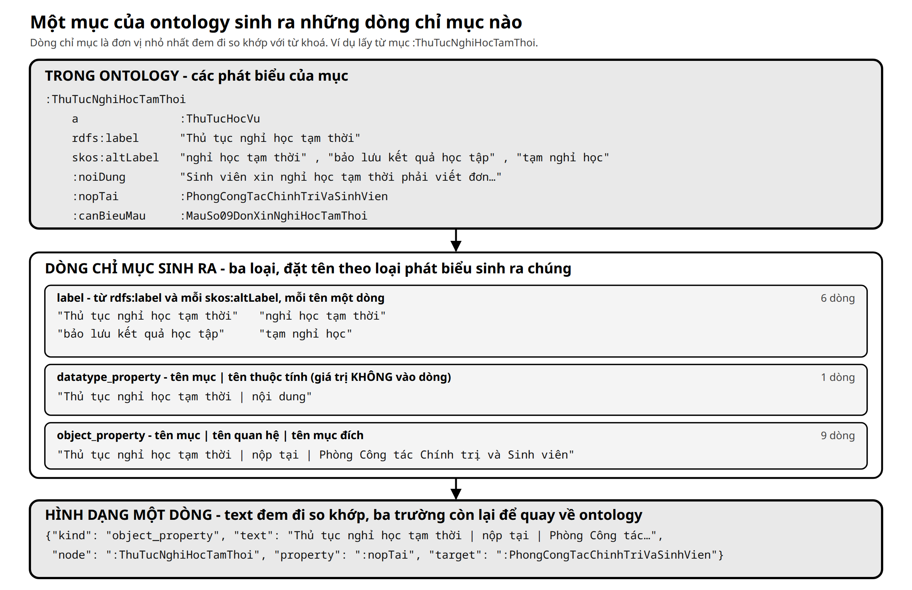

# Trợ lý hỏi đáp học vụ dựa trên ontology

Nguyên mẫu nghiên cứu về hỏi đáp học vụ tiếng Việt tại Trường Đại học Nha Trang.

- **Đầu vào:** câu hỏi bằng ngôn ngữ tự nhiên.
- **Đầu ra:** câu trả lời kèm trích dẫn và đường dẫn tới văn bản gốc.
- **Nguyên tắc:** mô hình ngôn ngữ lớn (LLM) không phải nơi lưu quy định. Nội dung học vụ
  chỉ lấy từ **ontology** — kho dữ kiện có cấu trúc, trong đó mỗi dữ kiện gắn với đúng chỗ
  của văn bản đã nêu ra nó. Không tìm thấy dữ kiện phù hợp thì trả lời **"không có thông tin"**.

Liên kết:

- [Dùng thử hệ thống](https://ontchatbot.vercel.app/)
- [Ảnh dịch vụ trên Docker Hub](https://hub.docker.com/r/vpt19/ontchatbot)


*Hình 1. Tổng quan hệ thống. Vùng ①: trả lời một câu hỏi. Vùng ②: xây dựng và cập nhật ontology.*

## 1. Bài toán nghiên cứu

### 1.1 Bối cảnh

- Thông tin học vụ nằm rải rác trong nhiều nguồn: quy chế, quyết định, phụ lục, biểu mẫu,
  chương trình đào tạo, trang web của các phòng ban.
- Sinh viên hỏi bằng từ ngữ đời thường, viết tắt hoặc thiếu dấu. Ví dụ: "xin nghỉ học" và
  "bảo lưu kết quả" cùng chỉ thủ tục nghỉ học tạm thời.
- LLM trả lời từ trí nhớ thì trôi chảy nhưng dễ sai: không biết quy chế riêng của trường và
  không chỉ ra được câu nào lấy từ đâu.

### 1.2 Yêu cầu

| Yêu cầu | Nội dung |
|---|---|
| Truy được nguồn | mỗi dữ kiện trong câu trả lời dẫn về đúng chỗ của văn bản đã nêu nó |
| Từ chối đúng | dữ liệu không có điều được hỏi thì nói là không có |
| Cập nhật được | văn bản thay đổi thì sửa dữ liệu ngay, không huấn luyện lại mô hình |

### 1.3 Phạm vi

- **Nhắm tới:** quy tắc đào tạo, thủ tục học vụ, biểu mẫu, học bổng, rèn luyện và kỷ luật,
  chứng chỉ, ngành, chuyên ngành, chương trình đào tạo, đơn vị phục vụ sinh viên.
- **Không lưu:** dữ liệu riêng của từng người hoặc từng đợt, như điểm của một sinh viên, học
  phí của một tài khoản, điểm chuẩn. Với loại này, hệ thống chỉ dẫn tới nơi tra cứu chính thức.
- **Độ phủ:** dữ liệu phủ một phần phạm vi nhắm tới (mục 5.7).

### 1.4 Câu hỏi nghiên cứu

| Mã | Câu hỏi | Đánh giá tại |
|---|---|---|
| RQ1 | Tìm kiếm theo từ khoá trên ontology có đưa mục chứa đáp án lên đầu không? | 8.1 |
| RQ2 | Khi ghép LLM với công cụ tìm kiếm, hệ thống trả lời đúng và từ chối đúng đến đâu? | 8.2 |
| RQ3 | Có giữ được nguồn của từng dữ kiện, và sửa dữ liệu mà vẫn đúng cấu trúc không? | 5.8, 7.2, 8.3 |

**Đóng góp.** Không phải một LLM mới hay một thuật toán tìm kiếm mới, mà là một chuỗi tài
nguyên kiểm tra được ở từng khâu:

```text
văn bản chính thức → ontology gắn nguồn từng câu → công cụ tìm kiếm trả dữ kiện theo nguồn → câu trả lời có trích dẫn
```

## 2. Kiến trúc hệ thống

### 2.1 Thuật ngữ

| Thuật ngữ | Nghĩa |
|---|---|
| **LLM** (*large language model*) | mô hình ngôn ngữ lớn: đọc câu hỏi, viết câu trả lời |
| **Công cụ** (*tool*) | hàm mà LLM được phép yêu cầu gọi; LLM gửi tham số, hệ thống chạy hàm rồi trả kết quả cho LLM |
| **Agent** | vòng lặp điều phối: gửi hội thoại cho LLM, chạy công cụ khi LLM yêu cầu, lặp tới khi LLM viết xong câu trả lời |
| **Ontology** | kho dữ kiện dạng đồ thị: các mục nối với nhau bằng quan hệ có tên, mỗi câu kèm nguồn (mục 5) |
| **JSON** | định dạng văn bản ghi dữ liệu thành các cặp tên – giá trị; mọi dữ liệu trao đổi giữa các thành phần dùng định dạng này |
| **API** | điểm nhận yêu cầu qua HTTP của máy chủ |
| **SSE** (*server-sent events*) | cách máy chủ đẩy từng sự kiện nhỏ về trình duyệt trong lúc xử lý, để câu trả lời hiện dần |

### 2.2 Thành phần

| Thành phần | Làm gì | Không làm gì |
|---|---|---|
| Giao diện chat | nhận câu hỏi; hiện trạng thái tra cứu và câu trả lời từng đoạn | không gọi LLM, không đọc ontology |
| API server | nhận câu hỏi, xếp hàng các lượt, chạy agent, đẩy sự kiện SSE | không tự viết câu trả lời |
| LLM | quyết định có tra không và tra bằng từ khoá nào; viết câu trả lời từ kết quả tra | không phải nơi lưu quy định |
| Công cụ tra cứu | giới hạn danh sách từ khoá, gọi search engine, viết kết quả thành JSON | không chọn câu trả lời |
| Search engine | chấm điểm, chọn 5 mục, đọc dữ kiện của mục theo nguồn | không hiểu nghĩa câu hỏi |
| Ontology và lược đồ | lưu dữ kiện cùng nguồn của từng câu; lược đồ khai báo mỗi loại mục có những ô nào | không tự trả lời |
| Trang quản trị | thêm, sửa, xoá mục; xác thực dữ liệu theo lược đồ trước khi ghi | không ghi dữ liệu sai lược đồ |

### 2.3 Triển khai

- Giao diện: trang web tĩnh.
- API server, agent, công cụ tra cứu, search engine, trang quản trị: cùng một dịch vụ Python.
- LLM: máy chủ bên ngoài, gọi qua giao thức *chat completions* tương thích OpenAI.

## 3. Luồng xử lý một lượt hỏi


*Hình 2. Trình tự một lượt hỏi. Mọi trao đổi giữa giao diện, LLM và công cụ tra cứu đều đi qua API server.*

### 3.1 Các bước

Ví dụ với câu hỏi **"em muốn xin nghỉ học"**. Số bước khớp với Hình 2.

| Bước | Từ → tới | Nội dung |
|---:|---|---|
| 1 | Giao diện → API | câu hỏi và tối đa 20 tin nhắn gần nhất |
| 2 | API → LLM | lời hướng dẫn, hội thoại, mô tả công cụ `lookup_academic_information` |
| 3 | LLM → API | yêu cầu gọi công cụ với 3 từ khoá: `nghỉ học tạm thời`, `bảo lưu kết quả học tập`, `xin nghỉ học` |
| 4 | API → công cụ | chạy công cụ; giao diện nhận sự kiện `lookup_started` |
| 5 | Công cụ → search engine | danh sách từ khoá |
| 6 | Search engine → công cụ | 5 mục điểm cao nhất, mỗi mục kèm dữ kiện gom theo nguồn |
| 7 | Công cụ → API | kết quả dạng JSON; giao diện nhận sự kiện `lookup_finished` |
| 8 | API → LLM | hội thoại cùng kết quả công cụ |
| 9 | LLM → API | câu trả lời, sinh từng đoạn, chỉ dựa trên kết quả công cụ |
| 10 | API → giao diện | mỗi đoạn là một sự kiện `text_delta`; kết thúc bằng `completed` |

- Ở bước 3, từ khoá không chép nguyên câu hỏi: LLM chuyển lời nói thường ngày sang thuật ngữ
  mà quy chế dùng.
- Lượt hỏi ví dụ: 3,28 giây, 1 lần gọi công cụ, 212 sự kiện `text_delta`.

### 3.2 Giới hạn của một lượt

| Giới hạn | Giá trị |
|---|---|
| Số bước gọi LLM | tối đa 4 |
| Thời gian | tối đa 45 giây |
| Số lượt chạy đồng thời | mặc định 16, hàng đợi 64 |

### 3.3 Các trường hợp từ chối

| Trường hợp | Hành vi |
|---|---|
| Câu ngoài học vụ (thời tiết, chuyện phiếm) | LLM trả lời là ngoài phạm vi, không gọi công cụ |
| Không mục nào khớp từ khoá (`status = not_found`) | LLM được gọi lại tối đa một lần với từ khoá khác; vẫn không có thì nói không tìm thấy |
| Có mục khớp nhưng không chứa điều được hỏi | LLM đối chiếu trường `matched`, đọc hết dữ kiện; chi tiết không có thì nói dữ liệu không chứa chi tiết đó |

"Không có thông tin" nghĩa là dữ liệu không chứa thông tin đó, không khẳng định thông tin
không tồn tại ngoài thực tế.

## 4. Dữ liệu ở từng bước


*Hình 3. Hình dạng dữ liệu của lượt hỏi "em muốn xin nghỉ học" (rút gọn phần dài).*

**Kết quả công cụ** (khối 4 của Hình 3) là toàn bộ thông tin về quy định mà LLM có khi viết
câu trả lời. Các trường:

| Trường | Ý nghĩa |
|---|---|
| `status` | `found`: có ít nhất một mục khớp; `not_found`: không có |
| `guidance` | lời nhắc cách đọc kết quả, gửi kèm trong dữ liệu |
| `label`, `classes` | tên mục và loại của mục |
| `matched` | các dòng chỉ mục đã khớp từ khoá (mục 6.2); LLM dùng để loại mục không đúng ý hỏi |
| `sources` | mỗi phần tử là một nguồn: `citation` và `url` để trích dẫn, `facts` là các dữ kiện nguồn đó khẳng định |
| `facts[].subject` | mục nêu ra dữ kiện; khác `label` nghĩa là câu của một mục khác nói tới mục này |
| `unmatched`, `truncation` | từ khoá không khớp gì; số từ khoá bị cắt vì vượt giới hạn |

- `citation: null`: dữ kiện dùng được nhưng không có nguồn để trích dẫn (mục 5.4).
- Công cụ nhận tối đa 20 từ khoá, mỗi từ khoá tối đa 120 ký tự.
- Sự kiện SSE khác: `queued` (đang xếp hàng, kèm vị trí), `warning` (lịch sử quá dài đã bị
  cắt), `error`.

## 5. Tổ chức ontology

- Tệp [`resources/ontology/ontology.trig`](resources/ontology/ontology.trig) là cơ sở dữ liệu
  nội dung duy nhất mà dịch vụ đọc.
- Văn bản chính thức vẫn là căn cứ có thẩm quyền; ontology là bản biểu diễn có cấu trúc của
  phần nội dung đã chọn vào phạm vi.

### 5.1 Khái niệm cơ bản

- **Namespace:** tiền tố địa chỉ chung của mọi định danh, `http://www.ntu.edu.vn/ontology/academic#`.
- **IRI:** định danh duy nhất của một mục. Trong tệp, tiền tố `:` thay cho namespace, ví dụ
  `:ThuTucNghiHocTamThoi`. IRI sinh từ tên tiếng Việt bỏ dấu.

| Khái niệm | Bản chất | Ví dụ |
|---|---|---|
| Lớp (*class*) | nhóm các mục cùng kiểu | `:ThuTucHocVu` — lớp thủ tục học vụ |
| Cá thể (*individual*), gọi tắt là **mục** | một đối tượng cụ thể thuộc một lớp | `:ThuTucNghiHocTamThoi` |
| **Nhãn** (*label*) | tên hiển thị; một tên chính và có thể có nhiều tên gọi khác | `rdfs:label "Thủ tục nghỉ học tạm thời"`, `skos:altLabel "bảo lưu kết quả học tập"` |
| **Quan hệ** (*object property*) | nối mục với một mục khác | `:nopTai` nối thủ tục với đơn vị tiếp nhận |
| **Thuộc tính dữ liệu** (*datatype property*) | nối mục với chữ, số, ngày hoặc đường dẫn | `:noiDung` nối thủ tục với một câu nội dung |

Mỗi dữ kiện là một **phát biểu ba vế** (*triple*):

```text
chủ ngữ → quan hệ hoặc thuộc tính → mục được trỏ tới hoặc giá trị
```

Ví dụ: `Thủ tục nghỉ học tạm thời → nộp tại → Phòng Công tác Chính trị và Sinh viên`.

### 5.2 Nguồn gắn theo từng phát biểu

- **Vấn đề:** một thủ tục được nhiều chỗ của văn bản nói tới. Ví dụ: nơi nộp ở khoản 3 Điều 24;
  các trường hợp được nghỉ ở điểm a–d khoản 1 Điều 24. Gắn nguồn cho cả mục thì không biết câu
  nào lấy từ đâu.
- **Cách làm:** thêm vế thứ tư cho mỗi phát biểu, gọi là **quad**. Vế thứ tư là tên của một
  **túi trích dẫn** (*named graph*).
- **Túi trích dẫn:** chứa mọi phát biểu do cùng một chỗ của cùng một văn bản khẳng định. Tên túi
  là **địa chỉ trích dẫn**, trỏ về nguồn và vị trí trong nguồn.
- **TriG:** định dạng văn bản ghi được cả bốn vế.


*Hình 4. Các phát biểu của một thủ tục được gom vào túi theo chỗ của văn bản khẳng định chúng.*

Hệ quả:

- Thêm nguồn không thêm mục hay quan hệ nào: nguồn là thông tin đi kèm phát biểu, không phải
  một loại nội dung khác.
- Văn bản mới đổi một chi tiết thì chỉ phát biểu đó đổi túi hoặc bị thay; các phát biểu khác
  của mục giữ nguyên nguồn.

### 5.3 Ví dụ: một thủ tục trong tệp TriG

Rút gọn từ tệp ontology:

```trig
:ThuTucNghiHocTamThoi a :ThuTucHocVu ;
    rdfs:label "Thủ tục nghỉ học tạm thời"@vi ;
    skos:altLabel "tạm nghỉ học"@vi , "tạm dừng học"@vi , "nghỉ học tạm thời"@vi ,
                  "bảo lưu kết quả"@vi , "bảo lưu kết quả học tập"@vi .

:TD1052_D24K03 {
    :ThuTucNghiHocTamThoi :nopTai :PhongCongTacChinhTriVaSinhVien ;
        :canBieuMau :MauSo09DonXinNghiHocTamThoi ;
        :doAiQuyetDinh :HieuTruong ;
        :doAiThucHien :SinhVien ;
        :thuTucTiepTheo :ThuTucXinHocTroLai ;
        :noiDung "Sinh viên xin nghỉ học tạm thời phải viết đơn (Mẫu số 09 - Phụ lục 4 kèm theo) gửi Hiệu trưởng thông qua Phòng Công tác Chính trị và Sinh viên."@vi .
}

:TD1052_D24K03 a :DiaChiTrichDan ;
    :thuocNguon :Nguon1052 ;
    :toaDo "khoản 3 Điều 24"@vi .

:Nguon1052 a :Nguon ;
    rdfs:label "Quy chế đào tạo trình độ đại học Trường Đại học Nha Trang"@vi ;
    :soHieu "1052/QĐ-ĐHNT"@vi ;
    :banHanhNgay "2025-07-17"^^xsd:date ;
    :loaiNguon :QuyChe ;
    :duongDan "https://pdtdaihoc.ntu.edu.vn/…pdf"^^xsd:anyURI .
```

Ký hiệu:

| Ký hiệu | Nghĩa |
|---|---|
| `a` | "là một": khai báo mục thuộc lớp nào |
| `;` `,` `.` | `;` nối phát biểu tiếp theo cùng chủ ngữ; `,` nối giá trị tiếp theo cùng quan hệ; `.` kết thúc |
| `{ … }` | khối bao các phát biểu thuộc cùng một túi trích dẫn |
| `@vi` | chuỗi đứng trước là tiếng Việt |
| `^^xsd:date` | giá trị đứng trước là một ngày |
| `rdfs:` `skos:` `xsd:` | tiền tố của ba bộ từ vựng chuẩn: RDFS cho nhãn, SKOS cho tên gọi khác, XSD cho kiểu dữ liệu |

Cách đọc:

| Khối | Nội dung |
|---|---|
| Khối đầu, ngoài mọi túi | danh tính của mục: loại, tên chính, tên gọi khác; không cần trích dẫn |
| `:TD1052_D24K03 { … }` | một túi: sáu phát biểu cùng do khoản 3 Điều 24 khẳng định |
| `:TD1052_D24K03 a :DiaChiTrichDan` | địa chỉ trích dẫn: toạ độ "khoản 3 Điều 24" trong nguồn `:Nguon1052` |
| `:Nguon1052` | nguồn: số hiệu, ngày ban hành, loại, đường dẫn |

Chuỗi trích dẫn được ghép khi đọc: *"khoản 3 Điều 24 Quy chế đào tạo trình độ đại học Trường
Đại học Nha Trang, ban hành kèm Quyết định 1052/QĐ-ĐHNT ngày 17/7/2025"*.

### 5.4 Hai tầng dữ liệu

| Tầng | Lưu gì | Dùng để |
|---|---|---|
| Tri thức | các loại mục: thủ tục, quy tắc, đơn vị, ngành, biểu mẫu… | trả lời câu hỏi; được tìm kiếm |
| Nguồn | nguồn (văn bản, trang web) và địa chỉ trích dẫn | dựng trích dẫn; không được tìm kiếm |

Phát biểu nằm ngoài mọi túi:

- danh tính của mục: loại, tên chính, tên gọi khác;
- điều dự án tự khẳng định mà không văn bản nào ghi, ví dụ ghép một mục tải trên website với
  biểu mẫu tương ứng trong phụ lục. Kết quả công cụ đánh dấu các phát biểu này `citation: null`.

### 5.5 Lược đồ SHACL

- **SHACL** (*Shapes Constraint Language*): ngôn ngữ khai báo ràng buộc cho dữ liệu dạng đồ thị.
- Tệp [`resources/ontology/shapes.ttl`](resources/ontology/shapes.ttl) có một **shape** cho mỗi
  loại mục, khai báo: loại đó có những ô nào; ô nào bắt buộc; nhận một hay nhiều giá trị; giá
  trị là chữ hay trỏ tới loại nào; có phải gắn nguồn không.
- Tệp viết bằng **Turtle**, định dạng ba vế cùng họ với TriG.

Rút gọn shape của thủ tục học vụ:

```turtle
:ThuTucHocVuShape a sh:NodeShape ;
    sh:targetClass :ThuTucHocVu ;
    sh:closed true ;
    sh:property
        [ sh:path :noiDung ; sh:name "nội dung"@vi ;
          sh:datatype rdf:langString ; sh:minCount 1 ;
          :batBuocNguon true ] ,
        [ sh:path :nopTai ; sh:name "nộp tại"@vi ;
          sh:class :ChuThe ;
          :batBuocNguon true ] .
```

| Ràng buộc | Nghĩa |
|---|---|
| `sh:closed true` | cấm ô chưa khai báo |
| `sh:minCount 1` | ô bắt buộc |
| `sh:datatype` | kiểu của giá trị (chữ, số, ngày) |
| `sh:class` | giá trị phải trỏ tới mục thuộc đúng loại |
| `:batBuocNguon true` | quy ước riêng của dự án: phát biểu của ô phải nằm trong một túi trích dẫn |


*Hình 5. Các loại mục và quan hệ nối giữa chúng.*

| Loại | Lớp | Chứa gì |
|---|---|---|
| Thủ tục học vụ | `ThuTucHocVu` | nội dung, người thực hiện, nơi nộp, biểu mẫu, trường hợp áp dụng |
| Quy tắc | `QuyTac` | quy định học vụ: cảnh báo, buộc thôi học, khối lượng đăng ký, thời gian đào tạo |
| Khái niệm | `KhaiNiem` | khái niệm học vụ: học kỳ, loại học phần, điểm rèn luyện |
| Chủ thể | `ChuThe` | đơn vị trong trường và vai trò: phòng, khoa, sinh viên, hiệu trưởng |
| Ngành đào tạo | `NganhDaoTao` | tên ngành, mã ngành, khối ngành |
| Chuyên ngành | `ChuyenNganh` | chuyên ngành và ngành chứa nó |
| Chương trình đào tạo | `ChuongTrinhDaoTao` | thời gian, ngôn ngữ, văn bằng, tổng tín chỉ, đơn vị quản lý |
| Biểu mẫu theo quyết định | `BieuMauTheoQuyetDinh` | mẫu đơn trong phụ lục quy chế |
| Mục biểu mẫu trên website | `MucBieuMauTrenWebsite` | đường tải biểu mẫu |
| Bảng | `Bang` | bảng chép nguyên văn từng ô |
| Chứng chỉ | `ChungChi` | chứng chỉ ngoại ngữ và tin học |
| Danh mục | `DanhMuc` | danh mục dùng chung: khối ngành, ngân hàng, đơn vị tính |
| Mức tiền | `MucTien` | mức học bổng, lệ phí |
| Học phần | `HocPhan` | học phần có quy định riêng |
| Trường hợp áp dụng | `TruongHopApDung` | trường hợp mà thủ tục áp dụng |
| Hệ thống trực tuyến | `HeThongTrucTuyen` | cổng thông tin sinh viên và các hệ thống tương tự |
| *Nguồn* | `Nguon` | văn bản và trang web làm căn cứ |
| *Địa chỉ trích dẫn* | `DiaChiTrichDan` | toạ độ trong nguồn; cũng là tên túi |

### 5.6 Quy trình biên soạn dữ liệu

1. Chọn nguồn chính thức; ghi số hiệu, ngày ban hành, đường dẫn.
2. Tách nội dung thành từng phát biểu; gắn mỗi phát biểu với chỗ nhỏ nhất của văn bản khẳng
   định nó (khoản, điểm, mục của trang).
3. Đối chiếu từng giá trị với bản chép trong [`references/`](references/) hoặc trang chính
   thức; bảng nhiều tầng được chép nguyên văn từng ô.
4. Ghi vào ontology qua bước xác thực theo lược đồ (mục 7.2); chạy lại bộ test và bộ kiểm
   tìm kiếm (mục 8).

Quy tắc biên soạn:

- Văn bản cũ vẫn là căn cứ cho những điểm mà văn bản mới không nói tới.
- Hai nguồn mâu thuẫn: dùng nguồn mới hơn.
- Không lưu thông tin cá nhân của cán bộ, như số điện thoại riêng của trưởng đơn vị.
- Không lưu dữ liệu riêng của từng sinh viên hoặc theo đợt; chỉ lưu đường dẫn tới nơi tra cứu
  chính thức.

Loại nguồn: quy chế, quyết định, hướng dẫn, văn bản chương trình đào tạo, trang chính thức của
phòng ban, danh mục biểu mẫu.

### 5.7 Phạm vi dữ liệu

- **Cố định:** cấu trúc của ontology — các loại mục, quan hệ giữa chúng, lược đồ ràng buộc.
- **Thay đổi:** khối lượng dữ liệu, phụ thuộc số văn bản đã được biểu diễn. Số mục của mỗi loại
  vì vậy không phải đặc trưng của phương pháp.
- Phiên bản dữ liệu dùng cho các phép đo ở mục 8 phủ một phần phạm vi ở mục 1.3; kết quả gắn
  với phần này.

### 5.8 Kiểm định ontology

Các phép kiểm tự động chạy trên toàn bộ tệp ontology xác nhận:

- toàn bộ dữ liệu khớp lược đồ SHACL;
- mọi ô bắt buộc gắn nguồn đều nằm trong túi;
- quy tắc trích dẫn: không có địa chỉ rỗng; mỗi chỗ trong nguồn chỉ có một địa chỉ; một văn bản
  không khẳng định cùng một dữ kiện ở hai chỗ;
- các bảng trong ontology khớp bản chép trong `references/` đến từng ký tự;
- các kiểu câu hỏi tiêu biểu tìm ra đúng mục.

Các phép kiểm này **không** chứng minh:

- tập nguồn là đầy đủ;
- mọi diễn giải đúng về pháp lý;
- trang web còn nguyên như lúc thu thập;
- LLM luôn trình bày trung thực.

Khi ontology mâu thuẫn với văn bản chính thức, văn bản chính thức được ưu tiên và ontology phải sửa.

## 6. Thuật toán tìm kiếm trên ontology

- **Đầu vào:** danh sách từ khoá do LLM viết.
- **Đầu ra:** 5 mục điểm cao nhất, mỗi mục kèm toàn bộ dữ kiện gom theo nguồn.

| Bước | Việc | Thời điểm chạy |
|---:|---|---|
| 1 | Sinh các dòng chỉ mục cho mỗi mục (6.2) | khi nạp ontology |
| 2 | Tách dòng chỉ mục và từ khoá thành token (6.3) | dòng: khi nạp; từ khoá: mỗi lần tìm |
| 3 | Chấm điểm từng dòng với từng từ khoá bằng BM25 (6.4) | mỗi lần tìm |
| 4 | Cộng điểm dòng thành điểm mục (6.5) | mỗi lần tìm |
| 5 | Chọn 5 mục điểm cao nhất (6.6) | mỗi lần tìm |
| 6 | Đọc hồ sơ của 5 mục (6.7) | mỗi lần tìm |

### 6.1 Mục — đối tượng được tìm

- **Mục** là một cá thể thuộc tầng tri thức (mục 5.4): một thủ tục, quy tắc, đơn vị, ngành,
  biểu mẫu…
- Đơn vị được xếp hạng là **mục**, không phải từng phát biểu.
- Mục thuộc tầng nguồn (`Nguon`, `DiaChiTrichDan`) không được tìm.

Một mục gồm:

| Thành phần | Ví dụ với `:ThuTucNghiHocTamThoi` |
|---|---|
| IRI | `:ThuTucNghiHocTamThoi` |
| Lớp | `:ThuTucHocVu` |
| Tên chính (`rdfs:label`) | Thủ tục nghỉ học tạm thời |
| Tên gọi khác (`skos:altLabel`) | tạm nghỉ học · tạm dừng học · nghỉ học tạm thời · bảo lưu kết quả · bảo lưu kết quả học tập |
| Thuộc tính dữ liệu | `:noiDung` → một câu nội dung |
| Quan hệ | `:nopTai` → Phòng Công tác Chính trị và Sinh viên; `:canBieuMau` → Mẫu số 09; … |

### 6.2 Dòng chỉ mục của một mục

- **Dòng chỉ mục** là một chuỗi ngắn sinh từ tên hoặc từ một phát biểu của mục. Đây là đơn vị
  được chấm điểm.
- **Chỉ mục** là tập mọi dòng chỉ mục, dựng trong bộ nhớ khi nạp ontology.
- Mỗi mục sinh nhiều dòng, thuộc ba loại:

| Loại dòng | Sinh từ | Khuôn | Ví dụ |
|---|---|---|---|
| `label` | mỗi tên chính và tên gọi khác | `tên` | `bảo lưu kết quả học tập` |
| `datatype_property` | mỗi thuộc tính dữ liệu | `tên mục \| tên thuộc tính` | `Thủ tục nghỉ học tạm thời \| nội dung` |
| `object_property` | mỗi quan hệ | `tên mục \| tên quan hệ \| tên mục được trỏ tới` | `Thủ tục nghỉ học tạm thời \| nộp tại \| Phòng Công tác Chính trị và Sinh viên` |

Hình dạng một dòng:

```json
{
  "kind": "object_property",
  "text": "Thủ tục nghỉ học tạm thời | nộp tại | Phòng Công tác Chính trị và Sinh viên",
  "node": ":ThuTucNghiHocTamThoi",
  "property": ":nopTai",
  "target": ":PhongCongTacChinhTriVaSinhVien"
}
```

| Trường | Vai trò |
|---|---|
| `kind` | loại dòng |
| `text` | chuỗi đem đi so khớp với từ khoá |
| `node` | IRI của mục sở hữu dòng; dùng để cộng điểm về đúng mục |
| `property`, `target` | IRI của quan hệ và mục được trỏ tới |



*Hình 6. Các phát biểu của một mục sinh ra ba loại dòng chỉ mục (rút gọn).*

Không sinh dòng chỉ mục:

- **Giá trị** của thuộc tính dữ liệu (câu nội dung, con số, ngày): người dùng hỏi "học phí
  ngành nào", không hỏi bằng con số. Giá trị đến LLM ở bước đọc hồ sơ (6.7).
- Ba thuộc tính chỉ chứa đường dẫn hoặc hộp thư.
- Toàn bộ tầng nguồn.

### 6.3 Tách từ

**Token** là đơn vị chữ nhỏ nhất đem đi so khớp. Dòng chỉ mục và từ khoá đi qua cùng một bước tách:

1. Chuẩn hoá Unicode, chuyển chữ thường.
2. Tách theo âm tiết.
3. Bỏ 26 hư từ và từ hỏi, như "là", "gì", "của", "và", "tại".
4. Mỗi token chỉ tính một lần trong một dòng (dòng `object_property` hay lặp chữ ở hai đầu).

```text
dòng    "Thủ tục nghỉ học tạm thời | nộp tại | Phòng Công tác Chính trị và Sinh viên"
      → [thủ, tục, nghỉ, học, tạm, thời, nộp, phòng, công, tác, chính, trị, sinh, viên]

từ khoá "nghỉ học tạm thời"
      → [nghỉ, học, tạm, thời]
```

- "tại", "và" bị bỏ vì là hư từ; dấu `|` là ký hiệu ngăn cách, không sinh token.
- Không sửa lỗi gõ, không bung viết tắt: từ khoá do LLM viết đã đúng chính tả; tên viết tắt như
  "CNTT" được khai làm tên gọi khác của mục.

### 6.4 Chấm điểm một dòng bằng BM25

**BM25** là công thức xếp hạng văn bản theo mức khớp với truy vấn. Ở đây truy vấn là **một từ
khoá**, văn bản là **một dòng chỉ mục**.

Ba yếu tố làm điểm của dòng tăng:

| Yếu tố | Ý nghĩa |
|---|---|
| **TF** (*term frequency*) | dòng chứa token của từ khoá; ở đây mỗi token chỉ có hoặc không |
| **IDF** (*inverse document frequency*) | token càng hiếm trong chỉ mục càng có giá trị: "thủ tục" có ở rất nhiều dòng nên ít giá trị hơn "bảo lưu" |
| Độ dài dòng | cùng khớp một token, dòng ngắn được điểm cao hơn dòng dài |

Công thức:

```text
điểm(q, d) = Σ_{t ∈ q} IDF(t) · f(t, d) · (k1 + 1) / (f(t, d) + k1 · (1 − b + b · |d| / avgdl))
IDF(t)     = ln(1 + (N − n(t) + 0,5) / (n(t) + 0,5))
```

| Ký hiệu | Nghĩa |
|---|---|
| `q`, `d` | một từ khoá; một dòng chỉ mục |
| `t` | một token của từ khoá |
| `f(t, d)` | 1 nếu dòng chứa token `t`, 0 nếu không |
| `N`, `n(t)` | số dòng của chỉ mục; số dòng chứa token `t` |
| `\|d\|`, `avgdl` | số token của dòng; số token trung bình của các dòng |
| `k1 = 1,5`, `b = 0,75` | tham số mặc định của thư viện `bm25s` |

Với mỗi từ khoá, chỉ giữ tối đa 20 dòng điểm cao nhất.

### 6.5 Cộng điểm dòng thành điểm mục

Quy tắc gồm hai bước:

1. **Lấy max trong một từ khoá:** với mỗi từ khoá, mỗi mục chỉ giữ dòng có điểm cao nhất của mục
   đó; không có dòng nào khớp thì được 0.
2. **Cộng qua các từ khoá:** điểm mục là tổng các điểm vừa giữ.

```text
điểm(m) = Σ_{q ∈ Q} max_{d ∈ D(m)} điểm(q, d)
```

`Q` là danh sách từ khoá; `D(m)` là các dòng chỉ mục của mục `m`.

| Bước | Lý do |
|---|---|
| Lấy max trong một từ khoá | mục có nhiều tên gọi gần giống nhau không tự cộng dồn điểm |
| Cộng qua các từ khoá | mục khớp nhiều ý của câu hỏi xếp trên mục chỉ khớp một ý |


*Hình 7. Điểm từng dòng và điểm mục với ba từ khoá của câu "em muốn xin nghỉ học". Ô tô đậm là dòng được cộng.*

Kết quả của Hình 7:

| Mục | "nghỉ học tạm thời" | "bảo lưu kết quả học tập" | "xin nghỉ học" | Điểm mục |
|---|---:|---:|---:|---:|
| Thủ tục nghỉ học tạm thời | 6,44 | 10,43 | 2,73 | **19,60** |
| Mục tải: Đơn xin nghỉ học tạm thời | 5,09 | 0 | 3,09 | 8,18 |
| Mẫu số 09 - Đơn xin nghỉ học tạm thời | 4,84 | 0 | 2,94 | 7,78 |

- Mục 1: từ khoá "bảo lưu kết quả học tập" khớp hai dòng (10,43 và 9,53); chỉ dòng 10,43 được cộng.
- Mục 2 và 3: không dòng nào khớp "bảo lưu kết quả học tập" nên nhận 0 ở cột này; đây là
  nguyên nhân chính của khoảng cách với mục 1.

### 6.6 Chọn 5 mục điểm cao nhất

- Sắp các mục theo điểm giảm dần, trả 5 mục đầu.
- Không đặt ngưỡng điểm tối thiểu: có ít nhất một token trùng là có kết quả.

| Lựa chọn | Lý do |
|---|---|
| Trả nhiều mục thay vì 1 | LLM thấy cả ứng viên yếu hơn; mọi mục đều lạc đề thì LLM có căn cứ để từ chối |
| 5 mục thay vì 3 | một thủ tục, biểu mẫu của nó và mục tải biểu mẫu có tên gần giống nhau nên thường chiếm liền 3 vị trí đầu; câu hỏi có hai chủ đề cần chỗ cho chủ đề thứ hai. Dữ liệu gửi LLM tăng khoảng 1,4 lần |
| Không đặt ngưỡng | điểm BM25 phụ thuộc độ hiếm của token, nên mỗi truy vấn có thang điểm khác; một ngưỡng cố định sẽ cắt sai ở một số truy vấn |

Việc loại mục không đúng ý hỏi thuộc về LLM. Trường `matched` (mục 4) liệt kê các dòng đã khớp
để LLM đối chiếu.

### 6.7 Đọc hồ sơ của mục

Với mỗi mục được chọn:

1. Lấy mọi phát biểu có mục là chủ ngữ, và phát biểu của mục khác trỏ tới nó (ví dụ các thủ
   tục cùng "nộp tại" một phòng).
2. Gom phát biểu theo túi trích dẫn; mỗi túi thành một nguồn, kèm chuỗi trích dẫn và đường dẫn.
3. Xếp nhóm nhiều dữ kiện lên trước; nhóm không có nguồn xếp cuối.

- Kết quả là mảng `sources` trong kết quả công cụ (mục 4). Ví dụ: mục "Thủ tục nghỉ học tạm
  thời" có 12 nhóm nguồn.
- Đây là bước đưa giá trị của thuộc tính dữ liệu (câu nội dung, con số, ngày) tới LLM.

### 6.8 Chi phí

| Thao tác | Thời gian |
|---|---|
| Nạp tệp TriG và dựng chỉ mục | khoảng 45 ms |
| Một lần tìm, kể cả đọc hồ sơ 5 mục | trung vị 0,55 ms · p95 0,85 ms |

- `p95`: ngưỡng mà 95% lần chạy không vượt quá.
- Đo trên một máy tính cá nhân, với các từ khoá của bộ kiểm tìm kiếm (mục 8.1).
- Chỉ mục dựng lại trong bộ nhớ mỗi khi ontology thay đổi; không có tệp chỉ mục cần đồng bộ.

## 7. Cập nhật dữ liệu

**CRUD** (*create, read, update, delete*): thêm, đọc, sửa, xoá. Trang quản trị thực hiện cả bốn
thao tác trên ontology; người biên soạn không cần biết TriG hay SHACL.

### 7.1 Form sinh từ lược đồ

- Mỗi loại mục có một form, sinh từ shape của loại đó (mục 5.5).
- Ô bắt buộc có dấu `*`.
- Ô trỏ tới loại khác hiện thành danh sách chọn.
- Ô phải gắn nguồn có thêm chỗ chọn nguồn và ghi vị trí trong nguồn (ví dụ "khoản 1 Điều 24");
  địa chỉ trích dẫn được tạo tự động.


*Hình 8. Form sửa mục "Thủ tục nghỉ học tạm thời".*

### 7.2 Cơ chế xác thực (validate) dữ liệu theo lược đồ trước khi ghi

Thao tác thêm và sửa đi qua bốn bước:

| Bước | Việc | Không đạt thì |
|---|---|---|
| 1. Xác thực từng trường | ô thuộc đúng loại mục; giá trị đúng kiểu; ô bắt buộc gắn nguồn đã chọn nguồn và ghi vị trí; ô không gắn nguồn thì không nhận nguồn; tên mới sinh ra IRI chưa được dùng | báo lỗi theo từng dòng của form |
| 2. Dựng bản thử | áp thay đổi lên một bản sao ontology trong bộ nhớ | — |
| 3. Xác thực toàn bộ bằng SHACL | kiểm bản thử theo mọi shape: ô bắt buộc, số giá trị, kiểu dữ liệu, loại của mục được trỏ tới, ô chưa khai báo | báo từng vi phạm thành câu dễ đọc |
| 4. Ghi | ghi tệp TriG theo thứ tự cố định; search engine dựng lại chỉ mục | — |

- Bước 1 hoặc 3 không đạt: không ghi gì, dữ liệu cũ giữ nguyên.
- Thao tác xoá bỏ qua bước 1, và bị chặn nếu còn mục khác trỏ tới mục cần xoá.
- Form và bước xác thực cùng đọc một lược đồ, nên ràng buộc hiện trên form và ràng buộc chặn
  khi ghi luôn thống nhất.


*Hình 9. Mục mới bị từ chối ở bước 1: câu nội dung chưa chọn nguồn.*

### 7.3 Sau khi ghi

- Lượt hỏi kế tiếp dùng dữ liệu mới, không huấn luyện lại gì.
- Một lần lưu mất khoảng nửa giây.

## 8. Đánh giá

> **Phạm vi.** Mọi phép đo chạy trên phiên bản dữ liệu ở mục 5.7. Kết quả chỉ nói về phần nội dung
> đã được biểu diễn, không nói về một hệ thống có dữ liệu phủ hết phạm vi ở mục 1.3.

- **Chatbot** trong mục này là toàn bộ chuỗi xử lý ở mục 3: LLM, công cụ tra cứu và search engine.
- Ba phần đánh giá: bộ kiểm tìm kiếm (RQ1), bộ kiểm toàn hệ thống (RQ2), test tự động (RQ3).

### 8.1 Bộ kiểm tìm kiếm

**Cách làm**

- 49 câu hỏi; mỗi câu có sẵn từ khoá và mục chứa đáp án. Từ khoá lấy từ một lượt chạy của chatbot
  rồi giữ cố định, nên kết quả chỉ phản ánh search engine.
- Đưa từ khoá vào search engine. **Đạt** khi mục chứa đáp án nằm trong 3 mục trả về.
- Ví dụ: câu "tỷ trọng điểm ngoại ngữ ra sao ạ"; từ khoá `tỷ trọng điểm ngoại ngữ`, `điểm ngoại ngữ`,
  `quy định điểm ngoại ngữ`; mục chứa đáp án "Bảng đánh giá học phần ngoại ngữ".

**Kết quả: 48/49 câu đạt (98,0%)**

| Thứ hạng của mục chứa đáp án | Hạng 1 | Hạng 2 | Hạng 3 | Không có trong 3 mục |
|---|---:|---:|---:|---:|
| Số câu | 43 | 3 | 2 | 1 |

- Câu trượt: "đường tải xuống của đơn xin bảo lưu học phần nằm ở đâu zậy?" — search engine trả các mục
  về nghỉ học tạm thời.
- Từ khoá cố định nên kết quả không cho biết chatbot tự viết từ khoá tốt đến đâu; mục 8.2 đo phần đó.

### 8.2 Bộ kiểm toàn hệ thống

**Cách làm**

1. Hỏi chatbot 85 câu soạn sẵn theo cách sinh viên hỏi, gồm cả lối viết trang trọng, đời thường và
   gõ thiếu dấu; mỗi câu là một lượt riêng.
2. Lưu câu trả lời, dữ liệu chatbot đã tra được và thời gian của từng lượt.
3. Chấm từng câu trả lời bằng mô hình chấm.

Thiết lập: mô hình `lightning-ai/gemma-4-31B-it`; 3 mục mỗi lần tìm; tối đa 4 bước LLM mỗi lượt.

**Nhóm câu hỏi**

Câu trả lời đúng phụ thuộc vào việc dữ liệu có đáp án hay không. Ontology có bảng tỷ trọng điểm ngoại
ngữ, nên câu hỏi về tỷ trọng phải được trả lời. Ontology không lưu học phí, nên câu hỏi về học phí phải
nhận "không có thông tin"; đưa ra một con số là bịa. Vì vậy mỗi câu thuộc một nhóm:

| Nhóm | Loại câu hỏi | Ví dụ | Hành vi đúng | Số câu |
|---|---|---|---|---:|
| A | ontology có đáp án | "tỷ trọng điểm ngoại ngữ ra sao ạ" | trả lời đúng | 58 |
| B | đòi nguyên văn một điều khoản hoặc thông tin về chính văn bản; ontology không lưu nguyên văn | "điều 20 quychế 1052 thế nào?" | không bịa nội dung văn bản | 8 |
| C | thuộc học vụ nhưng ontology không có đáp án | "Học phí ngành Kế toán một năm là bao nhiêu tiền?" | nói không có thông tin | 14 |
| D | không thuộc học vụ, hoặc không nói muốn hỏi gì | "nói chuyện với mình đi ạ?" | từ chối hoặc hỏi lại | 5 |

**Cách chấm**

Mô hình chấm là một mô hình ngôn ngữ (cùng mô hình của chatbot, nhiệt độ 0). Với mỗi câu, nó đọc câu
hỏi, dữ liệu chatbot đã tra được và câu trả lời, rồi chọn một mức kèm trích đoạn làm bằng chứng:

| Mức | Nghĩa |
|---|---|
| Đúng | nêu được điều được hỏi; mọi thông tin đều có trong dữ liệu |
| Đúng một phần | nêu được một phần điều được hỏi |
| Từ chối | không nêu được, và nói dữ liệu không có (kể cả hỏi lại khi câu hỏi quá chung) |
| Lạc đề | không nêu được, và không nói là thiếu |
| Sai | có thông tin ngoài dữ liệu, hoặc tự ghép quan hệ mà dữ liệu không nói; mức này thay mọi mức khác |

**Kết quả: 79/85 câu đạt; không câu nào bị chấm Sai hoặc Lạc đề.**

| Nhóm | Đạt khi được chấm | Đạt | Phân bố mức |
|---|---|---:|---|
| A. Ontology có đáp án | Đúng | **52/58** | Đúng 52 · Đúng một phần 2 · Từ chối 4 |
| B. Hỏi nguyên văn văn bản | bất kỳ mức nào trừ Sai và Lạc đề | **8/8** | Từ chối 7 · Đúng 1 |
| C. Học vụ, ontology không có đáp án | Từ chối | **14/14** | Từ chối 14 |
| D. Ngoài học vụ hoặc không rõ yêu cầu | Từ chối | **5/5** | Từ chối 5 |

Sáu câu nhóm A chưa đạt:

| Nguyên nhân | Câu hỏi |
|---|---|
| Câu quá chung, chatbot hỏi lại | "Trường Đại học Nha Trang?", "Sinh viên thế nào ạ?" |
| Chatbot hiểu lệch ý | "quản lý thủy sản ra sap" — hiểu thành hỏi cơ hội việc làm |
| Ontology thiếu chi tiết được hỏi | "muon dang ky datn thi lien he phong nao?" — không ghi nơi nộp; chatbot nói đúng như vậy |
| Chỉ trả lời được một vế | "Bảng điểm toàn khóa và danh hiệu tốt nghiệp quy định thế nào?", "hãy tổng hợp địa chỉ và nhiệm vụ của trường…" |

Thời gian phản hồi:

| Phép đo | Trung vị | p95 |
|---|---:|---:|
| Một lượt hỏi, 85 lượt | 2,0 s | 2,9 s |
| Một lần gọi công cụ, 78 lần | 3,2 ms | 6,9 ms |

Thời gian một lượt gần như nằm hết ở LLM và mạng; lượt dài nhất 21,9 s.

### 8.3 Test tự động

Bộ test chạy lại được bất cứ lúc nào, bao phủ: vòng agent và các đường API; tách từ và xếp hạng của
search engine; thêm, sửa, xoá của trang quản trị, kể cả các trường hợp phải bị từ chối; dữ liệu khớp
lược đồ SHACL và quy tắc trích dẫn; các bảng khớp bản chép nguyên văn; hành vi của giao diện trong
trình duyệt.

## 9. Giao diện

- Địa chỉ: [ontchatbot.vercel.app](https://ontchatbot.vercel.app/).
- Giao diện chỉ trình bày hội thoại và trạng thái; không quyết định tra gì, không đọc ontology.
- Trong lúc tra cứu, giao diện hiện các từ khoá LLM đã gửi, giúp phân biệt lỗi chọn từ khoá với
  lỗi dữ liệu.


*Hình 10. Giao diện trong lúc tra cứu, hiện từ khoá LLM đã gửi.*


*Hình 11. Câu trả lời hiện dần, kèm nguồn trích dẫn.*


*Hình 12. Lời từ chối khi dữ liệu không có điều được hỏi.*

## 10. Kết luận, ưu điểm và hạn chế

### 10.1 Kết luận

| Câu hỏi nghiên cứu | Kết quả |
|---|---|
| RQ1 — tìm kiếm | mục chứa đáp án nằm trong 3 mục ở 48/49 câu, đứng đầu ở 43/49 câu |
| RQ2 — toàn hệ thống | 79/85 câu đạt (nhóm có đáp án 52/58, ba nhóm còn lại 27/27); không câu nào Sai hoặc Lạc đề; trung vị 2,0 giây mỗi lượt |
| RQ3 — nguồn và cập nhật | toàn bộ dữ liệu khớp lược đồ và quy tắc trích dẫn; mọi thao tác ghi đi qua xác thực theo lược đồ |

Chuỗi LLM → công cụ tìm kiếm → ontology có nguồn là khả thi trên phần nội dung đã được biểu diễn.
Kết quả **không** chứng minh hệ thống:

- bao quát toàn bộ quy định của trường;
- hoạt động tương tự trên câu hỏi thật chưa quan sát;
- tốt hơn các cách tiếp cận chưa được đem so sánh.

### 10.2 Ưu điểm ở cấp độ thiết kế

- **Nội dung tách khỏi LLM:** quy định nằm trong ontology, không nằm trong tham số của mô hình.
- **Nguồn theo từng câu:** mỗi dữ kiện mang đúng chỗ của văn bản đã nêu nó; trích dẫn được dựng
  tự động khi đọc.
- **Sửa dữ liệu có kiểm soát:** một lược đồ vừa sinh form vừa chặn dữ liệu sai; dữ liệu mới có
  hiệu lực ngay ở lượt hỏi kế tiếp.
- **Tra cứu giải thích được, tốn ít tài nguyên:** một quy tắc xếp hạng, không có tham số phải
  tinh chỉnh ngoài mặc định của BM25; mỗi điểm số quy được về các dòng chỉ mục đã khớp.
- **Tách được loại lỗi:** từ khoá và dữ kiện của mỗi lượt đều xem lại được, nên một câu trả lời
  sai quy được về nguyên nhân: từ khoá chọn hỏng, dữ liệu thiếu, hay LLM diễn đạt sai.

### 10.3 Hạn chế

| Hạn chế | Nội dung |
|---|---|
| Độ phủ dữ liệu | nội dung phủ một phần phạm vi ở mục 1.3; câu hỏi vào phần chưa biểu diễn nhận "không có thông tin" dù quy định có tồn tại |
| Tìm theo từ vựng | engine chỉ khớp chữ; cách gọi không có trong tên hay tên gọi khác của mục sẽ trượt; chất lượng phụ thuộc từ khoá LLM viết |
| Không tra theo điều khoản | tầng nguồn không được tìm kiếm, nên câu hỏi dạng "khoản 2 Điều 11" không lấy được nội dung tương ứng (nhóm B) |
| Không có ngưỡng | 5 mục luôn được trả về khi có chữ trùng; LLM phải tự loại mục không đúng ý hỏi và có thể dùng nhầm mục gần đúng |
| Có nguồn chưa đủ | LLM vẫn có thể ghép hai dữ kiện đúng thành một quan hệ mà dữ liệu không nói |
| Biên soạn dữ liệu | đối chiếu thủ công, chưa có hai người rà độc lập; trang web có thể đổi sau khi thu thập; một số thông báo có hạn theo học kỳ |
| Đánh giá | 85 câu, một lượt chạy; mô hình chấm trùng mô hình của chatbot; một câu nhóm A thực tế thiếu chi tiết được hỏi trong dữ liệu |
| Trang quản trị | bản triển khai ghi vào tệp trong container nên thay đổi mất khi dịch vụ khởi động lại; một khoá quản trị chung, không phân quyền, không lưu lịch sử sửa; mỗi lần ghi kiểm lại toàn bộ đồ thị nên chậm dần khi dữ liệu lớn lên |
| Chưa đối chứng | chưa so với **RAG** (*retrieval-augmented generation*: cắt văn bản gốc thành đoạn, tìm đoạn gần nghĩa rồi đưa cho LLM) hay cách tiếp cận khác trên cùng bộ câu hỏi |

## 11. Hướng cải tiến

1. Mở rộng dữ liệu cho phủ hết phạm vi ở mục 1.3, rồi đo lại toàn bộ mục 8.
2. Lưu ontology trên kho bền vững có kiểm tra phiên bản khi ghi, để thay đổi không mất và hai
   người sửa cùng lúc không ghi đè nhau.
3. Thêm lịch sử sửa, xem khác biệt trước khi lưu, và phân quyền cho trang quản trị.
4. Biểu diễn thời gian hiệu lực của văn bản để trả lời đúng theo khoá học.
5. Xây bộ câu hỏi thật từ người dùng, cố định trước khi sửa hệ thống; chạy nhiều lượt; dùng mô
   hình chấm khác mô hình trợ lý và thêm người chấm độc lập.
6. So sánh với RAG trên văn bản gốc, cùng bộ câu hỏi.
7. Gợi ý tên gọi khác cho mục từ các từ khoá thật đã trượt.

## 12. Tài nguyên và cách chạy thử

### 12.1 Tài nguyên

| Đường dẫn | Nội dung |
|---|---|
| [`resources/ontology/ontology.trig`](resources/ontology/ontology.trig) | ontology mà dịch vụ đọc |
| [`resources/ontology/shapes.ttl`](resources/ontology/shapes.ttl) | lược đồ SHACL |
| [`references/`](references/) | bản chép các văn bản gốc dùng để đối chiếu |
| [`src/ontchatbot/search/`](src/ontchatbot/search/) | search engine |
| [`src/ontchatbot/runtime/`](src/ontchatbot/runtime/) | agent, công cụ tra cứu, API |
| [`src/ontchatbot/admin/`](src/ontchatbot/admin/) | lược đồ form và thao tác ghi |
| [`webui/`](webui/) | giao diện chat, trang quản trị, proxy |
| [`resources/end-to-end/`](resources/end-to-end/) | hai bộ kiểm ở mục 8: câu hỏi, script chạy, script chấm, kết quả từng câu |
| [`docs/diagrams/`](docs/diagrams/) | mã nguồn SVG của các sơ đồ |

### 12.2 Chạy thử trên máy

Cần Python 3.12 với [uv](https://docs.astral.sh/uv/) và Node.js cho giao diện.

```bash
uv sync --extra inference --dev

export ONTCHATBOT_LLM_MODEL=…          # tên mô hình trên máy chủ LLM
export ONTCHATBOT_LLM_API_KEY=…        # khoá của máy chủ LLM
export ONTCHATBOT_BACKEND_TOKEN=…      # khoá mà giao diện dùng để gọi API
export ONTCHATBOT_ADMIN_TOKEN=…        # đặt thì mới mở trang quản trị

uv run serve_chatbot                   # API tại http://127.0.0.1:8000

cd webui && npm ci
BACKEND_API_TOKEN=$ONTCHATBOT_BACKEND_TOKEN npm run dev
# hỏi đáp: http://127.0.0.1:4173 · quản trị: http://127.0.0.1:4173/admin.html
```

Các lệnh khác:

```bash
uv run chat_agent --hoi "em muốn xin nghỉ học"                      # hỏi từ dòng lệnh
uv run ontology_search search "nghỉ học tạm thời" "bảo lưu kết quả học tập"
uv run pytest -q                                                    # bộ test Python
uv run python resources/end-to-end/check_retrieval.py              # bộ kiểm tìm kiếm
uv run python resources/end-to-end/run.py                          # chạy lại 85 câu (gọi LLM)
uv run python resources/end-to-end/score.py                        # tổng hợp số liệu lượt chạy
uv run python resources/end-to-end/score_quality.py                # mô hình chấm
```

Biến tuỳ chọn: `ONTCHATBOT_LLM_BASE_URL` (mặc định `https://lightning.ai/api/v1/`),
`ONTCHATBOT_ONTOLOGY_PATH`, `ONTCHATBOT_SEARCH_TOP_K`, `ONTCHATBOT_SEARCH_WORKERS`,
`ONTCHATBOT_TURN_SLOTS`, `ONTCHATBOT_TURN_QUEUE`, `ONTCHATBOT_CORS_ORIGINS`. Khi triển khai giao
diện trên Vercel, proxy đọc `CLOUD_RUN_SERVICE_URL` và `BACKEND_API_TOKEN` để khoá dịch vụ không
nằm trong trình duyệt.

### 12.3 Tài liệu tham khảo

- Robertson, S. và Zaragoza, H. (2009). *The Probabilistic Relevance Framework: BM25 and Beyond.*
  Foundations and Trends in Information Retrieval, 3(4), 333–389. — công thức xếp hạng ở mục 6.4.
- W3C (2014). *RDF 1.1 TriG.* https://www.w3.org/TR/trig/ — định dạng ghi bốn vế ở mục 5.2.
- W3C (2014). *RDF 1.1 Concepts and Abstract Syntax.* https://www.w3.org/TR/rdf11-concepts/ —
  phát biểu ba vế, IRI và named graph.
- W3C (2017). *Shapes Constraint Language (SHACL).* https://www.w3.org/TR/shacl/ — ngôn ngữ
  ràng buộc ở mục 5.5.
- W3C (2009). *SKOS Simple Knowledge Organization System Reference.*
  https://www.w3.org/TR/skos-reference/ — `skos:altLabel` cho tên gọi khác.
- Lù, X. H. (2024). *BM25S: Orders of magnitude faster lexical search via eager sparse scoring.*
  https://github.com/xhluca/bm25s — thư viện cài đặt BM25 mà dịch vụ dùng.
