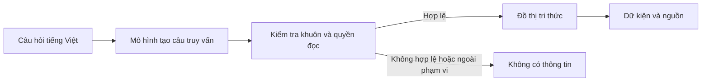

# Kiến trúc hệ thống

Tệp này trả lời câu hỏi hệ thống biến một câu hỏi học vụ thành dữ kiện có nguồn như thế nào. Tệp dành cho giảng viên, kỹ sư mới và người cần đánh giá khả năng dùng lại dự án mà không đọc mã nguồn.

## Luồng xử lý



| Bước | Ý nghĩa |
|---|---|
| Nhận câu hỏi | Hệ thống nhận một câu tiếng Việt về nội dung học vụ. |
| Tạo câu truy vấn | Mô hình đổi câu hỏi thành SPARQL. SPARQL là ngôn ngữ dùng để hỏi dữ liệu có cấu trúc; người dùng không cần tự viết nó. |
| Kiểm tra | Hệ thống chỉ chấp nhận câu truy vấn khớp một trong 50 khuôn đã định và chỉ đọc dữ liệu. |
| Tra cứu | Câu hợp lệ được chạy trên ontology. Ontology là tập dữ kiện và liên kết được sắp xếp để máy có thể tra cứu. |
| Trả kết quả | Hệ thống trả dữ kiện, trích dẫn và đường dẫn đến tài liệu gốc, hoặc trả “không có thông tin”. |

## Thành phần và trách nhiệm

| Thành phần | Làm gì | Không làm gì |
|---|---|---|
| Mô hình tạo truy vấn | Chọn một khuôn phù hợp và điền thông tin cần tra cứu. | Tự suy đoán quy định. |
| Danh mục khuôn truy vấn | Giới hạn 50 cách đọc dữ liệu được phép. | Mở quyền hỏi dữ liệu bất kỳ. |
| Ontology | Lưu nội dung học vụ và liên kết về nguồn. | Tự cập nhật quy định. |
| Bộ trả kết quả | Chuyển dữ liệu tra được thành dữ kiện dễ đọc kèm nguồn. | Viết câu trả lời hội thoại đầy đủ. |
| Lớp hội thoại bên ngoài | Có thể gọi công cụ này khi cần và viết câu trả lời cuối. | Thay thế nguồn dữ liệu của công cụ. |

Một node là một mục dữ liệu trong ontology, chẳng hạn một thủ tục hoặc một bảng. Khi chọn được node, hệ thống lấy các dữ kiện liên quan và nguồn của chúng để tránh trả lời chỉ bằng một mảnh thông tin rời rạc.

## Kết quả trả về

| Tình huống | Kết quả |
|---|---|
| Câu hỏi thuộc phạm vi và tra được dữ liệu | Dữ kiện, trích dẫn và đường dẫn tới văn bản gốc. |
| Câu hỏi ngoài phạm vi | “Không có thông tin”. |
| Câu truy vấn không thuộc khuôn cho phép | “Không có thông tin”. |
| Lỗi nạp dữ liệu hoặc lỗi dịch vụ | Báo lỗi hệ thống, không được đánh đồng với thiếu thông tin. |

Các bảng được trả nguyên khối để giữ tiêu đề, hàng, cột và ô trống như trong tài liệu. Vì vậy, người dùng có thể đối chiếu lại nội dung với nguồn thay vì nhận một bảng đã diễn giải lại.

## Phạm vi hiện có

Dự án cung cấp thành phần tra cứu và dịch vụ nhận câu hỏi. Lớp điều phối để một mô hình ngôn ngữ lớn quyết định lúc nào gọi công cụ, rồi viết câu trả lời cuối, chưa nằm trong dự án. Khi tích hợp lớp này, dữ kiện học vụ vẫn phải đến từ kết quả của công cụ.

## Kiểm tra chuỗi dữ liệu

```bash
uv run validate_sparql_dataset
.venv/bin/python -m pytest tests -q
```

Lệnh đầu kiểm tra sự khớp nhau giữa ontology, danh mục khuôn truy vấn và bộ câu hỏi. Lệnh sau chạy các phép kiểm tự động của toàn dự án.

## Tài liệu liên quan

- [Khái niệm và phạm vi](CONCEPT.md)
- [Ontology và nguồn](ONTOLOGY.md)
- [Bộ câu hỏi](DATASET.md)
- [Cách đo kết quả](EVALUATION.md)
