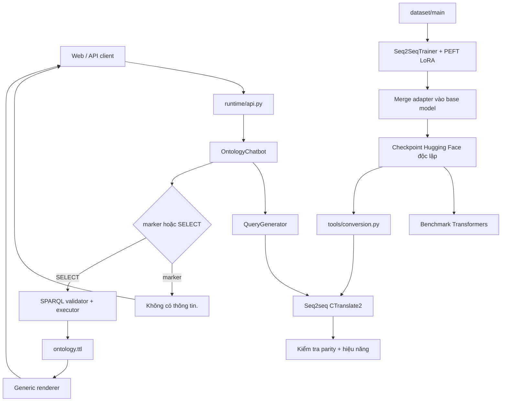

# Kiến trúc hệ thống

## Thành phần



Runtime chỉ phụ thuộc một model đã chuyển đổi, tokenizer, RDFLib và ontology.
Nó không import trainer, dataset curation hoặc code báo cáo.

## Trách nhiệm

| Thành phần | Nhận | Trả | Không làm |
|---|---|---|---|
| Normalizer | Câu hỏi | Văn bản sạch nhẹ | Dò entity, intent hoặc IRI |
| Model | Văn bản | Marker hoặc SPARQL | Đọc literal trong ontology |
| Validator | SPARQL | SPARQL an toàn | Sửa query |
| RDFLib | SPARQL + graph | Các literal | Suy đoán ý người dùng |
| Renderer | `list[dict]` | Văn bản | Chứa logic riêng cho ontology |

Model là nơi duy nhất quyết định trong/ngoài miền. Backend chỉ nhận diện marker
chính xác hoặc kiểm tra `SELECT`; không có threshold hay classifier thứ hai.

## Xử lý lỗi

Marker, query không hợp lệ và kết quả rỗng cùng trả `Không có thông tin.`. Lỗi
nạp artifact, nạp ontology và lỗi lập trình không bị che thành phản hồi nghiệp
vụ. Mỗi request được log với input chuẩn hoá, output model, trạng thái query,
số dòng kết quả và latency.

## Vòng đời model

Ba model candidate dùng cùng interface cấp cao:

```text
AutoTokenizer → AutoModelForSeq2SeqLM → PEFT LoRA → Seq2SeqTrainer
              → best adapter → merge_and_unload() → checkpoint độc lập
              → from_pretrained() → generate()
```

Checkpoint Hugging Face được mở lại trong một tiến trình đánh giá độc lập rồi
chuyển sang CTranslate2. CTranslate2 chỉ phục vụ triển khai và đo parity; không
được dùng để thay đổi kết luận về năng lực checkpoint gốc.

## An toàn truy vấn

Backend chỉ chấp nhận `SELECT`, cấm `SELECT *`, truy vấn liên kết ngoài và thao
tác thay đổi graph. URI hoặc blank node lọt ra kết quả là vi phạm contract:
query phải project label hoặc literal.

## Dạng dữ liệu nội bộ

Sau RDFLib, dữ liệu chỉ còn:

```python
list[dict[str, str | int | float | bool | None]]
```

Không có hierarchy DTO hoặc cấu trúc traversal riêng.
