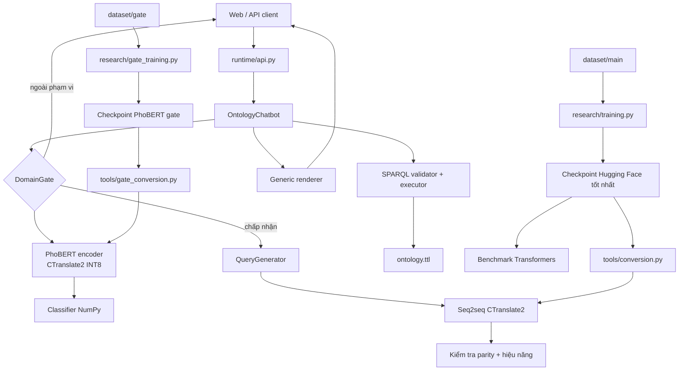

# Kiến trúc hệ thống

## Thành phần



Runtime chỉ phụ thuộc hai model đã chuyển đổi, tokenizer, NumPy, RDFLib và ontology. Nó
không import trainer, dataset curation hay code báo cáo.

## Trách nhiệm

| Thành phần | Nhận | Trả | Không làm |
|---|---|---|---|
| Normalizer | Câu hỏi | Văn bản sạch nhẹ | Dò entity, sinh IRI |
| Domain gate | Văn bản | Nhận/từ chối + xác suất | Sinh SPARQL, truy vấn ontology |
| Model | Văn bản | SPARQL | Đọc literal trong ontology |
| Validator | SPARQL | SPARQL an toàn | Sửa query |
| RDFLib | SPARQL + graph | Các literal | Suy đoán ý người dùng |
| Renderer | `list[dict]` | Văn bản | Chứa logic riêng cho ontology |

`runtime/pipeline.py` là điểm đọc ngắn nhất để hiểu luồng chạy thật.
`research/training.py` là điểm bắt đầu cho huấn luyện; `research/evaluation.py`
định nghĩa metric dùng chung cho validation và test.

Gate luôn chạy trước generator. Khi gate từ chối, pipeline dừng ngay và API
trả thông báo phạm vi với HTTP 200; model sinh SPARQL và RDFLib không được gọi.
Ngưỡng quyết định nằm trong manifest của artifact gate, không được hard-code
trong webapp.

## Vòng đời model

Ba model dùng cùng interface cấp cao của Transformers:

```text
AutoTokenizer → AutoModelForSeq2SeqLM → Seq2SeqTrainer
              → checkpoint → from_pretrained() → generate()
```

Checkpoint Hugging Face được mở lại bằng `from_pretrained()` trong một tiến
trình đánh giá độc lập và là nguồn điểm chất lượng chính. Chính checkpoint đó
được chuyển sang CTranslate2. CTranslate2 chỉ dùng để kiểm tra parity, tốc độ
và tài nguyên triển khai; sai khác sau conversion không được quy thành năng lực
của pretrained model. Không có model lai hoặc trạng thái model đặc biệt trong
RAM.

PhoBERT là encoder chứ không phải model sinh chuỗi. CTranslate2 chuyển encoder
nhưng không mang theo classification head của Transformers, vì vậy bước
conversion xuất đúng bốn tensor đã fine-tune sang `classifier.npz`. Runtime
thực hiện công thức gốc `CLS → Linear → tanh → Linear → softmax` bằng NumPy.
Đây là cùng một gate, không phải ghép hai model học độc lập.

## An toàn truy vấn

Backend chỉ chấp nhận `SELECT`, cấm `SELECT *`, truy vấn liên kết ngoài và mọi
thao tác thay đổi graph. Kết quả tối đa 100 dòng. URI hoặc blank node lọt ra
kết quả bị xem là vi phạm contract: target phải project label hoặc literal.

## Dạng dữ liệu nội bộ

Không có hierarchy DTO. Sau RDFLib, dữ liệu chỉ còn:

```python
list[dict[str, str | int | float | bool | None]]
```

Nhờ vậy query một cột, nhiều cột, danh sách và kết quả tổng hợp cùng đi qua một
renderer.
