# Chatbot học vụ trên nền Ontology — Khái niệm & Phương pháp

> Tài liệu này giải thích **ý tưởng và cách hoạt động** của hệ thống cho người đọc **không cần biết code**.
> Mọi thứ trình bày bằng lời + sơ đồ + ví dụ. Đây là bộ khung để viết báo cáo và để hiểu nhanh toàn bộ nghiên cứu.
>
> *Lưu ý: các giá trị cụ thể trong ví dụ (email, số điện thoại, mức phí…) mang tính **minh hoạ**; số liệu thật lấy từ ontology.*
>
> *Quy ước **placeholder kết quả**: những ô đánh dấu 📊 là chỗ dành cho **biểu đồ/số liệu thật** (train, test, benchmark) — sẽ chèn vào sau khi chạy. Mỗi ô ghi rõ mô tả + tệp hình dự kiến trong `docs/figures/`.*

## Mục lục
1. [Mục tiêu nghiên cứu](#1-mục-tiêu-nghiên-cứu)
2. [Bức tranh tổng quan](#2-bức-tranh-tổng-quan)
3. [Ontology là gì — tấm bản đồ tri thức](#3-ontology-là-gì--tấm-bản-đồ-tri-thức)
4. [Pipeline Ontology (hệ đề xuất)](#4-pipeline-ontology-hệ-đề-xuất)
5. [Pipeline CSDL phẳng (hệ đối chứng)](#5-pipeline-csdl-phẳng-hệ-đối-chứng)
6. [Đánh giá mô hình sinh cây](#6-đánh-giá-mô-hình-sinh-cây)
7. [Benchmark: Ontology vs CSDL phẳng](#7-benchmark-ontology-vs-csdl-phẳng)
8. [Tóm tắt luận điểm](#8-tóm-tắt-luận-điểm)

---

## 1. Mục tiêu nghiên cứu

Xây một chatbot tra cứu **thủ tục học vụ** (học phí, bảo lưu, chuyển ngành, phòng ban…) bằng tiếng Việt,
và **kiểm định giả thuyết**: tổ chức tri thức theo **ontology** (đồ thị quan hệ) cho câu trả lời **đúng và đầy đủ hơn**
một cơ sở dữ liệu (CSDL) **phẳng** thông thường — đặc biệt ở các câu hỏi **có cấu trúc** (kết hợp nhiều điều kiện,
đi qua nhiều quan hệ, hỏi cả một nhóm kết quả). *Kết luận chỉ được rút ra **sau** khi có số liệu benchmark (phần 7).*

Nói cách khác, nghiên cứu có **hai nhân vật** chạy song song trên **cùng câu hỏi**, rồi đem **kết quả** ra so:

- **Hệ đề xuất** — *pipeline ontology*: hiểu câu hỏi rồi **đi trên bản đồ tri thức** để lấy đáp án.
- **Hệ đối chứng** — *pipeline phẳng*: tìm kiếm trên một danh sách "phiếu" phẳng (kiểu tìm kiếm thông thường).

Toàn bộ chạy **cục bộ**, không gọi dịch vụ AI bên ngoài (ràng buộc đề tài).

---

## 2. Bức tranh tổng quan

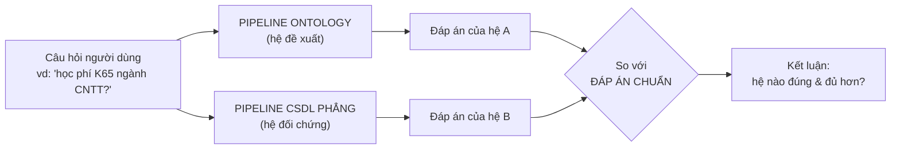

Hai hệ **nhận cùng đầu vào** (câu hỏi gốc) và đều phải **trả về cùng một loại đầu ra** (một *tập sự vật/thông tin*),
nhờ vậy mới đem ra chấm chung được. Phần 7 nói kỹ cách so.

---

## 3. Ontology là gì — tấm bản đồ tri thức

Hãy hình dung ontology như một **tấm bản đồ**:

- **Điểm trên bản đồ** = **sự vật cụ thể**: một thủ tục (*Bảo lưu*), một phòng (*Phòng CTSV*), một mức học phí (*K65 ngành CNTT*).
- **Đường nối có tên** = **quan hệ** giữa các sự vật: *"được xử lý bởi"*, *"yêu cầu điều kiện"*, *"áp dụng mức học phí"*…
- **Nhãn dán trên mỗi điểm** = **thuộc tính** (giá trị đọc được): *email*, *số điện thoại*, *địa chỉ*, *nội dung*, *học phí mỗi tín chỉ*…

Ví dụ một mảnh bản đồ quanh thủ tục **Bảo lưu**:

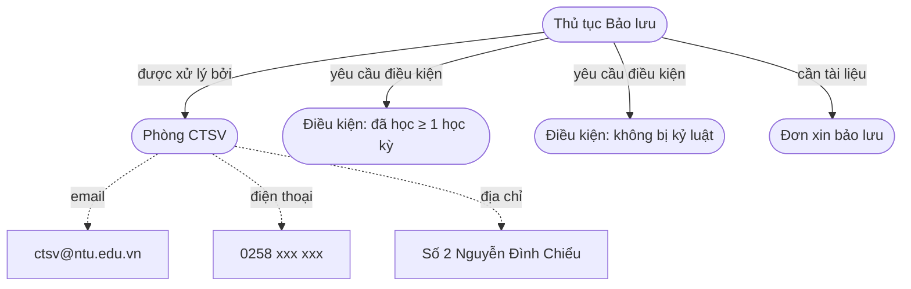

> Đường **liền** = quan hệ tới sự vật khác. Đường **gạch** = thuộc tính (giá trị lá, đọc xong là có đáp án).

Điểm mấu chốt: **mọi thông tin đều nằm ở đúng chỗ của nó và được nối với nhau bằng quan hệ có tên**. Đây là thứ
mà CSDL phẳng (phần 5) **vứt bỏ** — và cũng là lý do ontology trả lời tốt hơn ở câu hỏi có cấu trúc.

### Bảng thuật ngữ (lời thường ↔ thuật ngữ kỹ thuật)

Tài liệu dùng cách nói hình ảnh ("bản đồ / điểm / đường / nhãn") cho dễ hiểu. Bảng dưới quy về **tên kỹ thuật** để tiện đối chiếu khi viết báo cáo:

| Lời thường trong tài liệu | Thuật ngữ kỹ thuật | Ví dụ |
|---|---|---|
| sự vật / điểm trên bản đồ | **cá thể** (*individual*) | Phòng CTSV, Thủ tục Bảo lưu |
| loại sự vật | **lớp** (*class*) | Phòng ban hành chính, Quy trình học vụ |
| đường nối có tên | **quan hệ** (*object property*) | "được xử lý bởi", "áp dụng mức" |
| nhãn dán / giá trị đọc được | **thuộc tính** (*datatype property*) → **giá trị** (*literal*) | email → "ctsv@ntu.edu.vn" |
| tờ hướng dẫn đường đi | **cây truy vấn** | đầu ra của mô hình BART |
| mã định danh của một sự vật | **IRI** | dùng để khớp giữa ontology và hệ phẳng |

---

## 4. Pipeline Ontology (hệ đề xuất)

### 4.1. Hệ gồm những phần nào

Câu hỏi đi qua **5 chặng**, mỗi chặng làm một việc và biến đổi dữ liệu sang một **hình dạng** mới:

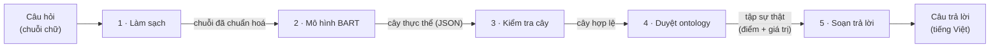

| Chặng | Chức năng | Đầu vào | Đầu ra (hình dạng dữ liệu) |
|---|---|---|---|
| **1 · Làm sạch** | Chuẩn hoá chữ (viết thường, bỏ ký tự thừa). Cố tình "ngu" — không phân tích gì | `"Học phí K65 ngành CNTT?"` | `"học phí k65 ngành cntt"` |
| **2 · Mô hình BART** | Hiểu câu, sinh **cây thực thể** (đã train từ dữ liệu) | chuỗi sạch | cây JSON: chủ thể + quan hệ/thuộc tính cần tra |
| **3 · Kiểm tra cây** | Bảo đảm cây đúng định dạng, loại bỏ phần rác | cây JSON thô | cây hợp lệ (hoặc "mơ hồ" nếu hỏng) |
| **4 · Duyệt ontology** | **Đi trên bản đồ** theo cây → lấy đáp án | cây hợp lệ | **tập điểm** (sự vật) + **giá trị** (thuộc tính) |
| **5 · Soạn trả lời** | Ghép kết quả thành câu tiếng Việt, giọng nghiêm túc | tập kết quả | chuỗi trả lời cho người dùng |

Triết lý: **toàn bộ việc "hiểu câu" dồn vào mô hình BART (chặng 2)**. Các chặng còn lại không có "luật thông minh" nào —
chặng 4 chỉ **đi theo đúng đường cây đã chỉ**. Nhờ vậy hệ dễ kiểm chứng và không chắp vá.

### 4.2. Mô hình BART làm gì — ví dụ

Mô hình nhận **câu hỏi** và in ra một **cây**: ghi rõ *bắt đầu từ sự vật nào*, rồi *đi theo quan hệ nào / đọc thuộc tính nào*.
Cây này chính là **tờ hướng dẫn đường đi** cho chặng 4.

Mỗi nút của cây có một **vai trò**:
- **chủ thể** — sự vật được hỏi tới (luôn là gốc cây);
- **quan hệ** — một đường nối cần đi theo;
- **thuộc tính** — một nhãn cần đọc giá trị (là điểm cuối, cho ra đáp án);
- (chủ thể con) — để **lọc giao** khi câu hỏi ghép nhiều điều kiện.

**Ví dụ 1 — câu đơn giản:** *"phòng công tác sinh viên ở đâu?"*
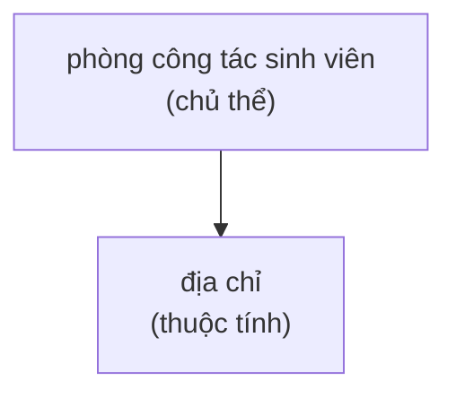

**Ví dụ 2 — đi một quan hệ:** *"phòng nào xử lý thủ tục bảo lưu?"*
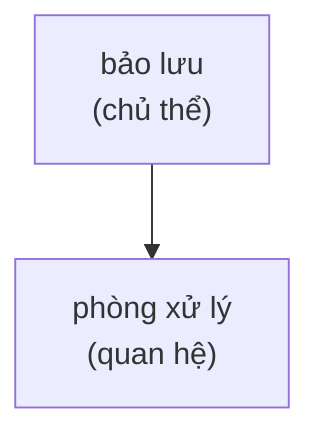

**Ví dụ 3 — đi nhiều chặng:** *"email của phòng xử lý thủ tục bảo lưu?"*
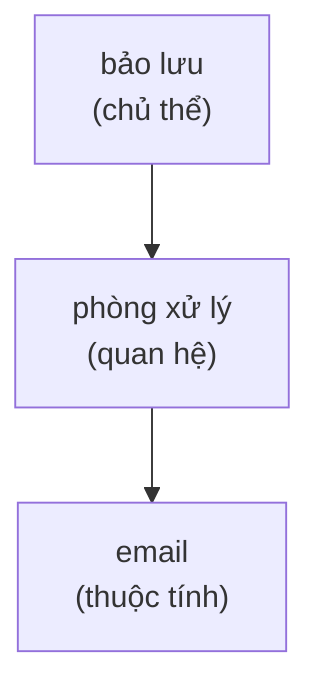

**Ví dụ 4 — ghép điều kiện (giao):** *"học phí khoá K65 ngành CNTT?"* — các tầng **lồng nhau** (K65 → CNTT) nghĩa là *lọc dần* = phép VÀ (xem §4.3).
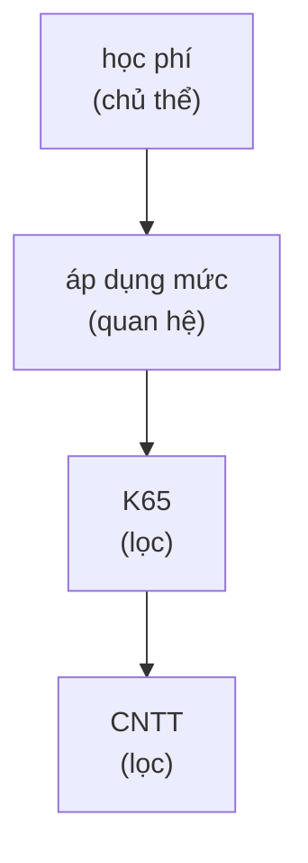

**Mô hình học làm việc này nhờ đâu?** Nhờ **bộ dữ liệu huấn luyện ép buộc**: ta cho mô hình xem ~vài nghìn cặp
*(câu hỏi → cây mẫu đúng)*. Quan trọng là dữ liệu phủ **nhiều cách diễn đạt khác nhau cho cùng một ý**, nên mô hình
học được **ý**, không học vẹt câu chữ. Ví dụ ba câu sau cho ra **cùng một cây**:

| Câu hỏi (diễn đạt khác nhau) | Cây sinh ra |
|---|---|
| "học phí K65 ngành CNTT" | học phí → áp dụng mức → {K65, CNTT} |
| "cho em hỏi sinh viên K65 công nghệ thông tin đóng bao nhiêu một tín" | *(cây y hệt)* |
| "hp khóa 65 cntt" | *(cây y hệt)* |

Mô hình còn **phân loại ý định** của câu (gắn ở gốc cây) để hệ biết khi nào **không nên tra**:

| Loại câu | Ví dụ | Hệ trả lời |
|---|---|---|
| Câu hỏi thật | "điều kiện bảo lưu là gì" | tra ontology rồi trả thông tin |
| Chào hỏi | "xin chào", "cảm ơn ad" | chào lại |
| Ngoài phạm vi | "hôm nay trời mưa không" | "Không có thông tin." |
| Mơ hồ | "thủ tục như nào", "phòng nào" | "Không hiểu câu hỏi." |

### 4.3. Thuật toán duyệt — ví dụ "đi bản đồ"

Chặng 4 chỉ làm **một việc**: đặt ngón tay lên điểm xuất phát, rồi **lần theo đúng những đường mà cây chỉ**. Trong khi đi,
nó giữ một **"tập điểm hiện tại"** (đang đứng ở những đâu) và biến đổi tập đó qua mỗi nút con:

- gặp **quan hệ** → đi theo đường đó tới các điểm kế tiếp (tập hiện tại **nhảy** sang điểm đích);
- gặp **thuộc tính** → đọc nhãn → **trả giá trị** (kết thúc nhánh);
- gặp **chủ thể con (lọc)** → trong các điểm đang có, **chỉ giữ** điểm khớp tên → **thu hẹp** tập.

Quy tắc ghép có **hai trường hợp đối nhau** — đừng lẫn:
- **Lồng nhau (cha → con nối tiếp) = phép VÀ = GIAO.** Mỗi tầng con *lọc tiếp* trên kết quả của tầng cha (thu hẹp dần). Dùng cho "K65 **và đồng thời** CNTT".
- **Anh em (nhiều con cùng một cha) = nhánh ĐỘC LẬP = GỘP/HỢP.** Mỗi nhánh chạy riêng từ cùng điểm rồi **cộng** kết quả. Dùng cho "K65 **với** K67" (hai khoá khác nhau).

**Ví dụ A — đi nhiều chặng** (*"email của phòng xử lý thủ tục bảo lưu"*):

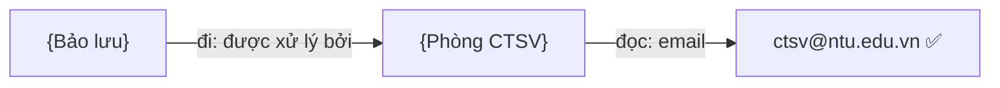

Bắt đầu ở *Bảo lưu* → lần theo *được xử lý bởi* → tới *Phòng CTSV* → đọc nhãn *email* → **xong**. Lưu ý: email **không**
nằm cùng chỗ với "bảo lưu" — phải **đi qua một quan hệ** mới tới. Đây là điều CSDL phẳng rất khó làm.

**Ví dụ B — lọc giao** (*"học phí K65 ngành CNTT"*):

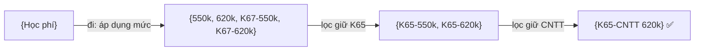

Hai phép lọc **VÀ** nối tiếp → từ 4 mức ban đầu thu về **đúng 1 mức**. Đây là **giao điều kiện** — thế mạnh lõi của ontology.

**Ví dụ C — trả cả một tập** (*"học phí khoá K65"* — không nêu ngành):

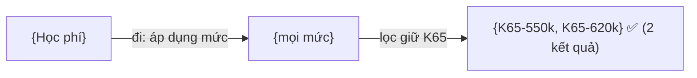

Hệ trả **đúng 2 mức** vì nó **đi tới đúng các điểm** chứ không "đoán lấy mấy kết quả".

**Ví dụ C2 — gộp/hợp** (*"học phí khoá K65 với khoá K67"* — hai nhánh **anh em**, không phải lồng):

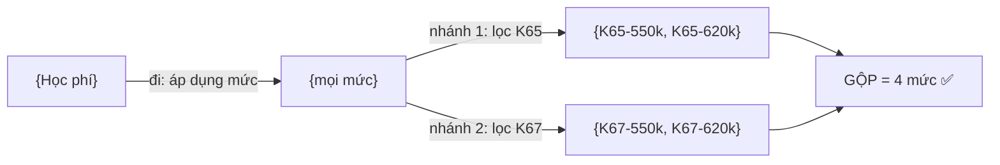

Hai nhánh chạy độc lập rồi **cộng** lại → ra **cả 4 mức** — khác hẳn phép **giao** (lồng nhau) ở Ví dụ B chỉ còn 1 mức. Đây chính là chỗ
*lồng nhau* và *anh em* cho kết quả **ngược nhau**, nên mô hình phải học đặt đúng cấu trúc cây.

**Ví dụ D — không có dữ liệu:** *"học phí ngành Y khoa"* (ngành không có trong ontology) → đi tới *áp dụng mức* nhưng
**không điểm nào khớp "Y khoa"** → hệ trả thẳng *"Không có thông tin «Y khoa»."* (không bịa).

---

## 5. Pipeline CSDL phẳng (hệ đối chứng)

Đây là **đối thủ** trong benchmark — đại diện cho cách làm chatbot tra cứu **thông thường** (không dùng ontology).
Ta xây nó **đàng hoàng, mạnh nhất có thể** để phép so công bằng.

### 5.1. Kho phẳng được xây thế nào — ví dụ

Lấy **mỗi sự vật** trong ontology và "dập phẳng" nó thành **một phiếu** (một đoạn văn bản gộp): tên + tên gọi khác +
mọi giá trị thuộc tính + loại. **Bỏ hết các đường quan hệ** — chỉ còn văn bản rời.

> Phiếu của **Phòng CTSV** (minh hoạ):
> ```
> Phòng Công tác Sinh viên | CTSV | phòng ctsv |
> email: ctsv@ntu.edu.vn | điện thoại: 0258 xxx xxx |
> địa chỉ: Số 2 Nguyễn Đình Chiểu | loại: Phòng ban hành chính
> ```

> Phiếu của mức **K65 ngành CNTT** (minh hoạ):
> ```
> Mức học phí K65 CNTT | Công nghệ thông tin | k65 |
> học phí mỗi tín chỉ: 620.000đ | loại: Định mức học phí
> ```

Đúng như bạn hình dung: **mỗi phiếu tương ứng một cá thể (individual) trong ontology**, dùng **chung mã định danh (id = IRI)**
để sau này chấm điểm so được với ontology. Khác biệt **cốt tử**: phiếu là **văn bản rời rạc**, không biết "Phòng CTSV"
*xử lý* "Bảo lưu" — quan hệ đã bị xoá.

### 5.2. Hệ gồm những phần nào

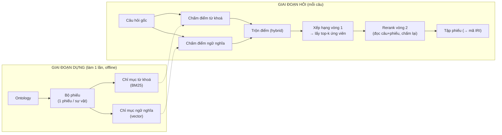

| Phần | Chức năng | Đầu vào | Đầu ra (hình dạng) |
|---|---|---|---|
| Bộ phiếu | Dập phẳng ontology thành văn bản | ontology | danh sách phiếu (văn bản) |
| Chỉ mục từ khoá | Xếp hạng theo độ khớp từ, có xét độ hiếm (BM25) | bộ phiếu | bảng tra từ → phiếu |
| Chỉ mục ngữ nghĩa | Biến mỗi phiếu thành **vector** (dãy số biểu diễn nghĩa) | bộ phiếu | danh sách vector |
| Chấm + trộn | So câu hỏi với từng phiếu theo 2 cách rồi gộp | câu hỏi | điểm số cho mỗi phiếu |
| Xếp hạng vòng 1 | Sắp theo điểm trộn, lấy top-k ứng viên | điểm số | k phiếu ứng viên |
| **Rerank vòng 2** | Mô hình đọc **câu hỏi + từng phiếu cùng lúc**, chấm lại độ liên quan | k ứng viên | tập phiếu xếp lại (mã IRI) |

### 5.3. Hybrid search — thuật toán & ví dụ

"Hybrid" = **trộn hai kiểu tìm kiếm** vì mỗi kiểu mạnh một chỗ:

- **Tìm theo từ khoá (BM25):** xếp hạng phiếu theo mức khớp từ, **có xét tần suất và độ hiếm của từ** (từ hiếm trùng nhau cho điểm cao hơn từ phổ biến). *Mạnh* khi dùng đúng từ; *yếu* khi viết tắt/khác chữ
  (vd "hp" vs "học phí", "dk" vs "điều kiện").
- **Tìm theo ngữ nghĩa (vector):** biến câu hỏi và phiếu thành **vector số**; hai vector gần nhau = nghĩa gần nhau, **dù khác chữ**.
  *Mạnh* khi diễn đạt lệch; *yếu* khi cần khớp chính xác mã/tên riêng.

Cách trộn (minh hoạ): chuẩn hoá điểm hai bên về cùng thang `[0..1]` rồi cộng có trọng số.

> **Ví dụ:** câu hỏi *"phòng ctsv liên hệ kiểu gì"*, xét 3 phiếu:
>
> | Phiếu | Điểm từ khoá | Điểm ngữ nghĩa | Trộn (0.5/0.5) |
> |---|---|---|---|
> | **Phòng CTSV** | 0.7 (trùng "ctsv", "phòng") | 0.9 (gần nghĩa "liên hệ") | **0.80** ✅ |
> | Phòng KHTC | 0.2 | 0.5 | 0.35 |
> | Thủ tục Bảo lưu | 0.1 | 0.3 | 0.20 |
>
> → xếp hạng: **Phòng CTSV** đứng đầu → trả phiếu đó.

Hình dạng dữ liệu chạy xuyên qua: `câu hỏi (chữ)` → `2 dãy điểm` → `1 dãy điểm đã trộn` → `danh sách phiếu xếp hạng` → `top-k phiếu`.

### 5.4. Rerank — đọc kỹ lại top-k

Vòng 1 (hybrid) tìm **nhanh** nhưng "thô": nó chấm câu hỏi và phiếu một cách *rời rạc*. **Rerank** là vòng 2 tinh hơn —
một mô hình **đọc đồng thời câu hỏi VÀ từng phiếu ứng viên** rồi chấm lại độ liên quan, nhờ đọc cùng lúc nên hiểu ngữ cảnh
tốt hơn. Vì chậm, nó **chỉ chạy trên top-k** phiếu mà vòng 1 lọc ra, không quét toàn kho.

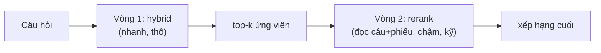

> *Cấu hình cụ thể (đã thử ở `stress_test_vram.py`): truy hồi bằng **BGE-M3** (một mô hình sinh **cả** vector ngữ nghĩa lẫn trọng số
> từ khoá), rerank bằng **BGE-reranker-v2-m3**. Đây là baseline phẳng **mạnh** (mô hình thần kinh đa ngữ) — cố ý chọn mạnh để phép so
> không bị tố "đánh baseline yếu". Cụm baseline này là **module benchmark riêng**, chạy lúc đánh giá (được phép dùng GPU), KHÔNG nằm
> trong bản triển khai CPU.*

**Lưu ý quan trọng:** dù mạnh, rerank vẫn chỉ **xếp lại các phiếu** — nó **vẫn không đi theo quan hệ, không lọc giao, và trả về một
phiếu chứ không phải một thuộc tính cụ thể**. Nên các thế mạnh của ontology ở phần 7 vẫn còn nguyên.

> ⚠️ **Giới hạn cố hữu của hệ phẳng** (sẽ lộ ra ở phần 7): nó chỉ tìm được **phiếu giống câu hỏi nhất**. Nó **không đi theo quan hệ**,
> **không lọc giao**, và **không biết phải trả bao nhiêu** kết quả (phải tự chọn `k`).

---

## 6. Đánh giá mô hình sinh cây

Phần này đo **riêng chất lượng mô hình BART** (chặng 2): nó sinh cây tốt tới đâu? Vì đầu ra là **một cấu trúc** (cây JSON)
chứ không phải một nhãn, ta **không** chấm như bài phân loại thông thường, mà chấm theo **nhiều bước từ lỏng đến chặt**:

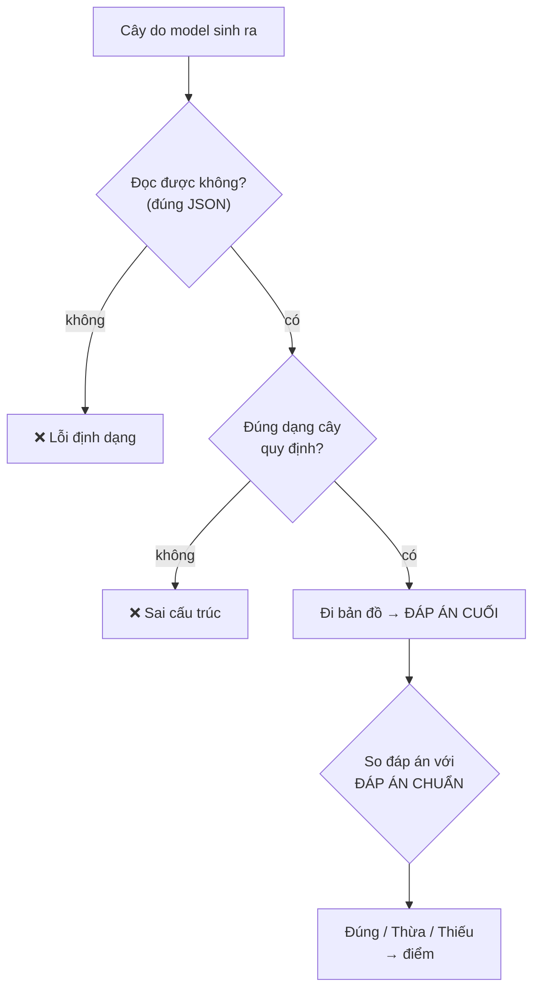

**Vì sao chấm ở "đáp án cuối" mới đúng:** điều người dùng nhận là **câu trả lời sau khi đi bản đồ**, không phải cây trung gian.
Hai cây *viết khác nhau* vẫn có thể cho *cùng đáp án đúng* (vd "K65 CNTT" và "CNTT K65" đảo thứ tự). Nếu chấm theo *từng chữ của cây*
thì phạt oan. Ngược lại, cây *lệch một chút* có thể **đi ra đáp án sai** — chỉ so đáp-án-cuối mới bắt được.

**Cách tính điểm** (ở mức đáp án cuối): với mỗi câu, gọi
**Đúng** = số kết quả vừa-trả-vừa-đúng · **Thừa** = trả ra nhưng sai · **Thiếu** = đúng nhưng bỏ sót. Khi đó:

- **Độ chính xác (precision)** = Đúng ÷ (Đúng + Thừa) → *"trả ra có bị lẫn rác không"*
- **Độ bao phủ (recall)** = Đúng ÷ (Đúng + Thiếu) → *"có bỏ sót gì không"*
- **F1** = trung bình hài hoà của hai cái trên (một con số cân bằng)
- **Khớp-trọn-vẹn** = đúng **y hệt** cả tập (1 hoặc 0) — thước đo nghiêm nhất

**Ví dụ chấm** — câu *"học phí khoá K65"*, đáp án chuẩn = `{K65-550k, K65-620k}`:

| Mô hình trả ra | Đọc được? | Đúng dạng? | Đúng | Thừa | Thiếu | Chính xác | Bao phủ | F1 | Khớp-trọn |
|---|:--:|:--:|:--:|:--:|:--:|:--:|:--:|:--:|:--:|
| `{K65-550k, K65-620k}` | ✓ | ✓ | 2 | 0 | 0 | 100% | 100% | 100% | ✅ |
| `{K65-550k, K65-620k, K67-620k}` *(thừa 1)* | ✓ | ✓ | 2 | 1 | 0 | 67% | 100% | 80% | ❌ |
| `{K65-550k}` *(sót 1)* | ✓ | ✓ | 1 | 0 | 1 | 100% | 50% | 67% | ❌ |
| `{Phòng CTSV}` *(sai chủ thể)* | ✓ | ✓ | 0 | 1 | 2 | 0% | 0% | 0% | ❌ |
| `học phí: [ {...` *(JSON vỡ)* | ✗ | – | – | – | – | – | – | – | ❌ (lỗi định dạng) |

Ngoài ra, **việc phân loại ý định** (câu hỏi thật / chào / ngoài phạm vi / mơ hồ) **đúng là bài phân loại 4 lớp bình thường**,
nên chấm theo chuẩn quen thuộc (đúng/sai từng lớp, kèm **ma trận nhầm lẫn** cho thấy lớp nào hay bị lẫn lớp nào).

**Trực quan hoá (cho báo cáo):** biểu đồ cột điểm theo **từng loại câu hỏi** (đơn / nhiều chặng / giao / trả-tập…) để thấy
mô hình mạnh/yếu ở đâu; đường cong huấn luyện; ma trận nhầm lẫn cho phần phân loại ý định.

> 📊 **[PLACEHOLDER — KẾT QUẢ THỰC, chèn sau khi train xong]**
> *Đường cong huấn luyện:* mất mát trên tập huấn luyện so với tập kiểm định (validation) theo từng bước — để thấy mô hình hội tụ và không học vẹt.
> Tệp dự kiến: `docs/figures/training_curve.png`
> <!--  -->

> 📊 **[PLACEHOLDER — KẾT QUẢ THỰC, chèn sau khi đánh giá]**
> *Điểm theo từng loại câu hỏi:* biểu đồ cột F1 / khớp-trọn-vẹn cho từng loại (đơn / nhiều chặng / giao / trả-tập / âm tính…).
> Tệp dự kiến: `docs/figures/eval_per_category.png`
> <!--  -->

> 📊 **[PLACEHOLDER — KẾT QUẢ THỰC, chèn sau khi đánh giá]**
> *Ma trận nhầm lẫn phân loại ý định:* 4 lớp (câu hỏi thật / chào / ngoài phạm vi / mơ hồ) — lớp nào hay bị lẫn lớp nào.
> Tệp dự kiến: `docs/figures/intent_confusion.png`
> <!--  -->

> *Lưu ý: BLEU/ROUGE (đo độ giống chữ, dùng cho dịch máy/tóm tắt) **không hợp** làm thước đo chính ở đây — cây JSON không phải
> văn xuôi, và "giống chữ" không bảo đảm "ra đúng đáp án". Cùng lắm chỉ dùng tham khảo phụ.*

---

## 7. Benchmark: Ontology vs CSDL phẳng

Đây là phần **chứng minh luận điểm** của đề tài.

### 7.1. So thế nào cho công bằng

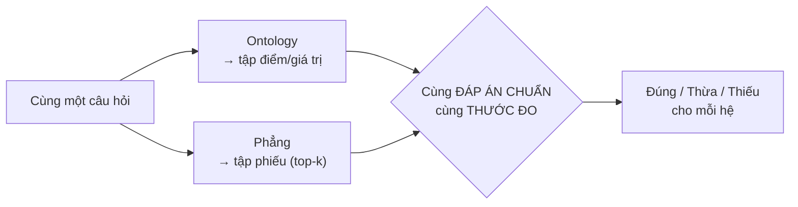

- **Cùng đầu vào:** cả hai nhận **câu hỏi gốc** (hệ phẳng **không** được mượn cây của mô hình — nếu mượn thì thành so thiên vị).
- **Cùng đầu ra để so:** quy về cùng dạng **đáp án chuẩn**, gồm 3 kiểu tuỳ câu hỏi — **(a) tập cá thể** (mã IRI), **(b) đúng thuộc tính được hỏi** (email vs điện thoại…), **(c) giá trị** (chuỗi). Chấm bằng cùng bộ thước đo phần 6. **Lấy đúng phiếu nhưng sai thuộc tính = vẫn tính SAI.**
- **Khác biệt khi chấm:** ontology trả **đúng một tập có lực lượng xác định**; hệ phẳng trả **danh sách xếp hạng** nên phải
  **đoán lấy `k` phiếu đầu** → ta báo cáo thêm "độ bao phủ trong top-k" **và nêu thẳng hạn chế "phải đoán k"** (bản thân nó là một phát hiện).

**Các cấu hình hệ phẳng đem so** (để phép so vững và tự phản biện):
1. **Phẳng cơ bản:** hybrid (từ khoá + ngữ nghĩa) → rerank, ăn câu hỏi gốc.
2. **Phẳng gộp-sẵn:** mỗi phiếu nhồi luôn thông tin hàng xóm → baseline **khó nhất** cho ontology ở câu nhiều chặng.
3. **Phẳng + thực-thể (đối chứng bổ trợ):** đưa **thực thể mà mô hình trích được** vào search phẳng. Nếu ontology *vẫn* thắng cấu hình này
   thì lợi thế đến từ **cách lưu trữ (đồ thị)**, không phải chỉ nhờ khâu hiểu câu — chặn phản biện "bạn thắng chỉ nhờ NLU".

### 7.2. Bộ dữ liệu benchmark

Chính là **bộ câu hỏi kiểm tra** (phần để riêng, **không** dùng huấn luyện), mỗi câu kèm **đáp án chuẩn** (tập sự vật/giá trị
đã biết là đúng). Lưu ý:

- Hệ phẳng **không hề được huấn luyện** — nó chỉ lập chỉ mục các phiếu. Hệ ontology dùng mô hình đã train.
- Cả hai bị hỏi **những câu chưa từng thấy**, và bộ câu kiểm tra cố tình **diễn đạt khác** với dữ liệu huấn luyện (để không "ăn may").
- **Quy mô:** tổng **5898 câu** (huấn luyện **4453** / kiểm tra **1445**); mỗi câu kèm đáp án chuẩn **tự kiểm bằng thuật toán duyệt** (sinh từ ontology, không gán tay). Việc tách test theo **cách diễn đạt khác** train chính là bằng chứng cho tuyên bố "mô hình học *ý*, không học vẹt câu chữ".

**Các loại câu hỏi (để chấm tách nhóm):** *đơn* (1 sự vật, đọc 1 thuộc tính) · *nhiều chặng* (đi ≥2 quan hệ nối tiếp) · *giao* (lồng nhiều điều kiện) · *trả-tập* (đáp án là một nhóm) · *âm tính* (đúng ra phải trả "không có thông tin" / "không hiểu câu hỏi").

### 7.3. Các ví dụ so sánh then chốt

> Đây là những tình huống cho thấy **ontology thắng ở đâu và vì sao**.

| Câu hỏi | Loại | Ontology làm được | Hệ phẳng vướng gì | Ai thắng |
|---|---|---|---|---|
| "email phòng CTSV" | tra cứu đơn | tới phiếu CTSV, đọc email | cũng tìm đúng phiếu CTSV | **Hoà** |
| "học phí K65 ngành CNTT" | giao điều kiện | lọc K65 **VÀ** CNTT → đúng 1 | lẫn mức K65 ngành khác + K67 ngành CNTT | **Ontology** |
| "học phí khoá K65" | trả cả tập | đi tới đúng 2 mức | phải đoán `k`: lấy 1 thì thiếu, lấy 3 thì thừa | **Ontology** |
| "email phòng xử lý bảo lưu" | nhiều chặng | bảo lưu → phòng → email | phiếu "bảo lưu" **không chứa** email | **Ontology** |
| "số điện thoại phòng KHTC" vs "email phòng KHTC" | chọn đúng thuộc tính | trả đúng **field** được hỏi | lấy đúng phiếu nhưng phiếu có cả 2 → khó chọn field | **Ontology** |

**Minh hoạ "giao điều kiện"** — *"học phí K65 ngành CNTT"*, đáp án chuẩn = `{K65-CNTT 620k}`:

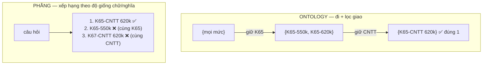
→ Hệ phẳng **không làm được phép VÀ**: mọi phiếu chứa "K65" *hoặc* "CNTT" đều nổi lên → lẫn kết quả sai.

**Minh hoạ "nhiều chặng"** — *"email phòng xử lý bảo lưu"*:

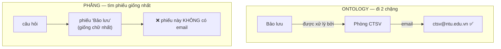
→ Email nằm ở **phiếu khác** (Phòng CTSV), nối với "bảo lưu" qua **một quan hệ** mà hệ phẳng đã xoá → nó **không bắc cầu** được.

> **Biến thể khó nhất cho ontology (để khỏi bị tố "đánh bù nhìn"):** ta còn dựng một kho phẳng **gộp sẵn** (mỗi phiếu nhồi luôn
> thông tin của hàng xóm). Khi đó câu nhiều chặng dễ hơn cho hệ phẳng — nhưng câu **giao điều kiện** và **trả-cả-tập** thì hệ phẳng
> vẫn vướng. Báo cáo trung thực cả những chỗ này.

### 7.4. Kỳ vọng kết quả (trung thực)

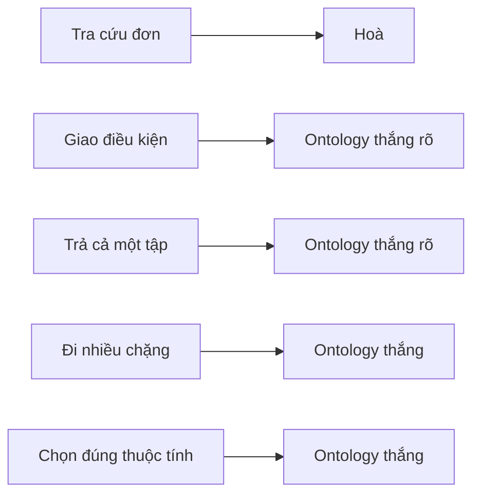

Báo cáo nêu **cả chỗ hoà** (tra cứu đơn) để phép so đáng tin, và làm nổi bật chỗ ontology vượt trội: **giao điều kiện, trả-cả-tập, đi nhiều chặng**.

### 7.5. Kết quả benchmark thực (chèn sau)

> 📊 **[PLACEHOLDER — KẾT QUẢ THỰC, chèn sau khi chạy benchmark]**
> *So sánh chính:* biểu đồ cột Ontology vs Phẳng-từ-khoá vs Phẳng-ngữ-nghĩa, theo **từng loại câu hỏi**, dùng độ chính xác / bao phủ / khớp-trọn-vẹn.
> Tệp dự kiến: `docs/figures/benchmark_per_type.png`
> <!--  -->

> 📊 **[PLACEHOLDER — KẾT QUẢ THỰC, chèn sau khi chạy benchmark]**
> *Hạn chế "phải đoán k" của hệ phẳng:* đường cong độ bao phủ theo số phiếu lấy ra (recall@k) — cho thấy hệ phẳng phải đánh đổi giữa thiếu và thừa.
> Tệp dự kiến: `docs/figures/recall_at_k.png`
> <!--  -->

> 📊 **[PLACEHOLDER — BẢNG SỐ TỔNG HỢP, chèn sau khi chạy benchmark]**
> *Bảng tổng:* điểm trung bình mỗi hệ trên toàn bộ tập kiểm tra + tách theo loại câu hỏi (con số để dẫn trong báo cáo).

---

## 8. Tóm tắt luận điểm

1. **Ontology = bản đồ tri thức**: sự vật là điểm, quan hệ là đường có tên, thuộc tính là nhãn.
2. **Mô hình BART** biến câu hỏi thành **tờ hướng dẫn đường đi** (cây thực thể) — học được nhờ **dữ liệu huấn luyện ép buộc**, phủ nhiều cách diễn đạt.
3. **Thuật toán duyệt** chỉ **đi theo đường cây chỉ** trên bản đồ; nhờ đi-theo-quan-hệ mà làm được **giao điều kiện, đi nhiều chặng, trả đúng cả tập**.
4. **Đánh giá mô hình** chấm ở **đáp án cuối** (Đúng/Thừa/Thiếu → chính xác/bao phủ/F1), không chấm từng chữ của cây.
5. **Hệ phẳng** (đối chứng) dập tri thức thành phiếu rời + **tìm kiếm lai** (từ khoá + ngữ nghĩa); chỉ tìm "phiếu giống nhất",
   **không đi theo quan hệ, không lọc giao, phải đoán số kết quả**.
6. **Benchmark** cho hai hệ **cùng câu hỏi, cùng đáp án chuẩn, cùng thước đo** → **kiểm chứng** giả thuyết ontology trả lời **đúng và đủ hơn** ở câu hỏi có cấu trúc (kết luận dựa trên số liệu phần 7).
