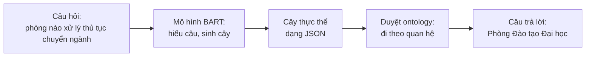
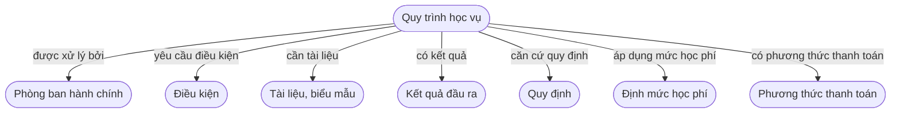
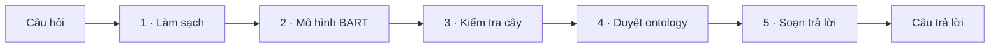
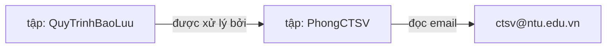
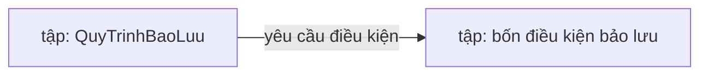
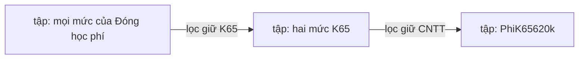
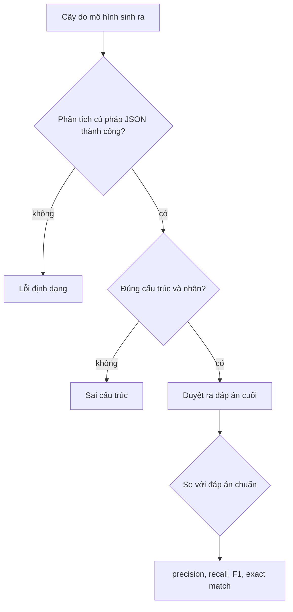
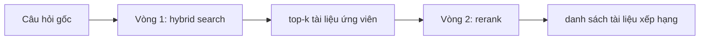
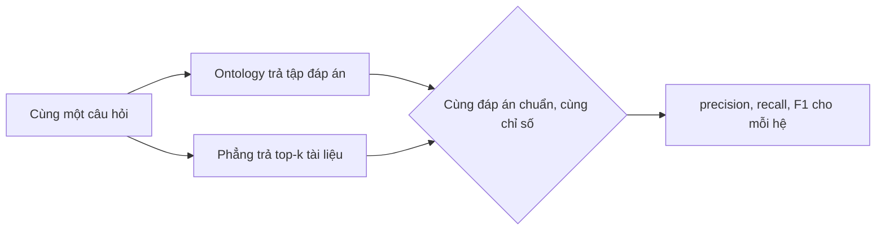
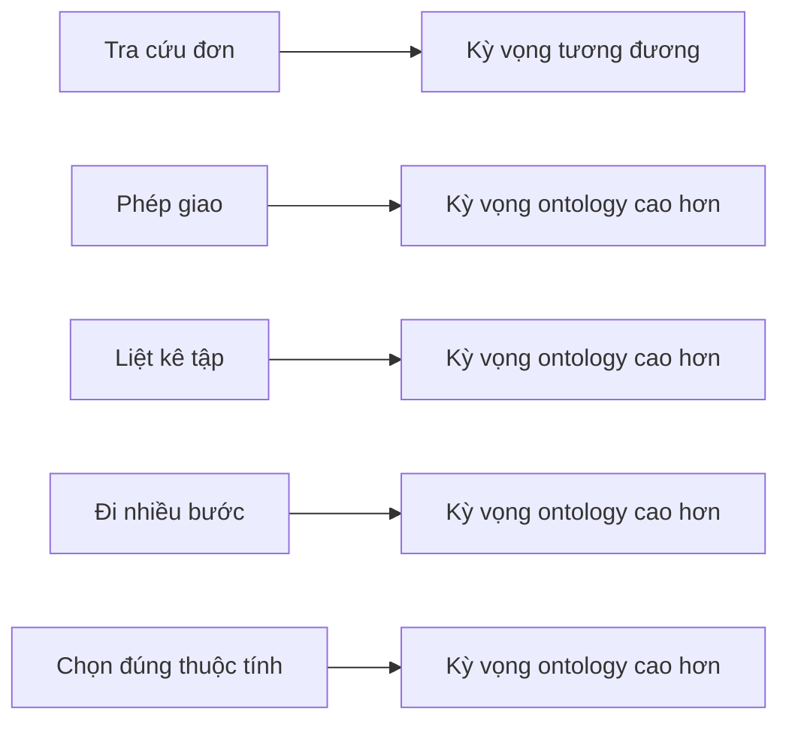

# Chatbot tra cứu quy trình học vụ trên nền Ontology: Khái niệm và Phương pháp

Tài liệu trình bày ý tưởng, kiến trúc và phương pháp đánh giá của hệ thống ở mức khái niệm, không yêu cầu người đọc tiếp xúc mã
nguồn. Nội dung được minh hoạ bằng sơ đồ và dữ liệu thật trích từ ontology của đề tài, nhằm làm cơ sở cho báo cáo khoa học.

Trọng tâm của đề tài là chatbot tra cứu các quy trình học vụ dựa trên ontology. Phép đối chứng với cơ sở dữ liệu phẳng ở Mục 6 là
nội dung bổ trợ, nhằm làm rõ giá trị của ontology, không phải mục tiêu chính.

## Mục lục
1. [Mục tiêu nghiên cứu](#1-mục-tiêu-nghiên-cứu)
2. [Tổng quan hệ thống](#2-tổng-quan-hệ-thống)
3. [Ontology lấy quy trình học vụ làm trung tâm](#3-ontology-lấy-quy-trình-học-vụ-làm-trung-tâm)
4. [Hệ thống chính: pipeline ontology](#4-hệ-thống-chính-pipeline-ontology)
5. [Đánh giá mô hình sinh cây](#5-đánh-giá-mô-hình-sinh-cây)
6. [Nội dung bổ trợ: đối chứng với cơ sở dữ liệu phẳng](#6-nội-dung-bổ-trợ-đối-chứng-với-cơ-sở-dữ-liệu-phẳng)
7. [Tóm tắt](#7-tóm-tắt)

---

## 1. Mục tiêu nghiên cứu

Nghiên cứu xây dựng một chatbot tiếng Việt tra cứu các quy trình học vụ của Trường Đại học Nha Trang, tổ chức tri thức theo mô
hình ontology. Hệ tri thức gồm chín quy trình học vụ: xin bảo lưu kết quả học tập, xin chuyển ngành, đăng ký học phần, học cải
thiện, đăng ký học lại, đóng học phí, rút môn học, xét học bổng và xét tốt nghiệp.

Việc chọn ontology xuất phát từ một đặc điểm bản chất của miền học vụ: một quy trình không tồn tại độc lập mà liên kết tới nhiều
đối tượng khác. Một câu hỏi về thủ tục bảo lưu có thể nhắm tới phòng ban phụ trách, các điều kiện cần thoả mãn, biểu mẫu phải nộp,
quy định làm căn cứ, hoặc kết quả của thủ tục. Ontology biểu diễn các liên kết đó dưới dạng các quan hệ có tên, nhờ vậy hệ thống
trả lời được cả những câu hỏi đòi hỏi đi qua nhiều liên kết liên tiếp.

Để kiểm tra giả thuyết rằng cách tổ chức này có lợi thế, Mục 6 bổ sung một phép đối chứng với cơ sở dữ liệu phẳng theo lối tìm
kiếm thông thường. Phần đối chứng đóng vai trò minh chứng bổ trợ; trọng tâm nghiên cứu nằm ở chính hệ thống ontology trình bày tại
các Mục 3–5.

---

## 2. Tổng quan hệ thống

Hệ thống tiếp nhận một câu hỏi và sinh ra câu trả lời thông qua một chuỗi xử lý tuyến tính, thể hiện ở Hình 1.



**Hình 1.** Luồng xử lý tổng quát của hệ thống.

Thành phần cốt lõi là ontology, đóng vai trò kho tri thức về các quy trình học vụ, cùng thuật toán duyệt vận hành trên ontology
đó. Mô hình BART giữ vai trò trung gian, dịch câu hỏi ngôn ngữ tự nhiên thành một lộ trình truy vấn để thuật toán duyệt thi hành.

---

## 3. Ontology lấy quy trình học vụ làm trung tâm

Ontology của đề tài được tổ chức theo bốn loại thành phần. **Cá thể** (*individual*) biểu diễn một sự vật cụ thể như một quy trình,
một phòng ban hay một điều kiện. **Lớp** (*class*) là loại của cá thể. **Quan hệ** (*object property*) là liên kết có tên giữa hai
cá thể, chẳng hạn *được xử lý bởi* hay *yêu cầu điều kiện*. **Thuộc tính** (*datatype property*) gắn một giá trị đọc được lên cá
thể, chẳng hạn email hay số điện thoại của một phòng ban. Để dễ hình dung, có thể xem ontology như một đồ thị có hướng, trong đó
cá thể là đỉnh, quan hệ là cung có nhãn, còn thuộc tính là giá trị treo trên đỉnh.

### 3.1. Quy trình học vụ là trung tâm liên kết

Đặc điểm then chốt của ontology trong đề tài là mỗi quy trình học vụ giữ vai trò một trung tâm liên kết, kết nối tới các đối tượng
liên quan. Tập đầy đủ các quan hệ mà một quy trình có thể có gồm bảy loại, thể hiện ở Hình 2; mỗi quy trình cụ thể chỉ dùng một
tập con tuỳ bản chất thủ tục.



**Hình 2.** Bảy quan hệ trong tập đầy đủ của một quy trình học vụ. Hai quan hệ *áp dụng mức học phí* và *có phương thức thanh toán*
chỉ xuất hiện ở quy trình đóng học phí; các quy trình khác dùng các quan hệ còn lại.

Bảng 1 liệt kê chín quy trình cùng phòng ban phụ trách và một câu hỏi mẫu cho mỗi quy trình, cho thấy phạm vi tra cứu trải đều
trên nhiều loại quan hệ khác nhau chứ không tập trung vào học phí.

**Bảng 1.** Chín quy trình học vụ, phòng ban phụ trách và câu hỏi mẫu.

| Quy trình | Phòng phụ trách | Câu hỏi mẫu |
|---|---|---|
| Xin bảo lưu kết quả học tập | Phòng Công tác Sinh viên | các điều kiện để được bảo lưu |
| Xin chuyển ngành | Phòng Đào tạo Đại học | thủ tục chuyển ngành cần biểu mẫu gì |
| Đăng ký học phần | Phòng Đào tạo Đại học | đăng ký học phần căn cứ quy định nào |
| Học cải thiện | Phòng Đào tạo Đại học | kết quả của học cải thiện là gì |
| Đăng ký học lại | Phòng Đào tạo Đại học | điều kiện đăng ký học lại |
| Đóng học phí | Phòng Tài chính | phương thức thanh toán học phí |
| Rút môn học | Phòng Đào tạo Đại học | phòng nào xử lý rút môn học |
| Xét học bổng | Phòng Công tác Sinh viên | điều kiện xét học bổng |
| Xét tốt nghiệp | Phòng Đào tạo Đại học | xét tốt nghiệp cần nộp biểu mẫu nào |

Ontology định nghĩa tám lớp đối tượng: Quy trình học vụ, Phòng ban hành chính, Điều kiện, Tài liệu biểu mẫu, Định mức học phí,
Kết quả đầu ra, Phương thức thanh toán và Quy định.

### 3.2. Biểu diễn dữ liệu của một quy trình

Xét quy trình xin bảo lưu kết quả học tập như một trường hợp tiêu biểu. Tri thức được lưu dưới dạng các bộ ba *cá thể nguồn — quan
hệ — cá thể đích*, trình bày ở Bảng 2.

**Bảng 2.** Các liên kết thật của quy trình bảo lưu trong ontology.

| Cá thể nguồn | Quan hệ hoặc thuộc tính | Cá thể đích hoặc giá trị |
|---|---|---|
| QuyTrinhBaoLuu | được xử lý bởi | PhongCTSV |
| QuyTrinhBaoLuu | yêu cầu điều kiện | DieuKienBaoLuuVuTrang, …QuocTe, …YTe, …CaNhan |
| QuyTrinhBaoLuu | cần tài liệu | DonXinBaoLuu, DonXinHocTroLai |
| QuyTrinhBaoLuu | có kết quả | OutputDuocBaoLuu |
| QuyTrinhBaoLuu | căn cứ quy định | RegQD1052 |
| QuyTrinhBaoLuu | thuộc tính nội dung | "1. Sinh viên được xin nghỉ học tạm thời và bảo lưu kết quả…" |

Khi được trích ra để phục vụ hiển thị, một cá thể có hình dạng dữ liệu phẳng như sau, lấy ví dụ Phòng Công tác Sinh viên với các
thuộc tính thật:

```json
{
  "iri": "PhongCTSV",
  "class": "PhongBanHanhChinh",
  "label": "Phòng Công tác Sinh viên",
  "data": {
    "truongPhong": "ThS. Đỗ Quốc Việt",
    "email": "ctsv@ntu.edu.vn",
    "soDienThoai": "02582221900",
    "diaDiem": "Tầng 1, Tòa nhà Hiệu Bộ, trường Đại học Nha Trang",
    "website": "https://phongctsv.ntu.edu.vn/"
  }
}
```

Đặc tính quan trọng là thông tin được đặt đúng vị trí ngữ nghĩa và được nối với nhau bằng quan hệ có tên. Email không nằm trong cá
thể quy trình bảo lưu mà nằm ở cá thể Phòng Công tác Sinh viên, và muốn lấy được phải đi theo quan hệ *được xử lý bởi*. Chính đặc
tính này cho phép ontology trả lời các câu hỏi đòi hỏi nhiều bước suy diễn.

### 3.3. Quy ước thuật ngữ

Bảng 3 đối chiếu một số lối diễn đạt trực quan dùng trong tài liệu với thuật ngữ kỹ thuật chuẩn dùng trong báo cáo.

**Bảng 3.** Ánh xạ thuật ngữ.

| Diễn đạt trực quan | Thuật ngữ kỹ thuật | Ví dụ thật |
|---|---|---|
| điểm, đỉnh đồ thị | individual, cá thể | QuyTrinhBaoLuu, PhongCTSV |
| loại sự vật | class, lớp | Quy trình học vụ, Phòng ban hành chính |
| cung có nhãn | object property, quan hệ | duocXuLyBoi |
| giá trị treo trên đỉnh | datatype property, thuộc tính; literal, giá trị | email, "ctsv@ntu.edu.vn" |
| lộ trình truy vấn | cây thực thể | đầu ra của mô hình BART |
| mã định danh | IRI | PhongCTSV |

---

## 4. Hệ thống chính: pipeline ontology

### 4.1. Các chặng xử lý và hình dạng dữ liệu

Câu hỏi đi qua năm chặng, mỗi chặng biến đổi dữ liệu sang một hình dạng mới, thể hiện ở Hình 3 và Bảng 4.



**Hình 3.** Năm chặng của pipeline ontology.

**Bảng 4.** Chức năng, module hiện thực và hình dạng dữ liệu qua từng chặng, minh hoạ cho câu hỏi về phòng xử lý chuyển ngành. Cột
Module ghi tên tệp trong gói mã nguồn `src/ontchatbot/` để người đọc tham chiếu sang codebase.

| Chặng | Module | Chức năng | Đầu vào | Đầu ra |
|---|---|---|---|---|
| 1 · Làm sạch | `preprocess.py` | Chuẩn hoá chữ, không phân tích nội dung | "Phòng nào xử lý chuyển ngành?" | "phòng nào xử lý chuyển ngành" |
| 2 · Mô hình BART | `model.py` | Hiểu câu, sinh cây thực thể | chuỗi đã chuẩn hoá | cây JSON, xem Mục 4.2 |
| 3 · Kiểm tra cây | `tree.py` | Loại phần rác, kiểm tra định dạng | cây JSON thô | cây hợp lệ |
| 4 · Duyệt ontology | `ontology.py` | Đi theo cây trên ontology | cây hợp lệ | đối tượng Result, xem Mục 4.3 |
| 5 · Soạn trả lời | `render.py` | Ghép kết quả thành câu trả lời | Result | chuỗi trả lời |

Năm chặng được điều phối bởi module `pipeline.py`, vốn chỉ nối các chặng theo một chiều phụ thuộc mà không chứa luật nghiệp vụ.
Toàn bộ năng lực hiểu ngôn ngữ tập trung ở chặng 2; các chặng còn lại không chứa luật hiểu câu, và riêng chặng 4 chỉ thi hành đúng
lộ trình mà cây đã quy định. Thiết kế này giúp hệ thống dễ kiểm chứng và tách bạch trách nhiệm giữa các thành phần.

### 4.2. Mô hình BART sinh cây thực thể

Mô hình BART biến câu hỏi thành một cây JSON mô tả chủ thể được hỏi cùng các quan hệ và thuộc tính cần truy vấn. Cấu trúc cây tuân
theo khuôn:

```json
{ "act": "query",
  "entities": [ { "label": "...", "type": "individual | object | data", "children": [ ... ] } ] }
```

Trường `act` nhận một trong bốn giá trị `query`, `greeting`, `ood`, `vague`, tương ứng câu hỏi thật, câu chào, câu ngoài phạm vi
và câu mơ hồ. Khi `act` bằng `query`, trường `entities` chứa đúng một cây với gốc là một cá thể, tức chủ thể được hỏi tới; với ba
giá trị còn lại, `entities` để rỗng vì câu không nhắm tới đối tượng nào. Mỗi nút gồm nhãn chữ, vai trò `type`, và danh sách nút con.

Bốn ví dụ sau lấy chủ thể từ các quy trình học vụ khác nhau, sắp theo độ phức tạp tăng dần.

Ví dụ thứ nhất, tự mô tả một quy trình, câu hỏi "thủ tục chuyển ngành là gì":
```json
{ "act": "query", "entities": [ { "label": "chuyển ngành", "type": "individual", "children": [] } ] }
```

Ví dụ thứ hai, đi một quan hệ, câu hỏi "phòng nào xử lý thủ tục bảo lưu":
```json
{ "act": "query", "entities": [
  { "label": "bảo lưu", "type": "individual", "children": [
    { "label": "phòng xử lý", "type": "object", "children": [] } ] } ] }
```

Ví dụ thứ ba, đi nhiều bước, câu hỏi "email của phòng xử lý thủ tục bảo lưu":
```json
{ "act": "query", "entities": [
  { "label": "bảo lưu", "type": "individual", "children": [
    { "label": "phòng xử lý", "type": "object", "children": [
      { "label": "email", "type": "data", "children": [] } ] } ] } ] }
```

Ví dụ thứ tư, liệt kê một tập, câu hỏi "các điều kiện để được bảo lưu":
```json
{ "act": "query", "entities": [
  { "label": "bảo lưu", "type": "individual", "children": [
    { "label": "điều kiện", "type": "object", "children": [] } ] } ] }
```

Mô hình thực hiện được nhiệm vụ này nhờ một bộ dữ liệu huấn luyện được thiết kế phủ nhiều cách diễn đạt cho cùng một ý, nhằm giảm
phụ thuộc của mô hình vào biểu thức bề mặt của câu hỏi. Bảng 5 minh hoạ ba câu hỏi khác hình thức cùng cho một cây.

**Bảng 5.** Bất biến diễn đạt: ba câu hỏi khác hình thức, cùng một cây thực thể.

| Câu hỏi | Cây sinh ra |
|---|---|
| các điều kiện để được bảo lưu | cây ví dụ thứ tư |
| muốn bảo lưu thì cần thoả mãn những gì | cây tương tự |
| điều kiện xin nghỉ học tạm thời | cây tương tự |

Ngoài việc dựng cây, mô hình còn phân loại ý định câu hỏi qua trường `act` để xác định khi nào không nên truy vấn ontology. Bảng 6
liệt kê bốn loại ý định cùng cách hệ thống phản hồi.

**Bảng 6.** Phân loại ý định và phản hồi tương ứng.

| Giá trị act | Ví dụ câu hỏi | Phản hồi |
|---|---|---|
| query | điều kiện chuyển ngành | truy vấn ontology, trả thông tin |
| greeting | xin chào; cảm ơn | "Xin chào. Đây là hệ thống tra cứu thủ tục học vụ…" |
| ood | hôm nay trời có mưa không | "Không có thông tin." |
| vague | thủ tục như thế nào; phòng nào | "Không hiểu câu hỏi." |

### 4.3. Thuật toán duyệt ontology

Trước khi đi, thuật toán cần khớp mỗi nhãn trong cây với đúng thành phần ontology. Việc khớp dựa trên nhãn và tên gọi khác đã khai
báo cho từng quan hệ và cá thể. Chẳng hạn nhãn "phòng xử lý" khớp quan hệ `duocXuLyBoi`, vì quan hệ này được gán các nhãn "phòng
phụ trách", "phòng xử lý" và "xử lý"; nhãn "bảo lưu" khớp cá thể `QuyTrinhBaoLuu` theo cùng cơ chế.

Thuật toán duyệt duy trì một tập điểm hiện tại, tức tập các cá thể đang được xét, và biến đổi tập này khi đi qua từng nút con của
cây. Khi gặp một nút quan hệ, thuật toán đi theo quan hệ đó và chuyển tập hiện tại sang các cá thể đích. Khi gặp một nút thuộc
tính, thuật toán đọc giá trị thuộc tính trên tập hiện tại và trả về giá trị đó, kết thúc nhánh. Khi gặp một nút cá thể không phải
gốc, thuật toán giữ lại những cá thể có tên khớp với nhãn nút, qua đó lọc và thu hẹp tập hiện tại.

Cách bố trí các nút quyết định kết quả. Khi các nút **lồng nhau** theo chuỗi cha–con, mỗi tầng con thao tác trên kết quả của tầng
cha một cách tuần tự: có thể là đi tiếp theo một quan hệ, hoặc lọc thu hẹp tập. Nếu nhiều tầng lồng nhau cùng là nút lọc cá thể
thì hiệu ứng tổng hợp là phép giao các điều kiện lọc. Khi các nút là **anh em** cùng một cha, mỗi nhánh chạy độc lập trên cùng tập
xuất phát rồi cộng kết quả, tức phép hợp.

Hình 4 minh hoạ trường hợp đi nhiều bước ứng với ví dụ thứ ba ở Mục 4.2, trong đó các nút lồng nhau là một đường đi theo quan hệ.



**Hình 4.** Duyệt câu hỏi về email phòng xử lý bảo lưu qua hai bước theo quan hệ.

Kết quả của bước duyệt là một đối tượng Result, được định nghĩa trong module `ontology.py` cùng các kiểu OntNode và DataValue,
trong khi kiểu cây Tree và TreeNode thuộc module `tree.py`. Với câu hỏi trên, Result có dạng:
```json
{ "nodes": [], "values": [ { "prop": "email", "values": ["ctsv@ntu.edu.vn"] } ], "misses": [], "vague": false }
```
Chặng soạn trả lời chuyển kết quả này thành câu "Email: ctsv@ntu.edu.vn".

Hình 5 minh hoạ trường hợp liệt kê một tập ứng với ví dụ thứ tư. Câu hỏi về các điều kiện bảo lưu cho ra một tập gồm bốn cá thể.



**Hình 5.** Duyệt câu hỏi liệt kê điều kiện. Đáp án là một tập có lực lượng xác định.

```json
{ "nodes": [
    { "iri": "DieuKienBaoLuuVuTrang", "class": "DieuKien", "label": "Được điều động vào lực lượng vũ trang" },
    { "iri": "DieuKienBaoLuuQuocTe",  "class": "DieuKien", "label": "Được điều động tham dự các kỳ thi, giải đấu quốc tế" },
    { "iri": "DieuKienBaoLuuYTe",     "class": "DieuKien", "label": "Bị ốm, thai sản hoặc tai nạn phải điều trị dài ngày có giấy chứng nhận hợp lệ" },
    { "iri": "DieuKienBaoLuuCaNhan",  "class": "DieuKien", "label": "Vì lý do cá nhân khác nhưng phải học ít nhất 01 học kỳ ở Trường" } ],
  "values": [], "misses": [], "vague": false }
```

Phép giao bằng các nút lọc lồng nhau được minh hoạ qua truy vấn học phí, một trường hợp riêng của quy trình đóng học phí, vốn có
nhiều mức phân biệt theo khoá và theo ngành. Với câu hỏi về học phí khoá K65 ngành Công nghệ thông tin, hai nút cá thể K65 và Công
nghệ thông tin lồng nhau, mỗi nút lọc tiếp trên kết quả nút trước, thu về đúng một mức, như Hình 6.



**Hình 6.** Phép giao qua hai nút lọc cá thể lồng nhau; đáp án là PhiK65620k với học phí 620.000 đồng mỗi tín chỉ.

Ngược lại, câu hỏi về học phí khoá K65 và khoá K67 đặt hai nút cá thể K65 và K67 làm anh em, tạo thành phép hợp và trả về cả bốn
mức của hai khoá. Cùng một ontology, các nút lọc lồng nhau cho phép giao còn các nút anh em cho phép hợp; do đó mô hình phải đặt
đúng cấu trúc cây thì đáp án mới đúng.

Khi nhãn truy vấn không khớp cá thể nào, thuật toán không suy đoán mà trả về một danh sách *miss*. Câu hỏi về học phí ngành Y khoa,
với ngành không tồn tại, cho Result rỗng phần kết quả và phần *miss* chứa "Y khoa", dẫn tới phản hồi "Không có thông tin «Y khoa»".

---

## 5. Đánh giá mô hình sinh cây

Việc đánh giá tiến hành ở hai mức nhằm tách bạch nguồn lỗi. Mức thứ nhất là **độ đúng cấu trúc của cây**, so cây mô hình sinh ra
với cây chuẩn về cú pháp, cấu trúc và nhãn các nút; mức này cô lập chất lượng riêng của mô hình BART. Mức thứ hai là **độ đúng đầu
cuối**, duyệt cây thành đáp án rồi so với đáp án chuẩn; mức này phản ánh trải nghiệm người dùng nhưng bao gồm cả bước duyệt. Vì
thuật toán duyệt là xác định và đã được kiểm chứng độc lập, sai khác ở mức đầu cuối chủ yếu phản ánh lỗi của mô hình. Quy trình
đánh giá nhiều mức thể hiện ở Hình 7.



**Hình 7.** Quy trình đánh giá hai mức.

Lý do lấy đáp án cuối làm chuẩn cho mức thứ hai là vì điều người dùng nhận được là câu trả lời sau khi duyệt, không phải cây trung
gian. Hai cây khác nhau về hình thức vẫn có thể cho cùng một đáp án đúng, chẳng hạn khi đảo thứ tự hai nút trong phép giao. Ngược
lại, một cây chỉ lệch nhẹ vẫn có thể duyệt ra đáp án sai. Do đó chỉ phép so ở đáp án cuối mới phản ánh đúng chất lượng đầu cuối.

Gọi P là tập đáp án do mô hình trả về và G là tập đáp án chuẩn. Đặt TP là số phần tử vừa thuộc P vừa thuộc G, FP là số phần tử
thuộc P nhưng không thuộc G, FN là số phần tử thuộc G nhưng không thuộc P. Khi đó precision bằng TP chia cho tổng TP và FP, đo tỷ
lệ đáp án trả ra là đúng; recall bằng TP chia cho tổng TP và FN, đo tỷ lệ đáp án cần có được lấy ra; F1 là trung bình điều hoà của
precision và recall. Chỉ số exact match nhận giá trị một khi P trùng khít G và giá trị không trong trường hợp còn lại; đây là
thước đo nghiêm khắc nhất.

Bảng 7 minh hoạ cách chấm ở mức đầu cuối trên câu hỏi về các điều kiện bảo lưu, với tập chuẩn G gồm bốn điều kiện bảo lưu.

**Bảng 7.** Ví dụ chấm điểm với G gồm bốn điều kiện bảo lưu.

| Đáp án mô hình P | Cú pháp | Cấu trúc | TP | FP | FN | precision | recall | F1 | exact match |
|---|---|---|---|---|---|---|---|---|---|
| đủ bốn điều kiện đúng | đạt | đạt | 4 | 0 | 0 | 1,00 | 1,00 | 1,00 | 1 |
| bốn điều kiện đúng kèm một cá thể lạ | đạt | đạt | 4 | 1 | 0 | 0,80 | 1,00 | 0,89 | 0 |
| chỉ ba điều kiện | đạt | đạt | 3 | 0 | 1 | 1,00 | 0,75 | 0,86 | 0 |
| trả về một phòng ban | đạt | đạt | 0 | 1 | 4 | 0,00 | 0,00 | 0,00 | 0 |
| JSON hỏng | không | — | — | — | — | — | — | — | 0 |

Trên toàn tập kiểm tra, các chỉ số ở mức câu được gộp lại như sau: exact-match accuracy là tỷ lệ câu có P trùng khít G, còn
macro-F1 là trung bình F1 của mọi câu. Hai chỉ số này được báo cáo tổng thể và tách theo từng loại câu hỏi, đóng vai trò chỉ số
chính phản ánh chất lượng đầu cuối; nghiên cứu không gộp mọi độ đo thành một con số có trọng số. Nhóm chẩn đoán gồm tỷ lệ cú pháp
hợp lệ, tỷ lệ cấu trúc hợp lệ và độ chính xác phân loại act được báo cáo riêng, không cộng vào chỉ số chính, bởi một cây sai cú
pháp hoặc sai cấu trúc tất yếu duyệt ra đáp án rỗng hoặc sai và đã bị trừ điểm trong các chỉ số đầu cuối. Với câu hỏi dạng giá trị
như email hay số điện thoại, đáp án là một giá trị đơn nên exact-match trùng với độ chính xác của giá trị.

Trường `act` là một bài toán phân loại bốn lớp thông thường, được đánh giá bằng precision, recall, F1 theo từng lớp kèm ma trận
nhầm lẫn.

Báo cáo thực nghiệm sẽ trình bày các kết quả định lượng sau đây. Hình 8 trình bày đường cong huấn luyện gồm train loss và
validation loss theo bước, lưu tại `docs/figures/training_curve.png`. Hình 9 trình bày F1 và exact match theo từng loại câu hỏi,
lưu tại `docs/figures/eval_per_category.png`. Hình 10 trình bày ma trận nhầm lẫn của trường `act`, lưu tại
`docs/figures/intent_confusion.png`.

Hai độ đo BLEU và ROUGE, vốn đo độ tương đồng văn bản, không phù hợp làm thước đo chính ở đây, bởi cây JSON không phải văn xuôi và
độ giống chữ không bảo đảm duyệt ra đáp án đúng.

---

## 6. Nội dung bổ trợ: đối chứng với cơ sở dữ liệu phẳng

Mục này nhằm kiểm tra giả thuyết rằng cách tổ chức tri thức theo ontology trả lời tốt hơn một hệ truy hồi văn bản thông thường,
đặc biệt ở các câu hỏi có cấu trúc. Ở đây cụm "cơ sở dữ liệu phẳng" chỉ một kho gồm các tài liệu văn bản đã làm phẳng, không lưu
quan hệ, khác với cơ sở dữ liệu quan hệ có lược đồ bảng và truy vấn có cấu trúc. Hệ thống chính vẫn là chatbot ontology trình bày ở
các mục trước.

### 6.1. Xây dựng kho phẳng

Mỗi cá thể trong ontology được làm phẳng thành một tài liệu văn bản, gộp tên, tên gọi khác, các giá trị thuộc tính và lớp, đồng
thời loại bỏ toàn bộ quan hệ. Mã tài liệu trùng với IRI để có thể đối chiếu kết quả với ontology. Hai ví dụ tài liệu:

```json
{ "id": "PhongCTSV", "class": "PhongBanHanhChinh",
  "text": "Phòng Công tác Sinh viên CTSV; trưởng phòng ThS. Đỗ Quốc Việt; email ctsv@ntu.edu.vn; điện thoại 02582221900; Tầng 1 Tòa nhà Hiệu Bộ; https://phongctsv.ntu.edu.vn/" }
```
```json
{ "id": "QuyTrinhBaoLuu", "class": "QuyTrinhHocVu",
  "text": "Quy trình xin bảo lưu kết quả học tập; sinh viên được xin nghỉ học tạm thời và bảo lưu kết quả…" }
```

Khác biệt cơ bản là tài liệu chỉ còn văn bản rời rạc. Tài liệu của quy trình bảo lưu không lưu được dữ kiện rằng Phòng Công tác
Sinh viên xử lý thủ tục này, vì quan hệ đã bị loại bỏ.

### 6.2. Hệ truy hồi: hybrid search và rerank

Hệ truy hồi phẳng gồm hai vòng, thể hiện ở Hình 11.



**Hình 11.** Hai vòng của hệ truy hồi phẳng.

Vòng một là hybrid search, kết hợp hai cơ chế mà mô hình BGE-M3 sinh đồng thời. Cơ chế khớp từ vựng thưa (sparse) xếp hạng tài
liệu theo mức trùng từ giữa câu hỏi và tài liệu. Cơ chế embedding dày (dense) biểu diễn câu hỏi và tài liệu thành các vector số,
hai vector càng gần nhau thì nghĩa càng gần nhau ngay cả khi khác chữ. Kết quả là một danh sách top-k tài liệu ứng viên. Vòng hai là rerank bằng một mô hình cross-encoder, đọc đồng thời
câu hỏi và từng tài liệu ứng viên rồi chấm lại độ liên quan; cơ chế này chính xác hơn vòng một nhưng chậm hơn, nên chỉ áp dụng cho
top-k.

Cấu hình thực nghiệm dùng mô hình BGE-M3 cho vòng truy hồi và mô hình BGE-reranker-v2-m3 cho vòng rerank. Đây là một baseline mạnh
dựa trên mô hình thần kinh đa ngữ, được chọn nhằm tránh phê phán rằng phép đối chứng dùng baseline yếu. Cụm baseline này là một
module độc lập, dự kiến đặt tại `src/ontchatbot/baseline/`, được phép dùng GPU khi đánh giá, và không nằm trong bản triển khai CPU
của hệ ontology.

Cần lưu ý rằng đây là một baseline thuần truy hồi: hệ trả về một tài liệu được xếp hạng cao nhất chứ không trích ra một thuộc tính
cụ thể. Hệ không đi theo quan hệ, không thực hiện được phép giao, và không tự xác định được số lượng kết quả cần trả mà phải xác
định trước tham số k.

### 6.3. Thiết kế phép so

Phép so đối chứng thể hiện ở Hình 12.



**Hình 12.** Hai hệ nhận cùng đầu vào và được chấm trên cùng đáp án chuẩn.

Cả hai hệ nhận cùng câu hỏi gốc; hệ phẳng không được dùng cây của mô hình nhằm bảo đảm tính khách quan. Đáp án chuẩn gồm ba dạng
tuỳ câu hỏi: một tập cá thể, hoặc đúng thuộc tính được hỏi, hoặc một giá trị. Trường hợp tìm đúng tài liệu nhưng sai thuộc tính
vẫn bị tính là sai; đây là một bất lợi cấu trúc của baseline thuần truy hồi và được nêu rõ khi báo cáo. Bộ dữ liệu đánh giá là tập
kiểm tra gồm 1.445 câu, tách ra từ tổng số 5.898 câu, trong đó tập kiểm tra dùng cách diễn đạt khác với tập huấn luyện nhằm chống
hiện tượng học vẹt mẫu câu. Mỗi câu kèm đáp án chuẩn được kiểm chứng tự động bằng thuật toán duyệt. Việc chấm dùng cùng bộ chỉ số
precision, recall và F1 như Mục 5, không chỉ đếm số thực thể trùng đáp án, nhằm phạt cả phần trả thừa lẫn phần bỏ sót. Vì hệ phẳng
trả danh sách xếp hạng nên các chỉ số được tính ở dạng precision@k và recall@k, kèm đường recall@k để nêu rõ hạn chế phải xác định
trước k.

### 6.4. Các ví dụ so sánh kèm hình dạng dữ liệu

Mỗi ví dụ dưới đây trình bày ba khối dữ liệu là đáp án chuẩn, đầu ra ontology và đầu ra phẳng. Các ví dụ chủ yếu lấy từ quy trình
học vụ, kèm một ví dụ học phí cho phép giao.

Ví dụ thứ nhất là câu hỏi đi nhiều bước về email của phòng xử lý thủ tục bảo lưu.
```json
gold     : { "type": "value", "prop": "email", "answer": "ctsv@ntu.edu.vn" }
ontology : { "values": [ { "prop": "email", "values": ["ctsv@ntu.edu.vn"] } ] }
flat     : { "ranked": ["QuyTrinhBaoLuu", "DonXinBaoLuu"] }
```
Email nằm ở tài liệu Phòng Công tác Sinh viên, nối với bảo lưu qua quan hệ đã bị hệ phẳng loại bỏ. Trong ví dụ này ontology trả
đúng giá trị, còn hệ phẳng trả về tài liệu không chứa email.

Ví dụ thứ hai là câu hỏi liệt kê một tập về các điều kiện để được bảo lưu.
```json
gold     : { "type": "set", "answer": ["DieuKienBaoLuuVuTrang", "DieuKienBaoLuuQuocTe", "DieuKienBaoLuuYTe", "DieuKienBaoLuuCaNhan"] }
ontology : { "answer": ["DieuKienBaoLuuVuTrang", "DieuKienBaoLuuQuocTe", "DieuKienBaoLuuYTe", "DieuKienBaoLuuCaNhan"] }
flat     : { "ranked": ["DieuKienBaoLuuYTe", "QuyTrinhBaoLuu", "DieuKienBaoLuuCaNhan", "..."] }
```
Ontology đi theo quan hệ *yêu cầu điều kiện* và trả đúng tập bốn điều kiện. Hệ phẳng phải xác định trước k; k nhỏ thì thiếu, k lớn
thì lẫn các tài liệu không phải điều kiện.

Ví dụ thứ ba là câu hỏi phép giao về học phí khoá K65 ngành Công nghệ thông tin.
```json
gold     : { "type": "set", "answer": ["PhiK65620k"] }
ontology : { "answer": ["PhiK65620k"] }
flat     : { "ranked": ["PhiK65620k", "PhiK65550k", "PhiK67620k", "PhiK66620k"] }
```
Hệ phẳng không thực hiện được phép giao; mọi tài liệu chứa K65 hoặc Công nghệ thông tin đều được xếp hạng cao, trong đó PhiK65550k
là ngành khác cùng khoá và PhiK67620k là khoá khác cùng ngành.

Ví dụ thứ tư là câu hỏi chọn đúng thuộc tính, so sánh số điện thoại với email của Phòng Công tác Sinh viên.
```json
gold     : { "type": "value", "prop": "soDienThoai", "answer": "02582221900" }
ontology : { "values": [ { "prop": "soDienThoai", "values": ["02582221900"] } ] }
flat     : { "ranked": ["PhongCTSV"] }
```
Hệ phẳng, kể cả khi có rerank, trả về tài liệu đúng nhưng không tách được thuộc tính, nên dễ trả nhầm email khi câu hỏi nhắm tới
số điện thoại.

Ví dụ thứ năm là câu hỏi tra cứu đơn về email của Phòng Công tác Sinh viên.
```json
gold     : { "type": "value", "prop": "email", "answer": "ctsv@ntu.edu.vn" }
ontology : { "values": [ { "prop": "email", "values": ["ctsv@ntu.edu.vn"] } ] }
flat     : { "ranked": ["PhongCTSV"] }
```
Với câu hỏi một bước và một thuộc tính rõ ràng, hai hệ cho kết quả tương đương. Báo cáo nêu thẳng trường hợp này để bảo đảm tính
khách quan.

### 6.5. Cấu hình và giả thuyết

Phép so dùng hai cấu hình kho phẳng nhằm kiểm tra độ vững của kết luận. Cấu hình thứ nhất là *phẳng cơ bản* (concise): mỗi tài
liệu chỉ chứa thông tin của chính cá thể, tương ứng một kho tài liệu thực tế. Cấu hình thứ hai là *phẳng gộp sẵn* (denorm): mỗi
tài liệu được bổ sung thông tin của các cá thể lân cận theo cả quan hệ đi ra lẫn quan hệ đến, tạo thành một *chỉ mục được vật-chất-hoá
từ ontology*. Đây là baseline khó vượt nhất ở câu hỏi nhiều bước nhưng không còn là tài liệu tự nhiên, nên được xem là cận trên của
khâu truy hồi chứ không phải tài liệu thông thường. Cả hai cấu hình dùng chung hệ truy hồi BGE-M3 và rerank ở Mục 6.2.

Giả thuyết về kết quả được tóm tắt ở Hình 13. Kỳ vọng hệ thống đạt mức tương đương ở câu hỏi tra cứu đơn, và đạt kết quả cao hơn ở
các câu hỏi có cấu trúc gồm phép giao, liệt kê tập và đi nhiều bước.



**Hình 13.** Giả thuyết về kết quả theo từng loại câu hỏi.

### 6.6. Kết quả

Phép so chạy trên tập kiểm tra, lấy 1.205 câu truy-hồi-được (phần còn lại là chào hỏi, ngoài tri thức và câu mơ hồ — hệ phẳng không
có khái niệm từ chối nên không đưa vào so). Đáp án chuẩn được suy từ cây-vàng-đã-qua-oracle theo ngữ nghĩa ontology và lưu lại để
đối chiếu tại `artifacts/evaluation/gold.jsonl`; cấu hình và phiên bản thư viện ghi trong `artifacts/evaluation/benchmark_report.json`
để bảo đảm tái lập. Kết quả được tách làm hai tầng để tránh so lệch bản chất.

**Tầng truy hồi (tìm đúng tập tài liệu, cùng đơn vị IRI).** Ontology trả về một tập nên được chấm precision, recall, F1 và tỷ lệ
trùng-khít-tập (exact-set) theo lối micro. Hệ phẳng trả danh sách xếp hạng nên được chấm recall@k và full@k (tỷ lệ câu mà toàn bộ
đáp án nằm trong top-k), lấy trung bình theo câu. So "đúng toàn bộ" một cách tương xứng là đối chiếu exact-set của ontology với
full@k của hệ phẳng.

| Cấu hình | recall | recall@3 | recall@5 | đúng-toàn-bộ |
|---|---|---|---|---|
| Ontology (đầu-cuối, mô hình thật) | 0,96 | — | — | 0,97 (exact-set) |
| Phẳng concise | — | 0,76 | 0,85 | 0,74 (full@3) |
| Phẳng denorm | — | 0,87 | 0,92 | 0,84 (full@3) |


**Hình 14.** Recall theo từng loại câu hỏi. Hai hệ tương đương ở câu tra cứu đơn (tự mô tả, thuộc tính, học phí theo khoá/ngành),
nhưng hệ phẳng tụt rõ ở câu có cấu trúc: đi một quan hệ (0,47), nhiều thuộc tính (0,56) và đi nhiều bước (0,72) so với ontology
luôn trên 0,90.


**Hình 15.** Đường recall@k của hệ phẳng. Recall tăng khi nới k nhưng vẫn nằm dưới mốc ontology kể cả ở k=5, đồng thời phơi hạn
chế phải xác định trước k: k nhỏ thì bỏ sót, k lớn thì lẫn tài liệu thừa.

Quan sát chính: (1) ở câu tra cứu đơn một bước, hai hệ tương đương, thậm chí hệ phẳng nhỉnh hơn đôi chút ở vài loại (tự mô tả,
thuộc tính, học phí mỗi tín chỉ) vì mô hình sinh cây thỉnh thoảng lệch trong khi truy hồi trên 54 tài liệu dễ bắt trúng phiếu hiển
nhiên — nên kết luận đúng là ontology thắng *tổng thể và đặc biệt ở câu có cấu trúc*, không phải thắng mọi loại; (2) ở câu đi quan
hệ và đi nhiều bước, hệ phẳng tụt mạnh vì thông tin đáp án nằm ở tài liệu khác với tài liệu chứa từ khoá câu hỏi; (3) cấu hình
gộp sẵn (denorm) thu hẹp khoảng cách ở các câu đi nhiều bước, chứng tỏ điểm yếu nằm ở *cách lưu trữ phẳng* chứ không chỉ ở khâu
hiểu câu, nhưng vẫn không đạt mức ontology và còn gây nhiễu ở câu gộp tập (học phí gộp tụt còn 0,34) do nhồi thêm hàng xóm làm các
phiếu học phí giống nhau.

**Tầng đáp-án-cuối (chỉ câu hỏi thuộc tính).** Sau khi tìm đúng tài liệu còn phải chọn đúng thuộc tính và giá trị. Ontology đạt
95–98% cho cả ba việc tìm đúng chủ thể, đúng thuộc tính và đúng giá trị. Hệ phẳng thuần truy hồi không trích thuộc tính nên không
áp dụng được ở tầng này; đây là khác biệt bản chất chứ không phải một con số thấp, và được ghi rõ là không-áp-dụng thay vì trộn
vào tầng truy hồi.

Lưu ý khi đọc số: full@3 bất lợi về mặt cơ học cho câu có tập đáp án lớn hơn ba (ví dụ học phí gộp có bốn đến năm mức), nên với các
câu này phải đọc kèm recall@k và full@5; chỉ số ontology chấm theo micro còn hệ phẳng chấm trung bình theo câu, nên so "đúng toàn
bộ" dùng cặp exact-set với full@k. Toàn bộ kết quả nhất quán với giả thuyết ở Hình 13.

---

## 7. Tóm tắt

Trọng tâm của đề tài là chatbot tra cứu chín quy trình học vụ dựa trên ontology, trong đó mỗi quy trình là một trung tâm liên kết
tới các đối tượng liên quan như phòng ban, điều kiện, biểu mẫu, kết quả và quy định, riêng quy trình đóng học phí có thêm định mức
học phí và phương thức thanh toán. Ontology biểu diễn tri thức dưới dạng cá thể, lớp, quan hệ và thuộc tính. Mô hình BART biến câu
hỏi thành cây thực thể đóng vai trò lộ trình truy vấn. Thuật toán duyệt đi theo cây, trong đó các nút lọc lồng nhau cho phép giao
còn các nút anh em cho phép hợp, nhờ đó thực hiện được phép giao, đi nhiều bước và trả về đúng cả tập. Mô hình được đánh giá ở hai
mức là độ đúng cấu trúc và độ đúng đầu cuối, dùng precision, recall, F1 và exact match, tách theo từng loại câu hỏi. Phần đối
chứng với hệ truy hồi văn bản phẳng dùng hybrid search và rerank, trên cùng câu hỏi, cùng đáp án chuẩn và cùng chỉ số, nhằm kiểm
tra giả thuyết rằng ontology trả lời đúng và đầy đủ hơn ở các câu hỏi có cấu trúc.
