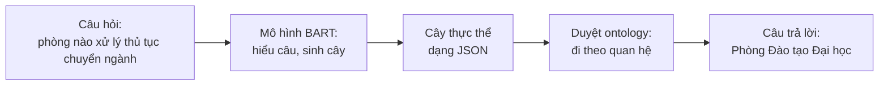
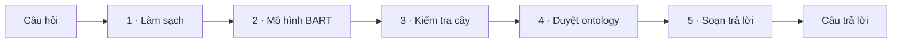
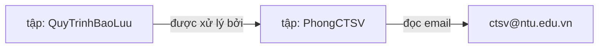
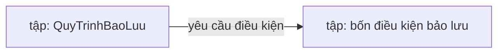
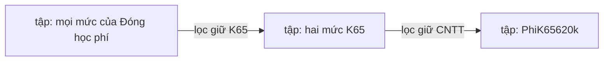
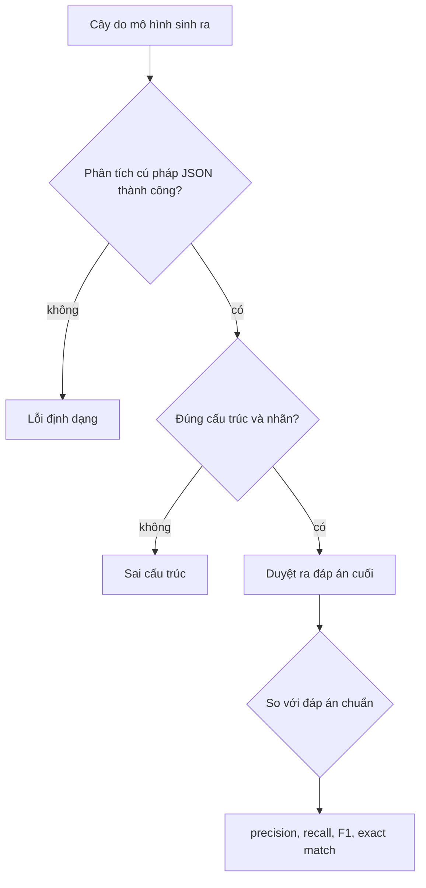
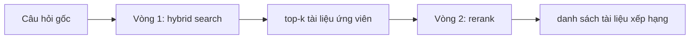
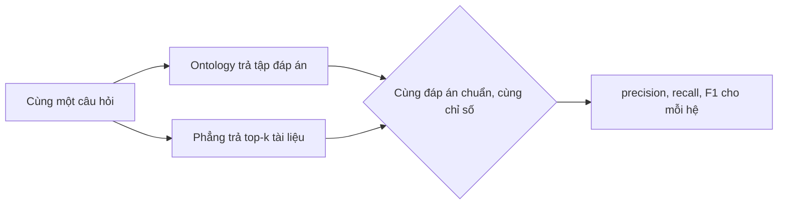

# Chatbot tra cứu quy trình học vụ trên nền Ontology: Khái niệm và Phương pháp

Tài liệu trình bày ý tưởng, kiến trúc và phương pháp đánh giá của hệ thống ở mức khái niệm, không yêu cầu người đọc tiếp xúc mã
nguồn. Nội dung được minh hoạ bằng sơ đồ và dữ liệu thật trích từ ontology của đề tài, nhằm làm cơ sở cho báo cáo khoa học.

Trọng tâm của đề tài là chatbot tra cứu các quy trình học vụ dựa trên ontology. Phép đối chứng với cơ sở dữ liệu phẳng ở Mục 6 là
nội dung bổ trợ, nhằm làm rõ giá trị của ontology, không phải mục tiêu chính.

## Mục lục
1. [Mục tiêu nghiên cứu](#1-mục-tiêu-nghiên-cứu)
2. [Tổng quan hệ thống](#2-tổng-quan-hệ-thống)
3. [Ontology lấy quy trình học vụ làm trung tâm](#3-ontology-lấy-quy-trình-học-vụ-làm-trung-tâm)
4. [Hệ thống chính: pipeline ontology](#4-hệ-thống-chính-pipeline-ontology)
5. [Đánh giá mô hình sinh cây](#5-đánh-giá-mô-hình-sinh-cây)
6. [Nội dung bổ trợ: đối chứng với cơ sở dữ liệu phẳng](#6-nội-dung-bổ-trợ-đối-chứng-với-cơ-sở-dữ-liệu-phẳng)
7. [Tóm tắt](#7-tóm-tắt)

---

## 1. Mục tiêu nghiên cứu

Nghiên cứu xây dựng một chatbot tiếng Việt tra cứu các quy trình học vụ của Trường Đại học Nha Trang, tổ chức tri thức theo mô
hình ontology. Hệ tri thức gồm chín quy trình học vụ: xin bảo lưu kết quả học tập, xin chuyển ngành, đăng ký học phần, học cải
thiện, đăng ký học lại, đóng học phí, rút môn học, xét học bổng và xét tốt nghiệp.

Việc chọn ontology xuất phát từ một đặc điểm bản chất của miền học vụ: một quy trình không tồn tại độc lập mà liên kết tới nhiều
đối tượng khác. Một câu hỏi về thủ tục bảo lưu có thể nhắm tới phòng ban phụ trách, các điều kiện cần thoả mãn, biểu mẫu phải nộp,
quy định làm căn cứ, hoặc kết quả của thủ tục. Ontology biểu diễn các liên kết đó dưới dạng các quan hệ có tên, nhờ vậy hệ thống
trả lời được cả những câu hỏi đòi hỏi đi qua nhiều liên kết liên tiếp.

Để kiểm tra giả thuyết rằng cách tổ chức này có lợi thế, Mục 6 bổ sung một phép đối chứng với cơ sở dữ liệu phẳng theo lối tìm
kiếm thông thường. Phần đối chứng đóng vai trò minh chứng bổ trợ; trọng tâm nghiên cứu nằm ở chính hệ thống ontology trình bày tại
các Mục 3–5.

---

## 2. Tổng quan hệ thống

Hệ thống tiếp nhận một câu hỏi và sinh ra câu trả lời thông qua một chuỗi xử lý tuyến tính, thể hiện ở Hình 1.



**Hình 1.** Luồng xử lý tổng quát của hệ thống.

Thành phần cốt lõi là ontology, đóng vai trò kho tri thức về các quy trình học vụ, cùng thuật toán duyệt vận hành trên ontology
đó. Mô hình BART giữ vai trò trung gian, dịch câu hỏi ngôn ngữ tự nhiên thành một lộ trình truy vấn để thuật toán duyệt thi hành.

---

## 3. Ontology lấy quy trình học vụ làm trung tâm

Ontology của đề tài được tổ chức theo bốn loại thành phần. **Cá thể** (*individual*) biểu diễn một sự vật cụ thể như một quy trình,
một phòng ban hay một điều kiện. **Lớp** (*class*) là loại của cá thể. **Quan hệ** (*object property*) là liên kết có tên giữa hai
cá thể, chẳng hạn *được xử lý bởi* hay *yêu cầu điều kiện*. **Thuộc tính** (*datatype property*) gắn một giá trị đọc được lên cá
thể, chẳng hạn email hay số điện thoại của một phòng ban. Để dễ hình dung, có thể xem ontology như một đồ thị có hướng, trong đó
cá thể là đỉnh, quan hệ là cung có nhãn, còn thuộc tính là giá trị treo trên đỉnh.

### 3.1. Quy trình học vụ là trung tâm liên kết

Đặc điểm then chốt của ontology trong đề tài là mỗi quy trình học vụ giữ vai trò một trung tâm liên kết, kết nối tới các đối tượng
liên quan. Tập đầy đủ các quan hệ mà một quy trình có thể có gồm bảy loại, thể hiện ở Hình 2; mỗi quy trình cụ thể chỉ dùng một
tập con tuỳ bản chất thủ tục.


**Hình 2.** Bảy quan hệ trong tập đầy đủ của một quy trình học vụ. Hai quan hệ *áp dụng mức học phí* và *có phương thức thanh toán*
chỉ xuất hiện ở quy trình đóng học phí; các quy trình khác dùng các quan hệ còn lại.

Bảng 1 liệt kê chín quy trình cùng phòng ban phụ trách và một câu hỏi mẫu cho mỗi quy trình, cho thấy phạm vi tra cứu trải đều
trên nhiều loại quan hệ khác nhau chứ không tập trung vào học phí.

**Bảng 1.** Chín quy trình học vụ, phòng ban phụ trách và câu hỏi mẫu.

| Quy trình | Phòng phụ trách | Câu hỏi mẫu |
|---|---|---|
| Xin bảo lưu kết quả học tập | Phòng Công tác Sinh viên | các điều kiện để được bảo lưu |
| Xin chuyển ngành | Phòng Đào tạo Đại học | thủ tục chuyển ngành cần biểu mẫu gì |
| Đăng ký học phần | Phòng Đào tạo Đại học | đăng ký học phần căn cứ quy định nào |
| Học cải thiện | Phòng Đào tạo Đại học | kết quả của học cải thiện là gì |
| Đăng ký học lại | Phòng Đào tạo Đại học | điều kiện đăng ký học lại |
| Đóng học phí | Phòng Tài chính | phương thức thanh toán học phí |
| Rút môn học | Phòng Đào tạo Đại học | phòng nào xử lý rút môn học |
| Xét học bổng | Phòng Công tác Sinh viên | điều kiện xét học bổng |
| Xét tốt nghiệp | Phòng Đào tạo Đại học | xét tốt nghiệp cần nộp biểu mẫu nào |

Ontology định nghĩa tám lớp đối tượng: Quy trình học vụ, Phòng ban hành chính, Điều kiện, Tài liệu biểu mẫu, Định mức học phí,
Kết quả đầu ra, Phương thức thanh toán và Quy định.

### 3.2. Biểu diễn dữ liệu của một quy trình

Xét quy trình xin bảo lưu kết quả học tập như một trường hợp tiêu biểu. Tri thức được lưu dưới dạng các bộ ba *cá thể nguồn — quan
hệ — cá thể đích*, trình bày ở Bảng 2.

**Bảng 2.** Các liên kết thật của quy trình bảo lưu trong ontology.

| Cá thể nguồn | Quan hệ hoặc thuộc tính | Cá thể đích hoặc giá trị |
|---|---|---|
| QuyTrinhBaoLuu | được xử lý bởi | PhongCTSV |
| QuyTrinhBaoLuu | yêu cầu điều kiện | DieuKienBaoLuuVuTrang, …QuocTe, …YTe, …CaNhan |
| QuyTrinhBaoLuu | cần tài liệu | DonXinBaoLuu, DonXinHocTroLai |
| QuyTrinhBaoLuu | có kết quả | OutputDuocBaoLuu |
| QuyTrinhBaoLuu | căn cứ quy định | RegQD1052 |
| QuyTrinhBaoLuu | thuộc tính nội dung | "1. Sinh viên được xin nghỉ học tạm thời và bảo lưu kết quả…" |

Khi được trích ra để phục vụ hiển thị, một cá thể có hình dạng dữ liệu phẳng như sau, lấy ví dụ Phòng Công tác Sinh viên với các
thuộc tính thật:

```json
{
  "iri": "PhongCTSV",
  "class": "PhongBanHanhChinh",
  "label": "Phòng Công tác Sinh viên",
  "data": {
    "truongPhong": "ThS. Đỗ Quốc Việt",
    "email": "ctsv@ntu.edu.vn",
    "soDienThoai": "02582221900",
    "diaDiem": "Tầng 1, Tòa nhà Hiệu Bộ, trường Đại học Nha Trang",
    "website": "https://phongctsv.ntu.edu.vn/"
  }
}
```

Đặc tính quan trọng là thông tin được đặt đúng vị trí ngữ nghĩa và được nối với nhau bằng quan hệ có tên. Email không nằm trong cá
thể quy trình bảo lưu mà nằm ở cá thể Phòng Công tác Sinh viên, và muốn lấy được phải đi theo quan hệ *được xử lý bởi*. Chính đặc
tính này cho phép ontology trả lời các câu hỏi đòi hỏi nhiều bước suy diễn.

### 3.3. Quy ước thuật ngữ

Bảng 3 đối chiếu một số lối diễn đạt trực quan dùng trong tài liệu với thuật ngữ kỹ thuật chuẩn dùng trong báo cáo.

**Bảng 3.** Ánh xạ thuật ngữ.

| Diễn đạt trực quan | Thuật ngữ kỹ thuật | Ví dụ thật |
|---|---|---|
| điểm, đỉnh đồ thị | individual, cá thể | QuyTrinhBaoLuu, PhongCTSV |
| loại sự vật | class, lớp | Quy trình học vụ, Phòng ban hành chính |
| cung có nhãn | object property, quan hệ | duocXuLyBoi |
| giá trị treo trên đỉnh | datatype property, thuộc tính; literal, giá trị | email, "ctsv@ntu.edu.vn" |
| lộ trình truy vấn | cây thực thể | đầu ra của mô hình BART |
| mã định danh | IRI | PhongCTSV |

---

## 4. Hệ thống chính: pipeline ontology

### 4.1. Các chặng xử lý và hình dạng dữ liệu

Câu hỏi đi qua năm chặng, mỗi chặng biến đổi dữ liệu sang một hình dạng mới, thể hiện ở Hình 3 và Bảng 4.



**Hình 3.** Năm chặng của pipeline ontology.

**Bảng 4.** Chức năng, module hiện thực và hình dạng dữ liệu qua từng chặng, minh hoạ cho câu hỏi về phòng xử lý chuyển ngành. Cột
Module ghi tên tệp trong gói mã nguồn `src/ontchatbot/` để người đọc tham chiếu sang codebase.

| Chặng | Module | Chức năng | Đầu vào | Đầu ra |
|---|---|---|---|---|
| 1 · Làm sạch | `preprocess.py` | Chuẩn hoá chữ, không phân tích nội dung | "Phòng nào xử lý chuyển ngành?" | "phòng nào xử lý chuyển ngành" |
| 2 · Mô hình BART | `model.py` | Hiểu câu, sinh cây thực thể | chuỗi đã chuẩn hoá | cây JSON, xem Mục 4.2 |
| 3 · Kiểm tra cây | `tree.py` | Loại phần rác, kiểm tra định dạng | cây JSON thô | cây hợp lệ |
| 4 · Duyệt ontology | `ontology.py` | Đi theo cây trên ontology | cây hợp lệ | đối tượng Result, xem Mục 4.3 |
| 5 · Soạn trả lời | `render.py` | Ghép kết quả thành câu trả lời | Result | chuỗi trả lời |

Năm chặng được điều phối bởi module `pipeline.py`, vốn chỉ nối các chặng theo một chiều phụ thuộc mà không chứa luật nghiệp vụ.
Toàn bộ năng lực hiểu ngôn ngữ tập trung ở chặng 2; các chặng còn lại không chứa luật hiểu câu, và riêng chặng 4 chỉ thi hành đúng
lộ trình mà cây đã quy định. Thiết kế này giúp hệ thống dễ kiểm chứng và tách bạch trách nhiệm giữa các thành phần.

### 4.2. Mô hình BART sinh cây thực thể

Mô hình BART biến câu hỏi thành một cây JSON mô tả chủ thể được hỏi cùng các quan hệ và thuộc tính cần truy vấn. Cấu trúc cây tuân
theo khuôn:

```json
{ "act": "query",
  "entities": [ { "label": "...", "type": "individual | object | data", "children": [ ... ] } ] }
```

Trường `act` nhận một trong bốn giá trị `query`, `greeting`, `ood`, `vague`, tương ứng câu hỏi thật, câu chào, câu ngoài phạm vi
và câu mơ hồ. Khi `act` bằng `query`, trường `entities` chứa đúng một cây với gốc là một cá thể, tức chủ thể được hỏi tới; với ba
giá trị còn lại, `entities` để rỗng vì câu không nhắm tới đối tượng nào. Mỗi nút gồm nhãn chữ, vai trò `type`, và danh sách nút con.

Độ phức tạp của cây phản ánh độ phức tạp của câu hỏi. Bốn dạng sau, lấy quy trình bảo lưu làm ví dụ xuyên suốt, sắp theo mức tăng
dần; ba dạng đầu sẽ được dùng lại ở Mục 4.3 để minh hoạ thuật toán duyệt, nên đặt tên để tiện tham chiếu.

**Dạng 1 — tự mô tả** ("thủ tục bảo lưu là gì"): gốc đứng một mình, không nút con.
```json
{ "act": "query", "entities": [ { "label": "bảo lưu", "type": "individual", "children": [] } ] }
```
**Dạng 2 — đi một quan hệ** ("phòng nào xử lý bảo lưu"): gốc nối một nút quan hệ.
```json
{ "act": "query", "entities": [ { "label": "bảo lưu", "type": "individual", "children": [
    { "label": "phòng xử lý", "type": "object", "children": [] } ] } ] }
```
**Dạng 3 — đi nhiều bước** ("email của phòng xử lý bảo lưu"): chuỗi quan hệ rồi tới thuộc tính lá.
```json
{ "act": "query", "entities": [ { "label": "bảo lưu", "type": "individual", "children": [
    { "label": "phòng xử lý", "type": "object", "children": [
      { "label": "email", "type": "data", "children": [] } ] } ] } ] }
```
**Dạng 4 — liệt kê một tập** ("các điều kiện để được bảo lưu"): một quan hệ trả về nhiều cá thể đích.
```json
{ "act": "query", "entities": [ { "label": "bảo lưu", "type": "individual", "children": [
    { "label": "điều kiện", "type": "object", "children": [] } ] } ] }
```

Mô hình làm được nhiệm vụ này nhờ bộ dữ liệu huấn luyện phủ nhiều cách diễn đạt cho cùng một ý, nhằm giảm phụ thuộc vào biểu thức bề
mặt của câu hỏi. Bảng 5 minh hoạ ba câu hỏi khác hình thức cùng cho một cây.

**Bảng 5.** Bất biến diễn đạt: ba câu hỏi khác hình thức, cùng một cây thực thể.

| Câu hỏi | Cây sinh ra |
|---|---|
| các điều kiện để được bảo lưu | cây ví dụ thứ tư |
| muốn bảo lưu thì cần thoả mãn những gì | cây tương tự |
| điều kiện xin nghỉ học tạm thời | cây tương tự |

Ngoài việc dựng cây, mô hình còn phân loại ý định câu hỏi qua trường `act` để xác định khi nào không nên truy vấn ontology. Bảng 6
liệt kê bốn loại ý định cùng cách hệ thống phản hồi.

**Bảng 6.** Phân loại ý định và phản hồi tương ứng.

| Giá trị act | Ví dụ câu hỏi | Phản hồi |
|---|---|---|
| query | điều kiện chuyển ngành | truy vấn ontology, trả thông tin |
| greeting | xin chào; cảm ơn | "Xin chào. Đây là hệ thống tra cứu thủ tục học vụ…" |
| ood | hôm nay trời có mưa không | "Không có thông tin." |
| vague | thủ tục như thế nào; phòng nào | "Không hiểu câu hỏi." |

### 4.3. Thuật toán duyệt ontology

Sau khi mô hình sinh ra cây JSON, chặng duyệt *thi hành* cây đó trên ontology: xuất phát từ gốc rồi lần lượt đi theo từng nút con
để thu về đáp án. Phần này trình bày ba điều theo thứ tự: cách khớp một nhãn với ontology, trạng thái mà thuật toán duy trì khi đi,
và một ví dụ duyệt đầy đủ từng bước.

**Khớp một nhãn với ontology.** Mỗi nút mang một nhãn chữ và một vai trò. Vai trò quyết định khớp nhãn vào thành phần nào của ontology:
nút cá thể khớp với tên và tên gọi khác của các cá thể; nút quan hệ khớp với nhãn của các quan hệ; nút thuộc tính khớp với nhãn của
các thuộc tính. Với cá thể, phép khớp dựa trên **chứa từ**: nhãn nút khớp một cá thể khi các từ trong nhãn nằm trong tên hoặc tên
gọi khác của cá thể đó, và khi nhiều cá thể cùng khớp thì chọn cá thể đạt điểm cao nhất chứ không đặt ngưỡng cứng. Nhờ vậy một đoạn
chữ dài vẫn khớp đúng cá thể mà không cần trùng khít từng chữ; ví dụ nhãn "bảo lưu" khớp cá thể `QuyTrinhBaoLuu` vì cá thể này mang
các tên gọi khác "bảo lưu", "bảo lưu kết quả", "nghỉ học tạm thời". Với quan hệ và thuộc tính, phép khớp dựa trên nhãn đã khai báo;
ví dụ nhãn "phòng xử lý" khớp quan hệ `duocXuLyBoi` vì quan hệ này được gán các nhãn "phòng phụ trách", "phòng xử lý" và "xử lý".

**Trạng thái duyệt: tập hiện tại.** Thuật toán duy trì một *tập hiện tại*, là tập các cá thể đang được xét. Tập này khởi đầu bằng cá
thể gốc rồi biến đổi mỗi khi đi qua một nút con, tuỳ vai trò của nút con đó:

| Nút con | Phép biến đổi tập hiện tại | Kết quả |
|---|---|---|
| quan hệ | đi theo quan hệ từ mỗi cá thể trong tập | tập mới gồm các cá thể đích, đi tiếp được |
| thuộc tính | đọc giá trị thuộc tính trên tập hiện tại | trả về giá trị, kết thúc nhánh |
| cá thể (không phải gốc) | giữ lại cá thể có tên khớp nhãn | tập thu hẹp, đi tiếp được |

Cách bố trí nút quyết định phép hợp thành. Hai nút **lồng nhau** theo chuỗi cha–con mang nghĩa *và*: tầng con thao tác trên kết quả
của tầng cha, nên nhiều nút lọc lồng nhau cho **phép giao** các điều kiện. Hai nút **anh em** cùng một cha là hai nhánh độc lập: mỗi
nhánh chạy trên cùng tập xuất phát rồi cộng kết quả, cho **phép hợp**. Khi một nhãn không khớp cá thể nào, thuật toán không suy đoán
mà ghi nhãn đó vào danh sách *không tìm thấy*, dẫn tới phản hồi "Không có thông tin «…»".

**Ví dụ duyệt từng bước.** Xét câu "email của phòng xử lý bảo lưu". Mô hình sinh ra cây Dạng 3 ở Mục 4.2, gồm gốc cá thể nối một
nút quan hệ rồi tới một nút thuộc tính lá:

```json
{ "act": "query", "entities": [ { "label": "bảo lưu", "type": "individual", "children": [
    { "label": "phòng xử lý", "type": "object", "children": [
      { "label": "email", "type": "data", "children": [] } ] } ] } ] }
```

Thuật toán thi hành cây này theo ba bước, mỗi bước biến đổi tập hiện tại theo đúng vai trò của nút:

| Bước | Nhãn nút | Vai trò | Phép làm | Tập hiện tại sau bước |
|---|---|---|---|---|
| 0 | "bảo lưu" | cá thể (gốc) | khớp tên cá thể | `{ QuyTrinhBaoLuu }` |
| 1 | "phòng xử lý" | quan hệ | đi theo quan hệ `duocXuLyBoi` | `{ PhongCTSV }` |
| 2 | "email" | thuộc tính | đọc thuộc tính `email` của `PhongCTSV` | giá trị `"ctsv@ntu.edu.vn"`, kết thúc nhánh |

Gốc cho tập hiện tại một phần tử. Nút quan hệ đẩy tập sang cá thể đích, đổi từ quy trình sang phòng. Nút thuộc tính đọc giá trị rồi
đóng nhánh, nên đáp án cuối là giá trị thư điện tử; chặng soạn trả lời chuyển thành câu "Email: ctsv@ntu.edu.vn". Hình 4 tóm tắt
đường đi này.



**Hình 4.** Duyệt câu hỏi về email phòng xử lý bảo lưu qua hai bước theo quan hệ.

Đáp án mà thuật toán trả về là một bản ghi gồm ba phần: tập cá thể ở đầu ra, danh sách giá trị thuộc tính, và danh sách nhãn không
tìm thấy. Với câu hỏi trên, bản ghi không có cá thể đầu ra mà có một giá trị thuộc tính:
```json
{ "nodes": [], "values": [ { "prop": "email", "values": ["ctsv@ntu.edu.vn"] } ], "misses": [], "vague": false }
```

Hình 5 minh hoạ trường hợp liệt kê một tập ứng với Dạng 4. Câu hỏi về các điều kiện bảo lưu cho ra một tập gồm bốn cá thể.



**Hình 5.** Duyệt câu hỏi liệt kê điều kiện. Đáp án là một tập có lực lượng xác định.

```json
{ "nodes": [
    { "iri": "DieuKienBaoLuuVuTrang", "class": "DieuKien", "label": "Được điều động vào lực lượng vũ trang" },
    { "iri": "DieuKienBaoLuuQuocTe",  "class": "DieuKien", "label": "Được điều động tham dự các kỳ thi, giải đấu quốc tế" },
    { "iri": "DieuKienBaoLuuYTe",     "class": "DieuKien", "label": "Bị ốm, thai sản hoặc tai nạn phải điều trị dài ngày có giấy chứng nhận hợp lệ" },
    { "iri": "DieuKienBaoLuuCaNhan",  "class": "DieuKien", "label": "Vì lý do cá nhân khác nhưng phải học ít nhất 01 học kỳ ở Trường" } ],
  "values": [], "misses": [], "vague": false }
```

Phép giao bằng các nút lọc lồng nhau được minh hoạ qua truy vấn học phí, một trường hợp riêng của quy trình đóng học phí, vốn có
nhiều mức phân biệt theo khoá và theo ngành. Câu hỏi về học phí khoá K65 ngành Công nghệ thông tin cho cây có hai nút cá thể **lồng
nhau** dưới gốc:

```json
{ "act": "query", "entities": [ { "label": "học phí", "type": "individual", "children": [
    { "label": "K65", "type": "individual", "children": [
      { "label": "Công nghệ thông tin", "type": "individual", "children": [] } ] } ] } ] }
```

Mỗi nút cá thể lọc tiếp trên kết quả nút trước: tập khởi đầu là mọi mức của Đóng học phí, nút "K65" giữ lại hai mức khoá K65, nút
"Công nghệ thông tin" giữ tiếp một mức, thu về đúng một mức như Hình 6.



**Hình 6.** Phép giao qua hai nút lọc cá thể lồng nhau; đáp án là PhiK65620k với học phí 620.000 đồng mỗi tín chỉ.

Ngược lại, câu hỏi về học phí khoá K65 và khoá K67 cho cây có hai nút cá thể **anh em** dưới gốc:

```json
{ "act": "query", "entities": [ { "label": "học phí", "type": "individual", "children": [
    { "label": "K65", "type": "individual", "children": [] },
    { "label": "K67", "type": "individual", "children": [] } ] } ] }
```

Mỗi nút anh em lọc độc lập trên cùng tập khởi đầu rồi cộng kết quả, nên đáp án là cả bốn mức của hai khoá. Cùng một ontology và cùng
hai nhãn khoá, cấu trúc lồng nhau cho phép giao còn cấu trúc anh em cho phép hợp; do đó mô hình phải đặt đúng cấu trúc cây thì đáp
án mới đúng. Khi một nhãn lọc không khớp cá thể nào — chẳng hạn hỏi học phí ngành Y khoa, ngành không tồn tại — thuật toán ghi nhãn
"Y khoa" vào danh sách không tìm thấy và trả lời "Không có thông tin «Y khoa»".

---

## 5. Đánh giá mô hình sinh cây

Việc đánh giá tiến hành ở hai mức nhằm tách bạch nguồn lỗi. Mức thứ nhất là **độ đúng cấu trúc của cây**, so cây mô hình sinh ra
với cây chuẩn về cú pháp, cấu trúc và nhãn các nút; mức này cô lập chất lượng riêng của mô hình BART. Mức thứ hai là **độ đúng đầu
cuối**, duyệt cây thành đáp án rồi so với đáp án chuẩn; mức này phản ánh trải nghiệm người dùng nhưng bao gồm cả bước duyệt. Vì
thuật toán duyệt là xác định và đã được kiểm chứng độc lập, sai khác ở mức đầu cuối chủ yếu phản ánh lỗi của mô hình. Quy trình
đánh giá nhiều mức thể hiện ở Hình 7.



**Hình 7.** Quy trình đánh giá hai mức.

Lý do lấy đáp án cuối làm chuẩn cho mức thứ hai là vì điều người dùng nhận được là câu trả lời sau khi duyệt, không phải cây trung
gian. Hai cây khác nhau về hình thức vẫn có thể cho cùng một đáp án đúng, chẳng hạn khi đảo thứ tự hai nút trong phép giao. Ngược
lại, một cây chỉ lệch nhẹ vẫn có thể duyệt ra đáp án sai. Do đó chỉ phép so ở đáp án cuối mới phản ánh đúng chất lượng đầu cuối.

Gọi P là tập đáp án do mô hình trả về và G là tập đáp án chuẩn. Đặt TP là số phần tử vừa thuộc P vừa thuộc G, FP là số phần tử
thuộc P nhưng không thuộc G, FN là số phần tử thuộc G nhưng không thuộc P. Khi đó precision bằng TP chia cho tổng TP và FP, đo tỷ
lệ đáp án trả ra là đúng; recall bằng TP chia cho tổng TP và FN, đo tỷ lệ đáp án cần có được lấy ra; F1 là trung bình điều hoà của
precision và recall. Chỉ số exact match nhận giá trị một khi P trùng khít G và giá trị không trong trường hợp còn lại; đây là
thước đo nghiêm khắc nhất.

Bảng 7 minh hoạ cách chấm ở mức đầu cuối trên câu hỏi về các điều kiện bảo lưu, với tập chuẩn G gồm bốn điều kiện bảo lưu.

**Bảng 7.** Ví dụ chấm điểm với G gồm bốn điều kiện bảo lưu.

| Đáp án mô hình P | Cú pháp | Cấu trúc | TP | FP | FN | precision | recall | F1 | exact match |
|---|---|---|---|---|---|---|---|---|---|
| đủ bốn điều kiện đúng | đạt | đạt | 4 | 0 | 0 | 1,00 | 1,00 | 1,00 | 1 |
| bốn điều kiện đúng kèm một cá thể lạ | đạt | đạt | 4 | 1 | 0 | 0,80 | 1,00 | 0,89 | 0 |
| chỉ ba điều kiện | đạt | đạt | 3 | 0 | 1 | 1,00 | 0,75 | 0,86 | 0 |
| trả về một phòng ban | đạt | đạt | 0 | 1 | 4 | 0,00 | 0,00 | 0,00 | 0 |
| JSON hỏng | không | — | — | — | — | — | — | — | 0 |

Trên toàn tập kiểm tra, các chỉ số ở mức câu được gộp lại như sau: exact match accuracy là tỷ lệ câu có P trùng khít G, còn
macro-F1 là trung bình F1 lấy theo năm nhóm năng lực. Hai chỉ số này được báo cáo tách theo năm nhóm năng lực rồi lấy trung bình
trên năm nhóm, đóng vai trò chỉ số chính phản ánh chất lượng đầu cuối. Trục năng lực được chọn thay cho trục miền dữ liệu để việc
đánh giá bám đúng mục tiêu suy luận của đề tài, thay vì bị chi phối bởi một miền đông mẫu như học phí; các câu phi-truy-vấn được
báo cáo riêng và không tính vào trung bình năng lực. Nhóm chẩn đoán gồm tỷ lệ cú pháp
hợp lệ, tỷ lệ cấu trúc hợp lệ và độ chính xác phân loại act được báo cáo riêng, không cộng vào chỉ số chính, bởi một cây sai cú
pháp hoặc sai cấu trúc tất yếu duyệt ra đáp án rỗng hoặc sai và đã bị trừ điểm trong các chỉ số đầu cuối. Với câu hỏi dạng giá trị
như email hay số điện thoại, đáp án là một giá trị đơn nên exact-match trùng với độ chính xác của giá trị.

Trường `act` là một bài toán phân loại bốn lớp thông thường, được đánh giá bằng precision, recall, F1 theo từng lớp kèm ma trận
nhầm lẫn.

Trên tập kiểm tra gồm 2.251 câu, mô hình đạt exact match accuracy trung bình theo năm nhóm năng lực là 0,96 và macro-F1 là 0,97.
Mọi câu đều sinh JSON hợp lệ và đúng hợp đồng cây. Riêng các câu truy vấn đạt exact match 0,96 và độ chính xác phân loại `act`
1,00, gần như không sai ý định. Tách theo năm nhóm năng lực, kết quả đều ở mức cao và phản ánh đúng độ khó: đi nhiều bước 1,00,
lọc theo ràng buộc 0,99, nhiều thuộc tính 0,98, tra cứu trực tiếp 0,95 và đi một quan hệ 0,94 (F1). Các loại phi-truy-vấn được báo
cáo riêng: câu ngoài tri thức đạt F1 0,90, câu có gốc rơi vào lớp hay quan hệ trần (đáng lẽ trả lời "không hiểu") 0,83, và câu mơ
hồ 0,81 — thấp hơn nhóm truy vấn, phản ánh một đánh đổi có chủ đích khi tăng cường dữ liệu cho các câu truy vấn quy trình vốn là
trọng tâm của đề tài.

Các kết quả định lượng được trình bày dưới đây. Mọi hình ở mục này do `scripts/visualize.py` sinh từ `eval_report.json`
(và log huấn luyện), nên được dựng lại sau mỗi lần huấn luyện và đánh giá.


**Hình 8.** Đường cong huấn luyện: train loss và validation loss theo bước. Validation loss giảm từ 0,063 xuống mức tốt
nhất 0,013 quanh epoch 8–9, nơi mô hình được chốt theo cơ chế giữ-bản-tốt-nhất-trên-tập-validation. Hình này do `train.py`
lưu lại `log_history` sau khi huấn luyện rồi `visualize.py` dựng; nó được sinh lại ở mỗi lần huấn luyện.


**Hình 9.** F1 và exact-match theo từng loại câu hỏi (đánh giá đầu-cuối). Các loại tra cứu một bước, phép giao và đi nhiều
bước đạt gần như tuyệt đối; hai loại không-truy-vấn là câu mơ hồ (F1 0,77) và câu ngoài tri thức (0,874) thấp hơn, phản ánh
độ khó tự nhiên của việc phân biệt ý định khi câu hỏi thiếu chủ thể cụ thể, chứ không phải khuyết tật của khâu duyệt.


**Hình 10.** Ma trận nhầm lẫn của trường `act` (tô màu theo tỉ lệ hàng). Nhầm lẫn tập trung ở câu mơ hồ bị đoán thành truy
vấn (22 trên 78) và câu ngoài tri thức bị đoán thành truy vấn (8 trên 103); lớp chào hỏi và truy vấn gần như không nhầm
(truy vấn đúng 1.442 trên 1.451). Ranh giới có xu hướng dịch về phía truy vấn, đúng hướng đề tài là ưu tiên trả lời được câu
thủ tục diễn đạt khẩu ngữ, nhưng F1 của câu mơ hồ vẫn tăng so với lần trước nhờ bù lại ở các câu mơ hồ thực sự thiếu chủ thể.

Hai độ đo BLEU và ROUGE, vốn đo độ tương đồng văn bản, không phù hợp làm thước đo chính ở đây, bởi cây JSON không phải văn xuôi và
độ giống chữ không bảo đảm duyệt ra đáp án đúng.

---

## 6. Nội dung bổ trợ: đối chứng với cơ sở dữ liệu phẳng

Mục này nhằm kiểm tra giả thuyết rằng cách tổ chức tri thức theo ontology trả lời tốt hơn một hệ truy hồi văn bản thông thường,
đặc biệt ở các câu hỏi có cấu trúc. Ở đây cụm "cơ sở dữ liệu phẳng" chỉ một kho gồm các tài liệu văn bản đã làm phẳng, không lưu
quan hệ, khác với cơ sở dữ liệu quan hệ có lược đồ bảng và truy vấn có cấu trúc. Hệ thống chính vẫn là chatbot ontology trình bày ở
các mục trước.

### 6.1. Xây dựng kho phẳng

Cơ sở dữ liệu phẳng được sinh tự động từ ontology bằng một bước *làm phẳng*: duyệt qua từng cá thể và gom các dữ kiện của riêng nó
— nhãn, các tên gọi khác, phân loại, và mọi giá trị thuộc tính — thành một đoạn văn bản, đồng thời **loại bỏ mọi quan hệ** nối cá
thể đó với cá thể khác. Mỗi cá thể cho đúng một tài liệu, mã tài liệu trùng định danh cá thể trong ontology để có thể đối chiếu kết
quả giữa hai hệ. Vì ontology vẫn còn được chỉnh sửa, kho phẳng được vật chất hoá thành một tệp riêng và sinh lại mỗi khi ontology
đổi; nhờ vậy nó là một cơ sở dữ liệu thực sự, ngang hàng với ontology, chứ không phải dữ liệu dựng tạm trong lúc đánh giá. Hai ví
dụ tài liệu:

```json
{ "id": "PhongCTSV", "class": "PhongBanHanhChinh",
  "text": "Phòng Công tác Sinh viên CTSV; trưởng phòng ThS. Đỗ Quốc Việt; email ctsv@ntu.edu.vn; điện thoại 02582221900; Tầng 1 Tòa nhà Hiệu Bộ; https://phongctsv.ntu.edu.vn/" }
```
```json
{ "id": "QuyTrinhBaoLuu", "class": "QuyTrinhHocVu",
  "text": "Quy trình xin bảo lưu kết quả học tập; sinh viên được xin nghỉ học tạm thời và bảo lưu kết quả…" }
```

Khác biệt cơ bản là tài liệu chỉ còn văn bản rời rạc. Tài liệu của quy trình bảo lưu không lưu được dữ kiện rằng Phòng Công tác
Sinh viên xử lý thủ tục này, vì quan hệ đã bị loại bỏ.

### 6.2. Hệ truy hồi: hybrid search và rerank

Hệ truy hồi phẳng gồm hai vòng, thể hiện ở Hình 11.



**Hình 11.** Hai vòng của hệ truy hồi phẳng.

Vòng một là hybrid search, kết hợp hai cơ chế mà mô hình BGE-M3 sinh đồng thời. Cơ chế khớp từ vựng thưa (sparse) xếp hạng tài
liệu theo mức trùng từ giữa câu hỏi và tài liệu. Cơ chế embedding dày (dense) biểu diễn câu hỏi và tài liệu thành các vector số,
hai vector càng gần nhau thì nghĩa càng gần nhau ngay cả khi khác chữ. Kết quả là một danh sách top-k tài liệu ứng viên. Vòng hai là rerank bằng một mô hình cross-encoder, đọc đồng thời
câu hỏi và từng tài liệu ứng viên rồi chấm lại độ liên quan; cơ chế này chính xác hơn vòng một nhưng chậm hơn, nên chỉ áp dụng cho
top-k.

Cấu hình thực nghiệm dùng BGE-M3 cho vòng truy hồi và BGE-reranker-v2-m3 cho vòng rerank — một baseline thần kinh đa ngữ mạnh, chọn
để tránh phê phán rằng phép đối chứng dùng baseline yếu. Cụm đối chứng là một thành phần độc lập, được phép dùng GPU khi đánh giá
và không nằm trong bản triển khai CPU của hệ ontology.

Cần lưu ý rằng đây là một baseline thuần truy hồi: hệ trả về một tài liệu được xếp hạng cao nhất chứ không trích ra một thuộc tính
cụ thể. Hệ không đi theo quan hệ, không thực hiện được phép giao, và không tự xác định được số lượng kết quả cần trả mà phải xác
định trước tham số k.

### 6.3. Thiết kế phép so

Phép so đối chứng thể hiện ở Hình 12.



**Hình 12.** Hai hệ nhận cùng đầu vào và được chấm trên cùng đáp án chuẩn.

Cả hai hệ nhận cùng câu hỏi gốc; hệ phẳng không được dùng cây của mô hình nhằm bảo đảm tính khách quan. Đáp án chuẩn gồm ba dạng
tuỳ câu hỏi: một tập cá thể, hoặc đúng thuộc tính được hỏi, hoặc một giá trị. Trường hợp tìm đúng tài liệu nhưng sai thuộc tính
vẫn bị tính là sai; đây là một bất lợi cấu trúc của baseline thuần truy hồi và được nêu rõ khi báo cáo. Bộ dữ liệu đánh giá là tập
kiểm tra gồm 1.648 câu, tách ra từ tổng số 6.788 câu, trong đó tập kiểm tra dùng cách diễn đạt khác với tập huấn luyện nhằm chống
hiện tượng học vẹt mẫu câu. Mỗi câu kèm đáp án chuẩn được kiểm chứng tự động bằng thuật toán duyệt. Việc chấm dùng cùng bộ chỉ số
precision, recall và F1 như Mục 5, không chỉ đếm số thực thể trùng đáp án, nhằm phạt cả phần trả thừa lẫn phần bỏ sót.

Các chỉ số dùng ở phần kết quả được định nghĩa như sau, với *đáp án chuẩn* là tập cá thể đúng cho mỗi câu hỏi:

- **recall** (độ bao phủ): tỷ lệ phần đáp án chuẩn mà hệ tìm được. **precision** (độ chính xác): tỷ lệ phần hệ trả ra mà đúng.
  **F1**: trung bình điều hoà của hai chỉ số trên.
- **trùng khít tập** (exact-set): tỷ lệ câu hỏi mà tập ontology trả về trùng đúng đáp án chuẩn — không thừa, không thiếu một cá thể.
- **recall@k** và **full@k**: hai chỉ số dành cho hệ phẳng, vốn trả một *danh sách xếp hạng* tài liệu chứ không trả một tập dứt
  khoát. recall@k là độ bao phủ khi chỉ xét k tài liệu đứng đầu; full@k là tỷ lệ câu hỏi mà *toàn bộ* đáp án chuẩn nằm gọn trong
  k tài liệu đầu. Phép so cân xứng nhất là đặt trùng khít tập của ontology cạnh full@k của hệ phẳng, vì cả hai cùng đo việc trả
  đúng trọn vẹn cả tập.

Vì hệ phẳng phải chọn trước số tài liệu k, recall@k của nó tăng dần khi k lớn lên. Vẽ recall@k theo các giá trị k cho **đường
recall**: đường càng phải nới k rộng mới đạt recall cao thì hệ càng yếu ở việc gom đủ đáp án trong một câu trả lời — hạn chế mà
ontology không gặp vì nó trả thẳng cả tập một lần.

### 6.4. Các ví dụ so sánh kèm hình dạng dữ liệu

Mỗi ví dụ trình bày bốn khối dữ liệu — câu hỏi, đáp án chuẩn, đầu ra của ontology, và năm tài liệu hệ phẳng xếp hạng cao nhất —
để thấy rõ mỗi hệ nhận gì và xuất gì. Cả bốn đều trích nguyên văn từ bản ghi của lần đánh giá hiện tại, không phải số liệu giả
định. Ba ví dụ chọn theo ba tình huống đại diện: ontology thắng ở câu đi nhiều bước, ontology thắng ở câu liệt kê đúng cả tập, và
hai hệ hoà ở câu tra cứu trực tiếp.

Ví dụ 1 — **đi nhiều bước**, phòng xử lý thủ tục bảo lưu nằm ở đâu. Ontology thắng.
```json
câu hỏi      : "phòng xử lý bảo lưu"
đáp án chuẩn : ["PhongCTSV"]
ontology trả : ["PhongCTSV"]
phẳng (5 đầu): ["QuyTrinhBaoLuu", "OutputDuocBaoLuu", "PhongKHTC", "PhongCTSV", "VanPhongTruong"]
```
Đáp án là Phòng Công tác Sinh viên, nối với bảo lưu qua quan hệ "được xử lý bởi" mà hệ phẳng đã loại bỏ. Hệ phẳng vì thế xếp cao
ba tài liệu chứa từ khoá câu hỏi (quy trình bảo lưu, kết quả được bảo lưu, một phòng khác) và chỉ đẩy `PhongCTSV` xuống hạng tư —
nằm ngoài top-3, nên bị tính là trượt ở recall@3. Ontology đi đúng một bước theo quan hệ và trả thẳng phòng đúng.

Ví dụ 2 — **liệt kê đúng cả tập**, các điều kiện được bảo lưu. Ontology thắng.
```json
câu hỏi      : "Điều kiện để được bảo lưu kết quả học tập là gì?"
đáp án chuẩn : ["DieuKienBaoLuuCaNhan", "DieuKienBaoLuuQuocTe", "DieuKienBaoLuuVuTrang", "DieuKienBaoLuuYTe"]
ontology trả : ["DieuKienBaoLuuCaNhan", "DieuKienBaoLuuQuocTe", "DieuKienBaoLuuVuTrang", "DieuKienBaoLuuYTe"]
phẳng (5 đầu): ["QuyTrinhBaoLuu", "OutputDuocBaoLuu", "DieuKienHocBongDiemHocTap", "OutputNhanHocBong", "OutputDuocXetTotNghiep"]
```
Đáp án là một tập gồm bốn điều kiện. Ontology đi theo quan hệ "yêu cầu điều kiện" và trả về *trọn vẹn cả bốn*. Hệ phẳng không có
khái niệm gom tập: nó xếp cao tài liệu quy trình bảo lưu cùng vài điều kiện của thủ tục khác, nhưng không tài liệu bảo lưu nào lọt
top-5 — vì mỗi điều kiện là một tài liệu riêng và không tài liệu nào một mình "giống" câu hỏi đủ mạnh.

Ví dụ 3 — **tra cứu trực tiếp**, trưởng phòng Công tác Sinh viên là ai. Hai hệ hoà.
```json
câu hỏi      : "Cho em hỏi ai là trưởng phòng CTSV ạ?"
đáp án chuẩn : ["PhongCTSV"]
ontology trả : ["PhongCTSV"]
phẳng (5 đầu): ["PhongCTSV", "PhongDaoTaoDaiHoc", "DonGiaHanThoiGianNopHocPhi", "PhongKHTC", "VanPhongTruong"]
```
Câu một bước, một thuộc tính của chính cá thể được hỏi: thông tin trưởng phòng nằm ngay trong tài liệu `PhongCTSV`, nên hệ phẳng
bắt đúng tài liệu ở hạng nhất. Báo cáo nêu thẳng trường hợp hoà này để bảo đảm khách quan. (Hạn chế còn lại của hệ phẳng — chỉ
trả về *tài liệu* chứ không tách ra *thuộc tính*, nên dễ trả nhầm số điện thoại khi hỏi email — được phân tích ở tầng đáp-án-cuối
tại Mục 6.6.)

### 6.5. Giả thuyết kiểm chứng

Phép so dùng một kho phẳng duy nhất — kho tài liệu thực tế mô tả ở Mục 6.1, mỗi cá thể một tài liệu và đã loại bỏ quan hệ. Việc
chỉ giữ một kho phản ánh đúng kịch bản triển khai một hệ truy hồi văn bản thông thường, đồng thời cho phép câu chuyện so sánh gọn
và trung thực, không cần một biến thể nhồi sẵn quan hệ vốn không còn là tài liệu tự nhiên.

**Giả thuyết kiểm chứng:** hai hệ *tương đương* ở câu tra cứu trực tiếp, còn ontology *cao hơn* ở các câu có cấu trúc — đi theo
quan hệ, liệt kê đúng cả tập, đi nhiều bước, đọc nhiều thuộc tính và lọc theo ràng buộc. Mục 6.6 đối chiếu giả thuyết này với số
đo thật.

### 6.6. Kết quả

Phép so chạy trên tập kiểm tra, chỉ lấy các câu mà hệ phẳng có thể truy hồi được, tức đã loại các câu chào hỏi, ngoài tri thức và
mơ hồ vì hệ phẳng không có khái niệm từ chối. Đáp án chuẩn được suy ra trực tiếp từ ontology theo đúng ngữ nghĩa quan hệ, độc lập
với mô hình, và đã được thuật toán duyệt kiểm chứng tự động; cấu hình cùng phiên bản thư viện được ghi lại để bảo đảm tái lập. Kết
quả tách làm hai tầng để tránh so lệch bản chất.

**Tầng truy hồi — tìm đúng tập tài liệu.** Ontology trả về một tập nên được chấm precision, recall, F1 và trùng khít tập theo lối
micro. Hệ phẳng trả danh sách xếp hạng nên được chấm recall@k và full@k, lấy trung bình theo câu. Theo các định nghĩa ở Mục 6.3,
phép so cân xứng là đặt trùng khít tập của ontology cạnh full@k của hệ phẳng. Số tổng thể:

| Hệ | recall | recall@3 | recall@5 | full@k |
|---|---|---|---|---|
| Ontology (đầu-cuối, mô hình thật) | 0,96 | — | — | 0,97 (trùng khít tập) |
| Phẳng | 0,43 (@1) | 0,67 | 0,77 | 0,65 (full@3) |

Tách theo năm nhóm năng lực truy vấn — xếp từ dễ đến khó — thấy rõ ontology không thắng đều, mà thắng đúng ở chỗ có cấu trúc:

| Nhóm năng lực | n | Ontology F1 | Ontology trùng khít tập | Phẳng recall@1 | Phẳng recall@3 |
|---|---|---|---|---|---|
| Tra cứu trực tiếp | 444 | 0,97 | 0,96 | 0,98 | 1,00 |
| Đi một quan hệ | 834 | 0,96 | 0,97 | 0,11 | 0,43 |
| Đi nhiều bước | 308 | 1,00 | 1,00 | 0,19 | 0,72 |
| Nhiều thuộc tính | 134 | 0,99 | 0,96 | 0,50 | 0,56 |
| Lọc theo ràng buộc | 225 | 0,99 | 0,98 | 0,80 | 0,93 |
| **Toàn bộ** | **1.945** | **0,97** | **0,97** | **0,43** | **0,67** |


**Hình 13.** Recall theo nhóm năng lực — *đọc theo trục đứng, so cặp cột ontology với phẳng* (cột ontology là recall, cột phẳng là
recall@3). Hai hệ tương đương ở nhóm tra cứu trực tiếp, nhưng hệ phẳng tụt rõ ở các nhóm có cấu trúc: đi một quan hệ (0,43), nhiều
thuộc tính (0,56) và đi nhiều bước (0,72), trong khi ontology giữ recall quanh 0,93 đến 1,00 ở mọi nhóm — đây là bằng chứng trực
tiếp cho luận điểm trung tâm.


**Hình 14.** Đường recall@k của hệ phẳng (0,43 ở k=1 lên 0,77 ở k=5). Recall tăng khi nới k nhưng vẫn nằm dưới mốc recall 0,96 của
ontology kể cả ở k=5, đồng thời phơi hạn chế phải xác định trước k: k nhỏ thì bỏ sót, k lớn thì lẫn tài liệu thừa.

Quan sát chính. **Một**, ở nhóm tra cứu trực tiếp hai hệ tương đương, thậm chí hệ phẳng còn nhỉnh hơn đôi chút (recall@3 1,00 so với
recall ontology 0,96) vì đáp án nằm ngay trong tài liệu chứa từ khoá câu hỏi, mà kho chỉ có 54 tài liệu nên truy hồi gần như luôn
bắt trúng, trong khi ontology phải qua thêm bước sinh cây của mô hình nên thỉnh thoảng lệch nhẹ — vì vậy kết luận đúng là ontology
thắng *tổng thể và đặc biệt ở câu có cấu trúc*, không phải thắng mọi loại. **Hai**, khoảng cách lớn nhất lộ ra khi đọc cột
recall@1: ở nhóm tra cứu trực tiếp hệ phẳng đạt 0,98, nhưng ở nhóm đi một quan hệ chỉ còn 0,11 và đi nhiều bước 0,19. Lý do là khi
đáp án *rời khỏi* tài liệu chứa từ khoá — sang một phòng ban, một tập điều kiện, hay qua nhiều bước quan hệ — thì tài liệu phẳng
không còn manh mối nào để xếp đúng nó lên đầu. **Ba**, hệ phẳng cũng không gom được một *tập* đáp án nằm rải ở nhiều tài liệu (như
bốn điều kiện bảo lưu ở Ví dụ 2), nên ngay cả khi nới k, full@k vẫn khó đạt trọn vẹn.

**Tầng đáp-án-cuối (chỉ câu hỏi thuộc tính).** Sau khi tìm đúng tài liệu còn phải chọn đúng thuộc tính và giá trị. Ontology đạt từ
0,89 (nhóm nhiều thuộc tính) đến 1,00 (đi nhiều bước) cho cả việc tìm đúng thuộc tính và đúng giá trị, phần lớn trên 0,95. Hệ phẳng thuần truy hồi không trích thuộc tính nên không áp dụng được ở tầng này; đây là khác biệt bản chất chứ không
phải một con số thấp, và được ghi rõ là không-áp-dụng thay vì trộn vào tầng truy hồi.

Lưu ý khi đọc số: full@3 bất lợi về mặt cơ học cho câu có tập đáp án lớn hơn ba (ví dụ liệt kê bốn điều kiện hay học phí gộp nhiều
mức), nên với các câu này phải đọc kèm recall@5; chỉ số ontology chấm theo micro còn hệ phẳng chấm trung bình theo câu, nên so
"đúng toàn bộ" dùng cặp exact-set với full@k. Cũng cần đặt kết quả ontology trong đúng bối cảnh: các số gần trần phần lớn do kho chỉ
gồm 54 tài liệu và đáp án đã được oracle kiểm chứng, phần sai còn lại chủ yếu đến từ bước sinh cây của mô hình (khoảng 3–6%), chứ
không nên đọc thành "ontology hoàn hảo". Toàn bộ kết quả nhất quán với giả thuyết nêu ở Mục 6.5.

---

## 7. Tóm tắt

Trọng tâm của đề tài là chatbot tra cứu chín quy trình học vụ dựa trên ontology, trong đó mỗi quy trình là một trung tâm liên kết
tới các đối tượng liên quan như phòng ban, điều kiện, biểu mẫu, kết quả và quy định, riêng quy trình đóng học phí có thêm định mức
học phí và phương thức thanh toán. Ontology biểu diễn tri thức dưới dạng cá thể, lớp, quan hệ và thuộc tính. Mô hình BART biến câu
hỏi thành cây thực thể đóng vai trò lộ trình truy vấn. Thuật toán duyệt đi theo cây, trong đó các nút lọc lồng nhau cho phép giao
còn các nút anh em cho phép hợp, nhờ đó thực hiện được phép giao, đi nhiều bước và trả về đúng cả tập. Mô hình được đánh giá ở hai
mức là độ đúng cấu trúc và độ đúng đầu cuối, dùng precision, recall, F1 và exact match, tách theo năm nhóm năng lực. Phần đối
chứng với hệ truy hồi văn bản phẳng dùng hybrid search và rerank, trên cùng câu hỏi, cùng đáp án chuẩn và cùng chỉ số, nhằm kiểm
tra giả thuyết rằng ontology trả lời đúng và đầy đủ hơn ở các câu hỏi có cấu trúc.
