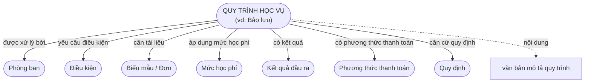
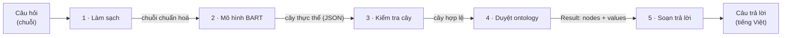
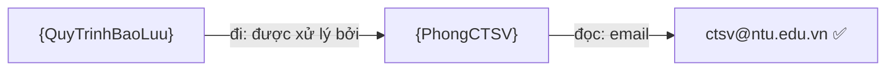
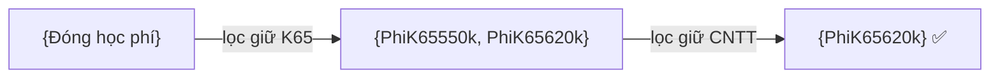
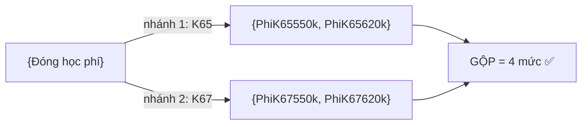
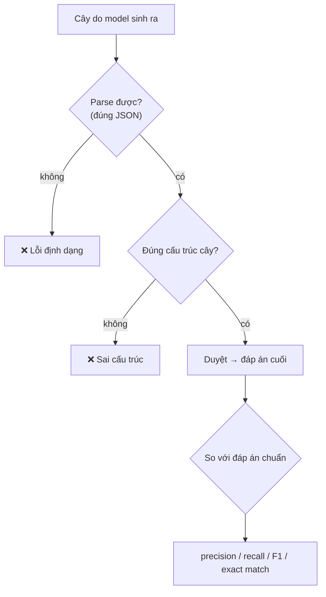
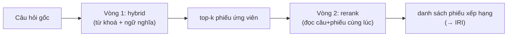
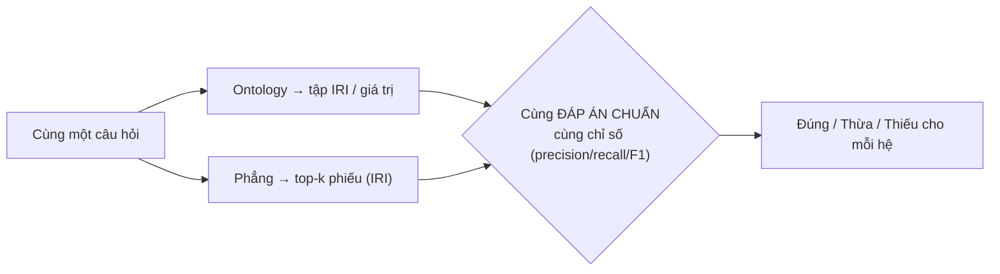
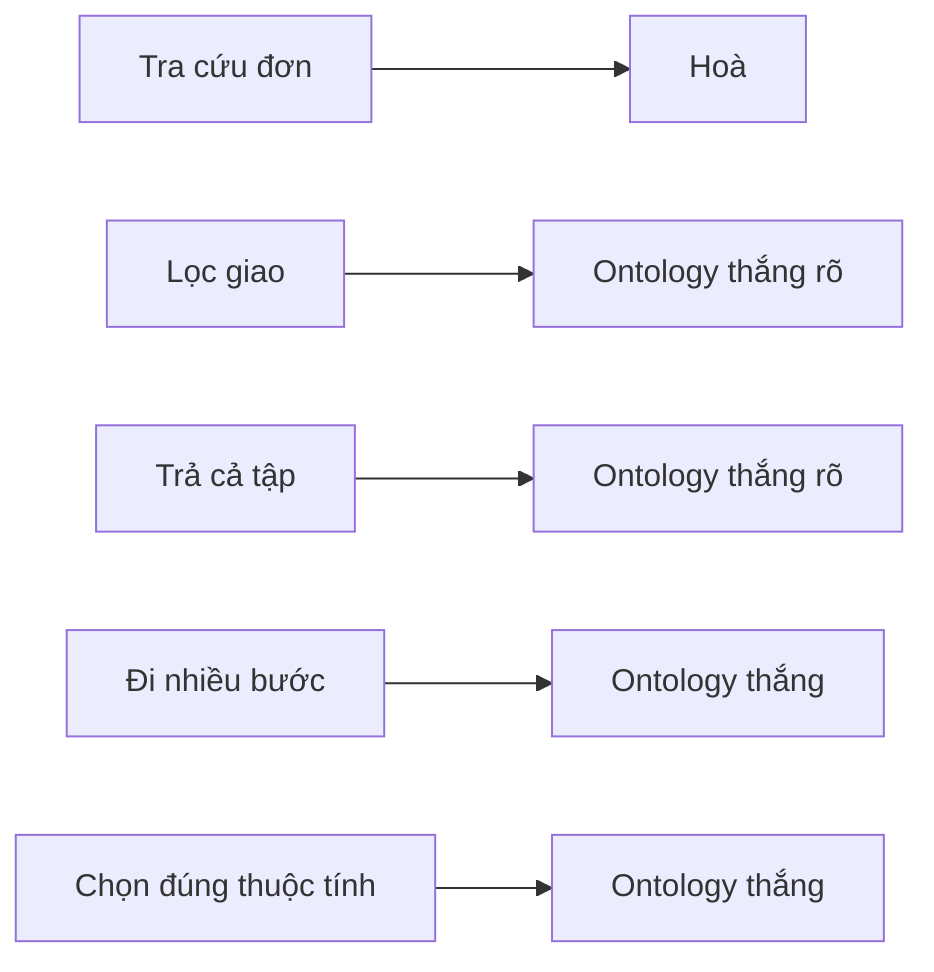

# Chatbot học vụ trên nền Ontology — Khái niệm & Phương pháp

> Tài liệu này giải thích **ý tưởng và cách hoạt động** của hệ thống cho người đọc **không cần biết code**: bằng lời + sơ đồ +
> **dữ liệu JSON thật** lấy từ ontology của đề tài. Đây là bộ khung để viết báo cáo và để hiểu nhanh toàn bộ nghiên cứu.
>
> *Trọng tâm đề tài là **chatbot tra cứu quy trình học vụ bằng ontology**. Phần đối chứng với cơ sở dữ liệu phẳng (phần 6) chỉ là **phần bổ trợ** để làm rõ giá trị của ontology, không phải mục tiêu chính.*
>
> *Quy ước **placeholder kết quả**: ô đánh dấu 📊 là chỗ dành cho biểu đồ/số liệu thật (train, test, benchmark) — chèn vào sau khi chạy.*

## Mục lục
1. [Mục tiêu nghiên cứu](#1-mục-tiêu-nghiên-cứu)
2. [Bức tranh tổng quan](#2-bức-tranh-tổng-quan)
3. [Ontology — bản đồ tri thức lấy quy trình học vụ làm trung tâm](#3-ontology--bản-đồ-tri-thức-lấy-quy-trình-học-vụ-làm-trung-tâm)
4. [Pipeline Ontology — hệ thống chính](#4-pipeline-ontology--hệ-thống-chính)
5. [Đánh giá mô hình sinh cây](#5-đánh-giá-mô-hình-sinh-cây)
6. [(Bổ trợ) Đối chứng với cơ sở dữ liệu phẳng](#6-bổ-trợ-đối-chứng-với-cơ-sở-dữ-liệu-phẳng)
7. [Tóm tắt](#7-tóm-tắt)

---

## 1. Mục tiêu nghiên cứu

Xây một chatbot tiếng Việt tra cứu **quy trình học vụ** của Trường ĐH Nha Trang — *bảo lưu, chuyển ngành, đăng ký học phần,
học lại, học cải thiện, rút môn, đóng học phí, xét học bổng, xét tốt nghiệp* — bằng cách tổ chức tri thức theo **ontology**
(đồ thị quan hệ ngữ nghĩa).

Lý do chọn ontology: **một quy trình học vụ không đứng một mình — nó kết nối tới hầu hết mọi thứ khác**. Hỏi về "bảo lưu" có
thể là hỏi *phòng nào xử lý*, *cần điều kiện gì*, *nộp đơn nào*, *căn cứ quy định nào*, *kết quả ra sao*. Ontology nắm các
**quan hệ** đó như những con đường có tên, nên trả lời được cả những câu phải **đi qua nhiều bước**.

> Phần **6** thêm một phép **đối chứng** với cách lưu trữ "phẳng" (tìm kiếm thông thường) để cho thấy ontology hơn ở đâu — nhưng
> đó chỉ là **bổ trợ chứng minh**, sức nặng của đề tài nằm ở chính hệ thống ontology (phần 3–5).

---

## 2. Bức tranh tổng quan

Hệ thống nhận **câu hỏi** và trả về **câu trả lời**, qua một chuỗi xử lý:


Trái tim của hệ là **ontology** (kho tri thức về các quy trình học vụ) và **thuật toán duyệt** đi trên đó. Mô hình BART chỉ
làm nhiệm vụ **dịch câu hỏi thành một lộ trình** để đi trên ontology.

---

## 3. Ontology — bản đồ tri thức lấy quy trình học vụ làm trung tâm

Hình dung ontology như một **tấm bản đồ**:

- **Điểm trên bản đồ** = **cá thể** (*individual*): một quy trình (*Bảo lưu*), một phòng (*Phòng CTSV*), một điều kiện, một mức học phí…
- **Đường nối có tên** = **quan hệ** (*object property*): *"được xử lý bởi"*, *"yêu cầu điều kiện"*, *"áp dụng mức học phí"*…
- **Nhãn dán trên mỗi điểm** = **thuộc tính** (*datatype property*) → **giá trị** (*literal*): email, số điện thoại, nội dung…

### 3.1. Quy trình học vụ là HUB của ontology

Đây là điểm quan trọng nhất: **mỗi quy trình học vụ là một trung tâm (hub) toả ra hầu hết các loại sự vật khác.** Ontology của
đề tài có **9 quy trình**, mỗi quy trình nối qua tối đa **7 quan hệ**:



8 **loại sự vật** (class): Quy trình học vụ, Phòng ban hành chính, Điều kiện, Tài liệu biểu mẫu, Định mức học phí, Kết quả đầu
ra, Phương thức thanh toán, Quy định.

### 3.2. Một quy trình thật trông như thế nào (dữ liệu JSON)

Lấy quy trình **Bảo lưu** thật trong ontology. Tri thức được lưu dưới dạng **bộ ba** *(điểm A) —quan hệ→ (điểm B)*:

```text
QuyTrinhBaoLuu  ──được xử lý bởi──►   PhongCTSV
QuyTrinhBaoLuu  ──yêu cầu điều kiện─► DieuKienBaoLuuYTe, …VuTrang, …QuocTe, …CaNhan   (4 điều kiện)
QuyTrinhBaoLuu  ──cần tài liệu──────► DonXinBaoLuu, DonXinHocTroLai
QuyTrinhBaoLuu  ──có kết quả────────► OutputDuocBaoLuu
QuyTrinhBaoLuu  ──căn cứ quy định───► RegQD1052
QuyTrinhBaoLuu  ──nội dung (thuộc tính)──► "1. Sinh viên được xin nghỉ học tạm thời và bảo lưu kết quả…"
```

Mỗi **điểm** khi lấy ra có hình dạng (đã làm phẳng cho dễ đọc) — ví dụ điểm **Phòng CTSV** với các **thuộc tính** thật:

```json
{
  "iri": "PhongCTSV",
  "class": "PhongBanHanhChinh",
  "label": "Phòng Công tác Sinh viên",
  "data": {
    "truongPhong": "ThS. Đỗ Quốc Việt",
    "email": "ctsv@ntu.edu.vn",
    "soDienThoai": "02582221900",
    "diaDiem": "Tầng 1, Tòa nhà Hiệu Bộ, trường Đại học Nha Trang",
    "website": "https://phongctsv.ntu.edu.vn/"
  }
}
```

Điểm mấu chốt: **thông tin nằm đúng chỗ của nó và được nối với nhau bằng quan hệ có tên.** Email không nằm trong "Bảo lưu" mà
nằm ở "Phòng CTSV" — muốn lấy phải **đi theo quan hệ** *được xử lý bởi*. Đây chính là thứ giúp ontology trả lời các câu nhiều bước.

### 3.3. Bảng thuật ngữ (lời thường ↔ thuật ngữ kỹ thuật)

| Lời thường trong tài liệu | Thuật ngữ kỹ thuật | Ví dụ thật |
|---|---|---|
| sự vật / điểm trên bản đồ | **individual** (cá thể) | QuyTrinhBaoLuu, PhongCTSV |
| loại sự vật | **class** (lớp) | Quy trình học vụ, Phòng ban hành chính |
| đường nối có tên | **object property** (quan hệ) | duocXuLyBoi ("được xử lý bởi") |
| nhãn dán → giá trị | **datatype property** → **literal** | email → "ctsv@ntu.edu.vn" |
| tờ hướng dẫn đường đi | **cây thực thể** (entity tree) | đầu ra của mô hình BART |
| mã định danh của một điểm | **IRI** | "PhongCTSV" |

---

## 4. Pipeline Ontology — hệ thống chính

### 4.1. Năm chặng và hình dạng dữ liệu qua mỗi chặng



| Chặng | Chức năng | Đầu vào | Đầu ra (hình dạng) |
|---|---|---|---|
| 1 · Làm sạch | Chuẩn hoá chữ; cố tình "ngu" (không phân tích) | `"Email phòng xử lý bảo lưu?"` | `"email phòng xử lý bảo lưu"` |
| 2 · Mô hình BART | Hiểu câu → sinh **cây thực thể** | chuỗi sạch | JSON cây (xem 4.2) |
| 3 · Kiểm tra cây | Bỏ phần rác, bảo đảm đúng định dạng | cây JSON thô | cây hợp lệ (hoặc `vague`) |
| 4 · Duyệt ontology | **Đi theo cây** trên bản đồ → lấy kết quả | cây hợp lệ | `Result` (xem 4.3) |
| 5 · Soạn trả lời | Ghép kết quả thành câu, giọng nghiêm túc | `Result` | chuỗi trả lời |

### 4.2. Mô hình BART: câu hỏi → cây thực thể (JSON)

Mô hình biến câu hỏi thành một **cây JSON**: ghi rõ *bắt đầu ở quy trình/sự vật nào*, rồi *đi theo quan hệ nào / đọc thuộc tính
nào*. Hình dạng cố định:

```json
{ "act": "query",
  "entities": [ { "label": "...", "type": "individual | object | data", "children": [ ... ] } ] }
```

- `act` ∈ `query | greeting | ood | vague` (câu hỏi thật / chào / ngoài phạm vi / mơ hồ).
- mỗi nút: `label` (đoạn chữ), `type` (vai trò), `children` (cây con). **Gốc luôn là `individual`** (chủ thể được hỏi).

**Bốn ví dụ thật** (cùng chủ thể *Bảo lưu*), từ đơn giản đến nhiều bước:

**(a) Tự mô tả** — *"thủ tục bảo lưu là gì"*
```json
{ "act": "query", "entities": [ { "label": "bảo lưu", "type": "individual", "children": [] } ] }
```

**(b) Đi một quan hệ** — *"phòng nào xử lý thủ tục bảo lưu"*
```json
{ "act": "query", "entities": [
  { "label": "bảo lưu", "type": "individual", "children": [
    { "label": "phòng xử lý", "type": "object", "children": [] } ] } ] }
```

**(c) Đi nhiều bước** — *"email của phòng xử lý thủ tục bảo lưu"*
```json
{ "act": "query", "entities": [
  { "label": "bảo lưu", "type": "individual", "children": [
    { "label": "phòng xử lý", "type": "object", "children": [
      { "label": "email", "type": "data", "children": [] } ] } ] } ] }
```

**(d) Lọc giao** — *"học phí khoá K65 ngành CNTT"* (gốc "học phí" trỏ tới quy trình *Đóng học phí*)
```json
{ "act": "query", "entities": [
  { "label": "học phí", "type": "individual", "children": [
    { "label": "K65", "type": "individual", "children": [
      { "label": "CNTT", "type": "individual", "children": [] } ] } ] } ] }
```
> Ở (d), "K65" và "CNTT" là **tên các mức học phí đích**, nên là nút `individual` **lồng nhau**; hệ tự dò trong các mức mà quy
> trình "học phí" liên kết tới (xem 4.3 — lồng nhau = phép GIAO).

**Mô hình làm được nhờ đâu?** Nhờ **bộ dữ liệu huấn luyện** phủ **nhiều cách diễn đạt cho cùng một ý** — nên nó học *ý*, không
học vẹt câu chữ. Ba câu sau cho ra **cùng một cây** ở ví dụ (d):

| Câu hỏi (diễn đạt khác nhau) | Cây sinh ra |
|---|---|
| "học phí K65 ngành CNTT" | (d) |
| "sinh viên K65 công nghệ thông tin đóng bao nhiêu một tín" | *(y hệt)* |
| "hp khóa 65 cntt" | *(y hệt)* |

Mô hình còn **phân loại ý định** (gắn ở `act`) để biết khi nào **không nên tra**:

| `act` | Ví dụ câu | Trả lời |
|---|---|---|
| `query` | "điều kiện bảo lưu" | tra ontology rồi trả thông tin |
| `greeting` | "xin chào", "cảm ơn ad" | "Xin chào. Đây là hệ thống tra cứu thủ tục học vụ…" |
| `ood` | "hôm nay trời mưa không" | "Không có thông tin." |
| `vague` | "thủ tục như nào", "phòng nào" | "Không hiểu câu hỏi." |

### 4.3. Thuật toán duyệt: đi bản đồ theo cây

Chặng 4 giữ một **"tập điểm hiện tại"** (đang đứng ở đâu) và biến đổi nó qua mỗi nút con:
- **`object`** → đi theo quan hệ đó → tập hiện tại nhảy sang các điểm đích;
- **`data`** → đọc thuộc tính → **trả giá trị** (kết thúc nhánh);
- **`individual`** (không phải gốc) → **lọc**: trong các điểm đang có (và điểm cách 1 bước), chỉ giữ điểm khớp tên → **thu hẹp**.

**Hai cách ghép — đối nhau, đừng lẫn:**
- **Lồng nhau (cha → con nối tiếp) = phép VÀ = GIAO.** Mỗi tầng con lọc tiếp trên kết quả tầng cha (thu hẹp dần).
- **Anh em (nhiều con cùng một cha) = nhánh ĐỘC LẬP = GỘP/HỢP.** Mỗi nhánh chạy riêng rồi cộng kết quả.

**Ví dụ đi nhiều bước** — cây (c) ở trên (*"email phòng xử lý bảo lưu"*):



Kết quả của bước duyệt có hình dạng `Result` như sau (giá trị thật):
```json
{ "nodes": [], "values": [ { "prop": "email", "values": ["ctsv@ntu.edu.vn"] } ], "misses": [], "vague": false }
```
→ chặng 5 render thành: `Email: ctsv@ntu.edu.vn`.

**Ví dụ lọc giao (VÀ)** — cây (d) (*"học phí K65 CNTT"*), đáp án đúng = `PhiK65620k`:


```json
{ "nodes": [ { "iri": "PhiK65620k", "class": "DinhMucHocPhi", "label": "Học phí K65 (Công nghệ thông tin)",
              "data": { "hocPhiMoiTinChi": 620000 } } ],
  "values": [], "misses": [], "vague": false }
```

**Ví dụ gộp/hợp (anh em)** — *"học phí K65 với K67"*: hai nút `individual` **anh em** dưới "học phí":

Lồng nhau (giao) và anh em (hợp) cho kết quả **ngược nhau** — nên mô hình phải học đặt **đúng cấu trúc cây**.

**Ví dụ không có dữ liệu** — *"học phí ngành Y khoa"* (ngành không tồn tại): đi tới các mức nhưng không mức nào khớp "Y khoa":
```json
{ "nodes": [], "values": [], "misses": ["Y khoa"], "vague": false }
```
→ render: `Không có thông tin «Y khoa».` (hệ không bịa).

---

## 5. Đánh giá mô hình sinh cây

Phần này đo **chất lượng mô hình BART** (chặng 2). Vì đầu ra là **một cấu trúc** (cây JSON) chứ không phải một nhãn, ta chấm
theo **nhiều bước từ lỏng đến chặt**:



**Vì sao chấm ở "đáp án cuối":** điều người dùng nhận là **câu trả lời sau khi duyệt**, không phải cây trung gian. Hai cây
*viết khác nhau* vẫn có thể cho *cùng đáp án đúng* (đảo thứ tự "K65 CNTT"). Còn cây *lệch một chút* có thể **duyệt ra đáp án sai**.

**Các chỉ số** (dùng đúng thuật ngữ chuẩn). Với mỗi câu, gọi tập đáp án mô hình là **P**, tập đúng là **G**:
- **TP** (true positive, *đúng*) = P ∩ G · **FP** (false positive, *thừa*) = P \ G · **FN** (false negative, *thiếu*) = G \ P
- **precision** = TP / (TP + FP) — *trong cái trả ra, bao nhiêu đúng*
- **recall** = TP / (TP + FN) — *trong cái cần có, lấy được bao nhiêu*
- **F1** = 2·precision·recall / (precision + recall) — *một con số cân bằng*
- **exact match** (khớp đúng cả tập) = 1 nếu P = G, ngược lại 0 — *thước đo nghiêm nhất*

**Ví dụ chấm** — câu *"học phí khoá K65"*, đáp án chuẩn `G = {PhiK65550k, PhiK65620k}`:

| Mô hình trả P | parse? | cấu trúc? | TP | FP | FN | precision | recall | F1 | exact |
|---|:--:|:--:|:--:|:--:|:--:|:--:|:--:|:--:|:--:|
| `{PhiK65550k, PhiK65620k}` | ✓ | ✓ | 2 | 0 | 0 | 1.00 | 1.00 | 1.00 | ✅ |
| `{PhiK65550k, PhiK65620k, PhiK67620k}` *(thừa)* | ✓ | ✓ | 2 | 1 | 0 | 0.67 | 1.00 | 0.80 | ❌ |
| `{PhiK65550k}` *(thiếu)* | ✓ | ✓ | 1 | 0 | 1 | 1.00 | 0.50 | 0.67 | ❌ |
| `{PhongCTSV}` *(sai chủ thể)* | ✓ | ✓ | 0 | 1 | 2 | 0.00 | 0.00 | 0.00 | ❌ |
| `{"học phí": [ {…` *(JSON vỡ)* | ✗ | – | – | – | – | – | – | – | ❌ (format) |

Riêng trường `act` là **bài phân loại 4 lớp** thông thường → chấm bằng precision/recall/F1 từng lớp + **confusion matrix**.

> 📊 **[PLACEHOLDER — chèn sau khi train]** Đường cong huấn luyện (train loss vs validation loss). `docs/figures/training_curve.png`

> 📊 **[PLACEHOLDER — chèn sau khi đánh giá]** F1 / exact match theo từng loại câu hỏi. `docs/figures/eval_per_category.png`

> 📊 **[PLACEHOLDER — chèn sau khi đánh giá]** Confusion matrix phân loại `act`. `docs/figures/intent_confusion.png`

> *BLEU/ROUGE (đo độ giống chữ) **không hợp** làm thước đo chính: cây JSON không phải văn xuôi, và "giống chữ" không bảo đảm
> "duyệt ra đúng đáp án".*

---

## 6. (Bổ trợ) Đối chứng với cơ sở dữ liệu phẳng

> **Đây là phần phụ.** Mục tiêu: cho thấy *vì sao* tổ chức tri thức theo ontology trả lời tốt hơn cách lưu trữ "phẳng" thông
> thường, ở các câu hỏi **có cấu trúc**. Hệ chính (phần 3–5) vẫn là chatbot ontology.

### 6.1. Kho phẳng được xây thế nào (dữ liệu JSON)

Lấy **mỗi cá thể** trong ontology và "dập phẳng" thành **một phiếu** văn bản: gộp tên + tên gọi khác + giá trị thuộc tính + lớp,
**bỏ hết quan hệ**. Mã phiếu = IRI (để chấm so được với ontology). Ví dụ phiếu của Phòng CTSV và một mức học phí:

```json
{ "id": "PhongCTSV", "class": "PhongBanHanhChinh",
  "text": "Phòng Công tác Sinh viên | CTSV | trưởng phòng ThS. Đỗ Quốc Việt | email ctsv@ntu.edu.vn | điện thoại 02582221900 | Tầng 1 Tòa nhà Hiệu Bộ | https://phongctsv.ntu.edu.vn/" }
```
```json
{ "id": "PhiK65620k", "class": "DinhMucHocPhi",
  "text": "Học phí K65 (Công nghệ thông tin) | Công nghệ thông tin | CNTT | k65 | 620000 đồng mỗi tín chỉ" }
```

Khác biệt **cốt tử**: phiếu là **văn bản rời rạc**. Nó **không biết** "Phòng CTSV" *xử lý* "Bảo lưu" — quan hệ đã bị xoá.

### 6.2. Pipeline phẳng: hybrid search → rerank



- **Vòng 1 — hybrid retrieval:** trộn hai cách tìm. **BM25** (xếp hạng theo độ khớp từ, có xét độ hiếm của từ) + **embedding**
  (biến câu và phiếu thành vector số; gần nhau = nghĩa gần nhau, dù khác chữ). Lấy ra top-k phiếu ứng viên.
- **Vòng 2 — reranker (cross-encoder):** một mô hình **đọc đồng thời câu hỏi + từng phiếu ứng viên** rồi chấm lại độ liên quan
  — chính xác hơn vòng 1 nhưng chậm, nên chỉ chạy trên top-k.

> *Cấu hình đã thử (`stress_test_vram.py`): retrieval **BGE-M3** (sinh cả vector ngữ nghĩa lẫn trọng số từ khoá), rerank
> **BGE-reranker-v2-m3**. Đây là baseline **mạnh** (mô hình thần kinh đa ngữ) — cố ý chọn mạnh để không bị tố "đánh baseline yếu".
> Cụm baseline là **module benchmark riêng** (được dùng GPU), KHÔNG nằm trong bản triển khai CPU của hệ ontology.*

> ⚠️ Dù mạnh, hệ phẳng **chỉ tìm phiếu giống câu hỏi nhất**. Nó **không đi theo quan hệ, không lọc giao, trả về một phiếu chứ
> không phải một thuộc tính cụ thể**, và **không biết phải trả bao nhiêu** kết quả (phải tự chọn `k`).

### 6.3. So sánh thế nào cho công bằng



- **Cùng đầu vào:** cả hai nhận **câu hỏi gốc** (hệ phẳng không mượn cây của mô hình — tránh thiên vị).
- **Cùng đáp án chuẩn**, gồm 3 kiểu: **(a) tập cá thể** (IRI), **(b) đúng thuộc tính được hỏi** (email vs điện thoại), **(c) giá
  trị**. **Lấy đúng phiếu nhưng sai thuộc tính = vẫn tính SAI.**
- **Bộ benchmark = bộ test** (5898 câu tổng: train 4453 / test 1445; test tách theo **cách diễn đạt khác** train để chống học vẹt).
  Mỗi câu có đáp án chuẩn **tự kiểm bằng thuật toán duyệt**.
- Hệ phẳng trả **danh sách xếp hạng** nên phải đoán `k` → báo cáo thêm **recall@k** và nêu thẳng hạn chế "phải đoán k".

### 6.4. Các ví dụ so sánh — kèm hình dạng dữ liệu

> Mỗi ví dụ cho thấy **đáp án chuẩn**, **đầu ra ontology**, **đầu ra phẳng** ở dạng dữ liệu cụ thể, để thấy rõ vì sao thắng/hoà.

**Ví dụ 1 — lọc giao** *"học phí K65 ngành CNTT"*
```json
gold     : { "type": "set", "answer": ["PhiK65620k"] }
ontology : { "answer": ["PhiK65620k"] }                       // precision 1.0, recall 1.0, exact ✅
flat     : { "ranked": ["PhiK65620k", "PhiK65550k", "PhiK67620k", "PhiK66620k"] }  // top-1 đúng, nhưng…
```
Hệ phẳng **không làm được phép VÀ**: mọi phiếu chứa "K65" *hoặc* "CNTT" đều nổi lên (PhiK65550k = K65 ngành khác; PhiK67620k =
CNTT khoá khác). Nếu lấy top-3 → **FP = 2** → precision 0.33. → **Ontology thắng.**

**Ví dụ 2 — trả cả một tập** *"học phí khoá K65"*
```json
gold     : { "type": "set", "answer": ["PhiK65550k", "PhiK65620k"] }
ontology : { "answer": ["PhiK65550k", "PhiK65620k"] }          // exact ✅ (biết đúng có 2 mức)
flat     : { "ranked": ["PhiK65620k", "PhiK65550k", "PhiK67550k", "..."] }  // đúng 2 cái đầu, nhưng phải đoán k=?
```
Lấy `k=1` → thiếu (recall 0.5); lấy `k=3` → thừa (precision 0.67). Ontology **đi tới đúng các điểm** nên trả đúng lực lượng. →
**Ontology thắng.**

**Ví dụ 3 — đi nhiều bước** *"email phòng xử lý bảo lưu"*
```json
gold     : { "type": "value", "prop": "email", "answer": "ctsv@ntu.edu.vn" }
ontology : { "values": [ { "prop": "email", "values": ["ctsv@ntu.edu.vn"] } ] }   // ✅ đi 2 bước
flat     : { "ranked": ["QuyTrinhBaoLuu", "DonXinBaoLuu"] }   // phiếu "bảo lưu" KHÔNG chứa email
```
Email nằm ở **phiếu khác** (PhongCTSV), nối qua quan hệ *được xử lý bởi* mà hệ phẳng đã xoá → nó **không bắc cầu** được. →
**Ontology thắng** (trừ khi dùng biến thể "gộp-sẵn", xem dưới).

**Ví dụ 4 — chọn đúng thuộc tính** *"số điện thoại phòng CTSV"* vs *"email phòng CTSV"*
```json
gold (sđt)  : { "type": "value", "prop": "soDienThoai", "answer": "02582221900" }
ontology    : { "values": [ { "prop": "soDienThoai", "values": ["02582221900"] } ] }   // ✅ đúng field
flat        : { "ranked": ["PhongCTSV"] }   // đúng PHIẾU, nhưng phiếu có cả email lẫn sđt → khó chọn đúng field
```
Hệ phẳng (kể cả có rerank) trả về **phiếu**, không tách được **thuộc tính** → dễ trả nhầm email khi hỏi điện thoại. → **Ontology thắng.**

**Ví dụ 5 — tra cứu đơn** *"email phòng CTSV"*
```json
gold     : { "type": "value", "prop": "email", "answer": "ctsv@ntu.edu.vn" }
ontology : { "values": [ { "prop": "email", "values": ["ctsv@ntu.edu.vn"] } ] }   // ✅
flat     : { "ranked": ["PhongCTSV"] }   // tìm đúng phiếu, email nằm ngay trong phiếu → cũng ra đúng
```
Câu một bước, một field rõ ràng → **hai bên HOÀ**. Báo cáo nêu thẳng để phép so đáng tin.

### 6.5. Cấu hình & kỳ vọng

**Các cấu hình hệ phẳng đem so** (tự phản biện): (1) **phẳng cơ bản** (hybrid + rerank); (2) **phẳng gộp-sẵn** — mỗi phiếu nhồi
luôn thông tin hàng xóm (baseline khó nhất, giúp câu nhiều bước); (3) **phẳng + thực-thể** — đưa thực thể mô hình trích được vào
search phẳng: nếu ontology *vẫn* thắng thì lợi thế đến từ **cách lưu trữ đồ thị**, không phải chỉ nhờ khâu hiểu câu.



> 📊 **[PLACEHOLDER — chèn sau khi chạy benchmark]** Cột so sánh Ontology vs Phẳng theo từng loại câu hỏi. `docs/figures/benchmark_per_type.png`

> 📊 **[PLACEHOLDER — chèn sau khi chạy benchmark]** Đường recall@k của hệ phẳng. `docs/figures/recall_at_k.png`

---

## 7. Tóm tắt

1. **Trọng tâm:** chatbot tra cứu **quy trình học vụ** bằng **ontology**. Mỗi quy trình là **hub** nối tới phòng ban, điều kiện,
   biểu mẫu, học phí, kết quả, thanh toán, quy định.
2. **Ontology = bản đồ tri thức**: cá thể là điểm, quan hệ là đường có tên, thuộc tính là nhãn → giá trị.
3. **Mô hình BART** biến câu hỏi thành **cây thực thể** (lộ trình đi trên bản đồ); học được nhờ dữ liệu phủ nhiều cách diễn đạt.
4. **Thuật toán duyệt** đi theo cây: **lồng nhau = GIAO**, **anh em = HỢP** → làm được lọc giao, đi nhiều bước, trả đúng cả tập.
5. **Đánh giá mô hình** chấm ở **đáp án cuối** bằng precision / recall / F1 / exact match, tách theo từng loại câu hỏi.
6. **(Bổ trợ)** Đối chứng với CSDL phẳng (hybrid + rerank) trên cùng câu hỏi, cùng đáp án chuẩn, cùng chỉ số → cho thấy ontology
   trả lời đúng và đủ hơn ở câu hỏi có cấu trúc.
