# Chatbot tra cứu quy trình học vụ trên nền Ontology: Khái niệm và Phương pháp

Tài liệu trình bày ý tưởng, kiến trúc và phương pháp đánh giá của hệ thống ở mức khái niệm, không yêu cầu người đọc tiếp xúc mã
nguồn. Nội dung được minh hoạ bằng sơ đồ và dữ liệu thật trích từ ontology của đề tài, nhằm làm cơ sở cho báo cáo khoa học.

Trọng tâm của đề tài là chatbot tra cứu các quy trình học vụ dựa trên ontology. Phép đối chứng với cơ sở dữ liệu phẳng ở Mục 6 là
nội dung bổ trợ, nhằm làm rõ giá trị của ontology, không phải mục tiêu chính.

## Mục lục
1. [Mục tiêu nghiên cứu](#1-mục-tiêu-nghiên-cứu)
2. [Tổng quan hệ thống](#2-tổng-quan-hệ-thống)
3. [Ontology lấy quy trình học vụ làm trung tâm](#3-ontology-lấy-quy-trình-học-vụ-làm-trung-tâm)
4. [Hệ thống chính: pipeline ontology](#4-hệ-thống-chính-pipeline-ontology)
5. [Đánh giá mô hình sinh cây](#5-đánh-giá-mô-hình-sinh-cây)
6. [Nội dung bổ trợ: đối chứng với cơ sở dữ liệu phẳng](#6-nội-dung-bổ-trợ-đối-chứng-với-cơ-sở-dữ-liệu-phẳng)
7. [Tóm tắt](#7-tóm-tắt)

---

## 1. Mục tiêu nghiên cứu

Nghiên cứu xây dựng một chatbot tiếng Việt tra cứu các quy trình học vụ của Trường Đại học Nha Trang, tổ chức tri thức theo mô
hình ontology. Hệ tri thức gồm chín quy trình học vụ: xin bảo lưu kết quả học tập, xin chuyển ngành, đăng ký học phần, học cải
thiện, đăng ký học lại, đóng học phí, rút môn học, xét học bổng và xét tốt nghiệp.

Việc chọn ontology xuất phát từ một đặc điểm bản chất của miền học vụ: một quy trình không tồn tại độc lập mà liên kết tới nhiều
đối tượng khác. Một câu hỏi về thủ tục bảo lưu có thể nhắm tới phòng ban phụ trách, các điều kiện cần thoả mãn, biểu mẫu phải nộp,
quy định làm căn cứ, hoặc kết quả của thủ tục. Ontology biểu diễn các liên kết đó dưới dạng các quan hệ có tên, nhờ vậy hệ thống
trả lời được cả những câu hỏi đòi hỏi đi qua nhiều liên kết liên tiếp.

Để kiểm tra giả thuyết rằng cách tổ chức này có lợi thế, Mục 6 bổ sung một phép đối chứng với cơ sở dữ liệu phẳng theo lối tìm
kiếm thông thường. Phần đối chứng đóng vai trò minh chứng bổ trợ; trọng tâm nghiên cứu nằm ở chính hệ thống ontology trình bày tại
các Mục 3–5.

---

## 2. Tổng quan hệ thống

Hệ thống tiếp nhận một câu hỏi và sinh ra câu trả lời thông qua một chuỗi xử lý tuyến tính, thể hiện ở Hình 1.

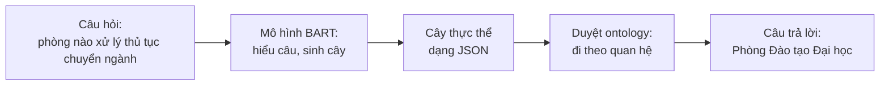

**Hình 1.** Luồng xử lý tổng quát của hệ thống.

Thành phần cốt lõi là ontology, đóng vai trò kho tri thức về các quy trình học vụ, cùng thuật toán duyệt vận hành trên ontology
đó. Mô hình BART giữ vai trò trung gian, dịch câu hỏi ngôn ngữ tự nhiên thành một lộ trình truy vấn để thuật toán duyệt thi hành.

---

## 3. Ontology lấy quy trình học vụ làm trung tâm

Ontology của đề tài được tổ chức theo bốn loại thành phần. **Cá thể** (*individual*) biểu diễn một sự vật cụ thể như một quy trình,
một phòng ban hay một điều kiện. **Lớp** (*class*) là loại của cá thể. **Quan hệ** (*object property*) là liên kết có tên giữa hai
cá thể, chẳng hạn *được xử lý bởi* hay *yêu cầu điều kiện*. **Thuộc tính** (*datatype property*) gắn một giá trị đọc được lên cá
thể, chẳng hạn email hay số điện thoại của một phòng ban. Để dễ hình dung, có thể xem ontology như một đồ thị có hướng, trong đó
cá thể là đỉnh, quan hệ là cung có nhãn, còn thuộc tính là giá trị treo trên đỉnh.

### 3.1. Quy trình học vụ là trung tâm liên kết

Đặc điểm then chốt của ontology trong đề tài là mỗi quy trình học vụ giữ vai trò một trung tâm liên kết, kết nối tới các đối tượng
liên quan. Tập đầy đủ các quan hệ mà một quy trình có thể có gồm bảy loại, thể hiện ở Hình 2; mỗi quy trình cụ thể chỉ dùng một
tập con tuỳ bản chất thủ tục.


**Hình 2.** Bảy quan hệ trong tập đầy đủ của một quy trình học vụ. Hai quan hệ *áp dụng mức học phí* và *có phương thức thanh toán*
chỉ xuất hiện ở quy trình đóng học phí; các quy trình khác dùng các quan hệ còn lại.

Bảng 1 liệt kê chín quy trình cùng phòng ban phụ trách và một câu hỏi mẫu cho mỗi quy trình, cho thấy phạm vi tra cứu trải đều
trên nhiều loại quan hệ khác nhau chứ không tập trung vào học phí.

**Bảng 1.** Chín quy trình học vụ, phòng ban phụ trách và câu hỏi mẫu.

| Quy trình | Phòng phụ trách | Câu hỏi mẫu |
|---|---|---|
| Xin bảo lưu kết quả học tập | Phòng Công tác Sinh viên | các điều kiện để được bảo lưu |
| Xin chuyển ngành | Phòng Đào tạo Đại học | thủ tục chuyển ngành cần biểu mẫu gì |
| Đăng ký học phần | Phòng Đào tạo Đại học | đăng ký học phần căn cứ quy định nào |
| Học cải thiện | Phòng Đào tạo Đại học | kết quả của học cải thiện là gì |
| Đăng ký học lại | Phòng Đào tạo Đại học | điều kiện đăng ký học lại |
| Đóng học phí | Phòng Tài chính | phương thức thanh toán học phí |
| Rút môn học | Phòng Đào tạo Đại học | phòng nào xử lý rút môn học |
| Xét học bổng | Phòng Công tác Sinh viên | điều kiện xét học bổng |
| Xét tốt nghiệp | Phòng Đào tạo Đại học | xét tốt nghiệp cần nộp biểu mẫu nào |

Ontology định nghĩa tám lớp đối tượng: Quy trình học vụ, Phòng ban hành chính, Điều kiện, Tài liệu biểu mẫu, Định mức học phí,
Kết quả đầu ra, Phương thức thanh toán và Quy định.

### 3.2. Biểu diễn dữ liệu của một quy trình

Xét quy trình xin bảo lưu kết quả học tập như một trường hợp tiêu biểu. Tri thức được lưu dưới dạng các bộ ba *cá thể nguồn — quan
hệ — cá thể đích*, trình bày ở Bảng 2.

**Bảng 2.** Các liên kết thật của quy trình bảo lưu trong ontology.

| Cá thể nguồn | Quan hệ hoặc thuộc tính | Cá thể đích hoặc giá trị |
|---|---|---|
| QuyTrinhBaoLuu | được xử lý bởi | PhongCTSV |
| QuyTrinhBaoLuu | yêu cầu điều kiện | DieuKienBaoLuuVuTrang, …QuocTe, …YTe, …CaNhan |
| QuyTrinhBaoLuu | cần tài liệu | DonXinBaoLuu, DonXinHocTroLai |
| QuyTrinhBaoLuu | có kết quả | OutputDuocBaoLuu |
| QuyTrinhBaoLuu | căn cứ quy định | RegQD1052 |
| QuyTrinhBaoLuu | thuộc tính nội dung | "1. Sinh viên được xin nghỉ học tạm thời và bảo lưu kết quả…" |

Khi được trích ra để phục vụ hiển thị, một cá thể có hình dạng dữ liệu phẳng như sau, lấy ví dụ Phòng Công tác Sinh viên với các
thuộc tính thật:

```json
{
  "iri": "PhongCTSV",
  "class": "PhongBanHanhChinh",
  "label": "Phòng Công tác Sinh viên",
  "data": {
    "truongPhong": "ThS. Đỗ Quốc Việt",
    "email": "ctsv@ntu.edu.vn",
    "soDienThoai": "02582221900",
    "diaDiem": "Tầng 1, Tòa nhà Hiệu Bộ, trường Đại học Nha Trang",
    "website": "https://phongctsv.ntu.edu.vn/"
  }
}
```

Đặc tính quan trọng là thông tin được đặt đúng vị trí ngữ nghĩa và được nối với nhau bằng quan hệ có tên. Email không nằm trong cá
thể quy trình bảo lưu mà nằm ở cá thể Phòng Công tác Sinh viên, và muốn lấy được phải đi theo quan hệ *được xử lý bởi*. Chính đặc
tính này cho phép ontology trả lời các câu hỏi đòi hỏi nhiều bước suy diễn.

### 3.3. Quy ước thuật ngữ

Bảng 3 đối chiếu một số lối diễn đạt trực quan dùng trong tài liệu với thuật ngữ kỹ thuật chuẩn dùng trong báo cáo.

**Bảng 3.** Ánh xạ thuật ngữ.

| Diễn đạt trực quan | Thuật ngữ kỹ thuật | Ví dụ thật |
|---|---|---|
| điểm, đỉnh đồ thị | individual, cá thể | QuyTrinhBaoLuu, PhongCTSV |
| loại sự vật | class, lớp | Quy trình học vụ, Phòng ban hành chính |
| cung có nhãn | object property, quan hệ | duocXuLyBoi |
| giá trị treo trên đỉnh | datatype property, thuộc tính; literal, giá trị | email, "ctsv@ntu.edu.vn" |
| lộ trình truy vấn | cây thực thể | đầu ra của mô hình BART |
| mã định danh | IRI | PhongCTSV |

---

## 4. Hệ thống chính: pipeline ontology

### 4.1. Các chặng xử lý và hình dạng dữ liệu

Câu hỏi đi qua năm chặng, mỗi chặng biến đổi dữ liệu sang một hình dạng mới, thể hiện ở Hình 3 và Bảng 4.

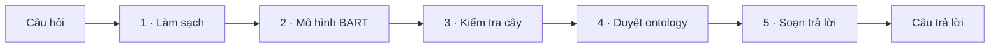

**Hình 3.** Năm chặng của pipeline ontology.

**Bảng 4.** Chức năng, module hiện thực và hình dạng dữ liệu qua từng chặng, minh hoạ cho câu hỏi về phòng xử lý chuyển ngành. Cột
Module ghi tên tệp trong gói mã nguồn `src/ontchatbot/` để người đọc tham chiếu sang codebase.

| Chặng | Module | Chức năng | Đầu vào | Đầu ra |
|---|---|---|---|---|
| 1 · Làm sạch | `preprocess.py` | Chuẩn hoá chữ, không phân tích nội dung | "Phòng nào xử lý chuyển ngành?" | "phòng nào xử lý chuyển ngành" |
| 2 · Mô hình BART | `model.py` | Hiểu câu, sinh cây thực thể | chuỗi đã chuẩn hoá | cây JSON, xem Mục 4.2 |
| 3 · Kiểm tra cây | `tree.py` | Loại phần rác, kiểm tra định dạng | cây JSON thô | cây hợp lệ |
| 4 · Duyệt ontology | `ontology.py` | Đi theo cây trên ontology | cây hợp lệ | kết quả duyệt, xem Mục 4.3 |
| 5 · Soạn trả lời | `render.py` | Ghép kết quả thành câu trả lời | kết quả duyệt | chuỗi trả lời |

Năm chặng được điều phối bởi module `pipeline.py`, vốn chỉ nối các chặng theo một chiều phụ thuộc mà không chứa luật nghiệp vụ.
Toàn bộ năng lực hiểu ngôn ngữ tập trung ở chặng 2; các chặng còn lại không chứa luật hiểu câu, và riêng chặng 4 chỉ thi hành đúng
lộ trình mà cây đã quy định. Thiết kế này giúp hệ thống dễ kiểm chứng và tách bạch trách nhiệm giữa các thành phần.

### 4.2. Mô hình BART sinh cây thực thể

Mô hình BART biến câu hỏi thành một cây JSON mô tả chủ thể được hỏi cùng các quan hệ và thuộc tính cần truy vấn. Cấu trúc cây tuân
theo khuôn:

```json
{ "act": "query",
  "entities": [ { "label": "...", "type": "individual | object | data", "children": [ ... ] } ] }
```

Trường `act` nhận một trong bốn giá trị `query`, `greeting`, `ood`, `vague`, tương ứng câu hỏi thật, câu chào, câu ngoài phạm vi
và câu mơ hồ. Khi `act` bằng `query`, trường `entities` chứa đúng một cây với gốc là một cá thể, tức chủ thể được hỏi tới; với ba
giá trị còn lại, `entities` để rỗng vì câu không nhắm tới đối tượng nào. Mỗi nút gồm nhãn chữ, vai trò `type`, và danh sách nút con.

Độ phức tạp của cây phản ánh độ phức tạp của câu hỏi. Bốn dạng sau, lấy quy trình bảo lưu làm ví dụ xuyên suốt, sắp theo mức tăng
dần; ba dạng đầu sẽ được dùng lại ở Mục 4.3 để minh hoạ thuật toán duyệt, nên đặt tên để tiện tham chiếu.

**Dạng 1 — tự mô tả** ("thủ tục bảo lưu là gì"): gốc đứng một mình, không nút con.
```json
{ "act": "query", "entities": [ { "label": "bảo lưu", "type": "individual", "children": [] } ] }
```
**Dạng 2 — đi một quan hệ** ("phòng nào xử lý bảo lưu"): gốc nối một nút quan hệ.
```json
{ "act": "query", "entities": [ { "label": "bảo lưu", "type": "individual", "children": [
    { "label": "phòng xử lý", "type": "object", "children": [] } ] } ] }
```
**Dạng 3 — đi nhiều bước** ("email của phòng xử lý bảo lưu"): chuỗi quan hệ rồi tới thuộc tính lá.
```json
{ "act": "query", "entities": [ { "label": "bảo lưu", "type": "individual", "children": [
    { "label": "phòng xử lý", "type": "object", "children": [
      { "label": "email", "type": "data", "children": [] } ] } ] } ] }
```
**Dạng 4 — liệt kê một tập** ("các điều kiện để được bảo lưu"): một quan hệ trả về nhiều cá thể đích.
```json
{ "act": "query", "entities": [ { "label": "bảo lưu", "type": "individual", "children": [
    { "label": "điều kiện", "type": "object", "children": [] } ] } ] }
```

Mô hình làm được nhiệm vụ này nhờ bộ dữ liệu huấn luyện phủ nhiều cách diễn đạt cho cùng một ý, nhằm giảm phụ thuộc vào biểu thức bề
mặt của câu hỏi. Bảng 5 minh hoạ ba câu hỏi khác hình thức cùng cho một cây.

**Bảng 5.** Bất biến diễn đạt: ba câu hỏi khác hình thức, cùng một cây thực thể.

| Câu hỏi | Cây sinh ra |
|---|---|
| các điều kiện để được bảo lưu | cây ví dụ thứ tư |
| muốn bảo lưu thì cần thoả mãn những gì | cây tương tự |
| điều kiện xin nghỉ học tạm thời | cây tương tự |

Ngoài việc dựng cây, mô hình còn phân loại ý định câu hỏi qua trường `act` để xác định khi nào không nên truy vấn ontology. Bảng 6
liệt kê bốn loại ý định cùng cách hệ thống phản hồi.

**Bảng 6.** Phân loại ý định và phản hồi tương ứng.

| Giá trị act | Ví dụ câu hỏi | Phản hồi |
|---|---|---|
| query | điều kiện chuyển ngành | truy vấn ontology, trả thông tin |
| greeting | xin chào; cảm ơn | "Xin chào. Đây là hệ thống tra cứu thủ tục học vụ…" |
| ood | hôm nay trời có mưa không | "Không có thông tin." |
| vague | thủ tục như thế nào; phòng nào | "Không hiểu câu hỏi." |

### 4.3. Thuật toán duyệt ontology

Mô hình giao cho chặng này một cây JSON. Chặng duyệt *thi hành* cây: bắt đầu từ gốc, đi dần theo từng nút con, biến đổi một **tập
hiện tại** cho tới khi ra đáp án.

Mục này gồm năm phần: (1) khuôn dữ liệu vào–ra, (2) cách khớp một nhãn, (3) trạng thái khi đi, (4) ví dụ trên dữ liệu thật, (5) các
trường hợp biên.

#### 4.3.1. Khuôn dữ liệu vào và ra

Thuật toán nhận một **cây** và trả một **kết quả quét**. Cả hai có khuôn cố định, không phụ thuộc câu hỏi cụ thể.

Cây vào — khuôn tổng quát (chi tiết ở Mục 4.2):

```json
{ "act": "query",
  "entities": [ { "label": "<nhãn>", "type": "individual | object | data", "children": [ … ] } ] }
```

Kết quả quét — khuôn tổng quát:

```json
{ "nodes":  [ "<cá thể đầu ra>" ],
  "values": [ { "prop": "<thuộc tính>", "values": [ "<giá trị>" ] } ],
  "misses": [ "<nhãn không khớp được>" ],
  "vague":  false }
```

Bốn trường của kết quả quét:

| Trường | Ý nghĩa |
|---|---|
| `nodes` | tập cá thể trả về — đáp án dạng tập |
| `values` | giá trị của thuộc tính lá — đáp án dạng giá trị |
| `misses` | các nhãn không khớp được cá thể hay quan hệ nào |
| `vague` | gốc mơ hồ, không trỏ vào một cá thể → "Không hiểu câu hỏi" |

Một câu hỏi thường chỉ lấp `nodes` *hoặc* `values`; hai trường còn lại cho biết phần trượt và trạng thái mơ hồ.

#### 4.3.2. Khớp một nhãn: cho điểm

Mỗi nút có một **nhãn** (chữ) và một **vai trò**. Vai trò quyết định nhãn được so với phần nào của ontology:

| Vai trò nút | Nhãn được so với |
|---|---|
| cá thể | tên và tên gọi khác của các cá thể |
| quan hệ | nhãn các quan hệ |
| thuộc tính | nhãn các thuộc tính |

Phép so **cho điểm**, không đặt ngưỡng cứng. Trước khi so, nhãn và bề mặt đều bỏ dấu và hạ chữ thường (nên "Bảo Lưu" và "bảo lưu"
là một, viết gọn `bao luu`).

Điểm giữa một nhãn và một bề mặt có bốn mức, từ chặt đến lỏng:

| Mức khớp | Điểm | Ví dụ minh hoạ |
|---|---|---|
| Trùng khít cả chuỗi | 100 | `bao luu` ↔ `bao luu` |
| Mọi từ của nhãn đều nằm trong bề mặt | 90 | `bao luu` nằm trong `output duoc bao luu` |
| Nhãn là chuỗi con liền mạch của bề mặt | 80 | `luu` nằm trong `bao luu` |
| Chỉ một phần số từ của nhãn trúng | 50 × (số từ trúng ÷ số từ nhãn) | nhãn 3 từ trúng 1 từ → ≈ 17 |

Một cá thể có nhiều bề mặt (tên, tên gọi khác, nhãn); điểm của cá thể là **bề mặt cao điểm nhất**. Thuật toán giữ cá thể đạt điểm cao
nhất, không cần trùng khít từng chữ.

Nút quan hệ và nút thuộc tính cũng cho điểm theo cùng bốn mức, nhưng so với *nhãn đã khai báo* của quan hệ/thuộc tính.

Cơ chế "chọn điểm cao nhất" có vài ca lệch — hoà điểm ở đỉnh, gốc sai loại, điểm quá thấp — được gom riêng ở Mục 4.3.5.

#### 4.3.3. Trạng thái khi đi: tập hiện tại

Thuật toán giữ một **tập hiện tại** = các cá thể đang xét. Khởi đầu là cá thể gốc; mỗi nút con biến đổi tập tuỳ vai trò:

| Nút con | Phép biến đổi tập hiện tại | Kết quả |
|---|---|---|
| quan hệ | đi theo quan hệ từ mỗi cá thể trong tập | tập mới gồm các cá thể đích — đi tiếp được |
| thuộc tính | đọc giá trị thuộc tính trên tập hiện tại | trả về giá trị — kết thúc nhánh |
| cá thể (không phải gốc) | trong tập hiện tại và các cá thể cách một bước quan hệ, giữ cá thể khớp nhãn | tập thu hẹp — đi tiếp được |

Cách bố trí nút trong cây quyết định phép hợp thành — đây là chỗ ontology làm được điều tìm kiếm văn bản thường không làm được:

- Nút **lồng nhau** (cha → con) mang nghĩa *và*: con lọc trên kết quả của cha → **phép giao**.
- Nút **anh em** (cùng một cha) là hai nhánh độc lập, cùng xuất phát rồi cộng kết quả → **phép hợp**.

Cả hai cấu trúc sẽ thấy rõ ở Ví dụ D bên dưới.

#### 4.3.4. Ví dụ duyệt trên dữ liệu thật

Từ đây các ví dụ dùng ontology thật của đề tài.

**Ví dụ A — chấm điểm chọn gốc.** Nhãn gốc "bảo lưu" (chuẩn hoá `bao luu`) được chấm trên các cá thể cùng chứa cụm này:

| Cá thể | Bề mặt khớp tốt nhất | Mức khớp | Điểm |
|---|---|---|---|
| `QuyTrinhBaoLuu` | tên gọi khác `bao luu` | trùng khít cả chuỗi | **100** |
| `OutputDuocBaoLuu` | tên cá thể `output duoc bao luu` | đủ mọi từ | 90 |
| `DonXinBaoLuu` | tên cá thể `don xin bao luu` | đủ mọi từ | 90 |
| `DieuKienBaoLuuYTe` | tên cá thể `dieu kien bao luu y te` | đủ mọi từ | 90 |

Chỉ `QuyTrinhBaoLuu` đạt 100 (trùng khít một tên gọi khác); các cá thể khác chỉ 90. Đỉnh là 100 và duy nhất một cá thể chạm tới →
gốc là `QuyTrinhBaoLuu`.

**Ví dụ B — đi nhiều bước.** Xét câu "email của phòng xử lý bảo lưu". Mô hình sinh cây Dạng 3 (Mục 4.2): gốc cá thể → nút quan hệ →
nút thuộc tính lá:

```json
{ "act": "query", "entities": [ { "label": "bảo lưu", "type": "individual", "children": [
    { "label": "phòng xử lý", "type": "object", "children": [
      { "label": "email", "type": "data", "children": [] } ] } ] } ] }
```

Thuật toán thi hành cây này theo ba bước, mỗi bước biến đổi tập hiện tại theo đúng vai trò của nút:

| Bước | Nhãn nút | Vai trò | Phép làm (điểm khớp) | Tập hiện tại sau bước — nội dung thật |
|---|---|---|---|---|
| 0 | "bảo lưu" | cá thể (gốc) | khớp tên gọi khác (100) | `{ QuyTrinhBaoLuu }` — quy trình "Xin bảo lưu kết quả học tập" |
| 1 | "phòng xử lý" | quan hệ | đi quan hệ `duocXuLyBoi` (100) | `{ PhongCTSV }` — "Phòng Công tác Sinh viên" |
| 2 | "email" | thuộc tính | đọc thuộc tính `email` của `PhongCTSV` (100) | giá trị `"ctsv@ntu.edu.vn"` — kết thúc nhánh |

Gốc cho tập hiện tại một phần tử. Nút quan hệ đẩy tập sang cá thể đích, đổi từ quy trình sang phòng. Nút thuộc tính đọc giá trị rồi
đóng nhánh, nên đáp án cuối là giá trị thư điện tử; chặng soạn trả lời chuyển thành câu "Email: ctsv@ntu.edu.vn". Hình 4 tóm tắt
đường đi này.

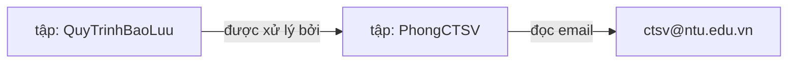

**Hình 4.** Duyệt câu hỏi về email phòng xử lý bảo lưu qua hai bước theo quan hệ.

Kết quả quét cho câu này không có cá thể ở `nodes`, chỉ có một giá trị ở `values`:

```json
{ "nodes": [], "values": [ { "prop": "email", "values": ["ctsv@ntu.edu.vn"] } ], "misses": [], "vague": false }
```

**Ví dụ C — liệt kê một tập.** Hình 5 minh hoạ trường hợp liệt kê ứng với Dạng 4: câu hỏi về các điều kiện bảo lưu cho ra một tập
gồm bốn cá thể.

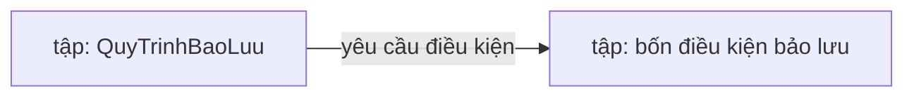

**Hình 5.** Duyệt câu hỏi liệt kê điều kiện. Đáp án là một tập có lực lượng xác định.

```json
{ "nodes": [
    { "iri": "DieuKienBaoLuuVuTrang", "class": "DieuKien", "label": "Được điều động vào lực lượng vũ trang" },
    { "iri": "DieuKienBaoLuuQuocTe",  "class": "DieuKien", "label": "Được điều động tham dự các kỳ thi, giải đấu quốc tế" },
    { "iri": "DieuKienBaoLuuYTe",     "class": "DieuKien", "label": "Bị ốm, thai sản hoặc tai nạn phải điều trị dài ngày có giấy chứng nhận hợp lệ" },
    { "iri": "DieuKienBaoLuuCaNhan",  "class": "DieuKien", "label": "Vì lý do cá nhân khác nhưng phải học ít nhất 01 học kỳ ở Trường" } ],
  "values": [], "misses": [], "vague": false }
```

**Ví dụ D — phép giao và phép hợp.** Truy vấn học phí minh hoạ cả hai. Đóng học phí có nhiều mức phân biệt theo khoá và ngành. Câu
hỏi học phí khoá K65 ngành Công nghệ thông tin cho cây có hai nút cá thể **lồng nhau** dưới gốc:

```json
{ "act": "query", "entities": [ { "label": "học phí", "type": "individual", "children": [
    { "label": "K65", "type": "individual", "children": [
      { "label": "Công nghệ thông tin", "type": "individual", "children": [] } ] } ] } ] }
```

Gốc "học phí" khớp cá thể quy trình đóng học phí; các mức phí nằm cách quy trình đúng một bước quan hệ nên lọt vào diện ứng viên của
nút cá thể con (theo bảng vai trò ở trên). Từ đó mỗi nút cá thể lọc tiếp trên kết quả nút trước: nút "K65" giữ lại hai mức khoá K65,
nút "Công nghệ thông tin" giữ tiếp một mức, thu về đúng một mức như Hình 6.

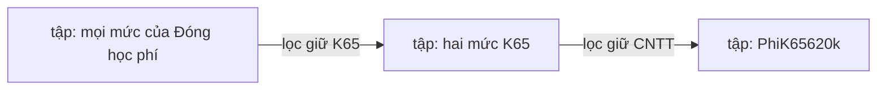

**Hình 6.** Phép giao qua hai nút lọc cá thể lồng nhau; đáp án là PhiK65620k với học phí 620.000 đồng mỗi tín chỉ.

Ngược lại, câu hỏi về học phí khoá K65 và khoá K67 cho cây có hai nút cá thể **anh em** dưới gốc:

```json
{ "act": "query", "entities": [ { "label": "học phí", "type": "individual", "children": [
    { "label": "K65", "type": "individual", "children": [] },
    { "label": "K67", "type": "individual", "children": [] } ] } ] }
```

Mỗi nút anh em lọc độc lập trên cùng tập khởi đầu rồi cộng kết quả, nên đáp án là cả bốn mức của hai khoá.

Điểm mấu chốt: cùng một ontology và cùng hai nhãn khoá, **cấu trúc lồng nhau cho phép giao, cấu trúc anh em cho phép hợp**. Vì vậy
mô hình phải đặt đúng *hình dạng* cây thì đáp án mới đúng.

#### 4.3.5. Trường hợp biên

Mạch trên giả định mọi nhãn khớp gọn vào đúng một đích. Bốn tình huống lệch được xử lý riêng, mỗi tình huống cho một phản hồi xác định:

- **Hoà ở đỉnh → "Không hiểu câu hỏi".** Nếu mô hình rút gốc còn cụm chung thì nhiều cá thể có thể đồng điểm ở đỉnh. Ví dụ gốc trơ
  trọi "học phần" (`hoc phan`) trúng *bốn* cá thể cùng 90 điểm: điều kiện học lại, kết quả có tên trong danh sách lớp, quy trình
  đăng ký học phần, quy trình rút môn học. Vì mỗi cây ứng với đúng một chủ thể, hoà ở gốc nghĩa là chủ thể mơ hồ → hệ từ chối thay
  vì gộp bừa. *(Nhãn đầy đủ "đăng ký học phần" thì chỉ một cá thể chạm đỉnh → đi tiếp bình thường.)*
- **Gốc là một lớp hoặc một quan hệ → "Không hiểu câu hỏi".** Gốc theo thiết kế phải là một *cá thể* chủ thể. Nếu nhãn gốc khớp tên
  một *lớp* (ví dụ "điều kiện") hay nhãn một *quan hệ* rõ hơn mọi cá thể, hệ coi đó là mô hình sinh sai loại và từ chối.
- **Nút con dưới 80 điểm → bỏ nút đó.** Một nút con phải đạt tối thiểu 80 điểm mới được nhận. Dưới mức đó coi như không khớp, để một
  nhãn rác không bị kéo đại vào quan hệ duy nhất của nút.
- **Nhãn không khớp cá thể nào → "Không có thông tin «…»".** Ví dụ hỏi học phí ngành "Y khoa" — ngành không tồn tại — thuật toán
  không suy đoán mà ghi "Y khoa" vào danh sách không tìm thấy và trả lời "Không có thông tin «Y khoa»".

---

## 5. Đánh giá mô hình sinh cây

Việc đánh giá tiến hành ở hai mức nhằm tách bạch nguồn lỗi. Mức thứ nhất là **độ đúng cấu trúc của cây**, so cây mô hình sinh ra
với cây chuẩn về cú pháp, cấu trúc và nhãn các nút; mức này cô lập chất lượng riêng của mô hình BART. Mức thứ hai là **độ đúng đầu
cuối**, duyệt cây thành đáp án rồi so với đáp án chuẩn; mức này phản ánh trải nghiệm người dùng nhưng bao gồm cả bước duyệt. Vì
thuật toán duyệt là xác định và đã được kiểm chứng độc lập, sai khác ở mức đầu cuối chủ yếu phản ánh lỗi của mô hình. Quy trình
đánh giá nhiều mức thể hiện ở Hình 7.

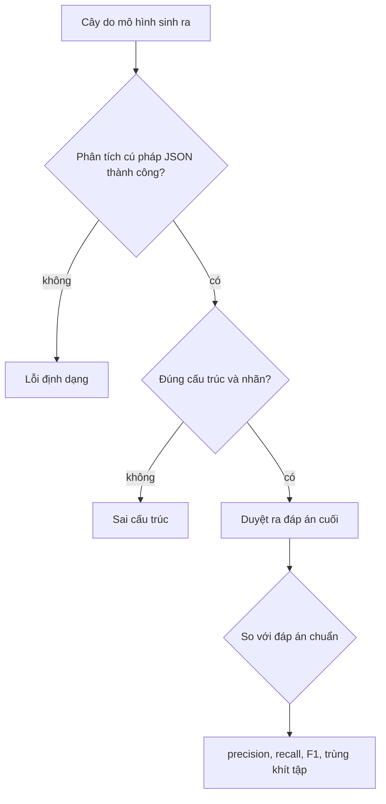

**Hình 7.** Quy trình đánh giá hai mức.

Lý do lấy đáp án cuối làm chuẩn cho mức thứ hai là vì điều người dùng nhận được là câu trả lời sau khi duyệt, không phải cây trung
gian. Hai cây khác nhau về hình thức vẫn có thể cho cùng một đáp án đúng, chẳng hạn khi đảo thứ tự hai nút trong phép giao. Ngược
lại, một cây chỉ lệch nhẹ vẫn có thể duyệt ra đáp án sai. Do đó chỉ phép so ở đáp án cuối mới phản ánh đúng chất lượng đầu cuối.

Gọi P là tập đáp án do mô hình trả về và G là tập đáp án chuẩn. Đặt TP là số phần tử vừa thuộc P vừa thuộc G, FP là số phần tử
thuộc P nhưng không thuộc G, FN là số phần tử thuộc G nhưng không thuộc P. Khi đó precision bằng TP chia cho tổng TP và FP, đo tỷ
lệ đáp án trả ra là đúng; recall bằng TP chia cho tổng TP và FN, đo tỷ lệ đáp án cần có được lấy ra; F1 là trung bình điều hoà của
precision và recall. Chỉ số trùng khít tập (exact match) nhận giá trị một khi P trùng khít G và giá trị không trong trường hợp còn lại; đây là
thước đo nghiêm khắc nhất.

Bảng 7 minh hoạ cách chấm ở mức đầu cuối trên câu hỏi về các điều kiện bảo lưu, với tập chuẩn G gồm bốn điều kiện bảo lưu.

**Bảng 7.** Ví dụ chấm điểm với G gồm bốn điều kiện bảo lưu.

| Đáp án mô hình P | Cú pháp | Cấu trúc | TP | FP | FN | precision | recall | F1 | trùng khít tập |
|---|---|---|---|---|---|---|---|---|---|
| đủ bốn điều kiện đúng | đạt | đạt | 4 | 0 | 0 | 1,00 | 1,00 | 1,00 | 1 |
| bốn điều kiện đúng kèm một cá thể lạ | đạt | đạt | 4 | 1 | 0 | 0,80 | 1,00 | 0,89 | 0 |
| chỉ ba điều kiện | đạt | đạt | 3 | 0 | 1 | 1,00 | 0,75 | 0,86 | 0 |
| trả về một phòng ban | đạt | đạt | 0 | 1 | 4 | 0,00 | 0,00 | 0,00 | 0 |
| JSON hỏng | không | — | — | — | — | — | — | — | 0 |

Trên toàn tập kiểm tra, các chỉ số được gộp ở mức câu rồi tổ chức thành ba nhóm, nhằm tách bạch *chất lượng đầu cuối* khỏi các chỉ
số chỉ đóng vai trò chẩn đoán:

- **Hai chỉ số chính** phản ánh chất lượng đầu cuối. *Exact match accuracy* là tỷ lệ câu có tập đáp án P trùng khít đáp án chuẩn G;
  *macro-F1* là trung bình của F1. Cả hai được tính riêng cho từng nhóm trong năm nhóm năng lực rồi lấy trung bình trên năm nhóm.
  Trục năng lực được dùng thay cho trục miền dữ liệu để con số bám đúng mục tiêu suy luận của đề tài, không bị một miền đông mẫu như
  học phí kéo lệch.
- **Các câu không phải truy vấn** (chào hỏi, ngoài tri thức, mơ hồ) được báo cáo riêng và không tính vào trung bình năng lực, vì
  chúng đo khả năng *từ chối đúng lúc* chứ không đo khả năng suy luận.
- **Nhóm chẩn đoán** — tỷ lệ cú pháp hợp lệ, tỷ lệ cấu trúc hợp lệ và độ chính xác phân loại ý định — cũng báo cáo riêng, không cộng
  vào chỉ số chính: một cây sai cú pháp hay sai cấu trúc tất yếu duyệt ra đáp án rỗng hoặc sai, nên đã bị trừ điểm sẵn trong chỉ số
  đầu cuối.

Với câu hỏi dạng giá trị như email hay số điện thoại, đáp án chỉ là một giá trị đơn, nên trùng khít tập cũng chính là độ chính xác
của giá trị đó.

Trường `act` là một bài toán phân loại bốn lớp thông thường, được đánh giá bằng precision, recall, F1 theo từng lớp kèm ma trận
nhầm lẫn.

Trên tập kiểm tra gồm 2.251 câu, mô hình đạt trùng khít tập trung bình theo năm nhóm năng lực là 0,96 và macro-F1 là 0,97;
mọi câu đều sinh JSON hợp lệ và đúng hợp đồng cây. Riêng các câu truy vấn đạt trùng khít tập 0,96 và độ chính xác phân loại ý định
1,00 — gần như không nhầm ý định.

Tách theo nhóm, kết quả xếp đúng theo độ khó suy luận (Bảng 8): các nhóm cần đi theo quan hệ hoặc gom cả tập đạt gần như tuyệt đối,
còn ba loại câu không phải truy vấn thấp hơn vì phải phân biệt ý định khi câu thiếu chủ thể rõ ràng.

**Bảng 8.** F1 đầu cuối theo nhóm. Năm nhóm trên là câu truy vấn, được tính vào trung bình năng lực; ba nhóm dưới (in nghiêng) là
câu không phải truy vấn, báo cáo riêng.

| Nhóm | F1 |
|---|---|
| Đi nhiều bước | 1,00 |
| Lọc theo ràng buộc | 0,99 |
| Nhiều thuộc tính | 0,98 |
| Tra cứu trực tiếp | 0,95 |
| Đi một quan hệ | 0,94 |
| *Ngoài tri thức* | *0,90* |
| *Gốc là lớp hoặc quan hệ trần* | *0,83* |
| *Mơ hồ* | *0,81* |

Mức thấp hơn của ba loại cuối là một đánh đổi có chủ đích: dữ liệu được tăng cường cho các câu truy vấn quy trình diễn đạt khẩu ngữ
— trọng tâm của đề tài — nên ranh giới phân loại dịch nhẹ về phía "trả lời được", chấp nhận đôi khi trả lời một câu mơ hồ thay vì
từ chối.

Ba biểu đồ dưới đây được sinh tự động từ kết quả đánh giá nên luôn khớp với số trong báo cáo, và được dựng lại sau mỗi lần huấn luyện.

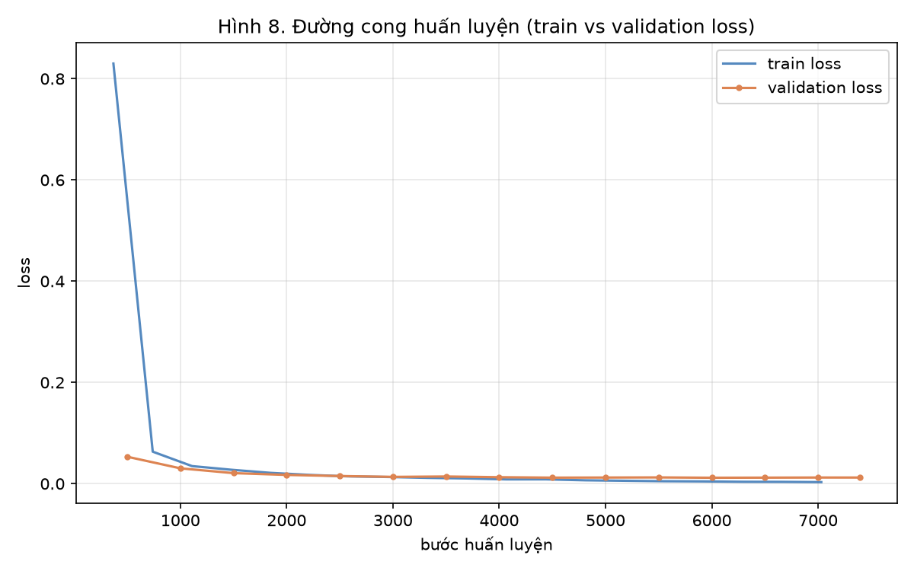

**Hình 8.** Đường cong huấn luyện. Hai đường là sai số (loss) của mô hình trên tập huấn luyện và trên tập kiểm định, đo lại sau mỗi
vòng học. Cả hai cùng giảm và bám sát nhau — dấu hiệu mô hình đang thực sự học chứ không học vẹt; nếu sai số trên tập huấn luyện
giảm trong khi trên tập kiểm định lại tăng thì đó mới là học thuộc lòng. Sai số trên tập kiểm định giảm từ 0,063 xuống mức thấp
nhất 0,013 quanh vòng học thứ tám đến thứ chín, và bản mô hình ở chính điểm thấp nhất đó được giữ làm bản cuối.

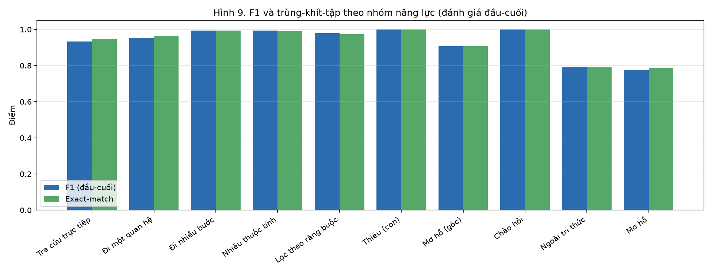

**Hình 9.** F1 và trùng khít tập theo từng nhóm năng lực (đánh giá đầu cuối). Các nhóm đi nhiều bước, lọc theo ràng buộc và nhiều
thuộc tính đạt gần như tuyệt đối; hai loại không phải truy vấn là câu mơ hồ (F1 0,81) và câu ngoài tri thức (0,90) thấp hơn, phản
ánh độ khó tự nhiên của việc phân biệt ý định khi câu hỏi thiếu chủ thể cụ thể, chứ không phải khuyết tật của khâu duyệt.

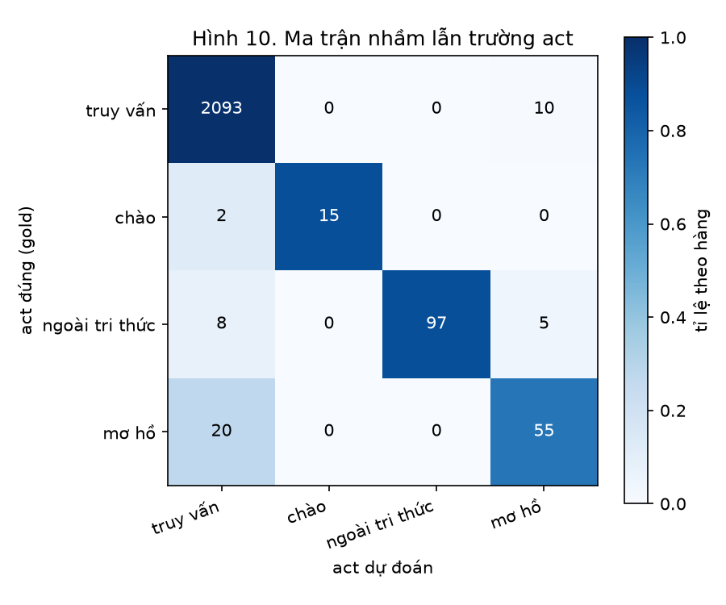

**Hình 10.** Ma trận nhầm lẫn của bốn loại ý định (tô màu theo tỉ lệ hàng). Nhầm lẫn tập trung ở câu mơ hồ bị đoán thành truy vấn
(22 trên 75) và câu ngoài tri thức bị đoán thành truy vấn (9 trên 110); lớp chào hỏi và truy vấn gần như không nhầm (truy vấn đúng
2.040 trên 2.049). Ranh giới có xu hướng dịch về phía truy vấn — đúng hướng đề tài là ưu tiên trả lời được câu thủ tục diễn đạt
khẩu ngữ, chấp nhận thỉnh thoảng nhận nhầm một câu mơ hồ.

Hai độ đo BLEU và ROUGE, vốn đo độ tương đồng văn bản, không phù hợp làm thước đo chính ở đây, bởi cây JSON không phải văn xuôi và
độ giống chữ không bảo đảm duyệt ra đáp án đúng.

---

## 6. Nội dung bổ trợ: đối chứng với cơ sở dữ liệu phẳng

Mục này nhằm kiểm tra giả thuyết rằng cách tổ chức tri thức theo ontology trả lời tốt hơn một hệ truy hồi văn bản thông thường,
đặc biệt ở các câu hỏi có cấu trúc. Ở đây cụm "cơ sở dữ liệu phẳng" chỉ một kho gồm các tài liệu văn bản đã làm phẳng, không lưu
quan hệ, khác với cơ sở dữ liệu quan hệ có lược đồ bảng và truy vấn có cấu trúc. Hệ thống chính vẫn là chatbot ontology trình bày ở
các mục trước.

### 6.1. Xây dựng kho phẳng

Kho phẳng được sinh tự động từ ontology bằng một bước **làm phẳng**: mỗi cá thể trở thành đúng một tài liệu văn bản.

Tài liệu gom mọi dữ kiện *của riêng* cá thể — nhãn, các tên gọi khác, phân loại, mọi giá trị thuộc tính — nhưng **bỏ hết quan hệ**
nối nó sang cá thể khác.

Mã tài liệu trùng định danh cá thể, để hai hệ chấm trên cùng một mốc đối chiếu.

Kho phẳng được ghi ra một tệp riêng và sinh lại mỗi khi ontology đổi, nên nó là một cơ sở dữ liệu thực thụ ngang hàng với ontology,
không phải dữ liệu dựng tạm lúc đánh giá.

Hai ví dụ tài liệu:

```json
{ "id": "PhongCTSV", "class": "PhongBanHanhChinh",
  "text": "Phòng Công tác Sinh viên CTSV; trưởng phòng ThS. Đỗ Quốc Việt; email ctsv@ntu.edu.vn; điện thoại 02582221900; Tầng 1 Tòa nhà Hiệu Bộ; https://phongctsv.ntu.edu.vn/" }
```
```json
{ "id": "QuyTrinhBaoLuu", "class": "QuyTrinhHocVu",
  "text": "Quy trình xin bảo lưu kết quả học tập; sinh viên được xin nghỉ học tạm thời và bảo lưu kết quả…" }
```

Khác biệt cơ bản là tài liệu chỉ còn văn bản rời rạc. Tài liệu của quy trình bảo lưu không lưu được dữ kiện rằng Phòng Công tác
Sinh viên xử lý thủ tục này, vì quan hệ đã bị loại bỏ.

### 6.2. Hệ truy hồi: hybrid search và rerank

Hệ truy hồi phẳng gồm hai vòng, thể hiện ở Hình 11.

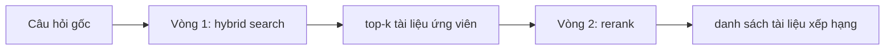

**Hình 11.** Hai vòng của hệ truy hồi phẳng.

**Vòng một — hybrid search.** Mô hình BGE-M3 chấm mỗi tài liệu theo hai cơ chế cùng lúc:

- *Khớp từ vựng thưa (sparse)*: xếp hạng theo mức trùng từ giữa câu hỏi và tài liệu.
- *Embedding dày (dense)*: biến câu hỏi và tài liệu thành vector số; hai vector càng gần thì nghĩa càng gần, kể cả khi khác chữ.

Vòng một trả về top-k tài liệu ứng viên.

**Vòng hai — rerank.** Một mô hình cross-encoder đọc đồng thời câu hỏi và từng ứng viên rồi chấm lại độ liên quan. Nó chính xác hơn
vòng một nhưng chậm hơn, nên chỉ chạy trên top-k.

Cấu hình thực nghiệm dùng BGE-M3 cho vòng truy hồi và BGE-reranker-v2-m3 cho vòng rerank — một baseline thần kinh đa ngữ mạnh, chọn
để tránh phê phán rằng phép đối chứng dùng baseline yếu. Cụm đối chứng là một thành phần độc lập, được phép dùng GPU khi đánh giá
và không nằm trong bản triển khai CPU của hệ ontology.

Đây là một baseline *thuần truy hồi*: nó trả về tài liệu xếp hạng cao nhất, không trích ra một thuộc tính cụ thể. Ba việc nó không
làm được:

- không đi theo quan hệ sang cá thể khác;
- không thực hiện phép giao;
- không tự biết cần trả bao nhiêu kết quả, mà phải định trước tham số k.

### 6.3. Thiết kế phép so

Phép so đối chứng thể hiện ở Hình 12.

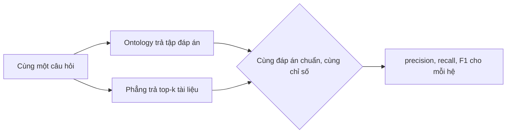

**Hình 12.** Hai hệ nhận cùng đầu vào và được chấm trên cùng đáp án chuẩn.

Cả hai hệ nhận cùng câu hỏi gốc. Hệ phẳng không được dùng cây của mô hình, để phép so khách quan.

Đáp án chuẩn gồm ba dạng tuỳ câu hỏi: một tập cá thể, đúng thuộc tính được hỏi, hoặc một giá trị. Tìm đúng tài liệu nhưng sai thuộc
tính vẫn tính là sai — một bất lợi cấu trúc của baseline thuần truy hồi, nêu thẳng khi báo cáo.

Dữ liệu chấm là tập kiểm tra gồm 2.251 câu, tách từ bộ dữ liệu 9.153 câu. Tập kiểm tra dùng cách diễn đạt khác tập huấn luyện, để
chống học vẹt mẫu câu. Mỗi câu kèm đáp án chuẩn đã được thuật toán duyệt kiểm chứng tự động.

Việc chấm dùng đúng bộ chỉ số precision, recall, F1 như Mục 5 — không chỉ đếm số thực thể trùng, mà phạt cả phần trả thừa lẫn phần
bỏ sót.

Các chỉ số dùng ở phần kết quả được định nghĩa như sau, với *đáp án chuẩn* là tập cá thể đúng cho mỗi câu hỏi:

- **recall** (độ bao phủ): tỷ lệ phần đáp án chuẩn mà hệ tìm được. **precision** (độ chính xác): tỷ lệ phần hệ trả ra mà đúng.
  **F1**: trung bình điều hoà của hai chỉ số trên.
- **trùng khít tập**: tỷ lệ câu hỏi mà tập ontology trả về trùng đúng đáp án chuẩn — không thừa, không thiếu một cá thể.
- **recall@k** và **full@k**: hai chỉ số dành cho hệ phẳng, vốn trả một *danh sách xếp hạng* tài liệu chứ không trả một tập dứt
  khoát. recall@k là độ bao phủ khi chỉ xét k tài liệu đứng đầu; full@k là tỷ lệ câu hỏi mà *toàn bộ* đáp án chuẩn nằm gọn trong
  k tài liệu đầu. Phép so cân xứng nhất là đặt trùng khít tập của ontology cạnh full@k của hệ phẳng, vì cả hai cùng đo việc trả
  đúng trọn vẹn cả tập.

Vì hệ phẳng phải chọn trước số tài liệu k, recall@k của nó tăng dần khi k lớn lên. Vẽ recall@k theo các giá trị k cho **đường
recall**: đường càng phải nới k rộng mới đạt recall cao thì hệ càng yếu ở việc gom đủ đáp án trong một câu trả lời — hạn chế mà
ontology không gặp vì nó trả thẳng cả tập một lần.

### 6.4. Các ví dụ so sánh kèm hình dạng dữ liệu

Mỗi ví dụ trình bày bốn khối dữ liệu — câu hỏi, đáp án chuẩn, đầu ra của ontology, và năm tài liệu hệ phẳng xếp hạng cao nhất —
để thấy rõ mỗi hệ nhận gì và xuất gì. Cả bốn đều trích nguyên văn từ bản ghi của lần đánh giá hiện tại, không phải số liệu giả
định. Ba ví dụ chọn theo ba tình huống đại diện: ontology thắng ở câu đi nhiều bước, ontology thắng ở câu liệt kê đúng cả tập, và
hai hệ hoà ở câu tra cứu trực tiếp.

Ví dụ 1 — **đi nhiều bước**, phòng xử lý thủ tục bảo lưu nằm ở đâu. Ontology thắng.
```json
câu hỏi      : "phòng xử lý bảo lưu"
đáp án chuẩn : ["PhongCTSV"]
ontology trả : ["PhongCTSV"]
phẳng (5 đầu): ["QuyTrinhBaoLuu", "OutputDuocBaoLuu", "PhongKHTC", "PhongCTSV", "VanPhongTruong"]
```
Đáp án là Phòng Công tác Sinh viên, nối với bảo lưu qua quan hệ "được xử lý bởi" mà hệ phẳng đã loại bỏ. Hệ phẳng vì thế xếp cao
ba tài liệu chứa từ khoá câu hỏi (quy trình bảo lưu, kết quả được bảo lưu, một phòng khác) và chỉ đẩy `PhongCTSV` xuống hạng tư —
nằm ngoài top-3, nên bị tính là trượt ở recall@3. Ontology đi đúng một bước theo quan hệ và trả thẳng phòng đúng.

Ví dụ 2 — **liệt kê đúng cả tập**, các điều kiện được bảo lưu. Ontology thắng.
```json
câu hỏi      : "Điều kiện để được bảo lưu kết quả học tập là gì?"
đáp án chuẩn : ["DieuKienBaoLuuCaNhan", "DieuKienBaoLuuQuocTe", "DieuKienBaoLuuVuTrang", "DieuKienBaoLuuYTe"]
ontology trả : ["DieuKienBaoLuuCaNhan", "DieuKienBaoLuuQuocTe", "DieuKienBaoLuuVuTrang", "DieuKienBaoLuuYTe"]
phẳng (5 đầu): ["QuyTrinhBaoLuu", "OutputDuocBaoLuu", "DieuKienHocBongDiemHocTap", "OutputNhanHocBong", "OutputDuocXetTotNghiep"]
```
Đáp án là một tập gồm bốn điều kiện. Ontology đi theo quan hệ "yêu cầu điều kiện" và trả về *trọn vẹn cả bốn*. Hệ phẳng không có
khái niệm gom tập: nó xếp cao tài liệu quy trình bảo lưu cùng vài điều kiện của thủ tục khác, nhưng không tài liệu bảo lưu nào lọt
top-5 — vì mỗi điều kiện là một tài liệu riêng và không tài liệu nào một mình "giống" câu hỏi đủ mạnh.

Ví dụ 3 — **tra cứu trực tiếp**, trưởng phòng Công tác Sinh viên là ai. Hai hệ hoà.
```json
câu hỏi      : "Cho em hỏi ai là trưởng phòng CTSV ạ?"
đáp án chuẩn : ["PhongCTSV"]
ontology trả : ["PhongCTSV"]
phẳng (5 đầu): ["PhongCTSV", "PhongDaoTaoDaiHoc", "DonGiaHanThoiGianNopHocPhi", "PhongKHTC", "VanPhongTruong"]
```
Câu một bước, một thuộc tính của chính cá thể được hỏi: thông tin trưởng phòng nằm ngay trong tài liệu `PhongCTSV`, nên hệ phẳng
bắt đúng tài liệu ở hạng nhất. Báo cáo nêu thẳng trường hợp hoà này để bảo đảm khách quan. (Hạn chế còn lại của hệ phẳng — chỉ
trả về *tài liệu* chứ không tách ra *thuộc tính*, nên dễ trả nhầm số điện thoại khi hỏi email — được phân tích ở tầng đáp án cuối
tại Mục 6.6.)

### 6.5. Giả thuyết kiểm chứng

Phép so dùng một kho phẳng duy nhất — kho tài liệu thực tế mô tả ở Mục 6.1, mỗi cá thể một tài liệu và đã loại bỏ quan hệ. Việc
chỉ giữ một kho phản ánh đúng kịch bản triển khai một hệ truy hồi văn bản thông thường, đồng thời cho phép câu chuyện so sánh gọn
và trung thực, không cần một biến thể nhồi sẵn quan hệ vốn không còn là tài liệu tự nhiên.

**Giả thuyết kiểm chứng:** hai hệ *tương đương* ở câu tra cứu trực tiếp, còn ontology *cao hơn* ở các câu có cấu trúc — đi theo
quan hệ, liệt kê đúng cả tập, đi nhiều bước, đọc nhiều thuộc tính và lọc theo ràng buộc. Mục 6.6 đối chiếu giả thuyết này với số
đo thật.

### 6.6. Kết quả

Phép so chạy trên tập kiểm tra, nhưng chỉ giữ các câu hệ phẳng có thể truy hồi — tức bỏ câu chào hỏi, ngoài tri thức và mơ hồ, vì
hệ phẳng không có khái niệm từ chối. Sau lọc còn **1.945 câu** truy vấn.

Đáp án chuẩn được suy thẳng từ ontology theo ngữ nghĩa quan hệ, độc lập với mô hình, và đã được thuật toán duyệt kiểm chứng tự động.

Kết quả tách làm hai tầng để tránh so lệch bản chất.

**Tầng truy hồi — tìm đúng tập tài liệu.** Ontology trả về một tập nên được chấm precision, recall, F1 và trùng khít tập theo lối
micro. Hệ phẳng trả danh sách xếp hạng nên được chấm recall@k và full@k, lấy trung bình theo câu. Theo các định nghĩa ở Mục 6.3,
phép so cân xứng là đặt trùng khít tập của ontology cạnh full@k của hệ phẳng. Số tổng thể:

| Hệ | Chất lượng | Đúng trọn vẹn cả tập |
|---|---|---|
| Ontology (mô hình thật) | F1 **0,97** | trùng khít tập **0,97** |
| Phẳng | recall@1 0,43 · @3 0,67 · @5 0,77 | full@3 0,65 |

Tách theo năm nhóm năng lực truy vấn — xếp từ dễ đến khó — thấy rõ ontology không thắng đều, mà thắng đúng ở chỗ có cấu trúc:

| Nhóm năng lực | n | Ontology F1 | Ontology trùng khít tập | Phẳng recall@1 | Phẳng recall@3 |
|---|---|---|---|---|---|
| Tra cứu trực tiếp | 444 | 0,97 | 0,96 | 0,98 | 1,00 |
| Đi một quan hệ | 834 | 0,96 | 0,97 | 0,11 | 0,43 |
| Đi nhiều bước | 308 | 1,00 | 1,00 | 0,19 | 0,72 |
| Nhiều thuộc tính | 134 | 0,99 | 0,96 | 0,50 | 0,56 |
| Lọc theo ràng buộc | 225 | 0,99 | 0,98 | 0,80 | 0,93 |
| **Toàn bộ** | **1.945** | **0,97** | **0,97** | **0,43** | **0,67** |

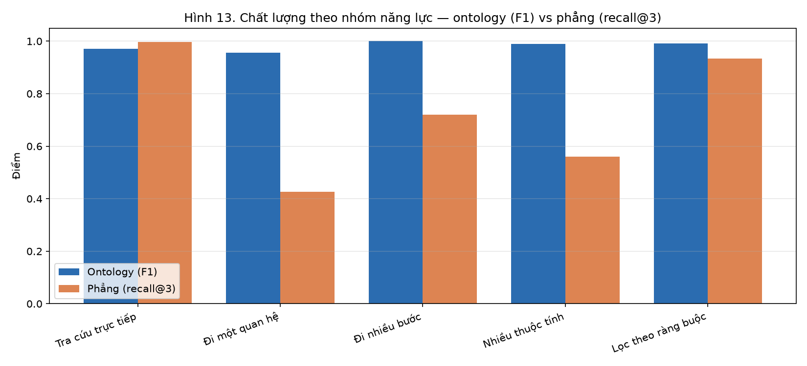

**Hình 13.** Chất lượng theo nhóm năng lực — *đọc theo trục đứng, so cặp cột ontology với phẳng* (cột ontology là F1, cột phẳng là
recall@3). Hai hệ tương đương ở nhóm tra cứu trực tiếp, nhưng hệ phẳng tụt rõ ở các nhóm có cấu trúc: đi một quan hệ (recall@3 0,43),
nhiều thuộc tính (0,56) và đi nhiều bước (0,72), trong khi ontology giữ F1 quanh 0,96 đến 1,00 ở mọi nhóm — đây là bằng chứng trực
tiếp cho luận điểm trung tâm.

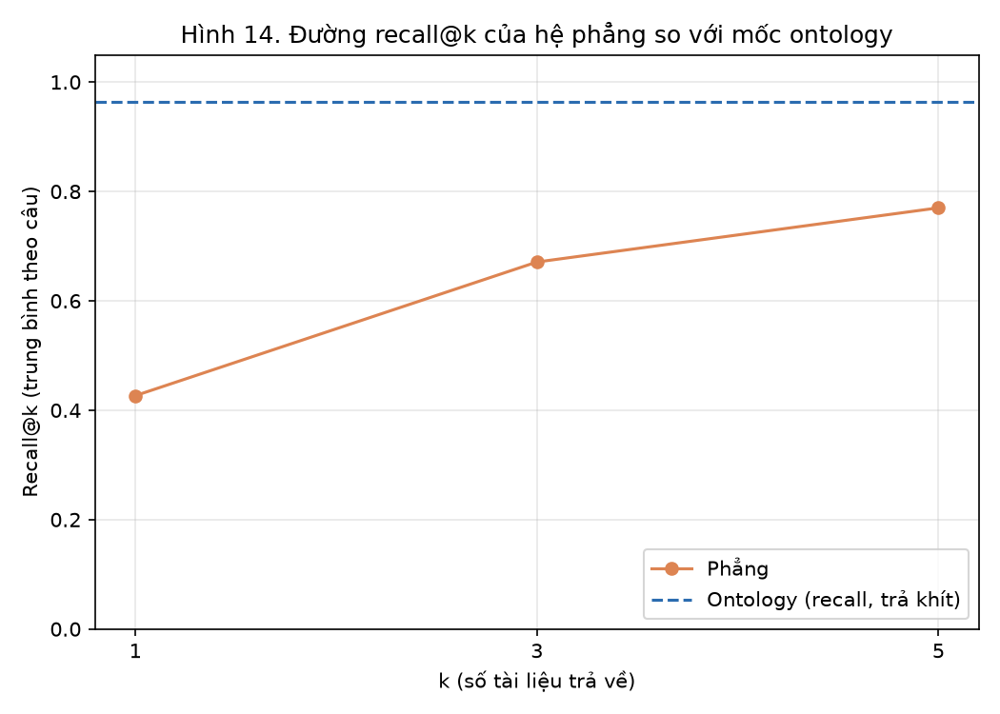

**Hình 14.** Đường recall@k của hệ phẳng (0,43 ở k=1 lên 0,77 ở k=5). Recall tăng khi nới k nhưng vẫn nằm dưới mốc recall 0,96 của
ontology kể cả ở k=5, đồng thời phơi hạn chế phải xác định trước k: k nhỏ thì bỏ sót, k lớn thì lẫn tài liệu thừa.

Ba quan sát chính:

- **Hai hệ tương đương ở câu tra cứu trực tiếp**, thậm chí hệ phẳng nhỉnh hơn đôi chút (recall@3 1,00 so với recall ontology 0,96),
  vì đáp án nằm ngay trong tài liệu chứa từ khoá và kho chỉ có 54 tài liệu nên truy hồi gần như luôn bắt trúng; ontology phải qua
  thêm bước sinh cây nên thỉnh thoảng lệch nhẹ. Vì vậy kết luận đúng là ontology thắng *tổng thể và đặc biệt ở câu có cấu trúc*,
  không phải thắng mọi loại.
- **Khoảng cách lớn nhất lộ ra ở cột recall@1**: nhóm tra cứu trực tiếp hệ phẳng đạt 0,98, nhưng đi một quan hệ chỉ còn 0,11 và đi
  nhiều bước 0,19. Khi đáp án *rời khỏi* tài liệu chứa từ khoá — sang một phòng ban, một tập điều kiện, hay qua nhiều bước quan hệ —
  tài liệu phẳng không còn manh mối nào để xếp nó lên đầu.
- **Hệ phẳng không gom được một *tập* đáp án rải ở nhiều tài liệu** (như bốn điều kiện bảo lưu ở Ví dụ 2), nên ngay cả khi nới k,
  full@k vẫn khó đạt trọn vẹn.

**Tầng đáp án cuối (chỉ câu hỏi thuộc tính).** Tìm đúng tài liệu rồi vẫn còn phải chọn đúng *thuộc tính* và *giá trị*.

Ontology đạt từ 0,89 (nhóm nhiều thuộc tính) đến 1,00 (đi nhiều bước) cho cả hai việc, phần lớn trên 0,95.

Hệ phẳng thuần truy hồi không trích thuộc tính nên *không áp dụng được* ở tầng này. Đây là khác biệt bản chất chứ không phải một con
số thấp — nên ghi rõ "không áp dụng" thay vì trộn vào tầng truy hồi.

Ba lưu ý khi đọc bảng số:

- **full@3 thiệt cho câu có tập đáp án lớn hơn ba** (liệt kê bốn điều kiện, hay học phí gộp nhiều mức), nên các câu này phải đọc kèm
  recall@5.
- **Hai hệ chấm theo lối khác nhau**: ontology chấm micro, hệ phẳng chấm trung bình theo câu — nên khi so "đúng trọn vẹn cả tập"
  phải đặt đúng cặp trùng khít tập ↔ full@k.
- **Số ontology gần trần không có nghĩa "hoàn hảo"**: phần lớn nhờ kho chỉ 54 tài liệu và đáp án đã được oracle kiểm chứng; phần sai
  còn lại (khoảng 3–6%) chủ yếu đến từ bước sinh cây của mô hình.

Toàn bộ kết quả nhất quán với giả thuyết nêu ở Mục 6.5.

---

## 7. Tóm tắt

Trọng tâm của đề tài là chatbot tra cứu chín quy trình học vụ dựa trên ontology, trong đó mỗi quy trình là một trung tâm liên kết
tới các đối tượng liên quan như phòng ban, điều kiện, biểu mẫu, kết quả và quy định, riêng quy trình đóng học phí có thêm định mức
học phí và phương thức thanh toán. Ontology biểu diễn tri thức dưới dạng cá thể, lớp, quan hệ và thuộc tính. Mô hình BART biến câu
hỏi thành cây thực thể đóng vai trò lộ trình truy vấn. Thuật toán duyệt đi theo cây, trong đó các nút lọc lồng nhau cho phép giao
còn các nút anh em cho phép hợp, nhờ đó thực hiện được phép giao, đi nhiều bước và trả về đúng cả tập. Mô hình được đánh giá ở hai
mức là độ đúng cấu trúc và độ đúng đầu cuối, dùng precision, recall, F1 và trùng khít tập, tách theo năm nhóm năng lực. Phần đối
chứng với hệ truy hồi văn bản phẳng dùng hybrid search và rerank, trên cùng câu hỏi, cùng đáp án chuẩn và cùng chỉ số, nhằm kiểm
tra giả thuyết rằng ontology trả lời đúng và đầy đủ hơn ở các câu hỏi có cấu trúc.
