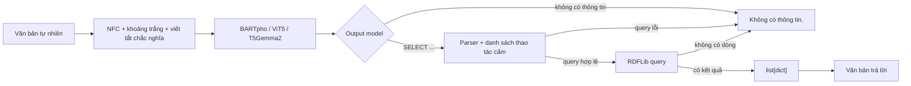

# Concept: tiếng Việt → quyết định miền/SPARQL → ontology

## Trạng thái contract

Kiến trúc một model và hai dạng output đã được chốt. Ontology canonical,
semantic index và inventory khả năng trả lời đã được đối chiếu và kiểm thử.
Catalogue 51 họ và dataset 2.000 câu đã vượt các cổng coverage, thực thi và
leakage. Dataset không quyết định ngược lại phạm vi ontology; hiện chưa có
benchmark chính thức trên release đã khóa.

## Trách nhiệm của model

Model seq2seq nhận văn bản tiếng Việt đã chuẩn hoá và sinh đúng một trong hai
output:

```text
không có thông tin
```

hoặc một dòng SPARQL:

```sparql
SELECT ?answer WHERE { :TemporaryAcademicLeaveProcedure :instructionProvision ?part . ?part :officialText ?answer . }
```

Model được phép học schema và canonical IRI của ontology. Nó không học literal
câu trả lời; backend lấy literal từ graph khi thực thi query.

## Luồng dữ liệu


```mermaid
flowchart LR
    Q["Văn bản tự nhiên"] --> N["NFC + khoảng trắng + viết tắt chắc nghĩa"]
    N --> M["BARTpho / ViT5 / T5Gemma2"]
    M --> D{"Output model"}
    D -- "không có thông tin" --> X["Không có thông tin."]
    D -- "SELECT ..." --> V["Parser + danh sách thao tác cấm"]
    V -- "query lỗi" --> X
    V -- "query hợp lệ" --> G["RDFLib query"]
    G -- "không có dòng" --> X
    G -- "có kết quả" --> R["list[dict]"]
    R --> T["Văn bản trả lời"]
```

Không có tầng tự sửa query, model phân loại riêng hoặc dò entity trong backend.
Query sai là lỗi model/dataset; query đúng nhưng dữ liệu sai là lỗi ontology.
Log giữ output nguyên văn và nguyên nhân kỹ thuật dù giao diện chỉ hiển thị
`Không có thông tin.`.

## Ranh giới miền

Một câu thuộc miền khi ontology và danh mục SPARQL trả lời được toàn bộ yêu cầu.
Marker từ chối áp dụng cho câu ngoài học vụ, câu thiếu dữ liệu, câu mơ hồ, trò
chuyện chung, văn bản vô nghĩa và câu hỗn hợp có bất kỳ phần nào không được hỗ
trợ. Backend không trả lời một phần câu hỗn hợp.

## Contract SPARQL

Model chỉ sinh phần `SELECT`, không sinh `PREFIX`. Backend gắn prefix cố định
cho namespace project, RDF, RDFS, SKOS và XSD. Target nằm trên một dòng, dùng
khoảng trắng canonical, nêu rõ cột kết quả và không dùng `SELECT *`.

Kết quả được project phải là:

- `rdfs:label` khi người dùng hỏi tên thực thể;
- literal của datatype property;
- giá trị tổng hợp như `COUNT`.

Object property chỉ tạo đường đi giữa node, không được trả thẳng về giao diện.

## Nguồn dữ liệu và thứ tự xây dựng

Ontology là đồ thị, không phải cây. Công văn chính thức là nguồn sự thật duy
nhất. Thứ tự xây dựng là:

```text
tài liệu chính thức → ontology → inventory khả năng trả lời
                    → SPARQL catalogue → dataset hợp nhất → model
```

Không tạo dataset trước rồi sửa ontology để khớp target đã viết.
Mọi mục được đánh dấu `supported` trong inventory phải có query catalogue; mọi
template catalogue phải có dữ liệu huấn luyện và đánh giá. Release hiện tại đáp
ứng đầy đủ chuỗi ràng buộc này.

## Contract tài liệu

`README.md` là tài liệu tiếng Việt đọc độc lập. Các phụ lục trong `docs/` giải
thích ontology, dataset, kiến trúc, fine-tuning, đánh giá và triển khai. Số liệu
dataset, benchmark và biểu đồ chỉ được sinh từ artifact mới đã qua kiểm tra;
không sao chép số liệu cũ hoặc điền tay.
