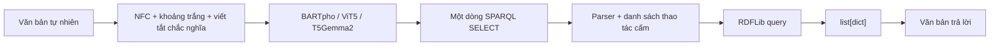

# Concept: tiếng Việt → SPARQL → ontology

## Bài toán

Hệ thống dịch một câu hỏi tiếng Việt sang SPARQL có giám sát. Model được phép
học schema và canonical IRI của ontology; ontology mới là nơi lưu dữ liệu trả
lời. Vì vậy thay nội dung literal mà giữ nguyên schema không đòi hỏi train lại
model, còn đổi IRI hoặc quan hệ có thể đòi hỏi cập nhật dataset.

Ontology là đồ thị, không phải cây. Ví dụ email của đơn vị xử lý bảo lưu nằm
sau một đường nối:

```text
AcademicLeaveProcedure
  --handledBy--> StudentAffairsOffice
  --email------> "ctsv@ntu.edu.vn"
```

Model sinh đường đi đó bằng SPARQL:

```sparql
SELECT ?answer WHERE { :AcademicLeaveProcedure :handledBy ?node . ?node :email ?answer . }
```

## Luồng dữ liệu


```mermaid
flowchart LR
    Q["Văn bản tự nhiên"] --> N["NFC + khoảng trắng + viết tắt chắc nghĩa"]
    N --> M["BARTpho / ViT5 / T5Gemma2"]
    M --> S["Một dòng SPARQL SELECT"]
    S --> V["Parser + danh sách thao tác cấm"]
    V --> G["RDFLib query"]
    G --> R["list[dict]"]
    R --> T["Văn bản trả lời"]
```

Không có tầng tự sửa query. Query sai là lỗi model/dataset; query đúng nhưng dữ
liệu sai là lỗi ontology. Ranh giới này giúp hệ thống dễ giải thích và dễ kiểm
thử.

## Contract đầu ra

Model chỉ sinh phần `SELECT`, không sinh `PREFIX`. Backend gắn các prefix cố
định cho namespace project, RDF, RDFS, SKOS và XSD. Target nằm trên một dòng,
có khoảng trắng nhất quán và phải nêu rõ cột kết quả; `SELECT *` không hợp lệ.

Kết quả cuối chỉ là:

- `rdfs:label` nếu người dùng hỏi tên một thực thể;
- literal của datatype property như `content`, `condition`, `email` hay mức
  học phí;
- giá trị tổng hợp như `COUNT`.

Object property như `handledBy`, `hasDocument` hay `basedOnRegulation` chỉ tạo
đường đi giữa các node, không được trả thẳng về giao diện.

Ví dụ hướng dẫn tổng quát:

```sparql
SELECT ?answer WHERE { :AcademicLeaveProcedure :content ?answer . }
```

Ví dụ tên đơn vị xử lý:

```sparql
SELECT ?answer WHERE { :AcademicLeaveProcedure :handledBy ?node . ?node rdfs:label ?answer . }
```

Ví dụ nhiều kết quả và phép tổng hợp:

```sparql
SELECT ?count ?answer WHERE { { SELECT (COUNT(DISTINCT ?node) AS ?count) WHERE { ?node a :AdministrativeOffice . } } ?item a :AdministrativeOffice . ?item rdfs:label ?answer . }
```

## Phạm vi

Project tập trung vào semantic parsing trên một ontology có schema ổn định.
RAG, cơ sở dữ liệu phẳng, hội thoại ngoài miền, router nhiều model và heuristic
fuzzy không thuộc pipeline cốt lõi. Chỉ thêm một tầng mới khi benchmark chứng
minh pipeline hiện tại không thể giải quyết nhu cầu đó.
