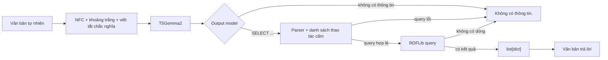

# Concept: tiếng Việt → quyết định miền/SPARQL → ontology

## Phạm vi và phương pháp

Hệ thống sử dụng một model để sinh hai dạng đầu ra: truy vấn SPARQL cho câu hỏi
được ontology hỗ trợ hoặc marker từ chối cho các câu còn lại. Ontology, danh
mục khả năng trả lời và 51 họ truy vấn xác định miền kiến thức của chatbot.
Dataset gồm 4.454 câu và được kiểm tra về độ phủ, khả năng thực thi truy vấn và
rò rỉ giữa các tập dữ liệu. Ba model được đánh giá bằng cùng một giao thức;
T5Gemma2 đạt System Answer Exact 92,38% với Transformers và 92,87% trên pipeline
triển khai CTranslate2.

## Trách nhiệm của model

Model seq2seq nhận văn bản tiếng Việt đã chuẩn hoá và sinh đúng một trong hai
output:

```text
không có thông tin
```

hoặc một dòng SPARQL:

```sparql
SELECT ?answer WHERE { :TemporaryAcademicLeaveProcedure :instructionProvision ?part . ?part :officialText ?answer . }
```

Model được phép học lược đồ và IRI chuẩn của ontology. Nó không học literal
câu trả lời; backend lấy literal từ graph khi thực thi query.

## Luồng dữ liệu


```mermaid
flowchart LR
    Q["Văn bản tự nhiên"] --> N["NFC + khoảng trắng + viết tắt chắc nghĩa"]
    N --> M["T5Gemma2"]
    M --> D{"Output model"}
    D -- "không có thông tin" --> X["Không có thông tin."]
    D -- "SELECT ..." --> V["Parser + danh sách thao tác cấm"]
    V -- "query lỗi" --> X
    V -- "query hợp lệ" --> G["RDFLib query"]
    G -- "không có dòng" --> X
    G -- "có kết quả" --> R["list[dict]"]
    R --> T["Văn bản trả lời"]
```

Không có tầng tự sửa query, model phân loại riêng hoặc dò entity trong backend.
Query sai là lỗi model/dataset; query đúng nhưng dữ liệu sai là lỗi ontology.
Log giữ output nguyên văn và nguyên nhân kỹ thuật dù giao diện chỉ hiển thị
`Không có thông tin.`.

## Ranh giới miền

Một câu thuộc miền khi ontology và danh mục SPARQL trả lời được toàn bộ yêu cầu.
Marker từ chối áp dụng cho câu ngoài học vụ, câu thiếu dữ liệu, câu mơ hồ, trò
chuyện chung, văn bản vô nghĩa và câu hỗn hợp có bất kỳ phần nào không được hỗ
trợ. Backend không trả lời một phần câu hỗn hợp.

## Định dạng SPARQL

Model chỉ sinh phần `SELECT`, không sinh `PREFIX`. Backend gắn prefix cố định
cho namespace project, RDF, RDFS, SKOS và XSD. Target nằm trên một dòng, dùng
khoảng trắng thống nhất, nêu rõ biến kết quả và không dùng `SELECT *`.

Kết quả được project phải là:

- `rdfs:label` khi người dùng hỏi tên thực thể;
- literal của datatype property;
- giá trị tổng hợp như `COUNT`.

Object property chỉ tạo đường đi giữa node, không được trả thẳng về giao diện.

## Nguồn dữ liệu và thứ tự xây dựng

Ontology là đồ thị, không phải cây. Công văn chính thức là nguồn sự thật duy
nhất. Thứ tự xây dựng là:

```text
tài liệu chính thức → ontology → danh mục khả năng trả lời
                    → danh mục SPARQL → dataset → model
```

Không tạo dataset trước rồi sửa ontology để khớp target đã viết.
Mỗi khả năng được đánh dấu `supported` phải có mẫu truy vấn tương ứng; mỗi mẫu
truy vấn phải có dữ liệu huấn luyện và đánh giá. Các kiểm tra tự động xác nhận
tính nhất quán của chuỗi ràng buộc này.

## Tổ chức tài liệu

`README.md` là tài liệu tiếng Việt đọc độc lập. Các phụ lục trong `docs/` giải
thích ontology, dataset, kiến trúc, fine-tuning, đánh giá và triển khai. Số liệu
dataset, benchmark và biểu đồ được sinh từ dữ liệu và kết quả máy đọc được để
tránh sai lệch do sao chép hoặc nhập số liệu thủ công.
