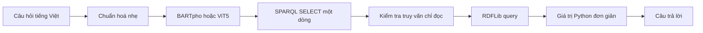

# Concept: câu hỏi tiếng Việt → SPARQL → ontology

## 1. Bài toán

Hệ thống trả lời câu hỏi học vụ bằng dữ liệu có cấu trúc trong ontology.
Ontology là đồ thị: individual được nối bằng object property và mang các giá
trị datatype property. Sức mạnh của ontology nằm ở quan hệ có nghĩa giữa các
node, không phải ở việc biến dữ liệu thành các đoạn văn phẳng.

Ví dụ, email của đơn vị xử lý bảo lưu không nằm trực tiếp trên quy trình:

```text
AcademicLeaveProcedure
  --handledBy--> StudentAffairsOffice
  --email------> "ctsv@ntu.edu.vn"
```

Câu hỏi “phòng nào xử lý bảo lưu?” cần đi qua `handledBy` rồi lấy label của
phòng. Câu hỏi “email phòng xử lý bảo lưu?” đi cùng đường nối nhưng kết thúc ở
datatype property `email`.

## 2. Luồng hệ thống


```mermaid
flowchart LR
    Q["Câu hỏi tiếng Việt"] --> N["Chuẩn hoá nhẹ"]
    N --> M["BARTpho hoặc ViT5"]
    M --> S["SPARQL SELECT một dòng"]
    S --> V["Kiểm tra truy vấn chỉ đọc"]
    V --> R["RDFLib query"]
    R --> P["Giá trị Python đơn giản"]
    P --> A["Câu trả lời"]
```

Model được phép biết schema, canonical IRI và hình dạng ontology. Đây là bài
toán semantic parsing có giám sát: model dịch câu hỏi sang ngôn ngữ truy vấn
chuẩn, còn ontology vẫn là nguồn dữ liệu quyết định đáp án.

Nếu dữ liệu trong ontology thay đổi nhưng schema và IRI giữ nguyên, không cần
train lại model. Nếu schema hoặc canonical IRI thay đổi, dataset target phải
được cập nhật và model có thể phải train lại.

## 3. Ranh giới trách nhiệm

| Thành phần | Trách nhiệm |
|---|---|
| Chuẩn hoá | Unicode, khoảng trắng và whitelist từ viết tắt chắc nghĩa |
| Model | Hiểu câu hỏi và sinh SPARQL canonical |
| Validator | Chỉ nhận truy vấn `SELECT` an toàn, không sửa đoán output |
| RDFLib | Parse và thực thi SPARQL trên ontology |
| Renderer | Trình bày số dòng và số cột bất kỳ |

Không có tầng fuzzy matching, route planner, traversal tùy biến hoặc heuristic
để “chữa” output của model. Khi query sai, lỗi được quy về model/dataset; khi
query đúng nhưng dữ liệu sai, lỗi thuộc ontology.

## 4. Contract đầu ra model

Model sinh phần query, không sinh prefix. Backend gắn prologue cố định:

```sparql
PREFIX : <http://www.ntu.edu.vn/ontology/academic#>
PREFIX rdf: <http://www.w3.org/1999/02/22-rdf-syntax-ns#>
PREFIX rdfs: <http://www.w3.org/2000/01/rdf-schema#>
PREFIX xsd: <http://www.w3.org/2001/XMLSchema#>
```

Target được canonical hóa trên một dòng và có khoảng trắng quanh dấu cấu
trúc:

```sparql
SELECT ?answer WHERE { :AcademicLeaveProcedure :content ?answer . }
```

Xuống dòng vẫn là SPARQL hợp lệ nhưng không được dùng làm target chuẩn vì tạo
ra khác biệt trình bày không mang ý nghĩa.

Canonical IRI dùng cho class, property và individual đã biết. Literal tiếng
Việt chỉ xuất hiện khi nó là điều kiện dữ liệu thật, chẳng hạn tên ngành hoặc
mã khóa. Không dùng label search để thay cho IRI mà model đã được học.

## 5. Cách lấy dữ liệu

Kết quả cuối chỉ thuộc một trong ba nhóm:

1. `rdfs:label` khi người dùng muốn tên của individual;
2. datatype property khi người dùng muốn nội dung, email, URL, mức tiền…;
3. giá trị tổng hợp như `COUNT`.

Object property chỉ nối các node và không được chọn trực tiếp làm kết quả.

### Hướng dẫn tổng quát

```sparql
SELECT ?answer WHERE { :AcademicLeaveProcedure :content ?answer . }
```

`content` là bản hướng dẫn đầy đủ, có chủ đích và được giữ trong ontology.

### Điều kiện cụ thể

Sau khi ontology được refactor:

```sparql
SELECT ?answer WHERE { :AcademicLeaveProcedure :condition ?answer . }
```

### Tên phòng xử lý

```sparql
SELECT ?answer WHERE { :AcademicLeaveProcedure :handledBy ?office . ?office rdfs:label ?answer . }
```

### Email phòng xử lý

```sparql
SELECT ?answer WHERE { :AcademicLeaveProcedure :handledBy ?office . ?office :email ?answer . }
```

### Phân biệt nơi nhận và nơi xử lý hồ sơ

Khi hai vai trò khác nhau, ontology biểu diễn bằng hai đường nối riêng thay vì
gán cả hai phòng vào một property:

```text
MajorChangeProcedure
  --receivedBy--> StudentAffairsOffice
  --handledBy----> UndergraduateEducationOffice
```

Nhờ đó, “nộp đơn chuyển ngành ở đâu?” dùng `receivedBy`, còn “đơn vị nào xử
lý chuyển ngành?” dùng `handledBy`. Backend không phải suy đoán vai trò từ
đoạn `content`.

### Biểu mẫu và đường dẫn

```sparql
SELECT ?document ?url WHERE { :AcademicLeaveProcedure :hasDocument ?node . ?node rdfs:label ?document ; :documentUrl ?url . }
```

### Đếm

```sparql
SELECT (COUNT(DISTINCT ?method) AS ?answer) WHERE { :TuitionPaymentProcedure :supportsPaymentMethod ?method . }
```

SPARQL cũng đảm nhận `FILTER`, `GROUP BY`, `ORDER BY`, `LIMIT` và nhiều nhánh
truy vấn. Không xây lại các phép toán này trong Python.

## 6. Contract ontology mới

Nguồn chuyển đổi là `resources/ontology/ontology_v10.ttl`. Phiên bản mới tiếp
tục dùng Turtle và namespace hiện tại.

Quy tắc mô hình hóa:

- URI tiếng Anh; PascalCase cho class/individual, camelCase cho property.
- `rdfs:label@vi` là tên tiếng Việt chính, đầy đủ và ổn định.
- `skos:altLabel@vi` chỉ giữ tên gọi khác thực sự hữu ích; không chứa cả câu
  hỏi và không được backend fuzzy-match.
- `content` giữ nguyên vai trò hướng dẫn tổng quát.
- Xóa lớp/individual trung gian `Condition`, `Outcome` và object property
  `hasCondition`, `hasOutcome`.
- Chuyển label của chúng thành literal lặp qua `condition` và `outcome`.
- Giữ object property có ý nghĩa nối dữ liệu như `receivedBy`, `handledBy`,
  `hasDocument`, `basedOnRegulation`, `supportsPaymentMethod`,
  `appliesTuitionRate`.

Việc làm phẳng Condition/Outcome không làm phẳng toàn ontology. Phòng ban,
biểu mẫu, quy định, phương thức thanh toán và định mức học phí vẫn là node khi
chúng có dữ liệu riêng, được dùng chung hoặc cần giữ sự gắn kết giữa nhiều
thuộc tính.

## 7. Kết quả backend

Backend không cần `EntityResult`, `LiteralResult` hay hệ DTO riêng. Kết quả
nội bộ chỉ là:

```python
list[dict[str, str | int | float | bool | None]]
```

Ví dụ:

```python
[{"answer": "Phòng Công tác Chính trị và Sinh viên"}]
```

hoặc:

```python
[{"document": "Đơn xin nghỉ học tạm thời", "url": "https://..."}]
```

`rdflib.Literal` được đổi bằng `toPython()`. Query được thiết kế để project
label/literal/aggregate; URIRef hoặc blank node lọt vào cột kết quả được coi là
lỗi contract thay vì được renderer đoán cách hiển thị.

## 8. Ngoài phạm vi

- Cơ sở dữ liệu phẳng và pipeline RAG không phải baseline chính.
- Greeting, unrelated và clarify chưa thuộc contract SPARQL cốt lõi; không tự
  động mang ba keyword QueryPlan cũ sang kiến trúc mới.
- Không tối ưu cho ontology thay schema tùy ý mà không train lại.
- Không thêm router, ensemble hoặc LLM để sửa query nếu chưa có nhu cầu được
  benchmark chứng minh.
- Không dùng kết quả QueryPlan cũ để tuyên bố chất lượng kiến trúc mới.
