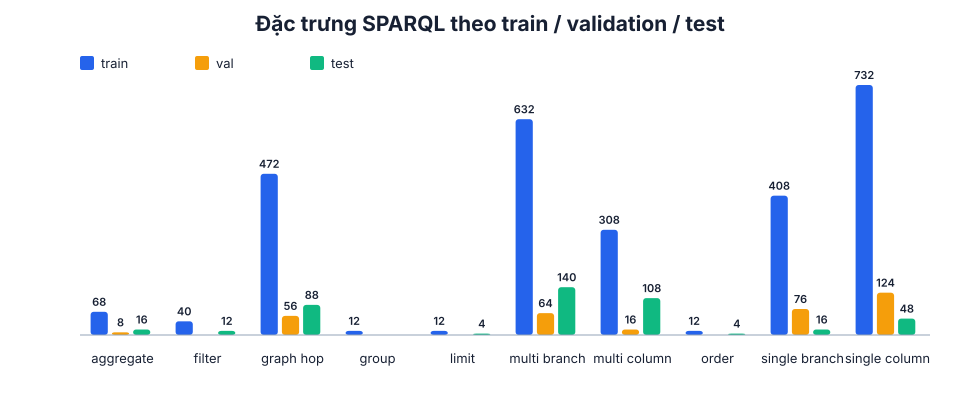

# Dataset

Dataset ánh xạ câu hỏi tiếng Việt tự nhiên sang một truy vấn SPARQL `SELECT`.
Mỗi dòng JSON Lines có năm trường:

```json
{
  "id": "question-0001",
  "family_id": "family-0001",
  "register": "formal",
  "input": "Tôi cần thực hiện thủ tục bảo lưu như thế nào?",
  "target": "SELECT ?answer WHERE { :AcademicLeaveProcedure :content ?answer . }"
}
```

`family_id` gom bốn câu có cùng ý nghĩa và cùng target. Cả family luôn nằm
trong một split, vì vậy model không được nhìn một cách diễn đạt ở train rồi gặp
lại cùng ý nghĩa ở validation hoặc test.

## Phong cách câu hỏi

| Register | Cách diễn đạt |
|---|---|
| `formal` | Câu đầy đủ, gần văn phong hành chính |
| `neutral` | Cách hỏi phổ thông |
| `colloquial` | Ngôn ngữ nói thường ngày |
| `noisy` | Viết tắt, bỏ dấu hoặc câu rút gọn |

Mỗi family có đúng một câu thuộc từng register. Câu hỏi được viết và đọc lại
theo ý nghĩa; không tạo hàng loạt bằng cách thay từ trong một template.

## Train, validation và test

| Tập | Câu hỏi | Family | Target | Vai trò |
|---|---:|---:|---:|---|
| Train | 1.084 | 271 | 173 | Cập nhật trọng số model |
| Validation | 164 | 41 | 41 | Chọn checkpoint bằng cách diễn đạt chưa thấy |
| Test | 168 | 42 | 42 | Đo khả năng ghép truy vấn mới |

Target validation đã có trong train nhưng family thì chưa. Target test chưa có
trong train/validation, song các thành phần schema tạo nên nó phải được học từ
train. Test chỉ được dùng sau khi checkpoint đã được chọn.


## Hình dạng SPARQL

Dataset không lưu nhãn hình dạng truy vấn do một query có thể đồng thời nhiều
cột, đi qua graph, lọc, gom nhóm và sắp xếp. Báo cáo tự suy ra các đặc trưng
độc lập từ target: số cột, số triple pattern, object-property hop, aggregate,
`FILTER`, `GROUP BY`, `ORDER BY`, `LIMIT` và `VALUES` cho truy vấn nhiều thực
thể độc lập.



## Khoảng trắng và padding

Target là một dòng và dùng khoảng trắng canonical để cả ba tokenizer bảo toàn
đúng SPARQL. Dynamic padding là token `<pad>` được thêm tạm khi tạo batch; nó
không nằm trong JSONL.

## Kiểm soát chất lượng

Trước khi huấn luyện, dataset phải qua các kiểm tra sau:

1. Mỗi bản ghi có đúng năm trường và mỗi family có đủ bốn register.
2. ID, family, câu trùng hoặc câu gần trùng không rò rỉ giữa split.
3. Mỗi family chỉ ánh xạ tới một target.
4. Target parse được, chạy có kết quả và chỉ dùng contract SPARQL an toàn.
5. Validation phủ các năng lực cần dùng để chọn checkpoint.
6. Thành phần schema trong test được hỗ trợ đủ ở train nhưng target test chưa
   xuất hiện trong dữ liệu chọn model.
7. BARTpho, ViT5 và T5Gemma2 round-trip toàn bộ source/target không `<unk>` và
   không bị cắt.

Số liệu máy đọc, trạng thái sẵn sàng huấn luyện và checksum nằm trong
`reports/dataset.json` cùng `resources/dataset/manifest.json`.
