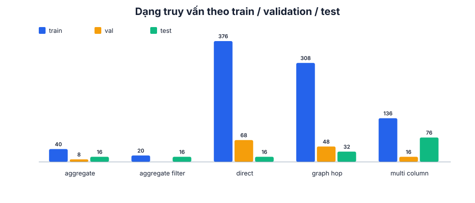

# Dataset

Mỗi ví dụ là một cặp câu hỏi tiếng Việt và SPARQL. JSON Lines được dùng vì dễ
đọc tuần tự, dễ diff và tương thích trực tiếp với thư viện huấn luyện.

```json
{
  "id": "question-0001",
  "family_id": "family-0001",
  "register": "formal",
  "query_shape": "direct",
  "input": "...",
  "target": "SELECT ?answer WHERE { ... }"
}
```

`family_id` gom bốn câu cùng nghĩa. Nó ngăn một cách diễn đạt của cùng câu hỏi
lọt vào train trong khi cách khác lọt vào validation hoặc test.

## Bốn phong cách ngôn ngữ

| Register | Mục tiêu |
|---|---|
| `formal` | Câu đầy đủ, văn phong hành chính |
| `neutral` | Cách hỏi phổ thông |
| `colloquial` | Ngôn ngữ nói thường ngày |
| `noisy` | Viết tắt, bỏ dấu hoặc câu rút gọn |

Mỗi register có đúng 294 câu. Các câu được viết và đọc lại theo ý nghĩa, không
sinh hàng loạt bằng một template thay từ.

## Chia tập

- Train: 880 câu / 220 họ, dùng cập nhật trọng số.
- Validation: 140 câu / 35 họ, dùng chọn checkpoint. Họ câu chưa thấy nhưng
  target đã có trong train, nên đo khả năng hiểu paraphrase.
- Test: 156 câu / 39 họ. Target chưa xuất hiện trong train hoặc validation,
  nhưng từng IRI/property cấu thành đã có trong train, nên đo khả năng ghép
  truy vấn mới.

Test có truy vấn trực tiếp, đi qua graph, nhiều cột, đếm và lọc/sắp xếp. Không
có rò rỉ family, câu trùng hoặc câu gần trùng giữa các tập.



## Các cổng chất lượng

Một dataset hợp lệ phải thỏa tất cả điều kiện sau:

1. Đúng sáu field và tập giá trị register/query shape.
2. ID, family và câu đã chuẩn hóa không rò rỉ giữa split.
3. Mỗi family chỉ có một target.
4. Target là một dòng, parse được, không có ký tự tokenizer không bảo toàn.
5. Target chạy trên ontology và trả ít nhất một dòng.
6. Target test chưa thấy nhưng không dùng schema term chưa học.
7. BARTpho, ViT5 và T5Gemma2 encode/decode toàn bộ target không có `<unk>`.

Manifest và thống kê đầy đủ nằm trong `resources/dataset/manifest.json` và
`reports/dataset.json`.
