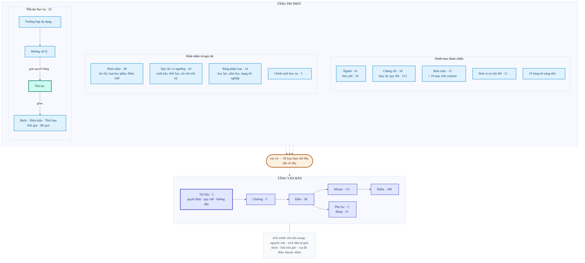

# Ontology học vụ

## Tài liệu này nói về cái gì

Chatbot của dự án không ghi nhớ câu trả lời. Toàn bộ kiến thức học vụ của nó
nằm trong `resources/ontology/ontology.ttl`.
Đây là **cơ sở dữ liệu duy nhất** của chatbot — mọi câu trả lời đều được lấy ra
từ tệp này. Tài liệu này mô tả nó: chứa gì, tổ chức ra sao, và vì sao như vậy.

Bạn không cần biết lập trình để đọc tài liệu này.

## Vài khái niệm cần biết trước

| Từ | Nghĩa trong tài liệu này |
|---|---|
| **Ontology** | Một cách lưu kiến thức dưới dạng mạng lưới: các *sự vật* được nối với nhau bằng các *quan hệ* có tên. Khác với văn bản thường ở chỗ máy đi theo được các mối nối. |
| **Thực thể** | Một sự vật có tên trong mạng lưới: một thủ tục, một phòng ban, một mức học phí, một điều luật. |
| **Quan hệ** | Mối nối có tên giữa hai thực thể, ví dụ *thủ tục bảo lưu* — **nộp tại** → *Phòng Công tác Chính trị và Sinh viên*. |
| **Thuộc tính** | Một giá trị gắn trực tiếp vào thực thể: tên gọi, nội dung, con số, đường dẫn tải về. |
| **Trích dẫn** | Mối nối từ một dữ kiện về đúng phần công văn chứng minh nó. |
| **Truy vấn** | Câu hỏi đặt cho mạng lưới, dạng "đi từ đây, theo quan hệ này, lấy giá trị kia". |

## Nguồn gốc của mọi nội dung

Thư mục `references/` chứa bản sao các văn bản gốc của Trường:

- Quyết định 1052/QĐ-ĐHNT và Quy chế đào tạo trình độ đại học ban hành kèm theo;
- Quyết định 729/QĐ-ĐHNT về mức học phí;
- hướng dẫn đóng học phí qua ngân hàng;
- trang danh mục biểu mẫu của Phòng Đào tạo Đại học.

**Chỉ những gì có căn cứ trong các văn bản này mới được đưa vào ontology.** Khi
văn bản của Trường thay đổi, sửa trực tiếp trong `ontology.ttl` rồi chạy bộ
kiểm tra ở cuối tài liệu. Ontology không có phiên bản: luôn chỉ có một bản
đang đúng.

## Bản đồ toàn bộ

Trước khi vào chi tiết, đây là hình dạng chung của đồ thị ở mức *loại thực thể*.
Tầng dưới là công văn được chẻ theo đúng cấu trúc pháp lý. Tầng trên chia ba
nhóm: thủ tục, khái niệm và quy tắc, danh mục tham chiếu. Điều đáng nhìn nhất là
mũi tên **căn cứ**: cả ba nhóm đều đổ về cùng một tầng văn bản.



**Không dữ kiện nào được phép tồn tại mà không dẫn được về công văn** — ngoại lệ
duy nhất là người và đơn vị, vốn không có căn cứ pháp lý riêng.

Con số sau mỗi ô là số thực thể đang có trong đồ thị. Bản đồ này là *toàn bộ*
cấu trúc, không nhóm nào bị lược đi.

## Hai tầng, và cả hai đều trả lời được

Nội dung được chia làm hai tầng.

**Tầng văn bản** giữ nguyên văn công văn, chia theo đúng cấu trúc pháp lý:
tài liệu → chương → điều → khoản → điểm, cùng phụ lục và bảng. Mỗi phần giữ
nguyên chữ của văn bản gốc và biết cách tự xưng danh: *"điểm c khoản 1 Điều 25
Quy chế đào tạo trình độ đại học"*.

**Tầng tri thức** là các dữ kiện đã được bóc tách thành thứ trả lời thẳng cho
người hỏi: một thủ tục gồm những bước nào, nộp ở đâu, cần điều kiện gì, hạn
chót ra sao. Mỗi dữ kiện đều có trích dẫn về đúng phần văn bản chứng minh nó.

Hai tầng phục vụ hai kiểu câu hỏi khác hẳn nhau:

> **"Bảo lưu thì nộp đơn ở đâu?"** → tầng tri thức trả lời gọn:
> *Phòng Công tác Chính trị và Sinh viên.*
>
> **"Điều 24 quy định gì?"** → tầng văn bản trả về nguyên văn điều luật.

Bản trước của ontology chỉ cho hỏi kiểu thứ nhất. Hệ quả là 60% nguyên văn công
văn nằm trong tệp mà không câu hỏi nào chạm tới được — chép vào rồi bỏ đó. Bản
hiện tại cho hỏi cả hai kiểu.

## Vì sao phải tách tầng

Nguyên tắc dẫn đường: **mỗi câu hỏi khác nhau phải chạm vào dữ liệu khác nhau.**

Một bản nháp rất sớm trả lời mọi câu hỏi về một thủ tục bằng cách đọc nguyên cả
điều luật — có trường hợp dài gần 6.000 ký tự. Bốn ý định khác nhau (cách làm,
điều kiện, thời hạn, kết quả) cùng nhận một khối chữ, nên ranh giới giữa chúng
không thể học được. Điều 24 chứa ba thủ tục, khiến câu trả lời về bảo lưu lẫn cả
nội dung thôi học.

Tầng tri thức tách các dữ kiện đó ra. Tầng văn bản giữ nguyên văn làm chứng cứ.
Trích dẫn nối hai bên lại.

## Quyết định và quy chế là hai tài liệu riêng

Quyết định 1052 có Điều 1, 2, 3 nói về việc *ban hành*. Quy chế kèm theo nó
cũng có Điều 1, 2, 3 — nhưng nói về phạm vi áp dụng, chương trình đào tạo,
phương thức đào tạo. Hai hệ đánh số hoàn toàn độc lập.

Bản trước gộp chúng làm một. Kết quả là "Điều 1" mang cùng lúc hai đoạn văn
không liên quan, còn tên gọi thì lấy của văn bản này gán cho nội dung của văn
bản kia. Hỏi Điều 1 sẽ nhận về hai câu trả lời mâu thuẫn.

Bản hiện tại tách chúng thành hai tài liệu riêng biệt, mỗi tài liệu có hệ điều
khoản của mình.

## Tìm một điều khoản bằng số hiệu

Mỗi phần văn bản mang đủ toạ độ của nó, chứ không chỉ số thứ tự riêng: một điểm
biết cả số điều lẫn số khoản chứa nó. Nhờ vậy "điểm c khoản 1 Điều 25 nói gì" là
một phép tra thẳng, không phải lần ngược cây cấu trúc.

Toạ độ do máy điền khi dựng tệp nên không thể lệch với cấu trúc thật.

## Trích dẫn phải tự giải thích được

Người hỏi không biết "Quyết định 1052" là văn bản gì. Một trích dẫn chỉ ghi số
hiệu là vô dụng với họ. Vì vậy mỗi phần văn bản mang **trích dẫn đầy đủ**:

> khoản 3 Điều 24 Quy chế đào tạo trình độ đại học Trường Đại học Nha Trang,
> ban hành kèm Quyết định 1052/QĐ-ĐHNT ngày 17/7/2025

Trích dẫn này tự nói ra bốn thứ: vị trí trong văn bản, tên văn bản, số quyết
định ban hành, và ngày ban hành. Kèm theo đó, mỗi phần văn bản còn mang **đường
dẫn tới bản gốc** để người đọc bấm vào kiểm chứng.

Nhờ vậy một câu trả lời có thể trả về *nội dung kèm nguồn* trong cùng một lần
hỏi, thay vì bắt người dùng hỏi thêm câu thứ hai:

```text
- Viết đơn xin nghỉ học tạm thời theo Mẫu số 09 (Phụ lục 4).
- Gửi đơn tới Hiệu trưởng thông qua Phòng Công tác Chính trị và Sinh viên.

căncứ: Điều 24 Quy chế đào tạo trình độ đại học Trường Đại học Nha Trang,
       ban hành kèm Quyết định 1052/QĐ-ĐHNT ngày 17/7/2025
xemtại: https://pdtdaihoc.ntu.edu.vn/.../245-Quyet dinh 1052 ....pdf
```

Nguồn chỉ xuất hiện **một lần ở cuối** dù danh sách có bao nhiêu dòng, vì nó là
chú thích cho cả câu trả lời chứ không phải dữ liệu của từng dòng.

Cả ba cấp của văn bản đều hỏi được theo cách này: *"Điều 24 quy định gì"*,
*"khoản 3 Điều 24 ghi gì"*, *"điểm c khoản 1 Điều 25 ghi gì"*.

Có một điểm bất đối xứng cần biết. Điều và khoản được hỏi bằng **số hiệu**, còn
điểm được hỏi bằng **tên định danh** của nó. Lý do nằm ở danh mục dạng câu hỏi
chứ không ở ontology: chỗ trống trong một dạng câu hỏi chỉ nhận được tên định
danh hoặc con số, mà ký hiệu điểm lại là chữ cái (a, b, c, d, **đ**, e, g, h, i).
Trong ontology, `pointLetter` vẫn nằm đó và truy vấn tay theo chữ cái vẫn chạy —
chỉ là chưa biến nó thành tham số được.

Bất đối xứng này chấp nhận được vì mọi điểm đều có mặt trong dữ liệu huấn luyện.
Nó sẽ thành vấn đề nếu về sau thêm công văn mới: số hiệu thì nhận được cả giá trị
chưa từng thấy, còn danh sách tên định danh thì phải khai lại và huấn luyện lại.

## Quy mô hiện tại

| Toàn bộ | Số lượng |
|---|---:|
| Mối nối và giá trị (bộ ba RDF) | 8.419 |
| Loại thực thể | 65 |
| Quan hệ giữa các thực thể | 37 |
| Thuộc tính | 59 |
| Thực thể có tên | 885 |

| Tầng văn bản | Số lượng |
|---|---:|
| Tài liệu | 5 |
| Chương | 5 |
| Điều | 38 |
| Khoản | 111 |
| Điểm | 108 |
| Phụ lục | 5 |
| Bảng | 13 |

| Tầng tri thức | Số lượng |
|---|---:|
| Thủ tục học vụ | 22 |
| Bước thực hiện | 44 |
| Điều kiện | 33 |
| Thời hạn | 7 |
| Kết quả xử lý | 10 |
| Hệ quả về sau | 2 |
| Trường hợp áp dụng | 4 |
| Hướng xử lý của trường hợp | 6 |
| Chính sách học vụ | 3 |
| Khái niệm được định nghĩa | 28 |
| Quy tắc có ngưỡng | 43 |

| Danh mục tham chiếu | Số lượng |
|---|---:|
| Ngành đào tạo | 41 |
| Mức học phí | 24 |
| Chứng chỉ | 18 |
| Quy tắc quy đổi chứng chỉ | 212 |
| Biểu mẫu theo quyết định | 15 |
| Mục biểu mẫu trên website | 19 |
| Đơn vị và chủ thể | 11 |

Từ mạng lưới này sinh ra **6.073 khả năng trả lời** — tức là số đường đi hợp lệ
từ một thực thể tới một câu trả lời. Thêm 260 mục bị loại có chủ đích, mỗi mục
kèm lý do. Toàn bộ danh sách được liệt kê ở dạng máy đọc được trong
`resources/ontology/answer_inventory.json`, và được sinh lại từ chính mạng lưới
nên không thể lệch với nó.

## Khái niệm và quy tắc, không chỉ thủ tục

Phần lớn quy chế không phải là thủ tục mà là **định nghĩa** và **ngưỡng**. Bản
trước bỏ trống phần này, nên những điều luật hay được hỏi nhất lại không trả lời
được. Bản hiện tại mô hình hoá chúng thành thực thể:

- **Định nghĩa**: tín chỉ, chín loại học phần, hai hình thức đào tạo, hai loại
  học kỳ, bốn điểm chữ (I, X, R, P), thành phần đánh giá học phần, lớp hành
  chính và lớp học phần, đề cương chi tiết học phần.
- **Quy tắc có ngưỡng**: khối lượng đăng ký mỗi học kỳ, ba mức cảnh báo học tập,
  hai căn cứ buộc thôi học, thời gian đào tạo tối đa, điều kiện dự thi, tỷ lệ
  học trực tuyến, giới hạn công nhận tín chỉ, sĩ số lớp học phần, hạ hạng tốt
  nghiệp.

Các quy tắc được **phân nhóm**, và đây là chỗ ontology hơn hẳn một danh sách
thường: hỏi *"có những ngưỡng cảnh báo học tập nào"* thì máy duyệt cả nhóm
"quy tắc cảnh báo" và trả về đủ ba mức — không ai phải liệt kê sẵn danh sách,
và thêm một ngưỡng mới vào mạng lưới thì câu trả lời tự đầy đủ theo.

Tương tự, các ngưỡng bằng số cho phép hỏi ngược: *"7,5 điểm xếp loại gì"*,
*"70 tín chỉ là sinh viên năm mấy"*, *"học phí ngành Công nghệ thông tin khoá
65"*, *"MOS 1700 điểm quy đổi được mấy"*.

## Quy tắc biên soạn

Tầng văn bản chỉ chép nguyên văn nên khó sai. Tầng tri thức diễn giải công văn
thành câu trả lời, nên nó là nơi duy nhất có thể sai nội dung học vụ mà không ai
phát hiện. Mỗi quy tắc dưới đây đều được kiểm tra tự động, và mỗi quy tắc tồn
tại vì **một lỗi đã thực sự xảy ra** khi soạn thảo.

### Ranh giới giữa các loại dữ kiện

Nếu người biên soạn còn phân vân giữa hai loại thì chatbot chắc chắn sẽ học sai.
Dùng đúng một câu hỏi để quyết định:

| Loại | Trả lời câu hỏi | Không được chứa |
|---|---|---|
| Trường hợp áp dụng | *hoàn cảnh nào kích hoạt thủ tục?* | nghĩa vụ phải làm, giấy tờ phải nộp |
| Điều kiện | *điều gì phải đúng thì mới được xét?* | hành động, thời hạn |
| Bước thực hiện | *ai làm gì, theo thứ tự nào?* | điều kiện được xét |
| Thời hạn | *phải làm trước hoặc trong bao lâu?* | nội dung hành động |
| Kết quả xử lý | *đơn được giải quyết ra sao?* | hệ quả về sau |
| Hệ quả về sau | *về sau sinh viên chịu ảnh hưởng gì?* | quyết định trên đơn |

Kết quả xử lý và hệ quả về sau tách nhau vì bản nháp từng gán "muốn quay lại
phải xét tuyển đầu vào như thí sinh khác" làm *kết quả* của thủ tục thôi học —
đó không phải kết quả giải quyết đơn mà là hệ quả về sau.

### Trích dẫn phải trỏ tới phần nhỏ nhất chứng minh dữ kiện

Không trỏ chung tới cả điều khi chỉ một khoản chứng minh dữ kiện đó. Nếu dữ kiện
nằm trong một bảng thì trích dẫn dừng ở bảng, không dừng ở cả phụ lục.

Ngược lại, một mục từ vựng trải khắp một phụ lục — tên các chứng chỉ, các khối
ngành — thì trỏ tới phụ lục mới đúng.

Dữ liệu không đến từ công văn, chẳng hạn địa chỉ và điện thoại phòng ban lấy từ
website, nằm ở các đơn vị trong trường; nhóm này không thuộc diện bắt buộc dẫn
nguồn.

### Điều kiện phải nói rõ nó áp dụng cho ai

Điều kiện chỉ áp dụng cho một trường hợp phải khai rõ trường hợp đó. Bản nháp
từng gắn "phải học ít nhất 01 học kỳ" cho toàn bộ thủ tục nghỉ học tạm thời,
trong khi Điều 24 chỉ áp cho điểm d — lý do cá nhân. Hậu quả: người đi nghĩa vụ
quân sự bị trả nhầm điều kiện không liên quan.

### Một hoàn cảnh dẫn tới nhiều thủ tục thì phải nói rõ khi nào áp dụng cái nào

Một trường hợp áp dụng được phép dùng chung giữa nhiều thủ tục và **không** được
nhân bản giả tạo. Nhưng khi nó dẫn tới nhiều thủ tục, mỗi hướng xử lý phải nói
rõ điều kiện phân nhánh.

"Ốm" dẫn tới ba thủ tục, và chính công văn đã có tiêu chí phân nhánh:

```text
Ốm  ├─ điều trị dưới 10 ngày            → thủ tục xin nghỉ ốm
    ├─ điều trị từ 10 ngày trở lên      → thủ tục nghỉ học tạm thời
    └─ ốm trong đợt thi kết thúc học phần → thủ tục xin hoãn thi
```

Với câu hỏi mơ hồ, câu trả lời đúng là **liệt kê các nhánh kèm tên thủ tục**,
không trả thẳng các bước — vì không tồn tại một câu trả lời đúng duy nhất.

### Không chép cùng một nội dung vào hai chỗ do người viết

Thời hạn nằm ở thời hạn, không được chép lại vào nội dung bước. Hai bản sao sẽ
lệch nhau khi cập nhật.

Riêng nguyên văn ở tầng văn bản được lưu ở nhiều mức — cả điều lẫn từng khoản —
nhưng đó là chủ đích: nguyên văn của điều được **ghép tự động từ chính các khoản
con của nó** khi dựng tệp, nên hai mức không thể lệch nhau.

### Tên gọi thay thế chỉ là tên gọi, không phải cách hỏi

Không đặt chỉ tiêu số lượng tên gọi thay thế. Chỉ tiêu "ít nhất 8 tên" khuyến
khích thêm những tên lỏng nghĩa như "bị tai nạn" cho trường hợp *"tai nạn phải
điều trị thời gian dài"* — chatbot học từ đó sẽ trả lời sai một cách tự tin.
Cách diễn đạt và biến thể khẩu ngữ thuộc phần dữ liệu huấn luyện, không thuộc
ontology.

### Danh sách phải đánh số liên tục

Các bước của một thủ tục phải đánh số 1..n liên tục; thứ tự điều kiện phải duy
nhất. Kết quả truy vấn vốn không có thứ tự, nên mọi câu trả lời dạng danh sách
đều phải sắp xếp theo các số này.

### Nội dung tiếng Việt phải được đánh dấu ngôn ngữ

Mọi đoạn nội dung tiếng Việt phải gắn nhãn ngôn ngữ. Ngoại lệ là các **mã**:
ký hiệu điểm ("c"), số chương ("IV"), điểm chữ ("R"). Gắn nhãn tiếng Việt vào
mã sẽ khiến việc tra cứu theo mã không khớp.

## Quy ước đặt tên

- Tên định danh của thực thể và loại thực thể dùng tiếng Anh, viết hoa đầu mỗi
  từ và không có dấu cách.
- Tên định danh của quan hệ và thuộc tính dùng tiếng Anh, viết thường chữ đầu.
- Mỗi thực thể công khai có một tên tiếng Việt đầy đủ và ổn định.
- Không đổi tên định danh sau khi dữ liệu huấn luyện đã bắt đầu được tạo; đổi ở
  thời điểm đó buộc phải kiểm tra lại toàn bộ.

## Những gì cố ý không phải là "neo"

Bước thực hiện, điều kiện, thời hạn, kết quả, hệ quả và hướng xử lý là các phần
bên trong một thủ tục. Người dùng không gọi tên chúng, nên không câu hỏi nào
nhắm thẳng vào chúng; nội dung của chúng được hỏi thông qua thủ tục chứa chúng.

Mức học phí, quy tắc quy đổi chứng chỉ và các bảng ngưỡng là **bản ghi kỹ
thuật**: người dùng hỏi chúng bằng một con số ("7,5 điểm xếp loại gì") chứ không
gọi tên, nên truy vấn phải tìm tới chúng bằng điều kiện nghiệp vụ.

## Danh mục biểu mẫu

Phụ lục 4 "Danh mục biểu mẫu" chỉ được liệt kê trong mục lục công văn; nội dung
thật nằm trên trang văn bản pháp quy của Phòng Đào tạo Đại học. Website đánh số
biểu mẫu **khác** với quyết định — mẫu số 8 trên web là mẫu số 9 trong quyết
định. Vì vậy biểu mẫu theo quyết định và mục biểu mẫu trên website là hai loại
thực thể tách biệt, nối nhau bằng một quan hệ riêng. Tuyệt đối không gộp.

## Giới hạn đã biết

- Công thức tính điểm trung bình ở Điều 18 khoản 1 không có trong mạng lưới:
  bản chuyển đổi của công văn đã làm hỏng ký hiệu toán nên không khôi phục được.
  Phần diễn giải các ký hiệu vẫn được giữ.
- Sinh viên tích lũy **đúng 105 tín chỉ** không rơi vào bậc năm học nào. Đây là
  khoảng trống của chính công văn: Điều 19 quy định năm ba là "từ 70 đến dưới
  105" còn năm tư là "trên 105". Ontology chép trung thực nên chatbot sẽ trả lời
  "không có thông tin" cho đúng con số này.
- Hai mức quy đổi chứng chỉ ngoại ngữ ở bậc 2 và bậc 3 không có ngưỡng điểm, vì
  bảng nguồn ghi hai giá trị nhập nhằng ("400 / ≥ 500"). Không đoán thay công
  văn, nên các mức này chỉ trả lời được phần diễn giải.
- Chưa mô hình hoá hiệu lực theo thời gian. Hiện mỗi công văn chỉ có một phiên
  bản nên chưa cần, nhưng phải chừa chỗ trước khi có văn bản sửa đổi.

## Kiểm tra sau khi sửa

Ontology được kiểm tra tự động theo các tiêu chí sau:

1. tệp đọc được và dùng đúng không gian tên quy định;
2. mọi loại thực thể và quan hệ được dùng đều đã khai báo, và ngược lại;
3. mọi loại, quan hệ và thực thể có tên đều có tên tiếng Việt;
4. tên định danh duy nhất và đúng quy ước viết hoa;
5. không quan hệ nào trỏ tới một thực thể không tồn tại;
6. nguyên văn là văn bản thuần, không còn ký tự định dạng;
7. mọi dữ kiện nghiệp vụ truy ngược được về tài liệu chính thức;
8. mọi truy vấn trong danh mục chạy được và chỉ trả về tên gọi hoặc giá trị;
9. mọi khả năng trả lời đều được ghi nhận, kèm lý do nếu bị loại.

Sau mỗi lần sửa `ontology.ttl`, chạy hai lệnh sau. Lệnh đầu kiểm tra lược đồ và
quy tắc biên soạn; lệnh sau kiểm tra cả chuỗi từ ontology tới dữ liệu huấn
luyện.

```bash
uv run pytest tests/ontology
uv run validate_sparql_dataset
```
