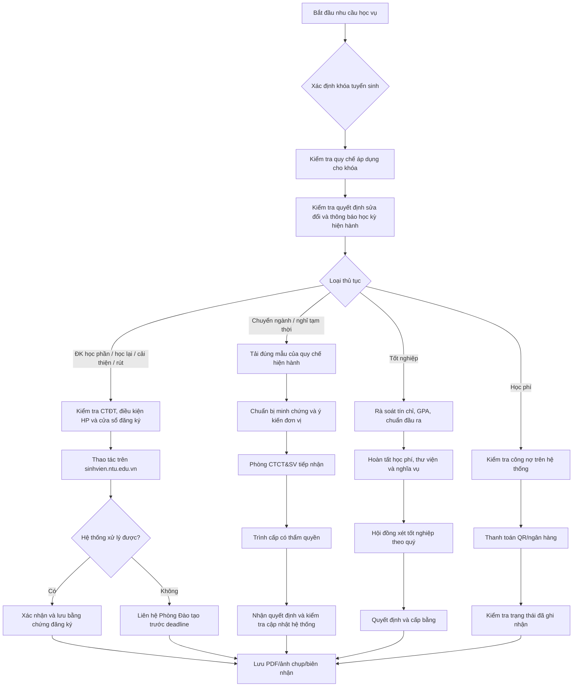

# Báo cáo nghiên cứu diện rộng về thủ tục học vụ tại Trường Đại học Nha Trang

## Tóm tắt điều hành

**Ngày chốt tìm kiếm và kiểm chứng: 10/08/2026, giờ Việt Nam.** Phạm vi nghiên cứu gồm các trang và kho văn bản chính thức của Trường Đại học Nha Trang (ĐHNT), Phòng Đào tạo, Phòng Công tác Chính trị và Sinh viên (CTCT&SV), Phòng Kế hoạch – Tài chính (KHTC), cổng tuyển sinh, hệ thống quản lý đào tạo; đồng thời đối chiếu văn bản của Bộ Giáo dục và Đào tạo (Bộ GDĐT) và Chính phủ. Trang văn bản pháp quy của Phòng Đào tạo hiện ghi nhận Quyết định 1052/QĐ-ĐHNT ngày 17/07/2025 về Quy chế đào tạo đại học; Quyết định 1965/QĐ-ĐHNT ngày 19/12/2025 sửa đổi, bổ sung **Phụ lục** của quy chế này; Thông báo 94 ngày 27/01/2026 về điều chỉnh tổ chức thực hiện hoạt động đào tạo; và Quyết định 626 ngày 29/04/2026 về Quy chế tuyển sinh đại học của Trường. citeturn20view0turn26search0

Kết luận quan trọng nhất là **không nên dùng một văn bản duy nhất cho mọi khóa sinh viên**. Quyết định 1052/QĐ-ĐHNT quy định áp dụng từ năm học 2025–2026, cho **khóa 64 trở đi**, đồng thời thay thế các quyết định trước đó có nội dung trái với quy chế. citeturn12view7 Với các khóa cũ hơn, Quyết định 753/QĐ-ĐHNT ngày 13/08/2021 và các văn bản chuyển tiếp vẫn cần được kiểm tra theo khóa. Mặt khác, ở cấp Bộ, ngày 07/07/2026 Bộ GDĐT đã ban hành **Thông tư 56/2026/TT-BGDĐT**, có hiệu lực ngay từ ngày 07/07/2026 và thay thế Thông tư 08/2021/TT-BGDĐT. Tuy nhiên, Thông tư 56 có điều khoản chuyển tiếp đáng chú ý: các khóa đã có thông báo tuyển sinh trước ngày thông tư có hiệu lực tiếp tục thực hiện theo quy chế đào tạo có hiệu lực tại thời điểm thông báo tuyển sinh. Vì vậy, không thể máy móc lấy Thông tư 56 để thay đổi ngay quy trình của mọi sinh viên đang học tại ĐHNT. citeturn19search0turn19search1

Qua rà soát, các thủ tục có mức độ rõ ràng cao nhất trong quy chế hiện hành của ĐHNT là **đăng ký học phần, học lại, học cải thiện, xét tốt nghiệp, chuyển ngành và nghỉ học tạm thời/bảo lưu**. Quyết định 1052 quy định trực tiếp điều kiện, đầu mối và nhiều biểu mẫu cho các thủ tục này. citeturn11view3turn11view4turn12view1turn12view3turn12view4

**Rút học phần là điểm cần thận trọng nhất.** Quyết định 753 cũ có Điều 10 quy định rất cụ thể thời hạn rút, gồm hai tuần đầu học kỳ chính và một tuần đầu học kỳ hè; trong các điều khoản Quyết định 1052 đã kiểm tra không còn thấy một điều độc lập tương đương. citeturn4view1turn12view7 Thông tư 56/2026 của Bộ lại yêu cầu quy chế của cơ sở đào tạo phải quy định việc rút bớt học phần. citeturn19search11 Vì vậy, đối với sinh viên thuộc phạm vi QĐ1052, **không nên tự áp dụng mốc “hai tuần/một tuần” của QĐ753 nếu thông báo học kỳ hoặc hệ thống sinh viên không xác nhận**.

Đối với học bổng khuyến khích học tập (KKHT), dữ liệu chính thức gần nhất được tìm thấy cho thấy ĐHNT đã chi học bổng HKII năm học 2024–2025 theo Quyết định 1618/QĐ-ĐHNT và 1619/QĐ-ĐHNT; mức học bổng năm 2024–2025 được đặt tại Quyết định 317/QĐ-ĐHNT ngày 07/03/2025. citeturn25view2turn24search0 Quy chế đào tạo mới xác nhận điểm trung bình học kỳ chính, không tính học kỳ hè, là căn cứ xét học bổng và khen thưởng. citeturn11view9 Không tìm thấy trong bộ nguồn hiện hành một “đơn xin học bổng KKHT” mà sinh viên đại trà phải nộp; mô hình công khai cho thấy đây về cơ bản là quy trình nhà trường lập danh sách từ kết quả học tập/rèn luyện rồi ban hành quyết định — đây là **suy luận từ chuỗi văn bản công khai**, không phải một câu chữ quy trình duy nhất. citeturn20view5turn25view2

Về học phí, ĐHNT đã có **QĐ 1314/QĐ-ĐHNT ngày 28/08/2025 ban hành Quy trình thu học phí** trong kho văn bản trung tâm. citeturn26search0 Đối với người học, quy trình công khai hiện tại là kiểm tra số tiền trên `sinhvien.ntu.edu.vn`, thanh toán bằng QR hoặc Mobile/Internet Banking; thanh toán điện tử qua các phương thức được nêu là miễn phí, còn nộp tiền mặt tại quầy Agribank/VietinBank có thể phát sinh phí ngân hàng 3.300 hoặc 5.500 đồng/lần tùy địa điểm. Thông báo gần nhất đang hiển thị trên cổng quản lý đào tạo là học phí học kỳ hè 2025–2026, hạn 05/07/2026. citeturn25view0

### Bảng tóm tắt so sánh

| Thủ tục | Bước chính | Thời hạn tiêu chuẩn/xác minh được | Phòng/đơn vị chính | Văn bản/link chính |
|---|---|---|---|---|
| **Tuyển sinh** | Chọn phương thức → đăng ký nguyện vọng trên hệ thống tuyển sinh quốc gia → nộp lệ phí → xét tuyển → xác nhận/nhập học ĐHNT | Theo lịch Bộ từng năm; năm 2026, nộp lệ phí trực tuyến **15–21/07/2026** | Phòng Đào tạo/Bộ phận tuyển sinh; Bộ GDĐT quản lý hệ thống quốc gia | [Cổng tuyển sinh ĐHNT](https://tuyensinh.ntu.edu.vn/); [Quy chế tuyển sinh ĐHNT](https://tuyensinh.ntu.edu.vn/thong-bao/quy-che-tuyen-sinh-truong-dai-hoc-nha-trang) citeturn20view6turn23view0turn17search12 |
| **Xét học bổng KKHT** | Chốt điểm/rèn luyện → xếp hạng theo tiêu chuẩn → lập danh sách → quyết định → chi trả | Sau học kỳ chính; không có một hạn nộp đơn cố định được tìm thấy | Phòng CTCT&SV; KHTC | [Danh mục học bổng KKHT](https://phongctsv.ntu.edu.vn/danh-muc/hoc-bong-khuyen-khich-hoc-tap); QĐ317 citeturn24search1turn24search0 |
| **Đăng ký học phần** | Kiểm tra CTĐT/kết quả → chọn HP → tư vấn → đăng ký/xác nhận trên hệ thống | Theo thông báo từng học kỳ | Phòng Đào tạo + khoa/viện + cố vấn | QĐ1052, Điều 9; [Văn bản pháp quy](https://pdtdaihoc.ntu.edu.vn/van-ban-phap-quy) citeturn11view3turn20view0 |
| **Đăng ký học lại** | Xác định HP không đạt → đăng ký lớp mở → học/thi lại → cập nhật điểm | Theo đợt đăng ký HP từng học kỳ/hè | Phòng Đào tạo | QĐ1052, Điều 11 citeturn11view4 |
| **Học cải thiện** | Chọn HP được phép học lại/cải thiện → đăng ký → hoàn thành → lấy kết quả theo quy chế | Theo đợt đăng ký HP | Phòng Đào tạo | QĐ1052, Điều 11 citeturn11view4 |
| **Rút học phần** | Điều chỉnh đăng ký trên hệ thống/đầu mối đào tạo | **Chưa thấy mốc hiện hành rõ trong QĐ1052**; QĐ753 cũ: 2 tuần đầu HK chính/1 tuần đầu HK hè | Phòng Đào tạo | QĐ753, Điều 10 — nguồn lịch sử; cần đối chiếu thông báo học kỳ hiện hành citeturn4view1turn12view7 |
| **Xét tốt nghiệp** | Rà soát CTĐT + GPA + chuẩn đầu ra + nghĩa vụ → Hội đồng xét → quyết định → cấp bằng | Hội đồng **mỗi quý**; bằng/quyết định trong **3 tháng** sau khi đủ điều kiện và nghĩa vụ | Hội đồng xét tốt nghiệp; Phòng Đào tạo phối hợp | QĐ1052, Điều 22–23 citeturn12view1turn12view2 |
| **Chuyển ngành** | Kiểm tra điều kiện → Mẫu 12 → ý kiến khoa cũ/mới → CTCT&SV → Hiệu trưởng | Ít nhất **2 tuần trước khi bắt đầu học kỳ mới** | Phòng CTCT&SV; hai khoa/viện; Hiệu trưởng | QĐ1052, Điều 25 citeturn12view3turn12view4 |
| **Đóng học phí** | Kiểm tra công nợ → QR/Internet Banking/ngân hàng → kiểm tra trạng thái | Theo thông báo từng kỳ; HK hè 2025–26: **05/07/2026** | KHTC; ngân hàng; CTCT&SV nếu xin gia hạn/chính sách | QĐ1314/2025; [qldt.ntu.edu.vn](https://qldt.ntu.edu.vn/) citeturn26search0turn25view0 |
| **Bảo lưu/nghỉ học tạm thời** | Xác định lý do → Mẫu 09 + minh chứng → CTCT&SV → quyết định; trước khi trở lại dùng Mẫu 11 | Đơn trở lại: ít nhất **2 tuần trước học kỳ mới** | Phòng CTCT&SV; Hiệu trưởng | QĐ1052, Điều 24 citeturn12view3 |

## Cơ sở pháp lý, phạm vi áp dụng và độ tin cậy nguồn

### Bộ văn bản hiện hành cần đặt ở “đỉnh” hồ sơ

Ở cấp Bộ, **Thông tư 56/2026/TT-BGDĐT ngày 07/07/2026** hiện là Quy chế đào tạo trình độ đại học mới, có hiệu lực từ 07/07/2026 và thay thế Thông tư 08/2021/TT-BGDĐT cùng Thông tư 28/2023/TT-BGDĐT. citeturn19search0turn19search1 Đây là một thay đổi rất mới so với nhiều trang hướng dẫn của ĐHNT được ban hành năm 2025–đầu 2026.

Tuy nhiên, điều khoản chuyển tiếp của Thông tư 56 nêu rằng đối với khóa đã có thông báo tuyển sinh trước ngày thông tư có hiệu lực và các khóa đang đào tạo, việc thực hiện tiếp tục theo quy chế có hiệu lực tại thời điểm thông báo tuyển sinh. citeturn19search1 Do đó, đối với phần lớn sinh viên đang học trong năm 2026, văn bản ĐHNT áp dụng cho khóa của họ vẫn là điểm xuất phát thực tế.

Ở cấp trường, văn bản nền tảng là **Quyết định 1052/QĐ-ĐHNT ngày 17/07/2025 – Ban hành Quy chế đào tạo trình độ đại học của Trường Đại học Nha Trang**. Trang pháp quy chính thức xác nhận văn bản này, cùng QĐ1965 ngày 19/12/2025 sửa đổi, bổ sung Phụ lục. citeturn20view0turn26search2

**PDF trực tiếp QĐ1052:**  
[https://pdtdaihoc.ntu.edu.vn/uploads/38//245-Quyet%20dinh%201052%20%2817-7-2025%29%20ban%20hanh%20quy%20che%20dao%20tao%20trinh%20do%20dai%20hoc%20cua%20Truong%20DHNT.pdf](https://pdtdaihoc.ntu.edu.vn/uploads/38//245-Quyet%20dinh%201052%20%2817-7-2025%29%20ban%20hanh%20quy%20che%20dao%20tao%20trinh%20do%20dai%20hoc%20cua%20Truong%20DHNT.pdf)

QĐ1052, Điều 32, trang 22 của phần quy chế xác định áp dụng từ năm học 2025–2026, cho khóa 64 trở đi, đồng thời thay thế các quy định cũ trái với quy chế. citeturn12view7

Đối với các khóa cũ và để truy lịch sử thay đổi, văn bản quan trọng là **QĐ753/QĐ-ĐHNT ngày 13/08/2021 – Quy chế đào tạo trình độ đại học**. citeturn20view0turn16search16

**PDF trực tiếp QĐ753:**  
[https://pdtdaihoc.ntu.edu.vn/uploads/38/files/Van-Ban-Truong/20210813_Q%C4%90%20753%20vv%20ban%20h%C3%A0nh%20Quy%20ch%E1%BA%BF%20%C4%91%C3%A0o%20t%E1%BA%A1o_13_8_2021.pdf](https://pdtdaihoc.ntu.edu.vn/uploads/38/files/Van-Ban-Truong/20210813_Q%C4%90%20753%20vv%20ban%20h%C3%A0nh%20Quy%20ch%E1%BA%BF%20%C4%91%C3%A0o%20t%E1%BA%A1o_13_8_2021.pdf)

Ngoài ra, kho văn bản ĐHNT vẫn liệt kê **QĐ1286/QĐ-ĐHNT ngày 02/12/2021 – Hướng dẫn thực hiện công tác tốt nghiệp trình độ đại học hệ chính quy**; các nội dung kỹ thuật của văn bản này chỉ nên tiếp tục dùng khi không trái QĐ1052 và các hướng dẫn mới hơn. citeturn20view0turn26search2

### Thứ tự ưu tiên khi văn bản mâu thuẫn

Trong thực tế xử lý hồ sơ, nên áp dụng theo nguyên tắc:

**Văn bản pháp luật đang có hiệu lực của Quốc hội/Chính phủ/Bộ GDĐT → quy chế ĐHNT áp dụng đúng khóa → quyết định sửa đổi/phụ lục mới hơn → thông báo triển khai của học kỳ/năm học → trang hướng dẫn/biểu mẫu web → tài liệu cũ.**

Điểm đặc biệt hiện nay là Thông tư 56/2026 mới có hiệu lực nhưng có điều khoản chuyển tiếp; vì thế việc “văn bản mới hơn” không đồng nghĩa tự động thay toàn bộ quy chế của khóa đã tuyển trước 07/07/2026. citeturn19search1

Đối với học phí, Nghị định **238/2025/NĐ-CP ngày 03/09/2025** hiện là nền tảng pháp lý thay Nghị định 81/2021 và Nghị định 97/2023. Điều 10 của Nghị định quy định cơ chế học phí giáo dục đại học, trong đó cơ sở công lập có thể quy định học phí học lại nhưng không vượt khung pháp lý tương ứng. citeturn17search3turn25view1

### Vấn đề PDF ảnh và OCR

Nhiều PDF của ĐHNT đúng như người dùng lưu ý là **scan ảnh thuần túy**. Các tệp QĐ1052, QĐ753, TB thời gian biểu 2026–2027 và QĐ317 về học bổng khi kiểm tra bằng `pdftotext` đều cho **0 ký tự hữu ích ngoài ký tự phân trang**, tức tệp gốc không chứa lớp văn bản có thể tìm kiếm. Vì vậy, những điều khoản trọng yếu trong báo cáo này đã được kiểm tra trực tiếp trên ảnh trang PDF, chẳng hạn Điều 9/11/22/24/25 của QĐ1052 và trang 2 QĐ317. citeturn11view3turn11view4turn12view1turn12view3turn12view4turn25view4

Tôi không gán một con số “độ chính xác OCR ký tự” giả tạo cho các file này: để tính CER/WER thực sự phải có bản chuẩn được đánh máy để so sánh. Bảng metadata ở phần sau vì vậy tách **tỷ lệ lớp text trích xuất được** và **mức tin cậy kiểm chứng trực quan**. Các trang được viện dẫn điều khoản trong báo cáo đều đã được đọc/đối chiếu trên ảnh trang, thay vì dựa duy nhất vào OCR của công cụ tìm kiếm.

## Phân tích chi tiết từng thủ tục

### Tuyển sinh đại học

**Cơ sở hiện hành.** Kho văn bản pháp quy của Phòng Đào tạo ghi **QĐ 626 ngày 29/04/2026 – Ban hành Quy chế tuyển sinh đại học Trường Đại học Nha Trang**. Cổng tuyển sinh ĐHNT cũng có trang “Quy chế tuyển sinh Trường Đại học Nha Trang” đăng ngày 21/05/2026. citeturn21view1turn23view0 Cần ghi đủ ngày và tên văn bản vì kho văn bản trung tâm còn có một **626/QĐ-ĐHNT ngày 20/05/2024** về một chủ đề nhân sự hoàn toàn khác. citeturn26search0

Năm 2026, ĐHNT công khai ba phương thức: xét điểm thi tốt nghiệp THPT 2026 với tổ hợp bốn môn, thang 40; xét điểm đánh giá năng lực ĐHQG TP.HCM hoặc ĐHQG Hà Nội; và xét tuyển thẳng/ưu tiên theo quy chế Bộ GDĐT. citeturn20view6 Trích ngắn từ trang tuyển sinh: **“Xét tuyển dựa vào Điểm thi tốt nghiệp THPT năm 2026”**. citeturn20view6

**Quy trình hành chính xác minh được:**

| Thành phần | Nội dung |
|---|---|
| Bước thực hiện | Theo dõi đề án/quy chế ĐHNT → chọn ngành, phương thức → đăng ký/điều chỉnh nguyện vọng trên hệ thống tuyển sinh của Bộ theo lịch năm → nộp lệ phí trực tuyến → nhận kết quả → hoàn thiện thủ tục nhập học tại ĐHNT. Bộ GDĐT vận hành cổng tuyển sinh quốc gia; trang ĐHNT có riêng khu vực “Nhập học”, “Hồ sơ nhập học 2026 – K68” và hướng dẫn sử dụng hệ thống sinh viên. citeturn17search2turn20view2 |
| Điều kiện | Phụ thuộc phương thức và ngành; năm 2026 dùng ba nhóm phương thức nêu trên. citeturn20view6 |
| Biểu mẫu | Đăng ký điện tử trên hệ thống tuyển sinh; không tìm thấy một mẫu giấy chung của ĐHNT bắt buộc cho mọi thí sinh chính quy trong nguồn công khai đã đọc. Hồ sơ nhập học K68 được cung cấp trên trang nhập học riêng. citeturn20view2 |
| Thời hạn | Lịch tuyển sinh thay đổi từng năm. Riêng năm 2026, Bộ quy định nộp lệ phí xét tuyển trực tuyến từ **15/07 đến 17h00 ngày 21/07/2026**. citeturn17search4turn17search8turn17search12 |
| Lệ phí | Đợt 2026 có nghĩa vụ nộp lệ phí trên hệ thống Bộ; trong nguồn chính thức đã thu thập tôi **không xác nhận được một con số lệ phí/1 nguyện vọng**, nên không suy đoán. Không được dùng mức 400.000 đồng của tuyển sinh vừa làm vừa học/liên thông để thay cho tuyển sinh chính quy. citeturn17search12turn16search6 |
| Cơ quan | Phòng Đào tạo/Bộ phận tuyển sinh ĐHNT; hệ thống tuyển sinh quốc gia do Bộ GDĐT tổ chức. Trang chủ ĐHNT công khai điện thoại tuyển sinh đại học chính quy 0258 383 1145 – 0258 383 1148. citeturn16search24 |

**Link theo dõi:** [tuyensinh.ntu.edu.vn](https://tuyensinh.ntu.edu.vn/), [trang nhập học](https://tuyensinh.ntu.edu.vn/dai-hoc/nhap-hoc). citeturn20view6turn20view2

### Xét học bổng khuyến khích học tập

Quy chế đào tạo QĐ1052 quy định điểm trung bình học kỳ được sử dụng để xét học bổng, khen thưởng sau **mỗi học kỳ chính**, không sử dụng học kỳ hè làm kỳ xét tương đương. citeturn11view9

ĐHNT ban hành **QĐ317/QĐ-ĐHNT ngày 07/03/2025 về mức học bổng KKHT năm học 2024–2025**. Bản scan ghi điều kiện nền là sinh viên chính quy có kết quả học tập và rèn luyện từ mức khá trở lên. citeturn24search0 Trích ngắn, Điều 1: **“kết quả học tập và rèn luyện đạt từ mức khá”**. citeturn24search0

Đối với chương trình chuẩn năm học 2024–2025, QĐ317 đặt mức học bổng 5 tháng/học kỳ tương ứng Xuất sắc 7,2 triệu đồng, Giỏi 6 triệu đồng và Khá 5 triệu đồng. Đối với chương trình đào tạo đặc biệt, trang 2 của cùng quyết định ghi Xuất sắc 8,64 triệu, Giỏi 7,2 triệu và Khá 6 triệu đồng. citeturn24search0turn25view4 Đây là **mức của năm học 2024–2025**, không phải cam kết rằng năm 2025–2026 hoặc 2026–2027 vẫn giữ nguyên.

Đợt công khai gần nhất tìm được là HKII 2024–2025, đăng 04/11/2025, gồm **QĐ1618/QĐ-ĐHNT** cho chương trình chuẩn và **QĐ1619/QĐ-ĐHNT** cho chương trình đào tạo đặc biệt, kèm danh sách sinh viên được nhận. citeturn25view2turn24search6turn24search12

| Thành phần | Nội dung |
|---|---|
| Bước thực hiện | Sau khi chốt điểm học kỳ chính và kết quả rèn luyện → đơn vị trường xác định đối tượng/ xếp hạng → lập danh sách → ban hành quyết định → chi trả. Việc đây là quy trình do trường chủ động xét là **suy luận từ QĐ317 và các quyết định 1618/1619 kèm danh sách**, vì chưa tìm thấy một văn bản công khai yêu cầu sinh viên đại trà phải nộp đơn KKHT. citeturn24search0turn25view2 |
| Điều kiện | Kết quả học tập và rèn luyện ít nhất mức khá theo QĐ317 của năm học được dẫn; tiêu chuẩn cụ thể và hạn mức quỹ phải kiểm tra quyết định của từng năm. citeturn24search0 |
| Biểu mẫu | **Không thấy mẫu đơn KKHT bắt buộc** trong bộ nguồn công khai hiện hành đã thu thập. Đây khác với học bổng tài trợ bên ngoài hoặc trợ cấp xã hội vốn có thể yêu cầu hồ sơ riêng. citeturn24search1turn25view2 |
| Thời hạn | Không có một “deadline nộp hồ sơ” cố định cho KKHT được tìm thấy; xét sau kết thúc học kỳ chính. Đợt HKII 2024–2025 được công bố ngày 04/11/2025. citeturn11view9turn25view2 |
| Lệ phí | Không có lệ phí xét học bổng được ghi nhận trong các văn bản trên. |
| Cơ quan | QĐ317 giao Phòng CTCT&SV, Phòng KHTC và đơn vị liên quan tổ chức thực hiện. citeturn25view4 |

**Lưu ý metadata:** một trang biểu mẫu tiếng Anh của Phòng CTSV ghi ngày QĐ317 không khớp bản ký; bản PDF có dấu và kho văn bản trung tâm đều xác nhận **07/03/2025**, nên phải ưu tiên bản ký và registry chính thức. citeturn24search10turn24search2

**PDF QĐ317:**  
[https://phongctsv.ntu.edu.vn/uploads/46/files/2025/269-Q%C4%90%20317_M%E1%BB%A9c%20HBKKHT%202024-2025.pdf](https://phongctsv.ntu.edu.vn/uploads/46/files/2025/269-Q%C4%90%20317_M%E1%BB%A9c%20HBKKHT%202024-2025.pdf)

### Đăng ký học phần, học lại và học cải thiện

**Đăng ký học phần.** Điều 9 QĐ1052 yêu cầu trước mỗi học kỳ sinh viên xem chương trình đào tạo, kế hoạch học tập, kết quả đã có, lựa chọn học phần cần học, học lại hoặc cải thiện, tham khảo ý kiến cố vấn và xác nhận đăng ký trên hệ thống quản lý đào tạo. citeturn11view3 Trích ngắn, Điều 9, trang 8: **“đăng ký học phần”**, **“học lại, học cải thiện”**. citeturn11view3

Về tải học tập, sinh viên có kết quả từ mức trung bình trở lên đăng ký tối thiểu 15 và tối đa 27 tín chỉ; một số chương trình 4,5 năm/chương trình đặc thù có thể được đăng ký đến 32 tín chỉ. Sinh viên thuộc diện kết quả yếu áp dụng khung 12–18 tín chỉ; điều kiện tiên quyết/song hành của từng học phần vẫn phải được đáp ứng. citeturn11view3turn11view4

**Đăng ký học lại.** Điều 11 QĐ1052 quy định học phần bắt buộc có điểm dưới 5 phải học lại đến khi đạt; đối với học phần tự chọn không đạt, sinh viên có thể học lại hoặc học một học phần tự chọn tương đương theo chương trình. citeturn11view4 Trích ngắn, Điều 11, trang 9: **“học lại”**. citeturn11view4

**Học cải thiện.** Điều 11 cũng cho phép sinh viên học lại hoặc thay đổi học phần tự chọn trong nhóm nhằm cải thiện điểm trung bình tích lũy; kết quả cao hơn được ghi nhận theo quy định hiện hành của trường. citeturn11view4

| Yếu tố | Đăng ký học phần | Học lại | Học cải thiện |
|---|---|---|---|
| Bước | Kiểm tra CTĐT → chọn lớp → tư vấn → đăng ký/xác nhận hệ thống | Xác định HP không đạt → tìm lớp được mở → đăng ký → học/thi | Xác định HP muốn nâng điểm → kiểm tra khả năng mở lớp/điều kiện → đăng ký → hoàn thành |
| Điều kiện | Khung tín chỉ + điều kiện tiên quyết + lớp được mở. citeturn11view3turn11view4 | HP bắt buộc <5 phải học lại; HP tự chọn có phương án học lại/thay tương đương. citeturn11view4 | Theo phạm vi Điều 11 và kế hoạch đào tạo/lớp mở. citeturn11view4 |
| Biểu mẫu | Thông thường thao tác trên hệ thống; QĐ1052 không chỉ ra một mẫu giấy riêng cho đăng ký thường kỳ tại Điều 9 | Không có mẫu giấy riêng được dẫn trong Điều 11 | Không có mẫu giấy riêng được dẫn trong Điều 11 |
| Deadline | Theo thông báo đăng ký của từng học kỳ | Cùng các đợt đăng ký học phần/lớp học lại | Cùng các đợt đăng ký |
| Phí | Không tìm thấy “lệ phí hành chính đăng ký”; sinh viên phải thanh toán **học phí của khối lượng học thực tế** theo chính sách học phí. Nghị định 238 cho phép trường xác định mức học phí học lại trong giới hạn pháp luật. citeturn25view1 | Như bên trái | Như bên trái |
| Đầu mối | Phòng Đào tạo; khoa/viện và cố vấn hỗ trợ | Phòng Đào tạo | Phòng Đào tạo |

Các mốc đăng ký cụ thể **không cố định trong quy chế** mà được ban hành cho từng học kỳ. Trang thông báo Phòng Đào tạo cho thấy năm 2026 đã có TB01 ngày 06/01/2026 về xác nhận đăng ký học phần HKII 2025–2026, cùng các thông báo lập kế hoạch hè và HKI 2026–2027. citeturn6search0turn13search2

Năm học 2026–2027 được NTU xác định tại **TB 571/TB-ĐHNT ngày 18/05/2026**: HKI bắt đầu 07/09/2026 và kết thúc 23/01/2027; HKII từ 15/02/2027 đến 26/06/2027; học kỳ hè từ 05/07 đến 28/08/2027. Đây là khung năm học, **không phải thời hạn đăng ký học phần**. citeturn24view0turn24view1

**PDF TB571:**  
[https://pdtdaihoc.ntu.edu.vn/uploads/38/files/2026/Thong%20bao/TB-Thoi-gian-bieu-nam-hoc-2026-2027.pdf](https://pdtdaihoc.ntu.edu.vn/uploads/38/files/2026/Thong%20bao/TB-Thoi-gian-bieu-nam-hoc-2026-2027.pdf)

### Rút học phần

Đây là thủ tục có **độ bất định pháp lý nội bộ cao nhất** trong lần rà soát này.

Trong QĐ753/2021, Điều 10 quy định rõ sinh viên được rút bớt học phần nếu sau khi rút vẫn đáp ứng khối lượng học tối thiểu; thủ tục có thể thực hiện trên hệ thống hoặc dùng Phiếu đăng ký/điều chỉnh học phần theo mẫu cũ. Thời hạn trong văn bản cũ là hai tuần đầu học kỳ chính và một tuần đầu học kỳ hè. citeturn4view1 Trích ngắn từ Điều 10: **“02 tuần đầu… 01 tuần đầu của học kỳ hè”**. citeturn4view1

Tuy nhiên, QĐ1052/2025 áp dụng cho khóa 64 trở đi và thay thế nội dung cũ trái với quy chế; trong các điều khoản hiện hành đã rà soát không thấy một điều “rút bớt học phần” độc lập giữ lại chính xác mốc trên. citeturn12view7 Trang biểu mẫu hiện vẫn công khai “Mẫu số 2 – Phiếu đăng ký/điều chỉnh học phần”, nhưng cùng trang này còn sử dụng hệ thống số mẫu của quy chế cũ, trong khi QĐ1052 đã đổi số nhiều mẫu. citeturn22view0

Đồng thời, Điều 9 của Quy chế mới cấp Bộ ban hành theo Thông tư 56/2026 yêu cầu quy chế cơ sở đào tạo quy định việc đăng ký học tập và **rút bớt học phần đã đăng ký**. citeturn19search11

Vì vậy, cách xử lý an toàn theo nhóm khóa là:

| Đối tượng | Cách áp dụng đề xuất |
|---|---|
| Khóa thuộc QĐ753/các quy chế cũ | Có thể đối chiếu trực tiếp Điều 10 QĐ753, đồng thời kiểm tra thông báo học kỳ để bảo đảm chưa có hướng dẫn chuyển tiếp mới. citeturn4view1 |
| Khóa 64 trở đi thuộc QĐ1052 | **Không mặc định áp dụng mốc 2 tuần/1 tuần của QĐ753.** Thực hiện trong giai đoạn “điều chỉnh/xác nhận đăng ký” được công bố trên hệ thống và thông báo học kỳ; nếu hệ thống không cho rút, liên hệ Phòng Đào tạo trước khi hết cửa sổ điều chỉnh. citeturn13search2turn12view7 |
| Khóa tuyển sau khi Thông tư 56/2026 thực sự chi phối | Phải áp dụng quy chế ĐHNT được cập nhật phù hợp Thông tư 56; cần theo dõi quyết định sửa đổi QĐ1052. citeturn19search0turn19search1 |

**Biểu mẫu:** Mẫu số 2 trên trang biểu mẫu là chứng cứ lịch sử/legacy, chưa nên coi là mẫu hiện hành tuyệt đối cho K64+ nếu hệ thống đăng ký đã xử lý điện tử. citeturn22view0  
**Lệ phí:** không tìm thấy lệ phí hành chính riêng cho việc rút. Hệ quả học phí/hoàn học phí cần căn cứ thông báo tài chính của kỳ cụ thể; không nên suy luận rằng rút học phần tự động được hoàn toàn bộ học phí.

### Xét tốt nghiệp

Điều 22 QĐ1052 quy định sinh viên được xét công nhận tốt nghiệp khi đáp ứng đồng thời các nhóm điều kiện: không trong thời gian bị truy cứu trách nhiệm hình sự/đình chỉ; hoàn thành chương trình và khối lượng học tập, chuẩn đầu ra; điểm trung bình tích lũy từ **5,50** trở lên; đạt chuẩn ngoại ngữ; hoàn thành Giáo dục quốc phòng – an ninh, Giáo dục thể chất và các học phần điều kiện; đồng thời hoàn thành nghĩa vụ với thư viện, nghiên cứu khoa học, học phí và các nghĩa vụ khác. citeturn12view1 Trích ngắn, Điều 22, trang 16: **“công nhận tốt nghiệp”**. citeturn12view1

Hội đồng xét tốt nghiệp được tổ chức **mỗi quý**. Đối với sinh viên tốt nghiệp sớm, QĐ1052 chỉ ra **Mẫu 08 – Phụ lục 4**. citeturn12view1 Sau khi sinh viên đáp ứng đủ điều kiện và hoàn tất nghĩa vụ, quyết định tốt nghiệp và bằng phải được cấp trong thời hạn không quá **3 tháng** theo Điều 23. citeturn12view2

| Thành phần | Nội dung |
|---|---|
| Bước | Rà soát CTĐT và chuẩn đầu ra → xử lý các học phần/chuẩn còn thiếu → hoàn tất nghĩa vụ tài chính, thư viện… → dữ liệu đưa vào Hội đồng xét tốt nghiệp → quyết định → cấp bằng. citeturn12view1turn12view2 |
| Điều kiện | GPA tích lũy ≥5,50; đủ CTĐT/chuẩn đầu ra; ngoại ngữ; GDQP-AN, GDTC và điều kiện khác; không bị vướng tình trạng pháp lý/kỷ luật quy định; không còn công nợ/nghĩa vụ. citeturn12view1 |
| Biểu mẫu | **Mẫu 08** cho trường hợp đề nghị tốt nghiệp sớm. Trang biểu mẫu cũ vẫn hiển thị “Mẫu số 7 – Đơn xin xét tốt nghiệp”, nhưng QĐ1052 không nêu mẫu này là yêu cầu bắt buộc cho mọi đợt xét thông thường. citeturn12view1turn22view0 |
| Thời hạn | Hội đồng mỗi quý; cấp quyết định/bằng trong 3 tháng kể từ khi đáp ứng đủ điều kiện và nghĩa vụ. citeturn12view1turn12view2 |
| Lệ phí | Không tìm thấy lệ phí hành chính riêng cho việc “xét công nhận tốt nghiệp” trong QĐ1052. |
| Cơ quan | Hội đồng xét tốt nghiệp/Hiệu trưởng; Phòng Đào tạo là đầu mối quản lý đào tạo, phối hợp khoa/viện và các đơn vị xác nhận nghĩa vụ. citeturn12view1turn8view0 |

QĐ1286/QĐ-ĐHNT ngày 02/12/2021 vẫn được kho văn bản hiện hành liệt kê và có các hướng dẫn nghiệp vụ về công tác tốt nghiệp/đồ án, khóa luận. citeturn20view0 Chẳng hạn, phần hướng dẫn cũ đặt yêu cầu GPA tích lũy ≥5,5 cho một số khâu đăng ký công tác tốt nghiệp. citeturn5view9 Tuy vậy, khi điều kiện xét bằng trong QĐ1052 khác hoặc mới hơn, QĐ1052 phải được ưu tiên cho khóa thuộc phạm vi của nó.

### Chuyển ngành

Điều 25 QĐ1052 là nguồn hiện hành rõ nhất. Sinh viên xin chuyển ngành phải không ở trình độ năm thứ nhất hoặc năm cuối; không thuộc diện buộc thôi học và còn đủ thời gian học; đáp ứng điều kiện tuyển sinh của chương trình/ngành dự kiến chuyển tương ứng với khóa tuyển sinh; được lãnh đạo đơn vị quản lý ngành cũ và mới đồng ý; đồng thời việc chuyển phải phù hợp năng lực tiếp nhận và bảo đảm chất lượng của đơn vị đào tạo. citeturn12view3turn12view4

Đơn phải nộp **ít nhất hai tuần trước khi bắt đầu học kỳ mới**, sử dụng **Mẫu 12 – Phụ lục 4**, thông qua Phòng CTCT&SV để trình Hiệu trưởng xem xét. Các học phần tương đương đã tích lũy được công nhận theo quy định và chuyển ngành không làm kéo dài thời gian tối đa được phép học. citeturn12view4 Trích ngắn, Điều 25, trang 18–19: **“chuyển ngành đào tạo”**. citeturn12view3turn12view4

| Thành phần | Nội dung |
|---|---|
| Bước | Kiểm tra điều kiện → trao đổi với khoa/viện ngành hiện tại và ngành mới → hoàn thiện Mẫu 12 → lấy/hoàn thiện ý kiến theo quy trình → nộp qua CTCT&SV → trình Hiệu trưởng → nếu được chấp thuận, cập nhật ngành và công nhận học phần tương đương. citeturn12view3turn12view4 |
| Điều kiện | Không năm nhất/năm cuối; không buộc thôi học; đủ thời gian; đáp ứng điều kiện tuyển sinh ngành mới; hai đơn vị đồng ý; có năng lực tiếp nhận. citeturn12view3turn12view4 |
| Biểu mẫu | **Mẫu 12 – Phụ lục 4 QĐ1052**, lưu ý trang biểu mẫu cũ lại gọi Đơn chuyển ngành là Mẫu số 10. citeturn12view4turn22view0 |
| Deadline | Ít nhất 02 tuần trước bắt đầu học kỳ mới. citeturn12view4 |
| Lệ phí | Không thấy QĐ1052 quy định lệ phí chuyển ngành. |
| Cơ quan | Phòng CTCT&SV nhận/luân chuyển hồ sơ; khoa/viện ngành cũ và mới cho ý kiến; Hiệu trưởng quyết định. citeturn12view3turn12view4 |

Một thông báo triển khai lịch sử về chuyển ngành từng yêu cầu khoa gửi danh sách về Phòng Đào tạo trước 15/03/2023, nhưng đây là mốc của một đợt cụ thể, **không phải deadline vĩnh viễn**. citeturn5view6 Đối với hồ sơ hiện nay, mốc nền phải dùng là “ít nhất hai tuần trước học kỳ mới” trong QĐ1052, sau đó kiểm tra thông báo cụ thể của năm.

### Đóng học phí

Kho văn bản trung tâm của ĐHNT ghi nhận **QĐ1314/QĐ-ĐHNT ngày 28/08/2025 – Quyết định ban hành Quy trình thu học phí của Trường Đại học Nha Trang**. citeturn26search0 Phần hướng dẫn trực tiếp cho sinh viên hiện đang hiển thị trên `qldt.ntu.edu.vn`.

Quy trình người học được công khai gồm: đăng nhập `sinhvien.ntu.edu.vn` để xem số tiền; vào mục học phí và quét QR bằng ứng dụng ngân hàng; hoặc dùng Mobile/Internet Banking của Agribank/VietinBank; hoặc đến quầy hai ngân hàng này và cung cấp **mã sinh viên/học viên** để ngân hàng tra cứu nghĩa vụ. citeturn25view0 Trích ngắn: **“đóng học phí… quét mã QR Code (miễn phí)”**. citeturn25view0

| Thành phần | Nội dung |
|---|---|
| Bước | Đăng nhập hệ thống sinh viên → kiểm tra số tiền → chọn QR/ngân hàng → thanh toán đúng mã SV → kiểm tra trạng thái công nợ sau giao dịch. citeturn25view0 |
| Điều kiện | Nộp đúng khoản được hệ thống ghi nhận theo học kỳ, chương trình, số tín chỉ và các quyết định học phí áp dụng. Nghị định 238/2025 hiện là nền pháp lý cấp Chính phủ. citeturn17search3turn25view1 |
| Biểu mẫu | Thanh toán thông thường không cần mẫu giấy. Trường hợp xin gia hạn/khó khăn phải theo thông báo chính sách của kỳ tương ứng; các thông báo trước đây có yêu cầu đơn và xác nhận tùy trường hợp. citeturn14search4 |
| Deadline | Theo từng học kỳ. Thông báo gần nhất trên cổng QLĐT tại ngày nghiên cứu là học phí hè 2025–2026, hạn **05/07/2026**; không nên dùng mốc này cho HKI 2026–2027. citeturn25view0 |
| Lệ phí giao dịch | QR và Mobile/Internet Banking theo phương thức được trường liệt kê: miễn phí. Nộp tiền mặt tại quầy Agribank/VietinBank: tại Nha Trang được nêu là miễn phí; một số giao dịch ở huyện/ngoại tỉnh có phí **3.300 hoặc 5.500 đồng/lần**. Đây là **phí giao dịch ngân hàng**, không phải học phí/lệ phí trường. citeturn25view0 |
| Cơ quan | Phòng KHTC quản lý thu; ngân hàng thực hiện kênh thanh toán; CTCT&SV tham gia các trường hợp chính sách/gia hạn theo thông báo. citeturn26search0turn14search4 |

Nghị định 238/2025 quy định đối với đào tạo theo tín chỉ, tổng học phí chương trình phải tuân nguyên tắc và mức trần theo quy định; cơ sở giáo dục công lập được xác định mức học phí cụ thể trong phạm vi pháp luật, kể cả học lại. citeturn25view1 Vì thế, **không có một “phí học lại cố định” chung cho mọi ngành** có thể suy ra từ quy chế đào tạo.

### Bảo lưu kết quả/nghỉ học tạm thời

Trong ngôn ngữ thủ tục hiện hành của QĐ1052, trường hợp sinh viên muốn tạm dừng việc học nhưng giữ quá trình đã tích lũy được xử lý chủ yếu dưới thủ tục **nghỉ học tạm thời**, Điều 24. citeturn12view3 Trích ngắn tại trang 18: **“nghỉ học tạm thời”**. citeturn12view3

Các lý do được quy định gồm: được điều động vào lực lượng vũ trang; được cơ quan có thẩm quyền cử đại diện quốc gia tham gia hoạt động quốc tế; bệnh, thai sản hoặc tai nạn cần điều trị dài ngày có minh chứng y tế; hoặc lý do cá nhân sau khi đã học tối thiểu một học kỳ và không trong diện đang bị xem xét buộc thôi học/kỷ luật. Thời gian nghỉ vì lý do cá nhân được tính vào thời gian tối đa hoàn thành khóa học. citeturn12view3

QĐ1052 xác định **Mẫu 09** cho nghỉ học tạm thời, **Mẫu 10** cho thôi học và **Mẫu 11** cho xin học trở lại. Hồ sơ thực hiện qua Phòng CTCT&SV. Đơn xin trở lại học phải nộp **ít nhất hai tuần trước khi bắt đầu học kỳ mới**. citeturn12view3

| Thành phần | Nội dung |
|---|---|
| Bước | Xác định lý do → chuẩn bị minh chứng → Mẫu 09 → nộp CTCT&SV → chờ quyết định → trong thời gian nghỉ theo dõi thời hạn → trước khi quay lại nộp Mẫu 11. citeturn12view3 |
| Điều kiện | Một trong các lý do Điều 24; nếu lý do cá nhân phải đã học ít nhất 1 học kỳ và không thuộc tình trạng bị xem xét xử lý theo quy định. citeturn12view3 |
| Biểu mẫu | Mẫu 09 nghỉ học tạm thời; Mẫu 11 trở lại; Mẫu 10 chỉ dùng nếu thôi học. citeturn12view3 |
| Deadline | Đơn trở lại ít nhất 02 tuần trước học kỳ mới; thời điểm xin nghỉ nên nộp ngay khi phát sinh lý do và trước khi tiếp tục tích lũy vi phạm/nghĩa vụ không cần thiết. Mốc “02 tuần” trong QĐ1052 áp dụng rõ cho đơn trở lại. citeturn12view3 |
| Lệ phí | Không thấy quy định lệ phí hành chính cho nghỉ tạm thời/học trở lại. |
| Cơ quan | Phòng CTCT&SV là đầu mối nhận hồ sơ; quyết định thuộc thẩm quyền của Nhà trường/Hiệu trưởng theo quy trình. citeturn12view3 |

Trang biểu mẫu cũ của Phòng Đào tạo vẫn hiển thị **Mẫu số 8 – Đơn xin nghỉ học tạm thời**, **Mẫu số 9 – Đơn xin học trở lại** và thậm chí **Mẫu số 14 – Đơn xin bảo lưu học phần**. citeturn22view0 Trong khi đó QĐ1052 đã chuyển nghỉ tạm thời thành **Mẫu 09**, học trở lại thành **Mẫu 11**, và sau đó QĐ1965/2025 còn sửa đổi/bổ sung Phụ lục. citeturn12view3turn26search0 Vì vậy **không lấy số mẫu trên trang biểu mẫu legacy làm căn cứ cuối cùng**; cần tải mẫu gắn với bản QĐ1052/QĐ1965 hoặc lấy trực tiếp từ CTCT&SV. Trang CTCT&SV năm 2026 thực tế cũng đang cung cấp “Đơn xin nghỉ học tạm thời 2026” và “Đơn xin học lại 2026”. citeturn2view3

## Mâu thuẫn văn bản, phiên bản và hồ sơ PDF đã thu thập

### Các mâu thuẫn hoặc điểm không đồng bộ đáng chú ý

**QĐ1052 so với QĐ753.** QĐ1052 là văn bản mới, áp dụng K64 trở đi từ năm học 2025–2026; QĐ753 là quy chế cũ và vẫn có giá trị nghiên cứu/áp dụng chuyển tiếp cho nhóm khóa phù hợp. citeturn12view7turn20view0 Khi hai văn bản khác nhau về cùng vấn đề với K64+, ưu tiên QĐ1052 và văn bản sửa đổi mới hơn.

**Rút học phần.** QĐ753 có Điều 10 rất rõ; QĐ1052 không tái hiện một điều độc lập tương đương trong phần đã rà soát. Đây không phải cơ sở để kết luận “ĐHNT cấm rút học phần”; đúng hơn là **quy trình hiện hành phải tìm trong cửa sổ điều chỉnh đăng ký/thông báo học kỳ hoặc văn bản cập nhật**. Thông tư 56/2026 còn yêu cầu cơ sở phải quy định vấn đề này. citeturn4view1turn19search11

**Số biểu mẫu trên website so với QĐ1052.** Trang biểu mẫu hiện còn hệ số cũ: Mẫu 7 xét tốt nghiệp, Mẫu 8 nghỉ tạm thời, Mẫu 9 trở lại, Mẫu 10 chuyển ngành. citeturn22view0 Trong QĐ1052, các thủ tục tương ứng đã được đánh số khác, chẳng hạn Mẫu 08 tốt nghiệp sớm, Mẫu 09 nghỉ tạm thời, Mẫu 11 học trở lại, Mẫu 12 chuyển ngành. citeturn12view1turn12view3turn12view4 QĐ1965 ngày 19/12/2025 lại sửa đổi/bổ sung chính **Phụ lục Quy chế đào tạo**, nên biểu mẫu do đơn vị tiếp nhận cung cấp tại thời điểm nộp hồ sơ phải được coi là bản an toàn nhất. citeturn26search0turn26search2

**QĐ317 học bổng có metadata web không thống nhất.** Bản PDF ký và kho văn bản trung tâm ghi ngày **07/03/2025**, trong khi một trang biểu mẫu của CTCT&SV hiển thị một ngày khác. Ưu tiên bản PDF có dấu và registry. citeturn24search0turn24search2turn24search10

**Số QĐ626 dễ nhầm.** “QĐ626” trên trang Phòng Đào tạo năm 2026 là quy chế tuyển sinh ngày 29/04/2026; registry trung tâm cũng có một QĐ626 năm 2024 về đánh giá/xếp loại nhân sự. Luôn ghi **số + ngày + trích yếu**, không dùng riêng “QĐ626”. citeturn21view1turn26search0

**Thông tư 08/2021 so với Thông tư 56/2026.** TT56 đã chính thức thay TT08 từ 07/07/2026. citeturn19search0turn19search1 Tuy nhiên điều khoản chuyển tiếp của TT56 bảo vệ tính liên tục của các khóa đã tuyển theo quy chế trước, nên đối với hồ sơ cá nhân phải xác định “khóa nào, thông báo tuyển sinh khi nào” trước khi viện dẫn. citeturn19search1

### Metadata PDF gốc đã tải/kiểm tra trực tiếp

Ngày tải kỹ thuật của các file dưới đây: **10/08/2026**.

| File | URL gốc | Kích thước đo được | Số trang / metadata | Text/OCR | Độ tin cậy |
|---|---|---:|---|---|---|
| **QĐ1052/QĐ-ĐHNT – Quy chế đào tạo đại học** | [PDF](https://pdtdaihoc.ntu.edu.vn/uploads/38//245-Quyet%20dinh%201052%20%2817-7-2025%29%20ban%20hanh%20quy%20che%20dao%20tao%20trinh%20do%20dai%20hoc%20cua%20Truong%20DHNT.pdf) | **8.042.477 byte** (~7,67 MiB) | 30 trang; scanner RICOH MP 4055; metadata tạo file 18/07/2025 | **0% trang có text layer trích xuất được**; full-file CER/WER: không thể tính nếu không có ground truth | **Cao** cho các trang đã kiểm chứng trực quan: Điều 9, 11, 22–25, 32 và phụ lục liên quan. citeturn11view3turn11view4turn12view1turn12view3turn12view4turn12view7 |
| **QĐ753/QĐ-ĐHNT – Quy chế đào tạo 2021** | [PDF](https://pdtdaihoc.ntu.edu.vn/uploads/38/files/Van-Ban-Truong/20210813_Q%C4%90%20753%20vv%20ban%20h%C3%A0nh%20Quy%20ch%E1%BA%BF%20%C4%91%C3%A0o%20t%E1%BA%A1o_13_8_2021.pdf) | **2.095.038 byte** (~2,00 MiB) | 38 trang; scanner SAVIN MP 4002; metadata 13/08/2021 | **0% text layer**; các điều trọng yếu được đối chiếu trên scan/HTML transcript chính thức | **Cao** cho Điều 10 và các mục được đối chiếu. citeturn4view1turn16search16 |
| **TB571/TB-ĐHNT – Thời gian biểu 2026–2027** | [PDF](https://pdtdaihoc.ntu.edu.vn/uploads/38/files/2026/Thong%20bao/TB-Thoi-gian-bieu-nam-hoc-2026-2027.pdf) | **448.530 byte** (~438 KiB) | 2 trang; Pdftools SDK; sửa 18/05/2026 | **0% text layer** | **Rất cao**: cả hai trang đã được kiểm tra trực quan; số/date, bảng thời gian đọc rõ. citeturn24view0turn24view1 |
| **QĐ317/QĐ-ĐHNT – Mức học bổng KKHT 2024–2025** | [PDF](https://phongctsv.ntu.edu.vn/uploads/46/files/2025/269-Q%C4%90%20317_M%E1%BB%A9c%20HBKKHT%202024-2025.pdf) | **90.589 byte** (~88,5 KiB) | 2 trang; scanner SAVIN MP 4002; metadata 13/03/2025 dù văn bản ký 07/03/2025 | **0% text layer** | **Rất cao** về điều kiện/mức học bổng: scan rõ, trang 2 kiểm tra trực tiếp. citeturn24search0turn25view4 |

**Cách hiểu cột “OCR”:** 0% ở đây có nghĩa là PDF gốc không có lớp text có thể trích xuất bằng công cụ PDF; **không có nghĩa nội dung đã được OCR với độ chính xác 0%**. Đối với báo cáo này, các trang điều khoản được dùng làm căn cứ đã được xác nhận trực quan trên ảnh PDF. Một “OCR success rate” theo nghĩa tỷ lệ ký tự đúng chỉ có thể được báo cáo khoa học khi có bản đánh máy chuẩn để so sánh; nguồn ĐHNT không cung cấp bản chuẩn đó cho các PDF scan nêu trên.

Ngoài bốn file tải kỹ thuật trên, nghiên cứu còn truy xuất/đối chiếu các tài liệu chính thức như QĐ1286/2021 về công tác tốt nghiệp, QĐ1618/1619 về chi trả học bổng, QĐ1965/2025 sửa Phụ lục quy chế đào tạo, QĐ1314/2025 về quy trình thu học phí và các thông báo đăng ký học phần 2025–2026/2026–2027. citeturn20view0turn25view2turn26search0turn6search0

## Luồng quy trình, checklist thực hiện và nguồn theo dõi

Sơ đồ dưới đây mô tả cách xử lý an toàn cho các thủ tục học vụ, đặc biệt trong giai đoạn tồn tại song song QĐ753, QĐ1052 và Thông tư 56/2026:

Luồng này phản ánh việc đăng ký học phần được thực hiện trên hệ thống và có tư vấn theo QĐ1052; chuyển ngành/nghỉ tạm thời đi qua CTCT&SV; xét tốt nghiệp phải hoàn thành các nghĩa vụ; và học phí được kiểm tra/thanh toán trên hệ thống sinh viên. citeturn11view3turn12view1turn12view3turn12view4turn25view0

### Checklist cho sinh viên

- [ ] **Xác định khóa nhập học trước tiên.** K64+ đang nằm trong phạm vi QĐ1052; sinh viên khóa cũ không nên tự mặc định quy chế mới áp dụng toàn bộ. citeturn12view7
- [ ] Trước mỗi thủ tục, mở [trang Văn bản pháp quy Phòng Đào tạo](https://pdtdaihoc.ntu.edu.vn/van-ban-phap-quy) và kiểm tra có quyết định/thông báo mới hơn hay không. citeturn20view0
- [ ] Với **đăng ký/học lại/cải thiện**, kiểm tra CTĐT, điều kiện tiên quyết, khối lượng tín chỉ và cửa sổ đăng ký; lưu ảnh xác nhận cuối cùng trên hệ thống. citeturn11view3turn11view4
- [ ] Với **rút học phần**, tuyệt đối không lấy mốc của QĐ753 làm mặc định cho K64+; kiểm tra thông báo học kỳ/hệ thống hoặc hỏi Phòng Đào tạo **trước khi cửa sổ điều chỉnh đóng**. citeturn4view1turn12view7
- [ ] Với **chuyển ngành**, chuẩn bị Mẫu 12 và bắt đầu thủ tục trước học kỳ mới ít nhất hai tuần. citeturn12view4
- [ ] Với **nghỉ/bảo lưu**, sử dụng mẫu hiện hành từ CTCT&SV/QĐ1052–QĐ1965, không tải nhầm Mẫu 8 legacy; khi trở lại phải nộp yêu cầu ít nhất hai tuần trước học kỳ. citeturn12view3turn22view0turn26search0
- [ ] Trước **xét tốt nghiệp**, tự lập bảng kiểm: đủ tín chỉ → GPA ≥5,50 → chuẩn ngoại ngữ → GDQP-AN/GDTC → thư viện → công nợ → các nghĩa vụ khác. citeturn12view1
- [ ] Với **học phí**, chỉ thanh toán theo số tiền hệ thống sinh viên hiển thị và giữ biên nhận; sau thanh toán phải kiểm tra công nợ đã được ghi nhận. citeturn25view0
- [ ] Với **học bổng KKHT**, không cần chờ một “đơn xin học bổng” nếu trường không công bố; ưu tiên kiểm tra kết quả học tập/rèn luyện và danh sách quyết định chính thức của CTCT&SV. citeturn25view2turn24search1
- [ ] Luôn lưu bản PDF/thông báo và ảnh chụp màn hình tại thời điểm nộp hồ sơ, vì một số trang biểu mẫu ĐHNT đang tồn tại song song phiên bản cũ và mới. citeturn22view0turn26search0

### Checklist cho cán bộ hành chính

Trước khi nhận hồ sơ, nên xác định **khóa tuyển sinh, hình thức đào tạo và quy chế áp dụng**; sau đó kiểm tra QĐ1965/2025 hoặc quyết định sửa đổi mới hơn trước khi phát mẫu. Với rút học phần, cần ghi rõ bằng văn bản hoặc trên cổng sinh viên cửa sổ điều chỉnh và hệ quả học phí để tránh việc sinh viên viện dẫn Điều 10 QĐ753 cũ. citeturn4view1turn26search0

Đối với xét tốt nghiệp, nên đồng bộ dữ liệu giữa Phòng Đào tạo, KHTC, thư viện và các đơn vị xác nhận chuẩn đầu ra trước kỳ họp Hội đồng theo quý; QĐ1052 yêu cầu hoàn thành đồng thời cả điều kiện học thuật lẫn nghĩa vụ với trường. citeturn12view1

Đối với biểu mẫu, cần đặc biệt tránh tiếp tục phát mẫu chỉ dựa trên danh mục web legacy, vì danh mục này hiện hiển thị số mẫu khác với QĐ1052 và QĐ1965 đã sửa phụ lục sau đó. citeturn22view0turn26search0

### Nguồn chính thức nên theo dõi lâu dài

| Nguồn | Mục đích |
|---|---|
| [Phòng Đào tạo – Văn bản pháp quy](https://pdtdaihoc.ntu.edu.vn/van-ban-phap-quy) | Nguồn quan trọng nhất cho quy chế đào tạo, quyết định sửa đổi, hướng dẫn tốt nghiệp và biểu mẫu. citeturn20view0 |
| [Phòng Đào tạo – Thông báo](https://pdtdaihoc.ntu.edu.vn/thong-bao?view=all) | Theo dõi đăng ký học phần, xác nhận/điều chỉnh đăng ký, hủy/mở lớp, học kỳ hè và kế hoạch năm học. citeturn6search0 |
| [Hệ thống sinh viên](https://sinhvien.ntu.edu.vn/) | Đăng ký học phần, thời khóa biểu, kết quả, học phí và dữ liệu cá nhân; trang nhập học chính thức cũng hướng dẫn sử dụng hệ thống này. citeturn20view2 |
| [Cổng quản lý đào tạo](https://qldt.ntu.edu.vn/) | Thông báo tác nghiệp, đặc biệt học phí và hướng dẫn thanh toán. citeturn25view0 |
| [Tuyển sinh ĐHNT](https://tuyensinh.ntu.edu.vn/) | Phương thức, ngành, quy chế, kết quả và nhập học từng năm. citeturn20view6 |
| [Phòng CTCT&SV](https://phongctsv.ntu.edu.vn/) | Học bổng, trợ cấp, biểu mẫu nghỉ học/học trở lại, chính sách sinh viên. citeturn25view2turn2view3 |
| [Phòng Kế hoạch – Tài chính](https://phongkhtc.ntu.edu.vn/) | Quy định học phí, chính sách tài chính và hướng dẫn liên quan. citeturn25view1 |
| [Kho văn bản toàn Trường](https://ntu.edu.vn/van-ban) | Kiểm tra số, ngày, trích yếu và các quyết định liên đơn vị như QĐ1965, QĐ1314. citeturn26search0 |
| [Cổng tuyển sinh Bộ GDĐT](https://tuyensinh.moet.gov.vn/) | Lịch và quy trình tuyển sinh quốc gia, đặc biệt nguyện vọng/lệ phí. citeturn17search2 |
| [Bộ GDĐT – văn bản quy phạm](https://moet.gov.vn/van-ban/van-ban-quy-pham-phap-luat) | Theo dõi Thông tư 56/2026 và các sửa đổi mới. citeturn19search0turn19search3 |
| [Hệ thống văn bản Chính phủ](https://vanban.chinhphu.vn/) | Nghị định học phí, văn bản pháp luật cấp Chính phủ và bản chính thức của thông tư. citeturn17search3turn19search1 |

**Kết luận:** ở thời điểm 10/08/2026, bộ quy trình đáng tin cậy nhất cho sinh viên ĐHNT là lấy **QĐ1052/2025 + QĐ1965/2025 + thông báo triển khai của học kỳ cụ thể** làm lớp nghiệp vụ trung tâm, sau khi xác định đúng khóa; đối chiếu với văn bản Bộ/Chính phủ đang hiệu lực. citeturn20view0turn26search0turn19search1 Ba điểm cần kiểm tra trực tiếp với đơn vị trước khi hành động là **rút học phần**, **phiên bản biểu mẫu sau QĐ1965**, và **mốc thời gian/chi phí thay đổi theo từng học kỳ hoặc từng đợt tuyển sinh**. Đối với các phần còn lại — học lại, cải thiện, tốt nghiệp, chuyển ngành và nghỉ học tạm thời — QĐ1052 đã cung cấp nền tảng tương đối rõ để xử lý hồ sơ. citeturn11view4turn12view1turn12view3turn12view4