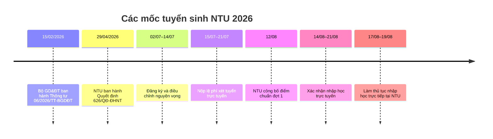

# Báo cáo tuyển sinh Đại học Nha Trang năm 2026

## Tóm tắt điều hành

Tính đến **14/08/2026**, tuyển sinh chính quy năm 2026 của Trường Đại học Nha Trang (NTU, mã trường **TSN**) đã qua giai đoạn xét tuyển đợt một: Trường công bố **điểm chuẩn ngày 12/08/2026**, thí sinh xác nhận nhập học trực tuyến từ **14/08 đến trước 17:00 ngày 21/08**, và làm thủ tục trực tiếp tại trường từ **17–19/08/2026**. Vì vậy, đối với điểm chuẩn 2026, báo cáo sử dụng **kết quả thực tế**, không còn cần dự báo. citeturn20view2turn23view4

Ba phương thức chính thức NTU công bố cho 2026 là: **điểm thi tốt nghiệp THPT 2026 với tổ hợp 4 môn, thang 40; điểm Đánh giá năng lực ĐHQG-HCM/ĐHQG-HN; xét tuyển thẳng và ưu tiên xét tuyển theo quy chế Bộ GD&ĐT**. Đáng chú ý, **không có phương thức xét học bạ độc lập** hoặc “xét tuyển kết hợp học bạ” trong danh sách phương thức chính thức năm 2026; học bạ vẫn có thể được dùng để kiểm tra điều kiện và là giấy tờ nhập học. citeturn23view0turn23view4

NTU công bố **quy mô 3.800 chỉ tiêu đại học chính quy**, với 71 chương trình đào tạo theo thông tin trên trang tuyển sinh. Tuy nhiên, tại trang “Ngành nghề và chỉ tiêu”, **cột chỉ tiêu từng mã ngành hiện đang để trống**; do đó phân bổ chính xác 3.800 chỉ tiêu theo từng ngành/khoa được ghi nhận là **“chưa công bố trên bảng công khai hiện hành”**, không nội suy số lượng để tránh tạo dữ liệu không có nguồn. citeturn24search3turn23view1

## Trường, cơ sở và quy mô tuyển sinh

Trường Đại học Nha Trang là trường đại học công lập, tiền thân hình thành từ **năm 1959**. Trụ sở và đầu mối tuyển sinh được Trường công bố tại **02 Nguyễn Đình Chiểu, Nha Trang, Khánh Hòa**. Trong thông tin tuyển sinh chính quy 2026 kiểm tra được, không thấy một phân hiệu khác có mã trường hoặc chỉ tiêu tuyển sinh độc lập; vì vậy cơ sở tuyển sinh được xác định chắc chắn là trụ sở Nha Trang. citeturn5view3turn23view4

Các lĩnh vực đào tạo được tổ chức thành các cụm lớn về **Kỹ thuật và Công nghệ; Kinh tế và Kinh doanh; Thủy sản và Khoa học sự sống**, bên cạnh ngoại ngữ, luật, du lịch và các chương trình đặc biệt/doanh nghiệp. citeturn5view3turn23view1

| Nội dung | Thông tin 2026 |
|---|---|
| Mã tuyển sinh | **TSN** |
| Trụ sở tuyển sinh | 02 Nguyễn Đình Chiểu, Nha Trang, Khánh Hòa |
| Phạm vi | Toàn quốc |
| Quy mô ĐH chính quy | **3.800 chỉ tiêu** |
| Quy mô chương trình được giới thiệu | **71 CTĐT** |
| Chỉ tiêu chi tiết từng ngành | **Chưa công bố/không hiển thị trong cột “Chỉ tiêu” hiện hành** |

Nguồn chính thức của Trường xác nhận mã TSN trong quy chế đăng ký nguyện vọng và quy mô 3.800 chỉ tiêu trên chuyên trang tuyển sinh. citeturn22view0turn24search3

## Lịch tuyển sinh và quy trình năm 2026

Bộ GD&ĐT ban hành Quy chế tuyển sinh 2026 ngày **15/02/2026**; NTU ban hành Quy chế tuyển sinh cấp trường bằng **Quyết định 626/QĐ-ĐHNT ngày 29/04/2026**. Thí sinh đăng ký/điều chỉnh nguyện vọng từ **02/07 đến 17:00 ngày 14/07**, nộp lệ phí **15–21/07**. NTU công bố điểm chuẩn ngày **12/08**, sau đó thí sinh xác nhận nhập học trước **17:00 ngày 21/08**. citeturn19search0turn25search5turn24search1turn20view2

Quy trình nhập học trực tiếp diễn ra tại giảng đường **G4, G5**, 02 Nguyễn Đình Chiểu; NTU phân lịch từng nhóm ngành trong ba ngày 17–19/08. citeturn23view4

## Phương thức, điều kiện, hồ sơ và chính sách ưu tiên

| Nội dung | Quy định 2026 | Đăng ký/hồ sơ chính |
|---|---|---|
| **Điểm thi TN THPT** | Điểm thi 2026; NTU dùng **tổ hợp 4 môn, thang 40** | Đăng ký ngành TSN trên hệ thống chung Bộ GD&ĐT; dữ liệu điểm được đồng bộ. citeturn23view0turn22view0 |
| **ĐGNL** | ĐGNL **ĐHQG-HCM, thang 1.200** hoặc **ĐHQG-HN, thang 150**, năm 2026 | Đăng ký kỳ thi ĐGNL và đăng ký nguyện vọng NTU trên hệ thống Bộ. citeturn23view0 |
| **Xét tuyển thẳng** | Theo Quy chế Bộ/NTU: nhóm thành tích quốc gia, quốc tế và các trường hợp được quy định | Trường tổ chức xét tuyển thẳng; người đủ điều kiện vẫn phải đưa ngành vào danh sách nguyện vọng trên hệ thống chung. citeturn22view0turn22view3 |
| **Học bạ** | **Không phải phương thức xét tuyển độc lập năm 2026** | Có thể là căn cứ kiểm tra điều kiện; học bạ là một giấy tờ phải nộp khi nhập học. citeturn23view0turn23view4 |
| **Xét tuyển kết hợp** | **Không được NTU công bố thành phương thức riêng năm 2026** | Không nên sử dụng thông tin “xét kết hợp” của năm cũ để đăng ký 2026. citeturn23view0turn24search11 |

Điều kiện chung là đã tốt nghiệp THPT/tương đương, đủ sức khỏe và hồ sơ. Với thí sinh thi tốt nghiệp từ 2026, quy chế NTU đặt ngưỡng nguồn xét tuyển chung là **tổng ba môn thi THPT đạt tối thiểu 15,00/30**, trừ các diện ngoại lệ theo quy chế. citeturn18view3turn22view0

**Tuyển thẳng** bao gồm, trong các nhóm đáng chú ý: Anh hùng Lao động/LLVT, Chiến sĩ thi đua toàn quốc; thí sinh đạt giải nhất–ba học sinh giỏi hoặc khoa học kỹ thuật quốc gia/quốc tế; giải nhất–ba kỳ thi tay nghề ASEAN/quốc tế, với thời hạn thành tích theo quy định không quá ba năm. Giải khuyến khích HSG quốc gia và một số giải khoa học kỹ thuật có thể thuộc diện **ưu tiên xét tuyển**, không đồng nghĩa tự động tuyển thẳng vào mọi ngành. citeturn22view0turn22view2

**Ưu tiên khu vực/đối tượng không phải phương thức tuyển sinh riêng.** Theo quy chế NTU: KV1 **+0,75**, KV2-NT **+0,50**, KV2 **+0,25**, KV3 **0**; nhóm UT1 **+2,0**, UT2 **+1,0** trên thang chuẩn 30 và được quy đổi tương đương khi dùng thang khác. Từ tổng điểm 22,5/30 trở lên, điểm ưu tiên giảm dần theo công thức của quy chế. Quyền ưu tiên khu vực được hưởng trong năm tốt nghiệp và một năm kế tiếp. citeturn22view0

Sau khi trúng tuyển, NTU yêu cầu hồ sơ nhập học gồm bản chính Giấy chứng nhận kết quả thi THPT, bản sao chứng thực giấy khai sinh và học bạ, bản sao bằng tốt nghiệp nếu đã có, và bản sao CCCD; thí sinh tốt nghiệp 2026 được bổ sung bản sao bằng sau khi được cấp. citeturn23view4

## Ngành và chỉ tiêu năm 2026

Trang tra cứu chính thức hiện chia ngành thành bốn cụm chính; **3.800 là tổng chỉ tiêu**, còn ô chỉ tiêu từng mã trong bảng chi tiết đang để trống. citeturn24search3turn23view1

| Cụm đào tạo | Một số ngành/mã tiêu biểu | Chỉ tiêu chi tiết 2026 |
|---|---|---|
| Chương trình đặc biệt/doanh nghiệp | CNTT 7480201A/B; QTKD 7340101A; Kế toán 7340301A; Tài chính-NH 7340201A; các CT Minh Phú/Hải Vương | **Chưa công bố trong bảng chi tiết** |
| Thủy sản, Sinh học, Thực phẩm | Khoa học thủy sản 7620303; Quản lý thủy sản 7620305; Nuôi trồng thủy sản 7620301; CNSH 7420201; CNTP 7540101 | **Chưa công bố** |
| Kỹ thuật và Công nghệ | CNTT 7480201; KH máy tính 7480101; Cơ khí, Cơ điện tử, Ô tô, Điện, Tự động hóa, Tàu thủy, Xây dựng… | **Chưa công bố** |
| Kinh tế, Kinh doanh, XHNV | QTKD 7340101; Marketing 7340115; Tài chính-NH; Kế toán; Luật; Ngôn ngữ Anh; Du lịch; Khách sạn… | **Chưa công bố** |

Danh sách chi tiết và tổ hợp từng mã nằm trên trang tra cứu của NTU. Việc dự báo một con số chỉ tiêu cho từng ngành **không đủ cơ sở dữ liệu chính thức đồng nhất 2021–2025 để nội suy**, nên báo cáo không gán số giả định. citeturn23view1

## Điểm chuẩn giai đoạn 2021–2025 và kết quả 2026

Để so sánh xu hướng, bảng dưới chọn ba ngành đại diện: Marketing (nhóm cạnh tranh cao), CNTT và Nuôi trồng thủy sản. Đây là **điểm thi THPT**, không phải học bạ/ĐGNL. citeturn19view0turn19view1turn18view1turn21view0turn20view0

| Ngành | 2021 | 2022 | 2023 | 2024 | 2025 |
|---|---:|---:|---:|---:|---:|
| Marketing | 23,0 | 20,0 | 23,0 | 23,0 | **27,0** |
| Công nghệ thông tin | 19,0 | 18,0 | 21,0 | 21,0 | **22,0** |
| Nuôi trồng thủy sản | 16,0 | 15,5 | 16,0 | 16,0 | **20,0** |

Nguồn toàn bộ chuỗi là bảng “Điểm trúng tuyển các năm” của NTU. citeturn3view2turn19view0turn21view0turn20view0

Xu hướng 2021–2025 cho thấy Marketing biến động mạnh và tăng cao năm 2025; CNTT tăng tương đối đều từ mức 18–19 lên 22; nhóm thủy sản duy trì ngưỡng thấp hơn trong nhiều năm trước khi tăng lên 20 năm 2025. Tuy nhiên **không nên ngoại suy cơ học sang 2026**, vì NTU chuyển sang các tổ hợp **4 môn/thang 40**, đồng thời thực hiện quy đổi tương đương giữa tổ hợp và phương thức. citeturn23view0turn20view2

Thực tế ngày **12/08/2026** đã thay thế nhu cầu dự báo: với tổ hợp **T2VA = Toán×2 + Ngữ văn + Tiếng Anh**, Marketing là **27**, CNTT **22**, Nuôi trồng thủy sản **20**; các tổ hợp khác của cùng ngành có điểm khác nhau, ví dụ Marketing dao động từ **20,73 đến 27,66**. Các số này **không được so trực tiếp như cùng một thang đo với chuỗi 2021–2025**. citeturn21view1turn21view2

## Thay đổi chính sách và chiến lược cho thí sinh

Thay đổi đáng chú ý nhất là **vai trò của học bạ**. Năm 2025, NTU từng công bố quy trình “Bước 1 – sơ tuyển: kết quả học tập THPT; Bước 2 – xét tuyển: thi THPT/ĐGNL”, và phương hướng trước đó còn mô tả xét tuyển kết hợp. Năm 2026, thông tin chính thức chỉ liệt kê ba phương thức THPT, ĐGNL và tuyển thẳng/ưu tiên; do đó không nên tiếp tục hiểu rằng NTU có một “phương thức học bạ” độc lập trong 2026. citeturn24search2turn24search11turn23view0

Quy chế 2026 còn đặt **trần 15 nguyện vọng** cho một thí sinh, yêu cầu xếp theo thứ tự ưu tiên; nếu đủ điều kiện nhiều nguyện vọng, hệ thống chỉ công nhận nguyện vọng cao nhất. Đồng thời, ngưỡng tối thiểu 15/30 đối với nguồn thí sinh thi tốt nghiệp từ 2026 là một quy định cần kiểm tra trước khi tính đến điểm chuẩn từng ngành. citeturn19search0turn22view0

Về chiến lược, thí sinh nên xếp ngành theo **mức độ thực sự muốn học**, không xếp theo suy đoán “ngành nào dễ đỗ”, vì thứ tự không làm giảm khả năng cạnh tranh trong từng ngành nhưng quyết định nguyện vọng nào được công nhận khi đủ nhiều lựa chọn. Với ngành cạnh tranh như Marketing, Luật, du lịch–khách sạn, cần kiểm tra **đúng tổ hợp 2026** thay vì so một con số điểm chuẩn cũ; với CNTT/kỹ thuật/thủy sản nên tận dụng đồng thời THPT và ĐGNL khi có kết quả hợp lệ. citeturn22view0turn20view2

Ở thời điểm **14/08/2026**, việc quan trọng nhất với người đã trúng tuyển là xác nhận nhập học trên hệ thống Bộ trước **17:00 ngày 21/08**, chuẩn bị hồ sơ giấy và theo đúng lịch NTU 17–19/08. citeturn23view4

## Nguồn chính chủ và liên kết trực tiếp

| Văn bản/trang chính thức | Ngày/cơ quan | URL |
|---|---|---|
| **Thông tư 06/2026/TT-BGDĐT – Quy chế tuyển sinh đại học** | 15/02/2026, Bộ GD&ĐT | `https://moet.gov.vn/van-ban/van-ban-quy-pham-phap-luat/thong-tu-ban-hanh-quy-che-tuyen-sinh-cac-nganh-dao-tao-trinh-do-dai-hoc-va-nganh-giao-duc-mam-non-trinh-do-cao-dang.html` citeturn0search2 |
| **Ban hành Quy chế tuyển sinh đại học năm 2026** | 15/02/2026, Bộ GD&ĐT | `https://moet.gov.vn/tin-tuc/tin-tong-hop2/ban-hanh-quy-che-tuyen-sinh-dai-hoc-nam-2026.html` citeturn19search0 |
| **Bộ GDĐT công bố kế hoạch tuyển sinh ĐH, CĐ năm 2026** | 04/11/2025, Bộ GD&ĐT | `https://moet.gov.vn/tin-tuc/tin-tong-hop2/bo-gddt-cong-bo-ke-hoach-tuyen-sinh-dai-hoc-cao-dang-nam-2026.html` citeturn25search5 |
| **Hướng dẫn tuyển sinh trình độ đại học… năm 2026** | 05/05/2026, Bộ GD&ĐT | `https://moet.gov.vn/tin-tuc/tin-tong-hop2/huong-dan-tuyen-sinh-trinh-do-dai-hoc-trinh-do-cao-dang-nganh-giao-duc-mam-non-nam-2026.html` citeturn24search1 |
| **QĐ 626 – Ban hành Quy chế tuyển sinh đại học Trường ĐH Nha Trang** | 29/04/2026, Hiệu trưởng NTU | `https://pdtdaihoc.ntu.edu.vn/uploads/38/Doc/890/qd-626-ban-hanh-quy-che-tuyen-sinh-dai-hoc-truong-dh-nha-trang-29-4-2026-pdf.pdf` citeturn18view3turn22view0 |
| **Thông tin tuyển sinh đại học năm 2026** | NTU; bài được chuyên trang ghi ngày 28/11/2025 | `https://tuyensinh.ntu.edu.vn/de-an-tuyen-sinh` citeturn23view0turn24search7 |
| **Ngành nghề và chỉ tiêu tuyển sinh** | NTU | `https://tuyensinh.ntu.edu.vn/nganh-nghe-va-chi-tieu` citeturn23view1 |
| **Điểm trúng tuyển các năm 2021–2025** | NTU | `https://tuyensinh.ntu.edu.vn/diem-trung-tuyen-cac-nam` citeturn3view2 |
| **Thông báo điểm chuẩn trúng tuyển năm 2026** | 12/08/2026, NTU | `https://tuyensinh.ntu.edu.vn/thong-bao/thong-bao-diem-chuan-trung-tuyen-nam-2026` citeturn20view2 |
| **Cổng hỗ trợ/tra cứu và hướng dẫn nhập học NTU 2026** | NTU | `https://xettuyen.ntu.edu.vn/` citeturn23view4 |
| **Cổng thông tin tuyển sinh Bộ GD&ĐT** | Bộ GD&ĐT | `https://tuyensinh.moet.gov.vn/` citeturn19search2 |

**Kết luận:** dữ liệu 2026 đã đủ rõ về **phương thức, quy trình, điểm chuẩn và tổng quy mô 3.800**, nhưng **phân bổ chỉ tiêu cụ thể theo từng mã ngành hiện chưa được hiển thị/công bố trên bảng chi tiết chính thức**. Đây là điểm duy nhất quan trọng trong yêu cầu mà không nên tự suy đoán; khi đối chiếu hồ sơ cá nhân, nguồn có giá trị cao nhất là Thông tư 06/2026/TT-BGDĐT, QĐ 626/QĐ-ĐHNT, trang phương thức 2026 và thông báo điểm chuẩn 12/08/2026. citeturn19search0turn22view0turn23view0turn20view2